# Snow虚拟机运行时管理系统详细文档

<cite>
**本文档中引用的文件**
- [OperandStack.java](file://src/main/java/org/jcnc/snow/vm/module/OperandStack.java)
- [LocalVariableStore.java](file://src/main/java/org/jcnc/snow/vm/module/LocalVariableStore.java)
- [StackFrame.java](file://src/main/java/org/jcnc/snow/vm/module/StackFrame.java)
- [CallStack.java](file://src/main/java/org/jcnc/snow/vm/module/CallStack.java)
- [MethodContext.java](file://src/main/java/org/jcnc/snow/vm/module/MethodContext.java)
- [VirtualMachineEngine.java](file://src/main/java/org/jcnc/snow/vm/engine/VirtualMachineEngine.java)
- [FDTable.java](file://src/main/java/org/jcnc/snow/vm/io/FDTable.java)
- [SocketRegistry.java](file://src/main/java/org/jcnc/snow/vm/io/SocketRegistry.java)
- [MutexRegistry.java](file://src/main/java/org/jcnc/snow/vm/io/MutexRegistry.java)
- [CondRegistry.java](file://src/main/java/org/jcnc/snow/vm/io/CondRegistry.java)
- [RwlockRegistry.java](file://src/main/java/org/jcnc/snow/vm/io/RwlockRegistry.java)
- [SemRegistry.java](file://src/main/java/org/jcnc/snow/vm/io/SemRegistry.java)
- [EnvRegistry.java](file://src/main/java/org/jcnc/snow/vm/io/EnvRegistry.java)
- [CommandExecutionHandler.java](file://src/main/java/org/jcnc/snow/vm/execution/CommandExecutionHandler.java)
</cite>

## 目录
1. [引言](#引言)
2. [项目结构概览](#项目结构概览)
3. [OperandStack：后进先出数据结构](#operandstack后进先出数据结构)
4. [LocalVariableStore：局部变量管理](#localvariablestore局部变量管理)
5. [StackFrame：栈帧结构](#stackframe栈帧结构)
6. [CallStack：调用层次管理](#callstack调用层次管理)
7. [MethodContext：方法上下文](#methodcontext方法上下文)
8. [虚拟机引擎架构](#虚拟机引擎架构)
9. [I/O和同步资源注册表](#io和同步资源注册表)
10. [运行时管理系统集成](#运行时管理系统集成)
11. [性能考虑](#性能考虑)
12. [故障排除指南](#故障排除指南)
13. [总结](#总结)

## 引言

Snow虚拟机的运行时管理系统是一个复杂而精密的架构，负责管理程序执行过程中的所有关键资源。该系统采用分层设计，通过多个专门的组件协同工作，实现了高效的内存管理、方法调用控制和系统资源访问。本文档将深入探讨这些核心组件的设计原理、实现细节和相互关系。

## 项目结构概览

Snow虚拟机的运行时管理系统主要分布在以下模块中：


**图表来源**
- [OperandStack.java](file://src/main/java/org/jcnc/snow/vm/module/OperandStack.java#L1-L104)
- [LocalVariableStore.java](file://src/main/java/org/jcnc/snow/vm/module/LocalVariableStore.java#L1-L182)
- [StackFrame.java](file://src/main/java/org/jcnc/snow/vm/module/StackFrame.java#L1-L104)
- [CallStack.java](file://src/main/java/org/jcnc/snow/vm/module/CallStack.java#L1-L97)

## OperandStack：后进先出数据结构

OperandStack是Snow虚拟机中最重要的数据结构之一，它实现了严格的后进先出（LIFO）原则，专门用于方法执行过程中的临时值存储和算术运算。

### 设计原理

OperandStack基于Java的`ArrayDeque`实现，提供了高效的操作数栈管理：


**图表来源**
- [OperandStack.java](file://src/main/java/org/jcnc/snow/vm/module/OperandStack.java#L15-L104)

### 核心功能特性

1. **严格LIFO操作**：所有push和pop操作都遵循后进先出原则
2. **类型安全性**：使用泛型Object确保类型灵活性
3. **边界检查**：自动检测空栈操作并抛出适当异常
4. **调试支持**：提供完整的栈状态打印功能

### 在算术运算中的作用

OperandStack在算术运算中扮演着核心角色：


**图表来源**
- [OperandStack.java](file://src/main/java/org/jcnc/snow/vm/module/OperandStack.java#L30-L80)

### 方法调用中的应用

在方法调用过程中，OperandStack用于：

- **参数传递**：方法调用前将参数压入栈
- **返回值存储**：方法执行完成后存储返回值
- **临时计算**：中间计算结果的暂存

**节来源**
- [OperandStack.java](file://src/main/java/org/jcnc/snow/vm/module/OperandStack.java#L1-L104)

## LocalVariableStore：局部变量管理

LocalVariableStore是虚拟机中负责管理方法局部变量的核心组件，它提供了动态扩展和紧凑化的智能内存管理机制。

### 架构设计


**图表来源**
- [LocalVariableStore.java](file://src/main/java/org/jcnc/snow/vm/module/LocalVariableStore.java#L20-L182)

### 槽位分配机制

LocalVariableStore采用动态数组结构，支持随机访问和自动扩容：

1. **初始容量**：可配置的初始容量设置
2. **自动扩容**：通过`ensureCapacity`方法实现透明扩容
3. **索引验证**：严格的负索引检查
4. **内存优化**：支持紧凑化操作减少内存占用

### 自动扩容机制


**图表来源**
- [LocalVariableStore.java](file://src/main/java/org/jcnc/snow/vm/module/LocalVariableStore.java#L60-L80)

### 紧凑化机制

紧凑化功能在程序执行完成后清理尾部的null槽位：


**图表来源**
- [LocalVariableStore.java](file://src/main/java/org/jcnc/snow/vm/module/LocalVariableStore.java#L130-L145)

### 与底层操作系统的桥接

LocalVariableStore通过以下方式与操作系统进行交互：

- **文件描述符管理**：通过FDTable间接管理文件资源
- **内存映射**：利用JVM的垃圾回收机制
- **线程安全**：在多线程环境中保持数据一致性

**节来源**
- [LocalVariableStore.java](file://src/main/java/org/jcnc/snow/vm/module/LocalVariableStore.java#L1-L182)

## StackFrame：栈帧结构

StackFrame代表了虚拟机执行过程中的单个方法调用上下文，包含了方法执行所需的所有状态信息。

### 结构组成


**图表来源**
- [StackFrame.java](file://src/main/java/org/jcnc/snow/vm/module/StackFrame.java#L15-L104)

### 生命周期管理

StackFrame的生命周期与方法调用紧密相关：

```mermaid
stateDiagram-v2
[*] --> 创建 : CALL指令
创建 --> 激活 : 压入CallStack
激活 --> 执行 : 方法开始
执行 --> 执行 : 方法体执行
执行 --> 完成 : RET指令
完成 --> 销毁 : 从CallStack弹出
销毁 --> [*]
note right of 创建 : 初始化局部变量表和操作数栈
note right of 激活 : 设置返回地址
note right of 执行 : 方法逻辑执行
note right of 完成 : 清理资源
```



**图表来源**
- [StackFrame.java](file://src/main/java/org/jcnc/snow/vm/module/StackFrame.java#L40-L60)

### 返回地址机制

返回地址是StackFrame的关键组成部分，它指示了方法执行完成后应该返回的指令位置：

- **静态确定**：在方法调用时确定
- **动态调整**：支持条件跳转和循环结构
- **异常处理**：在异常传播时提供恢复点

**节来源**
- [StackFrame.java](file://src/main/java/org/jcnc/snow/vm/module/StackFrame.java#L1-L104)

## CallStack：调用层次管理

CallStack维护了程序的完整调用层次结构，实现了严格的LIFO管理，并提供了调用深度保护机制。

### 核心功能


**图表来源**
- [CallStack.java](file://src/main/java/org/jcnc/snow/vm/module/CallStack.java#L10-L97)

### 调用深度保护

CallStack实现了防止栈溢出的保护机制：


**图表来源**
- [CallStack.java](file://src/main/java/org/jcnc/snow/vm/module/CallStack.java#L25-L35)

### 调用层次可视化

CallStack提供了完整的调用层次快照功能：


**图表来源**
- [CallStack.java](file://src/main/java/org/jcnc/snow/vm/module/CallStack.java#L50-L65)

**节来源**
- [CallStack.java](file://src/main/java/org/jcnc/snow/vm/module/CallStack.java#L1-L97)

## MethodContext：方法上下文

MethodContext为调试和跟踪目的提供了方法调用的元数据信息。

### 数据结构设计


**图表来源**
- [MethodContext.java](file://src/main/java/org/jcnc/snow/vm/module/MethodContext.java#L15-L41)

### 空值安全设计

MethodContext采用了优雅的空值处理策略：

- **默认空列表**：当传入null时自动转换为空ArrayList
- **不可变性**：构造后的方法上下文不可修改
- **格式化输出**：提供清晰的字符串表示

**节来源**
- [MethodContext.java](file://src/main/java/org/jcnc/snow/vm/module/MethodContext.java#L1-L41)

## 虚拟机引擎架构

VirtualMachineEngine是整个运行时管理系统的核心协调者，负责指令解释执行和各组件的协调工作。

### 引擎架构


**图表来源**
- [VirtualMachineEngine.java](file://src/main/java/org/jcnc/snow/vm/engine/VirtualMachineEngine.java#L25-L191)

### 主执行循环

虚拟机引擎的核心执行逻辑：


**图表来源**
- [VirtualMachineEngine.java](file://src/main/java/org/jcnc/snow/vm/engine/VirtualMachineEngine.java#L70-L130)

### 根帧机制

根帧是虚拟机执行的起点和终点：

- **唯一性**：在整个执行过程中只存在一个根帧
- **特殊返回地址**：PROGRAM_END标识程序正常结束
- **资源共享**：与虚拟机引擎共享局部变量存储

**节来源**
- [VirtualMachineEngine.java](file://src/main/java/org/jcnc/snow/vm/engine/VirtualMachineEngine.java#L1-L191)

## I/O和同步资源注册表

Snow虚拟机提供了一套完整的I/O和同步资源管理系统，通过多个专门的注册表实现资源的统一管理和生命周期控制。

### 资源注册表架构


### FDTable：文件描述符管理

FDTable实现了类似Unix文件描述符的抽象：


**图表来源**
- [FDTable.java](file://src/main/java/org/jcnc/snow/vm/io/FDTable.java#L25-L187)

#### 标准文件描述符

FDTable预分配了标准文件描述符：

- **fd 0**：标准输入（ReadableByteChannel）
- **fd 1**：标准输出（WritableByteChannel）
- **fd 2**：标准错误（WritableByteChannel）

#### 动态分配机制


**图表来源**
- [FDTable.java](file://src/main/java/org/jcnc/snow/vm/io/FDTable.java#L50-L65)

### SocketRegistry：套接字管理

SocketRegistry专门管理网络套接字资源：


**图表来源**
- [SocketRegistry.java](file://src/main/java/org/jcnc/snow/vm/io/SocketRegistry.java#L20-L100)

### 同步资源注册表

#### MutexRegistry：互斥量管理


**图表来源**
- [MutexRegistry.java](file://src/main/java/org/jcnc/snow/snow/vm/io/MutexRegistry.java#L25-L86)

#### 条件变量和读写锁

- **CondRegistry**：提供条件变量的分配和管理
- **RwlockRegistry**：管理读写锁资源
- **SemRegistry**：管理信号量资源

### 环境变量注册表

EnvRegistry提供了VM级别的环境变量覆盖层：


**图表来源**
- [EnvRegistry.java](file://src/main/java/org/jcnc/snow/vm/io/EnvRegistry.java#L25-L123)

#### 环境变量优先级

环境变量查询遵循以下优先级：

1. **VM覆盖层**：通过`set`方法设置的值
2. **系统环境**：通过`System.getenv()`获取的值  
3. **删除标记**：被标记为删除的变量返回null

**节来源**
- [FDTable.java](file://src/main/java/org/jcnc/snow/vm/io/FDTable.java#L1-L187)
- [SocketRegistry.java](file://src/main/java/org/jcnc/snow/vm/io/SocketRegistry.java#L1-L100)
- [MutexRegistry.java](file://src/main/java/org/jcnc/snow/vm/io/MutexRegistry.java#L1-L86)
- [EnvRegistry.java](file://src/main/java/org/jcnc/snow/vm/io/EnvRegistry.java#L1-L123)

## 运行时管理系统集成

各个运行时管理组件通过精心设计的接口和协作机制实现无缝集成。

### 组件间协作流程

```mermaid
sequenceDiagram
participant VM as VirtualMachineEngine
participant CEH as CommandExecutionHandler
participant CS as CallStack
participant SF as StackFrame
participant OS as OperandStack
participant LVS as LocalVariableStore
participant SYS as 系统调用处理器
VM->>CEH : handle(opCode, params, pc)
CEH->>SYS : 执行系统调用
SYS->>CS : 获取当前栈帧
CS-->>SYS : 返回StackFrame
SYS->>SF : 获取LocalVariableStore
SF-->>SYS : 返回LVS
SYS->>LVS : 访问局部变量
SYS->>OS : 访问操作数栈
OS-->>SYS : 返回操作数
SYS->>SYS : 执行系统调用逻辑
SYS-->>CEH : 返回结果
CEH-->>VM : 返回下一条指令位置
```

**图表来源**
- [CommandExecutionHandler.java](file://src/main/java/org/jcnc/snow/vm/execution/CommandExecutionHandler.java#L30-L60)

### 资源生命周期管理

运行时管理系统确保所有资源的正确生命周期：

```mermaid
stateDiagram-v2
[*] --> 分配 : 资源请求
分配 --> 使用 : 正常使用
使用 --> 使用 : 资源复用
使用 --> 清理 : 资源释放
清理 --> 销毁 : 最终销毁
销毁 --> [*]
note right of 分配 : ID分配/内存分配
note right of 使用 : 正常业务逻辑
note right of 清理 : 资源清理/状态重置
note right of 销毁 : 最终资源回收
```

### 错误处理和恢复

系统实现了多层次的错误处理机制：

1. **边界检查**：防止数组越界和空指针访问
2. **类型验证**：确保操作数类型匹配
3. **资源验证**：检查文件描述符和锁的有效性
4. **异常传播**：适当的异常信息传递

## 性能考虑

Snow虚拟机运行时管理系统在设计时充分考虑了性能优化：

### 内存管理优化

- **对象池化**：重用StackFrame和MethodContext对象
- **延迟初始化**：按需创建操作数栈和局部变量表
- **紧凑化机制**：定期清理无效的null槽位

### 并发性能

- **无锁设计**：大部分操作避免使用显式锁
- **原子操作**：使用AtomicInteger进行ID分配
- **并发容器**：使用ConcurrentHashMap保证线程安全

### 缓存友好性

- **局部性原理**：相邻的栈帧数据在内存中连续存放
- **预分配策略**：减少运行时的内存分配开销
- **批量操作**：合并多个小操作以提高效率

## 故障排除指南

### 常见问题诊断

#### 栈溢出问题

**症状**：StackOverflowError异常
**原因**：递归调用过深或无限递归
**解决方案**：
- 检查递归终止条件
- 增加MAX_STACK_DEPTH限制（谨慎使用）
- 优化算法减少递归深度

#### 内存泄漏

**症状**：内存使用持续增长
**原因**：资源未正确释放
**解决方案**：
- 确保所有文件描述符都被正确关闭
- 检查互斥量和锁的释放
- 使用compact()方法清理局部变量表

#### 性能问题

**症状**：执行速度缓慢
**原因**：频繁的内存分配或锁竞争
**解决方案**：
- 优化算法减少临时对象创建
- 使用对象池技术
- 减少不必要的同步操作

### 调试工具

运行时管理系统提供了丰富的调试功能：

- **栈快照**：`takeSnapshot()`方法提供完整的调用层次信息
- **状态打印**：`printStack()`和`printLocalVariables()`显示当前状态
- **日志记录**：详细的执行日志帮助问题定位

**节来源**
- [CallStack.java](file://src/main/java/org/jcnc/snow/vm/module/CallStack.java#L50-L70)
- [VirtualMachineEngine.java](file://src/main/java/org/jcnc/snow/vm/engine/VirtualMachineEngine.java#L150-L170)

## 总结

Snow虚拟机的运行时管理系统是一个高度模块化和可扩展的架构，通过精心设计的组件协作实现了高效的程序执行环境。该系统的主要特点包括：

### 核心优势

1. **模块化设计**：每个组件都有明确的职责边界
2. **类型安全**：强类型检查防止运行时错误
3. **性能优化**：多层次的性能优化策略
4. **资源管理**：完善的资源生命周期管理
5. **调试支持**：丰富的调试和监控功能

### 技术创新

- **统一资源模型**：通过注册表模式管理不同类型资源
- **LIFO数据结构**：OperandStack严格遵循栈式执行模型
- **动态扩展**：LocalVariableStore支持运行时动态扩容
- **线程安全**：所有并发组件都经过线程安全设计

### 应用价值

该运行时管理系统不仅为Snow语言提供了强大的执行环境，也为其他虚拟机系统的开发提供了宝贵的参考经验。其设计理念和实现技术可以广泛应用于各种需要高性能、高可靠性的计算环境中。

通过深入理解这些核心组件的设计原理和实现细节，开发者可以更好地利用Snow虚拟机的强大功能，并在必要时进行定制和扩展。