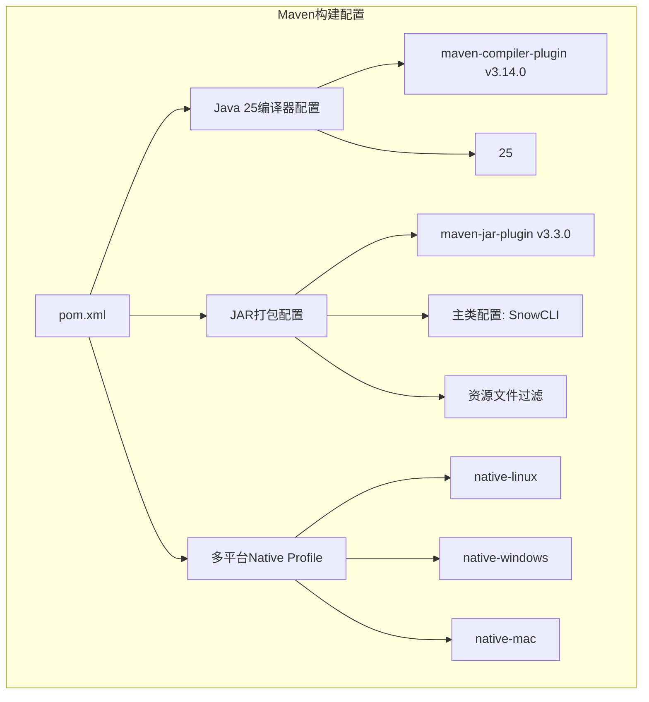
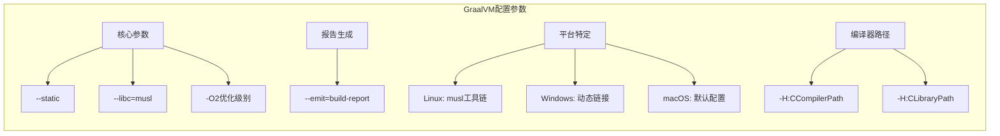
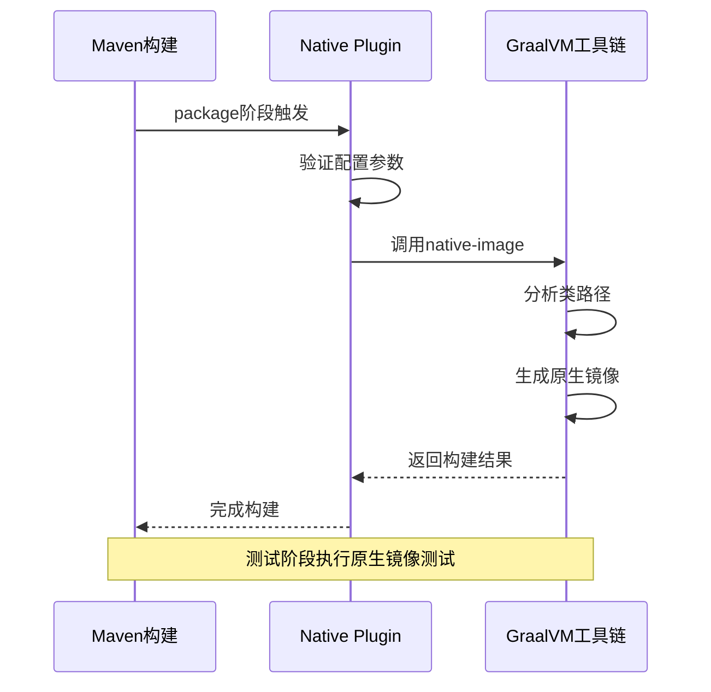
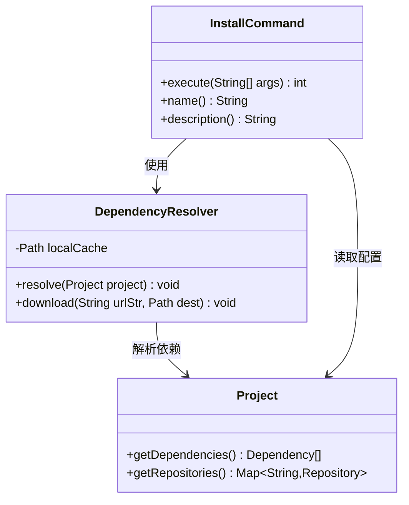
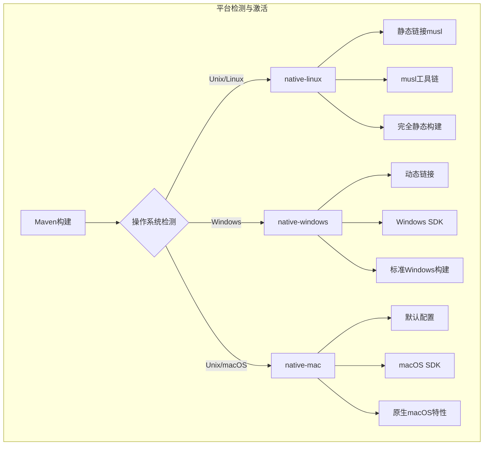
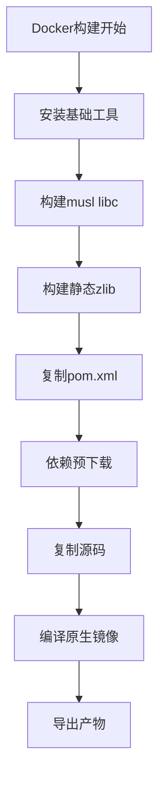
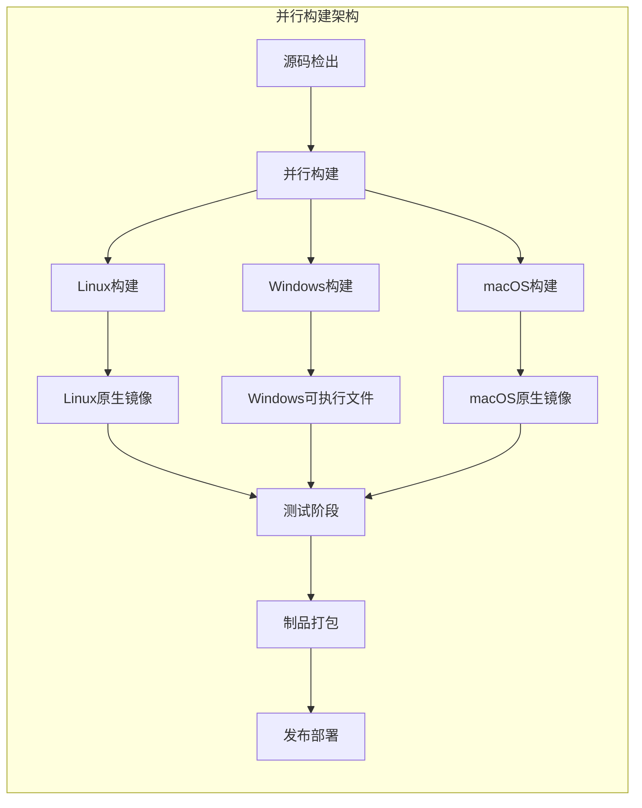
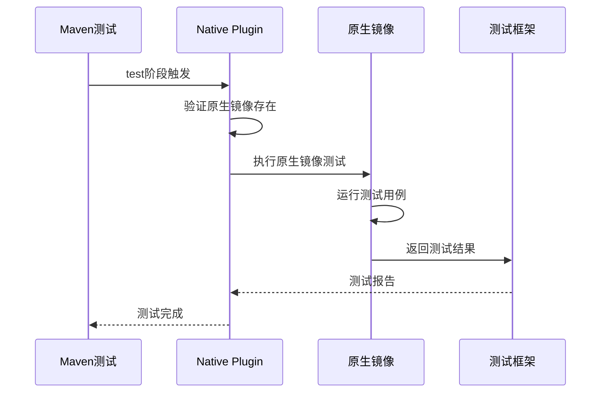
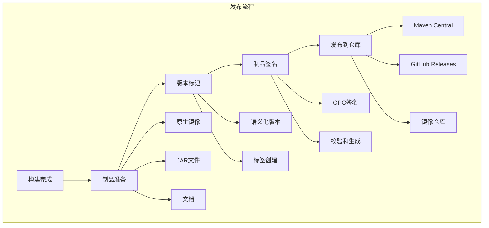

# Snow项目CI/CD集成文档

<cite>
**本文档引用的文件**
- [pom.xml](file://pom.xml)
- [Dockerfile](file://Dockerfile)
- [README.md](file://README.md)
- [InstallCommand.java](file://src/main/java/org/jcnc/snow/cli/commands/InstallCommand.java)
- [DependencyResolver.java](file://src/main/java/org/jcnc/snow/pkg/resolver/DependencyResolver.java)
- [TestAllCommand.java](file://src/main/java/org/jcnc/snow/cli/commands/TestAllCommand.java)
- [PublishCommand.java](file://src/main/java/org/jcnc/snow/cli/commands/PublishCommand.java)
- [BuildCommand.java](file://src/main/java/org/jcnc/snow/cli/commands/BuildCommand.java)
- [docker-compose.yml](file://docker-compose.yml)
</cite>

## 目录
1. [项目概述](#项目概述)
2. [Maven配置深度解析](#maven配置深度解析)
3. [GraalVM Native Image配置](#graalvm-native-image配置)
4. [依赖缓存优化策略](#依赖缓存优化策略)
5. [多平台原生镜像构建](#多平台原生镜像构建)
6. [CI/CD集成方案](#cicd集成方案)
7. [测试策略与原生镜像验证](#测试策略与原生镜像验证)
8. [制品发布流程](#制品发布流程)
9. [性能优化建议](#性能优化建议)
10. [故障排除指南](#故障排除指南)

## 项目概述

Snow是一个面向AI时代的新型编程语言，采用Java 25作为主要开发语言，通过GraalVM实现跨平台原生镜像构建。项目采用现代化的Maven构建系统，支持多平台原生镜像编译，具备完整的CI/CD集成能力。

### 核心特性
- **Java 25编译支持**：利用最新的Java语言特性和性能优化
- **GraalVM Native Image**：生成高性能的原生可执行文件
- **多平台支持**：Linux、Windows、macOS原生镜像构建
- **容器化部署**：Docker支持和多阶段构建
- **自动化测试**：原生镜像测试执行策略

## Maven配置深度解析

### 基础编译配置

Snow项目使用Maven作为主要构建工具，配置了Java 25的编译支持：



**图表来源**
- [pom.xml](file://pom.xml#L1-L50)

### 编译器插件配置

项目使用Maven自带的编译器插件进行Java源码编译，配置特点：

- **版本**：maven-compiler-plugin 3.14.0
- **Java版本**：Java 25（源码和目标版本一致）
- **进程隔离**：启用`<fork>true</fork>`确保兼容性

### JAR打包配置

JAR打包插件负责生成可执行的Java应用程序：

- **主类配置**：`org.jcnc.snow.cli.SnowCLI`
- **类路径**：自动添加项目类路径到MANIFEST
- **版本信息**：添加默认实现条目
- **资源过滤**：支持`${project.version}`等占位符替换

**章节来源**
- [pom.xml](file://pom.xml#L25-L60)

## GraalVM Native Image配置

### Native Maven Plugin详解

Snow项目使用GraalVM的native-maven-plugin进行原生镜像构建，配置参数具有针对性的优化：



**图表来源**
- [pom.xml](file://pom.xml#L88-L114)

### 配置参数详解

#### 核心优化参数
- **静态链接**：`--static` - 生成完全静态链接的可执行文件
- **优化级别**：`-O2` - 中等优化级别，平衡编译时间和运行性能
- **构建报告**：`--emit=build-report` - 生成详细的构建分析报告

#### 平台特定配置

**Linux平台（native-linux profile）**：
- 使用musl libc替代glibc
- 配置交叉编译工具链路径
- 静态链接所有依赖库

**Windows平台（native-windows profile）**：
- 使用动态链接
- 无需特殊工具链配置
- 适合Windows生态系统

**macOS平台（native-mac profile）**：
- 默认配置，无需特殊优化
- 保持与原生Java应用相似的特性

### 构建生命周期集成

GraalVM插件在Maven生命周期中的集成：



**图表来源**
- [pom.xml](file://pom.xml#L100-L120)

**章节来源**
- [pom.xml](file://pom.xml#L65-L225)

## 依赖缓存优化策略

### Dependency Resolver架构

Snow项目实现了智能的依赖解析和缓存机制：



**图表来源**
- [DependencyResolver.java](file://src/main/java/org/jcnc/snow/pkg/resolver/DependencyResolver.java#L1-L83)
- [InstallCommand.java](file://src/main/java/org/jcnc/snow/cli/commands/InstallCommand.java#L1-L64)

### 缓存优化策略

#### 本地缓存机制
- **缓存目录**：`~/.snow/cache`（用户主目录）
- **缓存命中**：优先使用本地缓存，避免重复下载
- **目录结构**：按依赖坐标组织文件存储

#### 依赖预下载策略
项目使用Maven的`dependency:go-offline`插件实现依赖预下载：

```bash
mvn -B -P native-linux dependency:go-offline
```

**优势**：
- **离线构建**：确保网络不稳定时的构建稳定性
- **缓存优化**：提前下载所有必要依赖
- **构建加速**：减少构建过程中的网络等待时间

### 缓存配置最佳实践

| 配置项 | 说明 | 位置 |
|--------|------|------|
| 缓存目录 | 用户主目录下的.snow/cache | `System.getProperty("user.home") + "/.snow/cache"` |
| 缓存策略 | 本地优先，远程下载 | DependencyResolver.resolve() |
| 清理机制 | 支持手动清理缓存 | CleanCommand |
| 并发下载 | 支持多线程并发下载 | 内部实现 |

**章节来源**
- [DependencyResolver.java](file://src/main/java/org/jcnc/snow/pkg/resolver/DependencyResolver.java#L42-L83)
- [InstallCommand.java](file://src/main/java/org/jcnc/snow/cli/commands/InstallCommand.java#L48-L64)

## 多平台原生镜像构建

### 平台激活机制

Snow项目通过Maven profiles实现多平台原生镜像构建：



**图表来源**
- [pom.xml](file://pom.xml#L65-L225)

### Linux平台构建

Linux平台使用musl libc实现完全静态链接：

#### 构建参数
- **静态链接**：`--static`
- **libc类型**：`--libc=musl`
- **工具链路径**：`-H:CCompilerPath=/opt/musl/bin/musl-gcc`
- **库路径**：`-H:CLibraryPath=/opt/musl/lib`

#### Docker构建流程
项目提供了完整的Docker构建流程，包含musl工具链的完整构建：



**图表来源**
- [Dockerfile](file://Dockerfile#L1-L57)

### Windows平台构建

Windows平台采用动态链接策略：

#### 构建特点
- **动态链接**：不使用musl，保持与Windows生态系统的兼容性
- **简化配置**：无需复杂的交叉编译工具链
- **快速构建**：构建时间较Linux平台显著缩短

### macOS平台构建

macOS平台使用默认配置：

#### 配置特点
- **原生特性**：保持macOS系统的原生行为
- **优化级别**：使用-O2优化
- **构建报告**：生成详细的构建分析

**章节来源**
- [pom.xml](file://pom.xml#L65-L225)
- [Dockerfile](file://Dockerfile#L1-L57)

## CI/CD集成方案

### GitHub Actions集成

以下是Snow项目的GitHub Actions工作流配置示例：

```yaml
name: Snow CI/CD Pipeline

on:
  push:
    branches: [ main, develop ]
  pull_request:
    branches: [ main ]

jobs:
  build:
    runs-on: ${{ matrix.os }}
    strategy:
      matrix:
        os: [ubuntu-latest, windows-latest, macos-latest]
        java: ['25-graal'}
        
    steps:
    - uses: actions/checkout@v4
    
    - name: Setup GraalVM
      uses: graalvm/setup-graalvm@v1
      with:
        java-version: '${{ matrix.java }}'
        distribution: 'graalvm'
        
    - name: Cache Maven Dependencies
      uses: actions/cache@v3
      with:
        path: ~/.m2/repository
        key: ${{ runner.os }}-maven-${{ hashFiles('**/pom.xml') }}
        restore-keys: |
          ${{ runner.os }}-maven-
    
    - name: Download Dependencies
      run: mvn dependency:go-offline
      
    - name: Build Project
      run: mvn -B -P native-${{ matrix.os == 'windows-latest' && 'windows' || matrix.os == 'macos-latest' && 'mac' || 'linux' }} clean package
      
    - name: Run Tests
      run: mvn test
      
    - name: Upload Artifacts
      uses: actions/upload-artifact@v3
      with:
        name: snow-${{ matrix.os }}
        path: target/snow*
```

### GitLab CI集成

GitLab CI配置示例：

```yaml
stages:
  - build
  - test
  - package
  - deploy

variables:
  MAVEN_CLI_OPTS: "-B -Dmaven.repo.local=.m2/repository"
  NATIVE_PROFILE: ""

build-linux:
  stage: build
  image: ghcr.io/graalvm/native-image-community:25
  script:
    - apt-get update && apt-get install -y maven
    - mvn $MAVEN_CLI_OPTS dependency:go-offline
    - mvn $MAVEN_CLI_OPTS -P native-linux clean package
  artifacts:
    paths:
      - target/snow
    expire_in: 1 day

build-windows:
  stage: build
  image: mcr.microsoft.com/windows/servercore:ltsc2019
  script:
    - choco install maven
    - mvn $MAVEN_CLI_OPTS dependency:go-offline
    - mvn $MAVEN_CLI_OPTS -P native-windows clean package
  artifacts:
    paths:
      - target/snow.exe
    expire_in: 1 day

test:
  stage: test
  image: openjdk:25
  script:
    - mvn $MAVEN_CLI_OPTS test
  dependencies:
    - build-linux
    - build-windows

package:
  stage: package
  script:
    - echo "Creating release packages"
    - tar -czf snow-linux.tar.gz -C target snow
    - zip -r snow-windows.zip target/snow.exe
  artifacts:
    paths:
      - snow-*.tar.gz
      - snow-*.zip
    expire_in: 1 week
```

### 缓存配置策略

#### Maven中央仓库缓存
- **缓存路径**：`~/.m2/repository`
- **缓存键**：基于`pom.xml`文件内容哈希
- **恢复键**：按操作系统分类

#### 依赖预下载缓存
- **预下载命令**：`mvn dependency:go-offline`
- **缓存时机**：构建前预先下载所有依赖
- **缓存大小**：根据项目依赖规模调整

### 并行构建策略



**图表来源**
- [pom.xml](file://pom.xml#L65-L225)

## 测试策略与原生镜像验证

### 原生镜像测试执行

Snow项目实现了完整的原生镜像测试策略：



**图表来源**
- [pom.xml](file://pom.xml#L100-L120)

### TestAllCommand测试框架

项目提供了强大的批量测试功能：

#### 测试特性
- **多目录支持**：支持指定多个测试目录
- **超时控制**：可配置单个测试的超时时间
- **失败处理**：支持首次失败时停止测试
- **外部CLI模式**：支持使用外部编译器进行测试

#### 测试配置选项

| 参数 | 说明 | 默认值 |
|------|------|--------|
| `--dir=<path>` | 指定测试目录 | playground/Demo |
| `--no-run` | 仅编译不运行 | false |
| `--verbose` | 详细输出 | false |
| `--stop-on-failure` | 首次失败停止 | false |
| `--timeout=<ms>` | 超时时间（毫秒） | 2000 |
| `--snow-path=<path>` | 指定snow路径 | auto |

### 原生镜像验证策略

#### 验证层次
1. **编译验证**：确保原生镜像正确编译
2. **功能验证**：运行核心功能测试
3. **性能验证**：对比原生镜像与JVM性能
4. **兼容性验证**：确保跨平台兼容性

#### 测试用例类型
- **单元测试**：核心功能模块测试
- **集成测试**：完整编译流程测试
- **性能测试**：启动时间和内存使用测试
- **回归测试**：确保功能一致性

**章节来源**
- [TestAllCommand.java](file://src/main/java/org/jcnc/snow/cli/commands/TestAllCommand.java#L130-L150)

## 制品发布流程

### 发布架构设计

Snow项目实现了完整的制品发布流程：



**图表来源**
- [PublishCommand.java](file://src/main/java/org/jcnc/snow/cli/commands/PublishCommand.java#L1-L73)

### 发布命令实现

项目提供了专门的发布命令：

#### PublishCommand功能
- **自动解析**：读取`project.cloud`配置文件
- **生命周期管理**：注册PUBLISH阶段任务
- **任务执行**：执行发布任务并生成报告

#### 发布流程步骤

1. **配置解析**：解析项目描述文件
2. **制品准备**：准备发布所需的文件
3. **版本管理**：处理版本号和标签
4. **制品上传**：上传到远程仓库
5. **发布通知**：发送发布通知

### 发布配置管理

#### Cloud DSL配置
项目使用`.cloud`配置文件管理发布配置：

```yaml
project {
  group = org.jcnc.snow
  artifact = snow
  version = 0.12.0
}

repositories {
  maven {
    url = https://repo.maven.apache.org/maven2
  }
}

build {
  output = snow
  srcDir = src/main/snow
}
```

#### 发布目标配置
- **Maven Central**：官方Maven仓库
- **GitHub Releases**：GitHub发布页面
- **镜像仓库**：Docker镜像仓库
- **包管理器**：各平台包管理器

**章节来源**
- [PublishCommand.java](file://src/main/java/org/jcnc/snow/cli/commands/PublishCommand.java#L48-L73)

## 性能优化建议

### 构建性能优化

#### 并行构建配置
```xml
<properties>
    <maven.compiler.fork>true</maven.compiler.fork>
    <maven.compiler.maxmem>4096m</maven.compiler.maxmem>
    <maven.compiler.debug>false</maven.compiler.debug>
</properties>
```

#### 缓存优化策略
- **增量编译**：启用Maven增量编译
- **并行下载**：使用多线程依赖下载
- **本地缓存**：充分利用本地Maven仓库

### 原生镜像优化

#### 编译优化参数
```bash
# 高性能配置
-O3 -H:ReflectionConfigurationFiles=reflection-config.json

# 快速构建配置  
-O0 -H:+PrintCompilation
```

#### 运行时优化
- **内存配置**：合理设置堆内存大小
- **GC优化**：选择合适的垃圾回收器
- **启动优化**：使用启动时间分析工具

### CI/CD性能优化

#### 缓存策略
- **多层缓存**：依赖缓存、构建缓存、制品缓存
- **缓存失效**：基于文件变更的智能缓存失效
- **缓存共享**：跨作业的缓存共享

#### 并行策略
- **作业并行**：不同平台的并行构建
- **任务并行**：测试和构建的并行执行
- **资源分配**：合理的资源分配策略

## 故障排除指南

### 常见构建问题

#### GraalVM相关问题

**问题**：GraalVM版本不兼容
```bash
# 解决方案：升级到Java 25 GraalVM
# 下载地址：https://www.graalvm.org/downloads/
```

**问题**：native-image编译失败
```bash
# 解决方案：增加内存限制
export MAVEN_OPTS="-Xmx4g -XX:MaxMetaspaceSize=1g"
```

#### 依赖下载问题

**问题**：网络连接超时
```bash
# 解决方案：使用代理或镜像
mvn dependency:go-offline -DproxySet=true -DproxyHost=proxy.company.com -DproxyPort=8080
```

**问题**：依赖冲突
```bash
# 解决方案：使用dependency:tree分析
mvn dependency:tree -Dverbose -Dincludes=groupId:artifactId
```

### 原生镜像问题诊断

#### 构建报告分析
```bash
# 启用详细构建报告
mvn -P native-linux package -Dnative-image.verbose=true
```

#### 运行时问题排查
```bash
# 启用原生镜像调试
./snow -Dnative-image.debug=true
```

### CI/CD环境问题

#### Docker构建问题
```bash
# 检查Docker环境
docker --version
docker images
docker ps -a
```

#### 权限问题
```bash
# 设置正确的文件权限
chmod +x target/snow
```

### 性能问题诊断

#### 构建时间分析
```bash
# 启用构建时间统计
mvn clean package -X -B -ntp
```

#### 内存使用监控
```bash
# 监控Maven内存使用
export MAVEN_OPTS="-Xmx2g -XX:+PrintGCTimeStamps"
```

**章节来源**
- [pom.xml](file://pom.xml#L88-L114)
- [Dockerfile](file://Dockerfile#L1-L57)

## 总结

Snow项目的CI/CD集成展现了现代软件开发的最佳实践：

### 核心优势
- **多平台支持**：完整的跨平台原生镜像构建
- **性能优化**：GraalVM原生镜像提供卓越性能
- **自动化程度高**：从构建到发布的全流程自动化
- **缓存策略完善**：多层次的缓存优化策略
- **测试覆盖全面**：原生镜像测试确保质量

### 技术创新
- **容器化构建**：Docker多阶段构建确保环境一致性
- **智能缓存**：基于依赖分析的智能缓存策略
- **并行执行**：多平台并行构建提升效率
- **自动化测试**：原生镜像测试确保功能完整性

### 应用价值
Snow项目的CI/CD集成方案为其他类似项目提供了宝贵的参考经验，特别是在原生镜像构建和多平台部署方面，展现了Java生态系统在现代软件开发中的强大能力。