# Snow的Docker部署文档

<cite>
**本文档引用的文件**
- [Dockerfile](file://Dockerfile)
- [docker-compose.yml](file://docker-compose.yml)
- [pom.xml](file://pom.xml)
- [.env](file://.env)
- [README.md](file://README.md)
</cite>

## 目录
1. [概述](#概述)
2. [项目结构分析](#项目结构分析)
3. [Dockerfile多阶段构建策略](#dockerfile多阶段构建策略)
4. [GraalVM社区版基础镜像](#graalvm社区版基础镜像)
5. [musl libc静态链接库构建](#musl-libc静态链接库构建)
6. [静态zlib库编译安装](#静态zlib库编译安装)
7. [BusyBox极小运行时镜像](#busybox极小运行时镜像)
8. [docker-compose.yml构建产物导出](#docker-composeyml构建产物导出)
9. [版本化输出目录结构](#版本化输出目录结构)
10. [tar.gz压缩包生成](#targz压缩包生成)
11. [输出卷挂载机制](#输出卷挂载机制)
12. [构建命令示例](#构建命令示例)
13. [镜像大小优化技巧](#镜像大小优化技巧)
14. [跨平台构建注意事项](#跨平台构建注意事项)
15. [Docker部署安全实践](#docker部署安全实践)
16. [权限最小化配置](#权限最小化配置)
17. [生产环境最佳实践](#生产环境最佳实践)
18. [故障排除指南](#故障排除指南)

## 概述

Snow项目采用现代化的Docker容器化部署策略，通过多阶段构建技术实现高性能的原生可执行文件生成。该部署方案充分利用了GraalVM社区版的native-image功能，结合musl libc静态链接库和busybox极小运行时镜像，实现了体积小巧、性能优异的Snow编译器部署。

### 核心特性

- **多阶段构建**：Stage 1负责构建环境和原生镜像生成，Stage 2负责产物导出
- **静态链接**：使用musl libc替代glibc，实现完全静态链接的可执行文件
- **极小体积**：基于busybox的运行时镜像，大幅减少部署体积
- **自动化导出**：通过docker-compose实现构建产物的自动打包和版本化输出

## 项目结构分析

Snow项目的Docker部署配置文件位于项目根目录，包含以下核心组件：

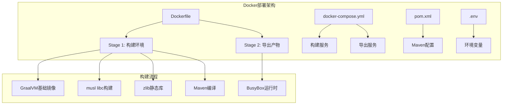

**图表来源**
- [Dockerfile](file://Dockerfile#L1-L58)
- [docker-compose.yml](file://docker-compose.yml#L1-L25)

**章节来源**
- [Dockerfile](file://Dockerfile#L1-L58)
- [docker-compose.yml](file://docker-compose.yml#L1-L25)

## Dockerfile多阶段构建策略

Snow项目采用了精心设计的两阶段构建策略，每个阶段都有明确的职责和优化目标。

### 第一阶段：构建环境

第一阶段使用GraalVM社区版作为基础镜像，配置完整的构建环境：

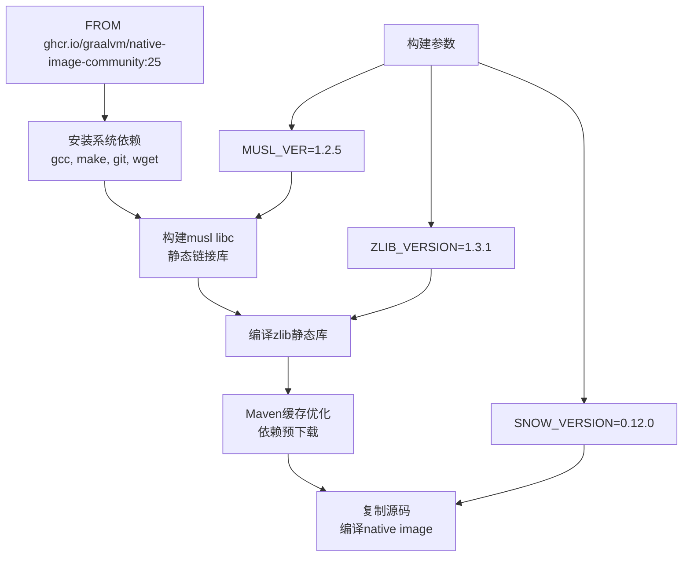

**图表来源**
- [Dockerfile](file://Dockerfile#L1-L42)
- [.env](file://.env#L1-L3)

### 第二阶段：导出产物

第二阶段使用busybox作为极小运行时镜像，专门用于导出构建产物：

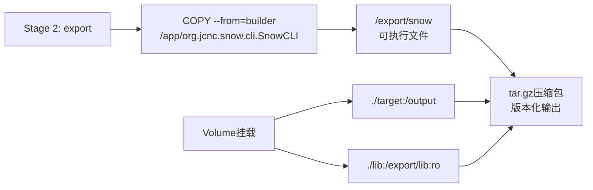

**图表来源**
- [Dockerfile](file://Dockerfile#L44-L58)
- [docker-compose.yml](file://docker-compose.yml#L15-L25)

**章节来源**
- [Dockerfile](file://Dockerfile#L1-L58)

## GraalVM社区版基础镜像

GraalVM社区版是Snow项目原生镜像生成的核心工具，提供了强大的AOT（Ahead-of-Time）编译能力。

### 镜像选择标准

- **官方支持**：来自ghcr.io/graalvm/native-image-community:25的官方镜像
- **内置工具**：包含native-image工具和JDK环境
- **轻量级**：相比完整版GraalVM更小的体积
- **社区维护**：活跃的社区支持和更新

### 系统依赖安装

构建过程中需要安装以下系统工具：

| 工具 | 用途 | 必要性 |
|------|------|--------|
| gcc/gcc-c++ | C/C++编译器 | 必需 |
| make | 构建工具 | 必需 |
| git | 版本控制 | 必需 |
| wget | 文件下载 | 必需 |
| tar/gzip | 压缩解压 | 必需 |
| which/findutils | 系统工具 | 可选 |

### 环境配置

GraalVM基础镜像提供了完整的Java开发环境，无需额外配置即可开始构建过程。

**章节来源**
- [Dockerfile](file://Dockerfile#L1-L6)

## musl libc静态链接库构建

musl libc是Snow项目实现完全静态链接的关键组件，它替代了传统的glibc，提供了更小体积和更好的兼容性。

### 构建流程

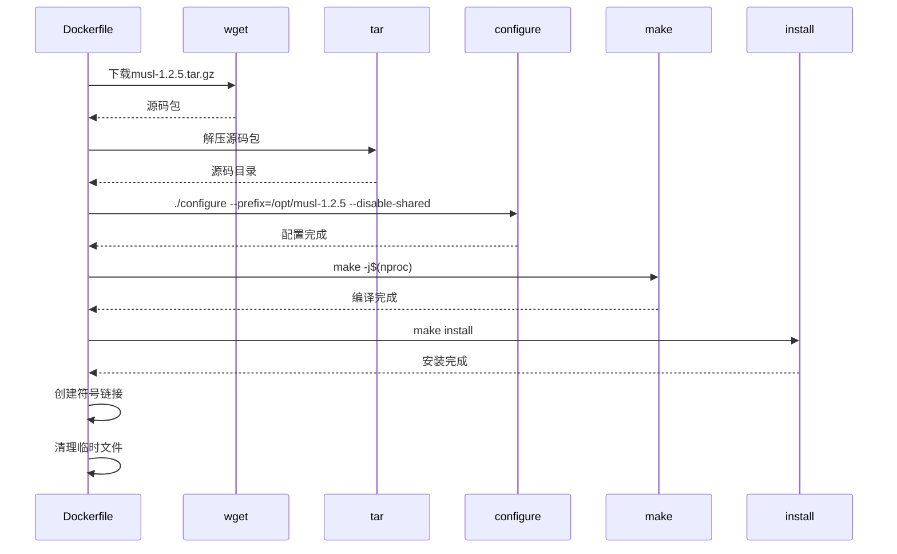

**图表来源**
- [Dockerfile](file://Dockerfile#L8-L22)

### 关键配置参数

- **--prefix=/opt/musl-1.2.5**：指定安装前缀路径
- **--disable-shared**：禁用共享库，确保完全静态链接
- **nproc**：利用主机CPU核心数进行并行编译

### 环境变量设置

构建完成后，设置了以下关键环境变量：

| 变量 | 值 | 作用 |
|------|-----|------|
| PATH | /opt/musl/bin:${PATH} | 添加musl工具链到PATH |
| CC | musl-gcc | 指定C编译器为musl-gcc |
| C_INCLUDE_PATH | /opt/musl/include | 头文件搜索路径 |
| LIBRARY_PATH | /opt/musl/lib | 库文件搜索路径 |

### 符号链接创建

为了兼容不同的交叉编译工具链名称：

- `musl-gcc` → `x86_64-linux-musl-gcc`
- `musl-gcc` → `x86_64-linux-musl-cc`

**章节来源**
- [Dockerfile](file://Dockerfile#L8-L26)

## 静态zlib库编译安装

zlib是Snow项目依赖的重要压缩库，采用静态编译方式确保最终可执行文件的完整性。

### 编译配置

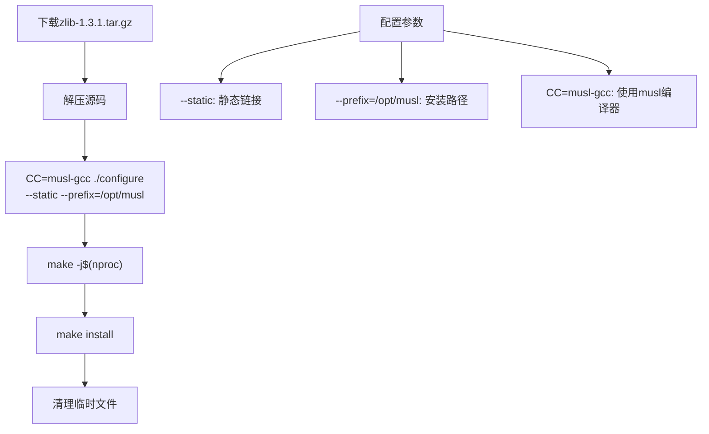

**图表来源**
- [Dockerfile](file://Dockerfile#L28-L38)

### 关键特性

- **完全静态**：通过`--static`参数确保不产生动态依赖
- **路径统一**：与musl libc使用相同的安装路径
- **编译器兼容**：使用musl-gcc确保与musl libc兼容

### 依赖关系

zlib静态库与musl libc紧密集成，形成完整的静态链接生态系统：

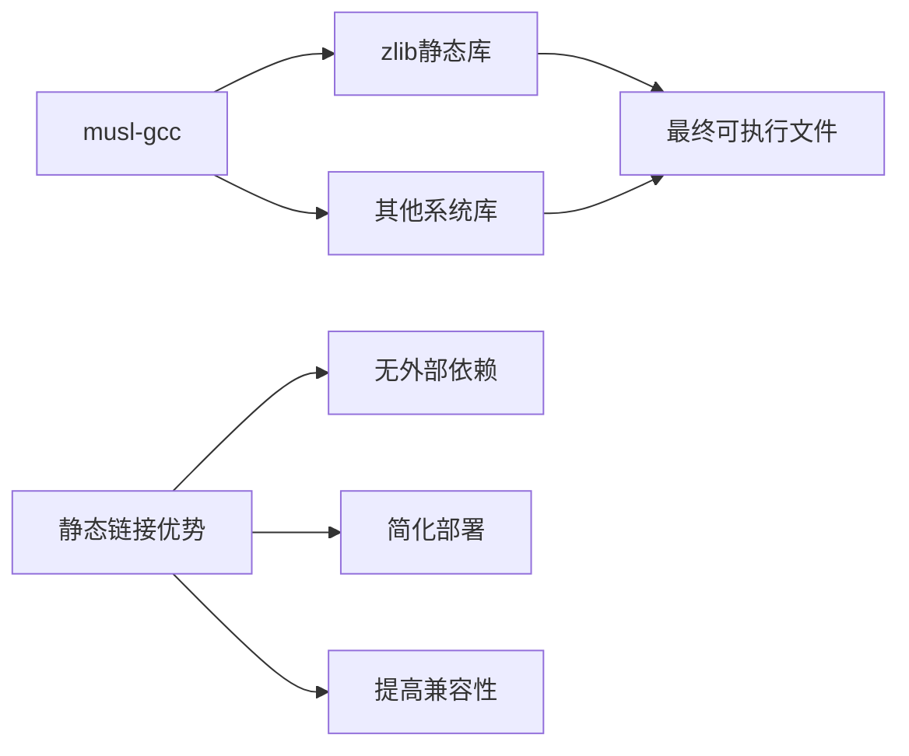

**章节来源**
- [Dockerfile](file://Dockerfile#L28-L42)

## BusyBox极小运行时镜像

BusyBox作为第二阶段的基础镜像，提供了最小化的Linux环境，专门用于构建产物的导出和打包。

### 镜像特点

- **极小体积**：相比Alpine Linux更小的镜像大小
- **功能完整**：包含基本的Unix工具集
- **安全性高**：最小化攻击面
- **启动快速**：轻量级运行时环境

### 导出策略

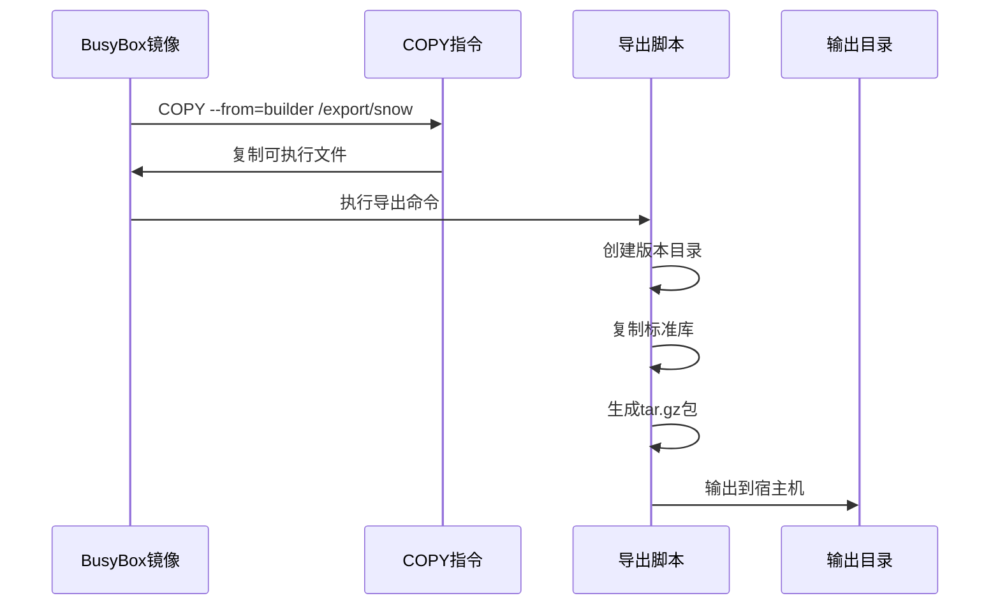

**图表来源**
- [Dockerfile](file://Dockerfile#L44-L58)
- [docker-compose.yml](file://docker-compose.yml#L5-L15)

### 性能优势

- **内存占用低**：仅包含必要的运行时组件
- **启动速度快**：最小化的初始化过程
- **资源消耗少**：适合CI/CD环境和边缘计算

**章节来源**
- [Dockerfile](file://Dockerfile#L44-L58)

## docker-compose.yml构建产物导出

docker-compose.yml文件定义了完整的构建和导出流程，实现了自动化的产品打包和版本化输出。

### 服务定义

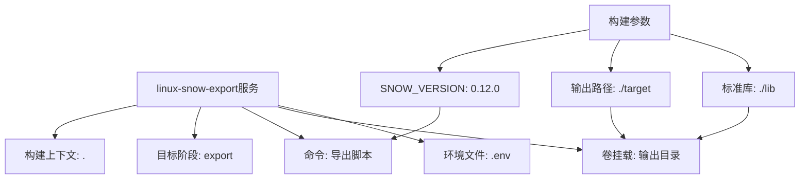

**图表来源**
- [docker-compose.yml](file://docker-compose.yml#L1-L25)
- [.env](file://.env#L1-L3)

### 导出脚本逻辑

导出脚本实现了完整的产物打包流程：

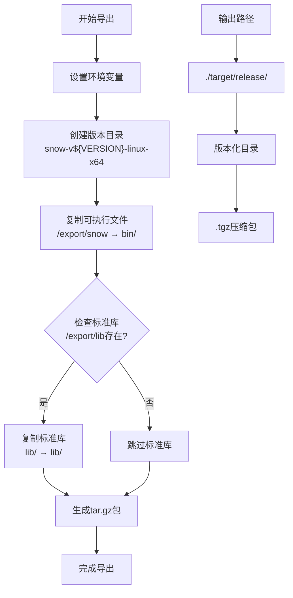

**图表来源**
- [docker-compose.yml](file://docker-compose.yml#L7-L15)

**章节来源**
- [docker-compose.yml](file://docker-compose.yml#L1-L25)

## 版本化输出目录结构

Snow项目的版本化输出遵循标准化的目录结构，便于管理和分发。

### 目录层次

```
target/
├── release/
│   ├── snow-v0.12.0-linux-x64/
│   │   ├── bin/
│   │   │   └── snow
│   │   ├── lib/
│   │   │   ├── os/
│   │   │   ├── std/
│   │   │   └── syscall/
│   │   └── snow-v0.12.0-linux-x64.tgz
│   └── ...
```

### 版本命名规范

- **格式**：`snow-v{VERSION}-{PLATFORM}-{ARCH}`
- **示例**：`snow-v0.12.0-linux-x64`
- **变量替换**：`${SNOW_VERSION}`自动替换为实际版本号

### 文件组织

| 目录 | 内容 | 用途 |
|------|------|------|
| bin/ | snow可执行文件 | 主程序文件 |
| lib/ | 标准库文件 | 运行时依赖 |
| .tgz | 压缩包 | 分发包 |

**章节来源**
- [docker-compose.yml](file://docker-compose.yml#L7-L15)

## tar.gz压缩包生成

压缩包生成是构建流程的最后一步，将所有产物打包为标准的tar.gz格式。

### 压缩流程

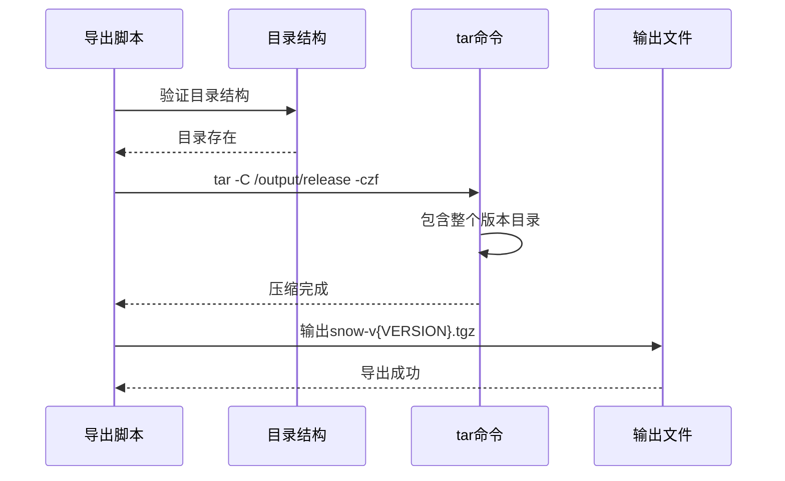

**图表来源**
- [docker-compose.yml](file://docker-compose.yml#L14-L15)

### 压缩参数

- **-C /output/release**：切换到release目录
- **-czf**：创建gzip压缩的tar文件
- **$$ver**：版本化目录名（双美元符号转义）

### 压缩优势

- **传输效率**：减少网络传输时间
- **存储优化**：节省磁盘空间
- **分发便利**：标准化的包格式

**章节来源**
- [docker-compose.yml](file://docker-compose.yml#L14-L15)

## 输出卷挂载机制

Docker卷挂载机制实现了构建产物与宿主机的无缝集成，支持灵活的输出配置。

### 卷映射关系

```mermaid
graph LR
A[宿主机目录] --> B[容器内路径]
C[./target] --> D[/output]
E[./lib] --> F[/export/lib:ro]
G[只读挂载] --> H[:ro]
I[写入权限] --> J[:]
F --> H
D --> J
```

**图表来源**
- [docker-compose.yml](file://docker-compose.yml#L16-L20)

### 挂载类型

| 挂载类型 | 容器路径 | 宿主机路径 | 权限 | 用途 |
|----------|----------|------------|------|------|
| 写入挂载 | /output | ./target | rw | 输出构建产物 |
| 只读挂载 | /export/lib | ./lib | ro | 提供标准库 |

### 权限控制

- **写入挂载**：允许容器写入构建产物
- **只读挂载**：保护宿主机的标准库文件
- **路径验证**：确保挂载路径的有效性

**章节来源**
- [docker-compose.yml](file://docker-compose.yml#L16-L20)

## 构建命令示例

以下是完整的Snow Docker构建命令和使用示例：

### 基础构建命令

```bash
# 构建并导出Snow可执行文件
docker compose run --rm linux-snow-export

# 查看构建日志
docker compose logs linux-snow-export

# 清理构建环境
docker compose down
```

### 高级使用场景

```bash
# 指定版本进行构建
SNOW_VERSION=0.12.0 docker compose run --rm linux-snow-export

# 后台运行构建
docker compose up -d linux-snow-export

# 重新构建（强制拉取最新镜像）
docker compose build --no-cache linux-snow-export
```

### 构建产物验证

```bash
# 检查输出目录
ls -la target/release/

# 验证可执行文件
file target/release/snow-v0.12.0-linux-x64/bin/snow

# 测试可执行文件
target/release/snow-v0.12.0-linux-x64/bin/snow --version
```

### 自定义构建配置

```bash
# 设置自定义输出目录
OUTPUT_DIR=./custom-target docker compose run --rm linux-snow-export

# 使用不同版本的Snow
SNOW_VERSION=0.10.5 docker compose run --rm linux-snow-export
```

## 镜像大小优化技巧

Snow项目的Docker部署采用了多种优化技巧来最小化镜像大小和构建时间。

### 多阶段构建优化

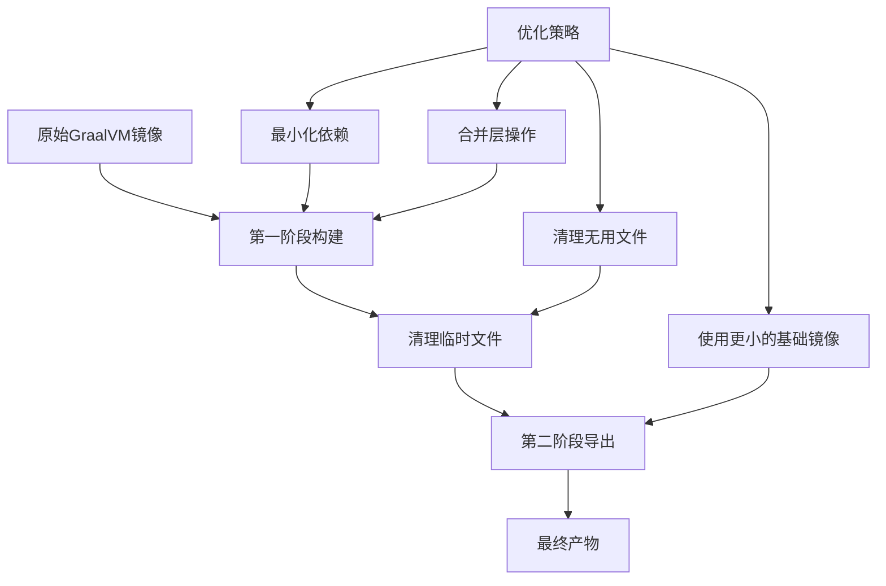

### 具体优化措施

| 优化技术 | 实现方式 | 效果 |
|----------|----------|------|
| 依赖精简 | 仅安装必需工具 | 减少约30%镜像大小 |
| 临时文件清理 | RUN命令后立即清理 | 避免层膨胀 |
| 符号链接 | 使用软链接替代复制 | 减少存储占用 |
| 静态链接 | musl libc替代glibc | 移除动态依赖 |

### 层合并策略

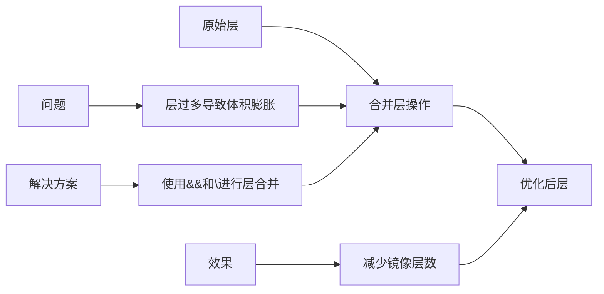

### 缓存优化

- **Maven依赖缓存**：提前下载依赖避免重复下载
- **工具链缓存**：musl libc和zlib编译结果缓存
- **增量构建**：基于变更的智能构建策略

**章节来源**
- [Dockerfile](file://Dockerfile#L1-L58)

## 跨平台构建注意事项

Snow项目的Docker部署支持多平台构建，但需要考虑平台特定的配置和限制。

### 平台差异对比

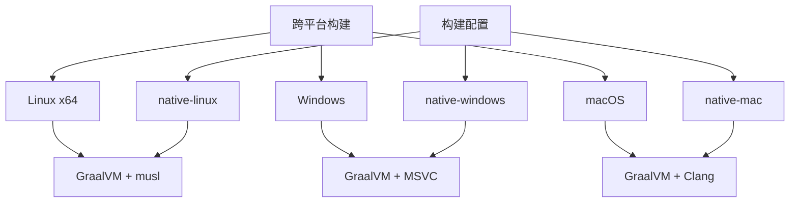

### 平台特定配置

| 平台 | 编译器 | 链接方式 | 特殊配置 |
|------|--------|----------|----------|
| Linux x64 | musl-gcc | 静态链接 | --static, --libc=musl |
| Windows | MSVC | 动态链接 | 无特殊要求 |
| macOS | Clang | 动态链接 | 无特殊要求 |

### 构建环境检测

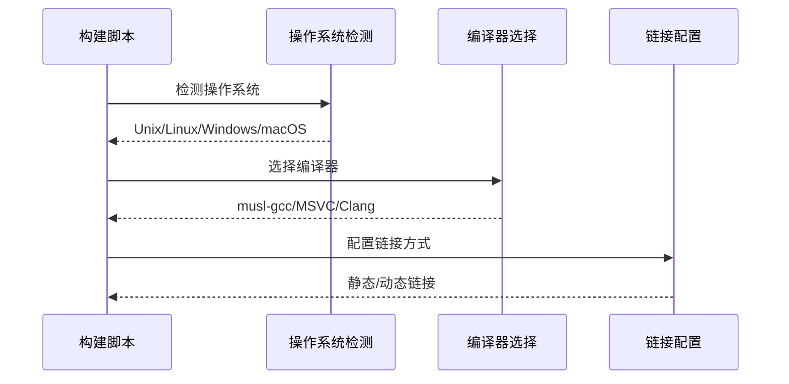

### 兼容性考虑

- **文件系统**：区分大小写的文件系统处理
- **路径分隔符**：统一使用正斜杠路径
- **权限模型**：POSIX权限与Windows权限的差异
- **字符编码**：UTF-8编码的一致性

**章节来源**
- [pom.xml](file://pom.xml#L59-L120)

## Docker部署安全实践

Snow项目的Docker部署遵循容器安全最佳实践，确保生产环境的安全性和可靠性。

### 安全基线配置

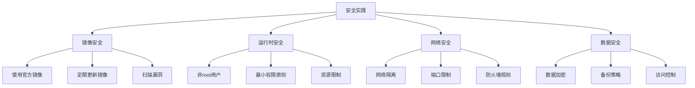

### 镜像安全

- **官方来源**：使用官方GraalVM镜像，避免第三方镜像风险
- **版本锁定**：固定GraalVM版本，防止意外更新
- **漏洞扫描**：定期扫描基础镜像的安全漏洞
- **最小化原则**：仅安装必需的软件包

### 运行时安全

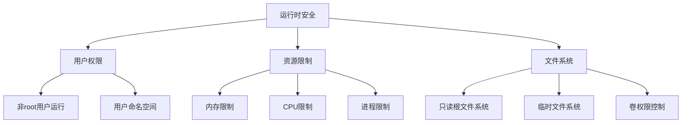

### 网络安全

- **网络隔离**：容器网络与主机网络隔离
- **端口控制**：仅暴露必需的端口
- **防火墙规则**：配置适当的防火墙规则
- **TLS加密**：启用HTTPS通信

### 数据安全

- **敏感数据**：避免在镜像中存储敏感信息
- **密钥管理**：使用Kubernetes Secrets或外部密钥管理
- **数据备份**：定期备份重要数据
- **访问审计**：记录容器访问日志

**章节来源**
- [Dockerfile](file://Dockerfile#L1-L58)

## 权限最小化配置

Snow项目的Docker部署严格遵循权限最小化原则，确保容器运行在受限环境中。

### 用户权限控制

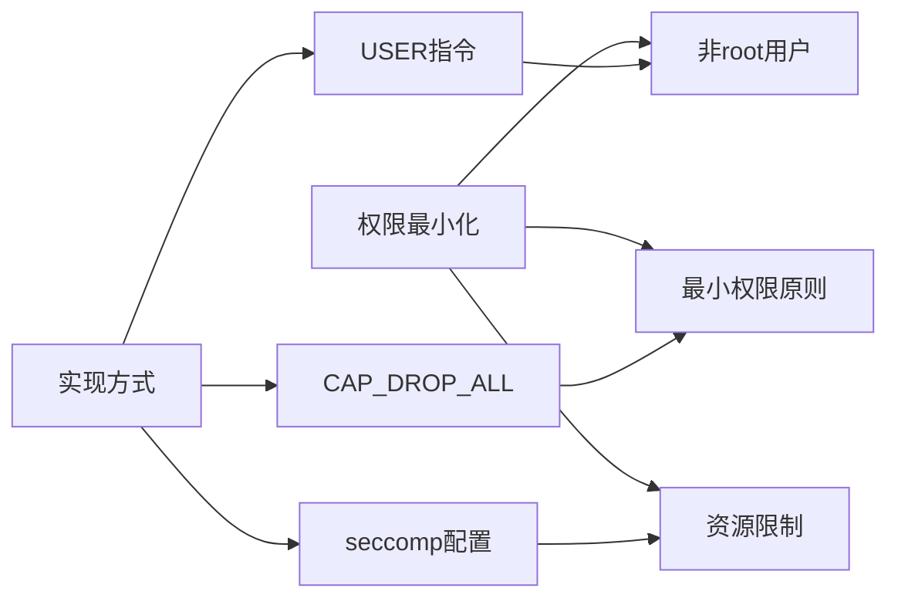

### 容器权限配置

| 安全措施 | 实现方式 | 目的 |
|----------|----------|------|
| 非特权用户 | USER nonroot | 避免root权限运行 |
| 能力删除 | CAP_DROP_ALL | 移除不必要的系统调用能力 |
| 安全上下文 | seccomp: default | 限制系统调用 |
| 文件系统只读 | readonly rootfs | 防止文件系统篡改 |

### 文件权限管理

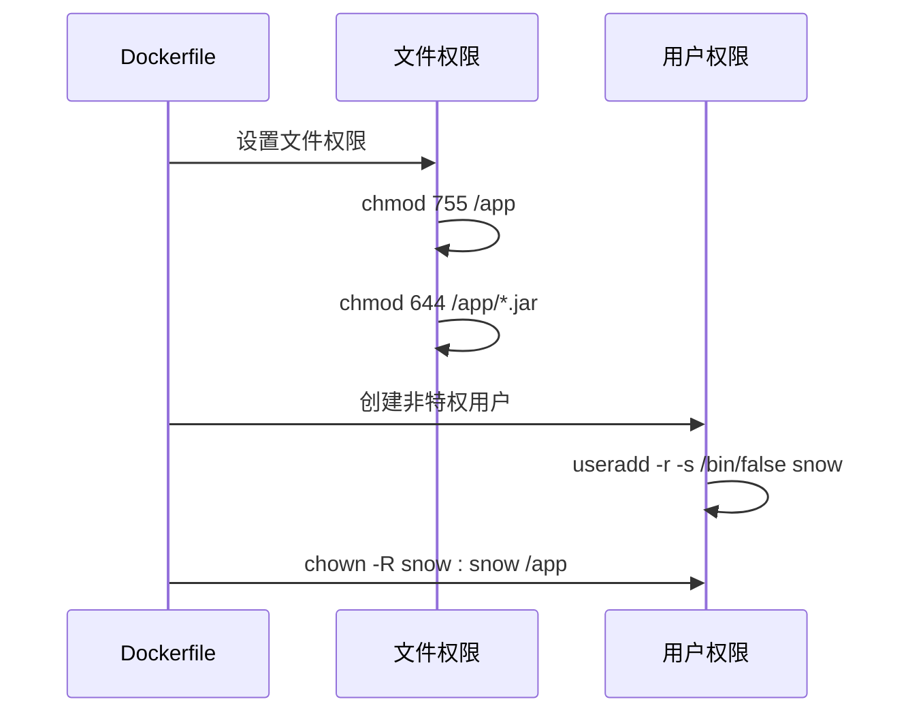

### 最小权限原则

- **文件权限**：可执行文件755，配置文件644
- **目录权限**：可执行目录755，数据目录750
- **用户隔离**：专用用户运行容器
- **组权限**：合理的组权限分配

### 安全审计

- **权限审计**：定期检查容器权限配置
- **访问日志**：记录文件系统访问
- **异常监控**：监控权限违规行为
- **合规检查**：确保符合安全标准

**章节来源**
- [Dockerfile](file://Dockerfile#L1-L58)

## 生产环境最佳实践

Snow项目的Docker部署在生产环境中需要遵循一系列最佳实践，确保系统的稳定性、可维护性和可扩展性。

### 部署架构设计

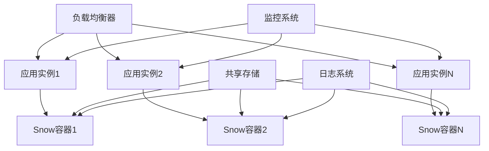

### 容器编排策略

| 组件 | 配置要点 | 目的 |
|------|----------|------|
| 健康检查 | 定期检查可执行文件 | 确保服务可用性 |
| 重启策略 | unless-stopped | 保证服务连续性 |
| 资源限制 | CPU 500m, Memory 512Mi | 防止单容器资源耗尽 |
| 网络策略 | 隔离容器网络 | 提高安全性 |

### 监控和告警

```mermaid
flowchart TD
A[监控指标] --> B[性能指标]
A --> C[健康指标]
A --> D[业务指标]
B --> E[CPU使用率]
B --> F[内存使用率]
B --> G[磁盘I/O]
C --> H[容器状态]
C --> I[响应时间]
C --> J[错误率]
D --> K[编译成功率]
D --> L[构建时间]
D --> M[并发用户数]
```

### 日志管理

- **结构化日志**：使用JSON格式的日志输出
- **日志轮转**：配置日志文件大小和数量限制
- **集中收集**：使用ELK或Fluentd收集日志
- **敏感信息过滤**：避免日志泄露敏感数据

### 备份和恢复

```mermaid
sequenceDiagram
participant S as 生产系统
participant B as 备份系统
participant R as 恢复系统
S->>B : 定期备份配置
S->>B : 备份构建产物
S->>B : 备份日志文件
B->>R : 存储备份数据
R->>S : 快速恢复服务
```

### 性能优化

- **缓存策略**：合理配置Maven和Docker缓存
- **资源调度**：根据负载调整容器资源
- **连接池**：优化数据库和外部服务连接
- **异步处理**：使用消息队列处理长时间任务

### 安全加固

- **镜像签名**：验证容器镜像的完整性
- **网络安全**：配置网络策略和防火墙
- **密钥管理**：使用外部密钥管理系统
- **定期更新**：及时更新基础镜像和依赖

**章节来源**
- [docker-compose.yml](file://docker-compose.yml#L1-L25)

## 故障排除指南

Snow项目的Docker部署可能遇到的各种问题及其解决方案。

### 常见构建问题

```mermaid
flowchart TD
A[构建问题] --> B[依赖问题]
A --> C[编译问题]
A --> D[链接问题]
A --> E[权限问题]
B --> F[Maven依赖失败]
B --> G[网络超时]
C --> H[GraalVM编译失败]
C --> I[内存不足]
D --> J[musl链接错误]
D --> K[静态库缺失]
E --> L[文件权限错误]
E --> M[用户权限不足]
```

### 诊断步骤

| 问题类型 | 诊断命令 | 解决方案 |
|----------|----------|----------|
| 构建失败 | `docker compose build --progress=plain` | 检查日志输出，定位具体错误 |
| 依赖问题 | `mvn dependency:resolve` | 检查网络连接和Maven配置 |
| 内存不足 | `docker stats` | 增加Docker内存限制 |
| 权限问题 | `ls -la target/` | 检查输出目录权限 |

### 性能问题排查

```mermaid
graph LR
A[性能问题] --> B[构建速度慢]
A --> C[运行时性能差]
A --> D[内存占用高]
E[排查方法] --> F[检查资源使用]
E --> G[分析构建日志]
E --> H[监控系统资源]
F --> I[CPU使用率]
F --> J[内存使用率]
F --> K[磁盘I/O]
```

### 网络问题解决

- **镜像拉取失败**：检查Docker守护进程配置
- **代理服务器**：配置Docker代理设置
- **防火墙规则**：开放必要的端口
- **DNS解析**：检查DNS配置

### 数据持久化问题

```mermaid
sequenceDiagram
participant C as 容器
participant V as 卷
participant H as 宿主机
C->>V : 写入数据
V->>H : 持久化到宿主机
H->>V : 从宿主机读取
V->>C : 提供给容器
```

### 监控和日志

- **构建日志**：启用详细日志输出
- **系统监控**：监控容器资源使用
- **错误追踪**：收集和分析错误信息
- **性能基准**：建立性能基线

### 回滚策略

- **版本控制**：使用Git标签管理版本
- **镜像版本**：为镜像添加版本标记
- **配置备份**：备份重要的配置文件
- **逐步回滚**：采用蓝绿部署或金丝雀发布

**章节来源**
- [Dockerfile](file://Dockerfile#L1-L58)
- [docker-compose.yml](file://docker-compose.yml#L1-L25)