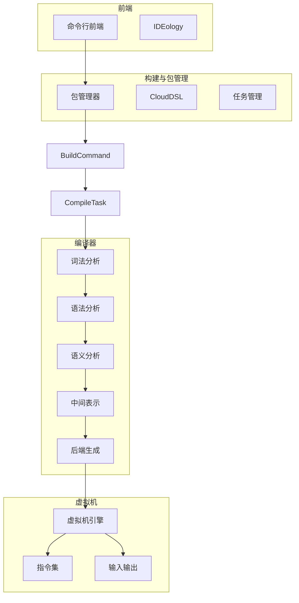
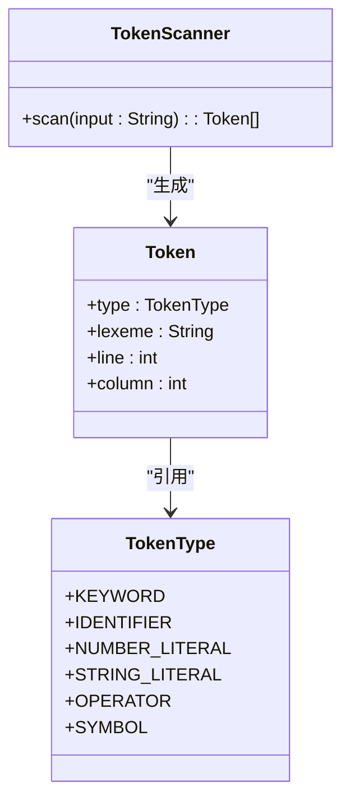
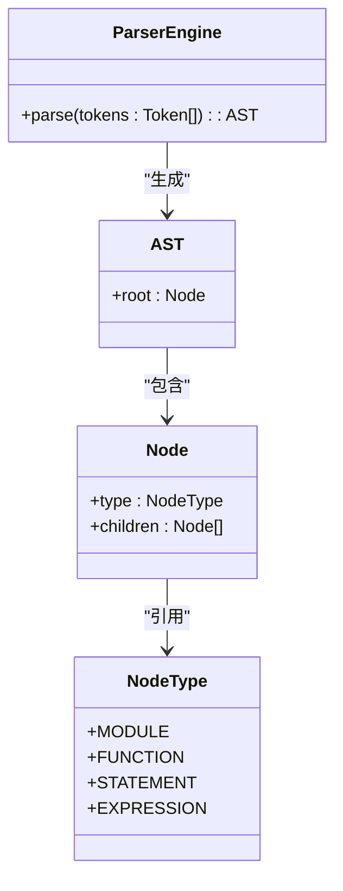
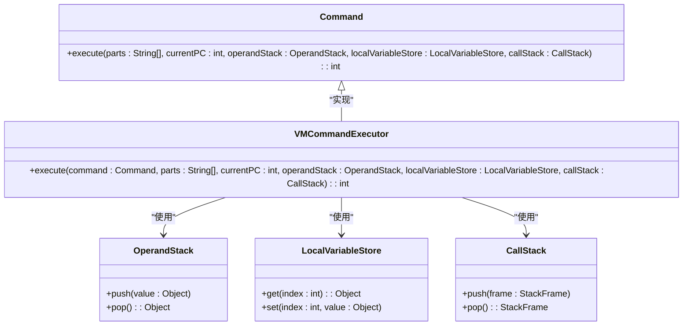
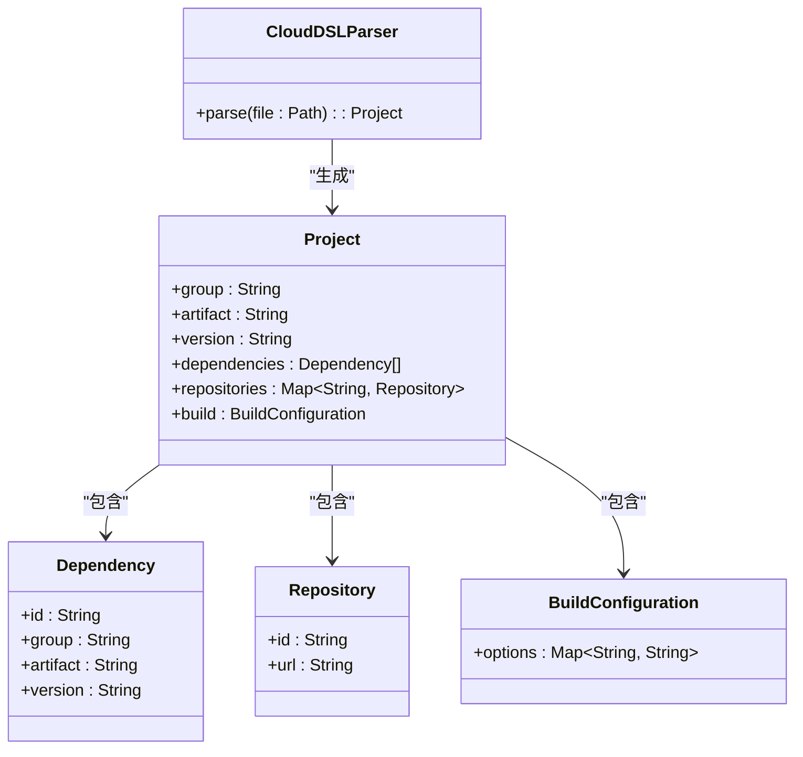
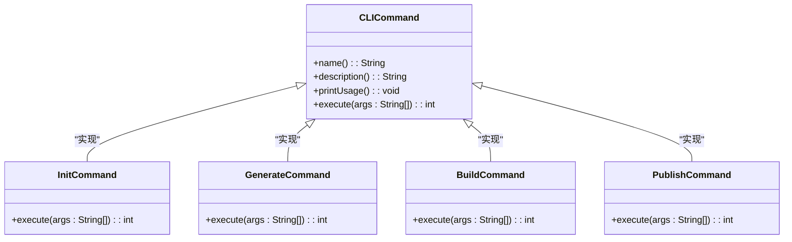
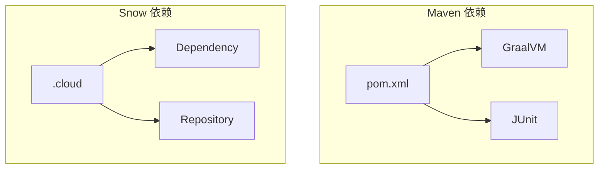
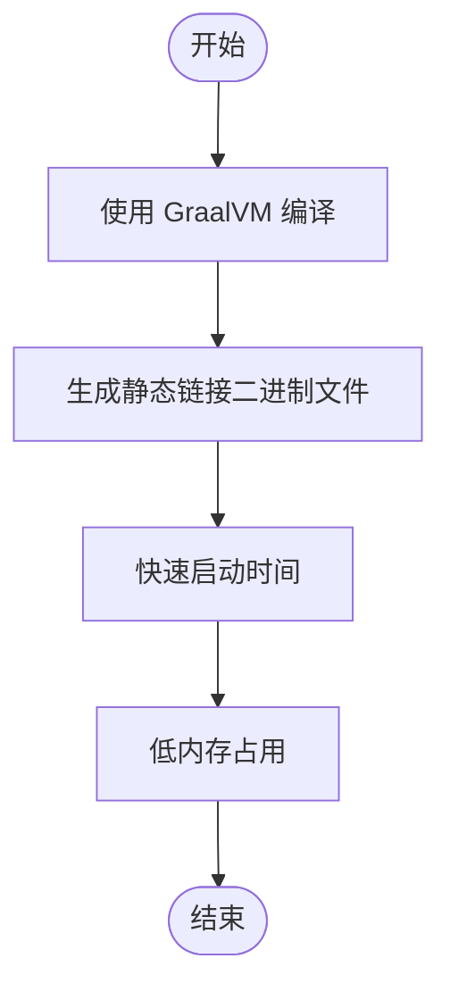

# 云原生部署

<cite>
**本文档引用的文件**
- [Dockerfile](file://Dockerfile)
- [docker-compose.yml](file://docker-compose.yml)
- [pom.xml](file://pom.xml)
- [.env](file://.env)
- [Project.java](file://src/main/java/org/jcnc/snow/pkg/model/Project.java)
- [CloudDSLParser.java](file://src/main/java/org/jcnc/snow/pkg/dsl/CloudDSLParser.java)
- [BuildCommand.java](file://src/main/java/org/jcnc/snow/cli/commands/BuildCommand.java)
- [PublishCommand.java](file://src/main/java/org/jcnc/snow/cli/commands/PublishCommand.java)
- [GenerateCommand.java](file://src/main/java/org/jcnc/snow/cli/commands/GenerateCommand.java)
- [InitCommand.java](file://src/main/java/org/jcnc/snow/cli/commands/InitCommand.java)
- [ProjectCloudExample.java](file://src/main/java/org/jcnc/snow/cli/utils/ProjectCloudExample.java)
- [BuildConfiguration.java](file://src/main/java/org/jcnc/snow/pkg/model/BuildConfiguration.java)
- [Dependency.java](file://src/main/java/org/jcnc/snow/pkg/model/Dependency.java)
- [Repository.java](file://src/main/java/org/jcnc/snow/pkg/model/Repository.java)
</cite>

## 目录
1. [简介](#简介)
2. [项目结构](#项目结构)
3. [核心组件](#核心组件)
4. [架构概述](#架构概述)
5. [详细组件分析](#详细组件分析)
6. [依赖分析](#依赖分析)
7. [性能考量](#性能考量)
8. [故障排除指南](#故障排除指南)
9. [结论](#结论)
10. [附录](#附录)

## 简介
Snow 是一门面向 AI 时代的新型编程语言，其设计初衷是让大模型（LLM）更容易生成和理解代码。本项目完整实现了 Snow 语言的编译流程，包括词法分析、语法分析、语义分析、中间表示（IR）生成，以及最终的虚拟机（VM）指令生成与执行。通过这一完整的编译-执行链路，开发者可以将 `.snow` 源文件编译为 `.water` 虚拟机指令，并直接在 SnowVM 上运行。从源码编译、构建管理、依赖管理、项目标准化到原生镜像发布，全部由 Snow 官方工具完成，降低了学习与集成成本。

## 项目结构
Snow 项目的目录结构清晰，主要分为以下几个部分：
- `compiler/`: Snow 编译器源代码目录
- `vm/`: 虚拟机相关源代码目录
- `pkg/`: 内置构建与包管理器 **snow pkg**
- `cli/`: 独立的命令行前端
- `frontend-lexer/` 和 `frontend-parser/`: 前端解析器模块
- `playground/`: 测试和性能测试代码
- 根目录下的 `Dockerfile`、`docker-compose.yml`、`pom.xml` 和 `.env` 文件用于构建和部署

**Diagram sources**
- [Dockerfile](file://Dockerfile#L1-L57)
- [docker-compose.yml](file://docker-compose.yml#L1-L24)
- [pom.xml](file://pom.xml#L1-L226)

**Section sources**
- [Dockerfile](file://Dockerfile#L1-L57)
- [docker-compose.yml](file://docker-compose.yml#L1-L24)
- [pom.xml](file://pom.xml#L1-L226)

## 核心组件
Snow 的核心组件包括编译器、虚拟机、构建与包管理器以及命令行前端。编译器负责将 `.snow` 源文件编译为 `.water` 虚拟机指令，虚拟机负责执行这些指令，构建与包管理器负责项目的构建和依赖管理，命令行前端提供用户交互界面。

**Section sources**
- [Project.java](file://src/main/java/org/jcnc/snow/pkg/model/Project.java#L1-L234)
- [CloudDSLParser.java](file://src/main/java/org/jcnc/snow/pkg/dsl/CloudDSLParser.java#L1-L41)
- [BuildCommand.java](file://src/main/java/org/jcnc/snow/cli/commands/BuildCommand.java#L1-L85)
- [PublishCommand.java](file://src/main/java/org/jcnc/snow/cli/commands/PublishCommand.java#L1-L73)

## 架构概述
Snow 的架构设计遵循模块化原则，各组件之间通过清晰的接口进行通信。编译器、虚拟机、构建与包管理器和命令行前端各自独立，但又紧密协作，共同完成从源码到可执行文件的整个流程。



**Diagram sources**
- [Dockerfile](file://Dockerfile#L1-L57)
- [pom.xml](file://pom.xml#L1-L226)
- [Project.java](file://src/main/java/org/jcnc/snow/pkg/model/Project.java#L1-L234)

## 详细组件分析
### 编译器分析
Snow 编译器分为词法分析、语法分析、语义分析、中间表示生成和后端生成五个阶段。每个阶段都有明确的职责和接口，确保了编译过程的高效和可靠。

#### 词法分析
词法分析器将源码切分为 Token，为后续的语法分析提供基础。



**Diagram sources**
- [TokenScanner.java](file://src/main/java/org/jcnc/snow/compiler/lexer/core/LexerEngine.java#L1-L50)
- [Token.java](file://src/main/java/org/jcnc/snow/compiler/lexer/token/Token.java#L1-L20)
- [TokenType.java](file://src/main/java/org/jcnc/snow/compiler/lexer/token/TokenType.java#L1-L30)

#### 语法分析
语法分析器将 Token 流解析为抽象语法树（AST），为语义分析提供结构化的数据。



**Diagram sources**
- [ParserEngine.java](file://src/main/java/org/jcnc/snow/compiler/parser/core/ParserEngine.java#L1-L50)
- [AST.java](file://src/main/java/org/jcnc/snow/compiler/parser/ast/Node.java#L1-L20)
- [Node.java](file://src/main/java/org/jcnc/snow/compiler/parser/ast/Node.java#L1-L30)

### 虚拟机分析
Snow 虚拟机负责执行编译生成的 `.water` 指令。虚拟机的设计注重性能和安全性，支持多种系统调用和网络操作。

#### 指令集
Snow 虚拟机的指令集包括控制流、寄存器控制、栈控制、系统控制等类别，每条指令都有明确的语义和执行方式。



**Diagram sources**
- [Command.java](file://src/main/java/org/jcnc/snow/vm/interfaces/Command.java#L1-L20)
- [VMCommandExecutor.java](file://src/main/java/org/jcnc/snow/vm/engine/VMCommandExecutor.java#L1-L50)
- [OperandStack.java](file://src/main/java/org/jcnc/snow/vm/module/OperandStack.java#L1-L30)
- [LocalVariableStore.java](file://src/main/java/org/jcnc/snow/vm/module/LocalVariableStore.java#L1-L30)
- [CallStack.java](file://src/main/java/org/jcnc/snow/vm/module/CallStack.java#L1-L30)

### 构建与包管理器分析
Snow 的构建与包管理器基于 `.cloud` 配置文件，支持依赖解析、编译、打包和发布等生命周期管理。

#### CloudDSL 解析
`.cloud` 配置文件通过 CloudDSLParser 解析为 Project 模型，为构建过程提供配置信息。



**Diagram sources**
- [CloudDSLParser.java](file://src/main/java/org/jcnc/snow/pkg/dsl/CloudDSLParser.java#L1-L41)
- [Project.java](file://src/main/java/org/jcnc/snow/pkg/model/Project.java#L1-L234)
- [Dependency.java](file://src/main/java/org/jcnc/snow/pkg/model/Dependency.java#L1-L46)
- [Repository.java](file://src/main/java/org/jcnc/snow/pkg/model/Repository.java#L1-L17)
- [BuildConfiguration.java](file://src/main/java/org/jcnc/snow/pkg/model/BuildConfiguration.java#L1-L41)

### 命令行前端分析
Snow 的命令行前端提供了一系列命令，如 `init`、`generate`、`build`、`publish` 等，方便用户进行项目初始化、构建和发布。

#### 命令实现
每个命令都实现了 CLICommand 接口，通过 execute 方法执行具体的操作。



**Diagram sources**
- [CLICommand.java](file://src/main/java/org/jcnc/snow/cli/api/CLICommand.java#L1-L20)
- [InitCommand.java](file://src/main/java/org/jcnc/snow/cli/commands/InitCommand.java#L1-L70)
- [GenerateCommand.java](file://src/main/java/org/jcnc/snow/cli/commands/GenerateCommand.java#L1-L49)
- [BuildCommand.java](file://src/main/java/org/jcnc/snow/cli/commands/BuildCommand.java#L1-L85)
- [PublishCommand.java](file://src/main/java/org/jcnc/snow/cli/commands/PublishCommand.java#L1-L73)

## 依赖分析
Snow 项目的依赖管理通过 Maven 和 `.cloud` 配置文件共同完成。Maven 负责管理 Java 依赖，`.cloud` 配置文件负责管理 Snow 项目的依赖。



**Diagram sources**
- [pom.xml](file://pom.xml#L1-L226)
- [CloudDSLParser.java](file://src/main/java/org/jcnc/snow/pkg/dsl/CloudDSLParser.java#L1-L41)
- [Dependency.java](file://src/main/java/org/jcnc/snow/pkg/model/Dependency.java#L1-L46)
- [Repository.java](file://src/main/java/org/jcnc/snow/pkg/model/Repository.java#L1-L17)

## 性能考量
Snow 项目通过 GraalVM 原生镜像技术，实现了快速启动时间和低内存占用。GraalVM 原生镜像在云环境中的性能优势显著，特别适合 Serverless 平台和容器化部署。

### GraalVM 原生镜像
GraalVM 原生镜像通过 Ahead-of-Time (AOT) 编译技术，将 Java 应用编译为静态链接的二进制文件，消除了 JVM 启动时间和垃圾回收开销。



**Diagram sources**
- [pom.xml](file://pom.xml#L1-L226)
- [Dockerfile](file://Dockerfile#L1-L57)

## 故障排除指南
### 常见问题
1. **编译失败**: 检查 `.snow` 源文件的语法是否正确，确保所有依赖项都已正确配置。
2. **运行失败**: 检查 `.water` 文件是否正确生成，确保虚拟机环境配置正确。
3. **依赖解析失败**: 检查 `.cloud` 配置文件中的依赖项是否正确，确保仓库 URL 可访问。

### 调试技巧
1. **使用 `--debug` 标志**: 在编译和运行时使用 `--debug` 标志，可以查看详细的执行过程和状态。
2. **查看日志**: 查看 `target` 目录下的日志文件，获取详细的错误信息。
3. **使用 IDEology**: 使用 Snow 专属 IDE IDEology 进行调试，可以实时查看局部变量表和调用栈。

**Section sources**
- [LoggingUtils.java](file://src/main/java/org/jcnc/snow/vm/utils/LoggingUtils.java#L1-L57)
- [VMStateLogger.java](file://src/main/java/org/jcnc/snow/vm/utils/VMStateLogger.java#L1-L30)

## 结论
Snow 项目通过模块化设计和先进的编译技术，实现了从源码到可执行文件的高效转换。通过 GraalVM 原生镜像技术，Snow 在云环境中的性能表现优异，特别适合 Serverless 平台和容器化部署。未来，Snow 项目将继续优化性能和用户体验，为开发者提供更强大的工具支持。

## 附录
### Dockerfile 详解
```dockerfile
# Stage 1: 官方 GraalVM 社区版（已含 native-image）
FROM ghcr.io/graalvm/native-image-community:25 AS builder

RUN microdnf install -y \
      gcc gcc-c++ make git wget tar gzip which findutils maven \
    && microdnf clean all

# ---------- 构建 musl ----------
ARG MUSL_VER=1.2.5
WORKDIR /tmp
RUN wget -q https://musl.libc.org/releases/musl-${MUSL_VER}.tar.gz \
 && tar -xzf musl-${MUSL_VER}.tar.gz \
 && cd musl-${MUSL_VER} \
 && ./configure --prefix=/opt/musl-${MUSL_VER} --disable-shared \
 && make -j"$(nproc)" \
 && make install \
 && ln -s /opt/musl-${MUSL_VER} /opt/musl \
 && cd / && rm -rf /tmp/musl-${MUSL_VER}*

RUN ln -s /opt/musl/bin/musl-gcc /usr/local/bin/x86_64-linux-musl-gcc \
 && ln -s /opt/musl/bin/musl-gcc /usr/local/bin/x86_64-linux-musl-cc

ENV PATH="/opt/musl/bin:${PATH}"
ENV CC="musl-gcc"
ENV C_INCLUDE_PATH="/opt/musl/include"
ENV LIBRARY_PATH="/opt/musl/lib"

# ---------- 静态 zlib ----------
ARG ZLIB_VERSION=1.3.1
WORKDIR /tmp
RUN wget -q https://zlib.net/zlib-${ZLIB_VERSION}.tar.gz \
 && tar -xzf zlib-${ZLIB_VERSION}.tar.gz \
 && cd zlib-${ZLIB_VERSION} \
 && CC=musl-gcc ./configure --static --prefix=/opt/musl \
 && make -j"$(nproc)" \
 && make install \
 && cd / && rm -rf /tmp/zlib-${ZLIB_VERSION}*

# ---------- Maven 缓存优化 ----------
WORKDIR /app
COPY pom.xml ./

# 先拉依赖并缓存
RUN mvn -B -P native-linux dependency:go-offline

# ---------- 复制源码 ----------
COPY . /app

# ---------- 编译 native image ----------
RUN mvn -P native-linux -DskipTests clean package

# ------------------------------------------------------------ 
# Stage 2: 输出产物镜像（可以直接 cp 出二进制）
# ------------------------------------------------------------ 
FROM busybox AS export
WORKDIR /export
COPY --from=builder /app/org.jcnc.snow.cli.SnowCLI /export/snow
```

### docker-compose.yml 详解
```yaml
services:
  # Run with: docker compose run --rm linux-snow-export
  linux-snow-export:
    build:
      context: .
      target: export
    command:
      - /bin/sh
      - -c
      - |
        set -e
        ver="snow-v${SNOW_VERSION}-linux-x64"
        mkdir -p "/output/release/$$ver/bin"
        cp /export/snow "/output/release/$$ver/bin/"
        if [ -d /export/lib ]; then
          mkdir -p "/output/release/$$ver/lib"
          cp -a /export/lib/. "/output/release/$$ver/lib/"
        fi
        tar -C /output/release -czf "/output/release/$$ver.tgz" "$$ver"
    volumes:
      - ./target:/output
      - ./lib:/export/lib:ro
    env_file:
      - .env
```

### .env 文件
```
# Auto-generated by build\tools\generate-dotenv.ps1
SNOW_VERSION=0.11.0
```