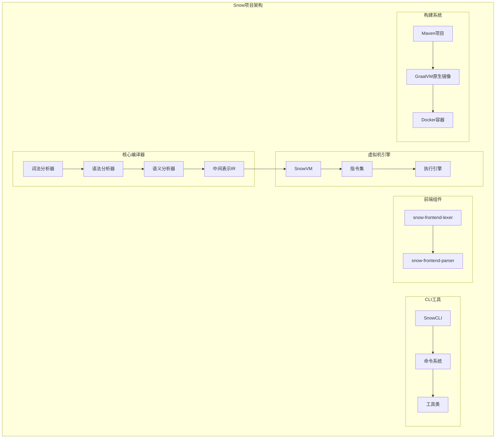
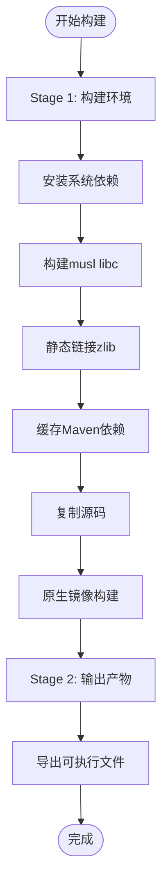
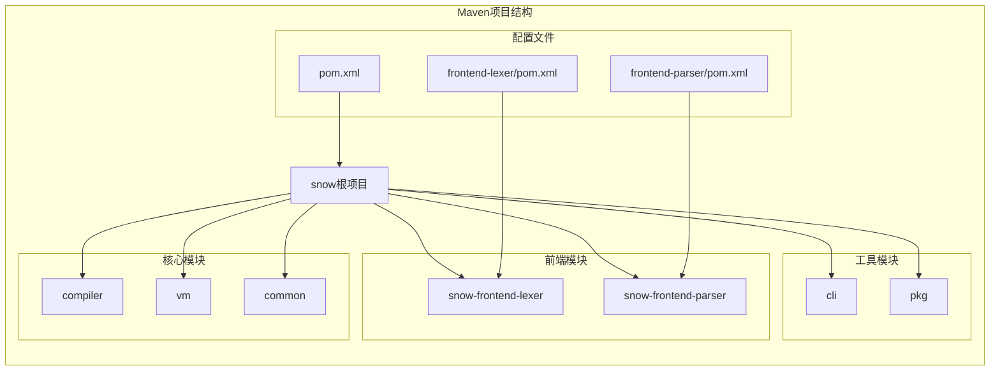
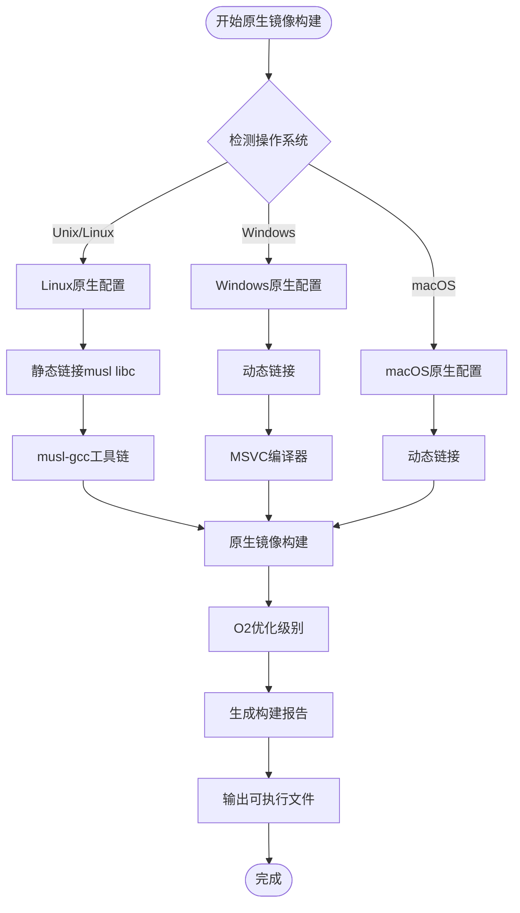
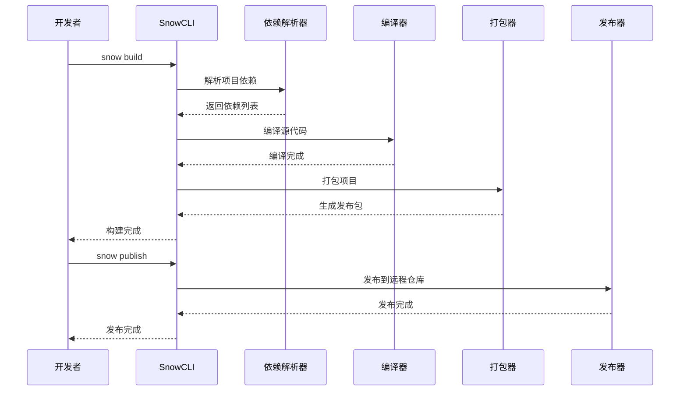
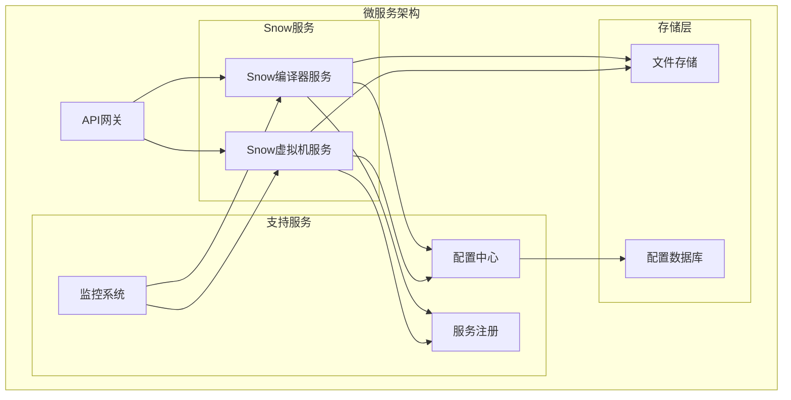
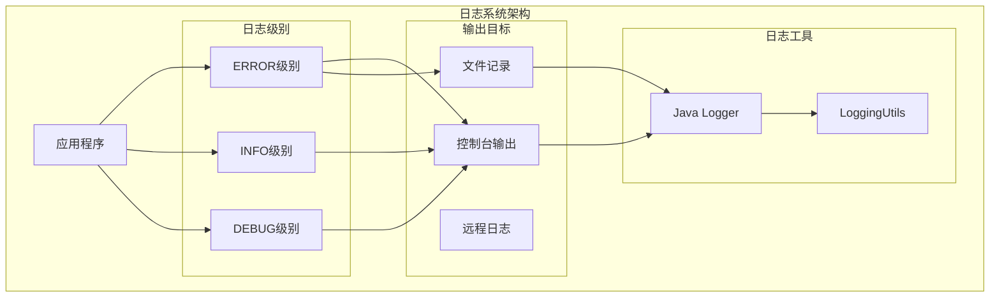
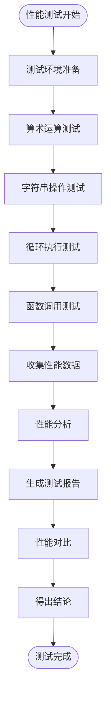
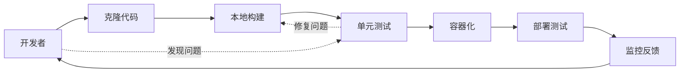

# Snow部署与集成文档

<cite>
**本文档引用的文件**
- [Dockerfile](file://Dockerfile)
- [docker-compose.yml](file://docker-compose.yml)
- [pom.xml](file://pom.xml)
- [frontend-lexer/pom.xml](file://frontend-lexer/pom.xml)
- [frontend-parser/pom.xml](file://frontend-parser/pom.xml)
- [.env](file://.env)
- [README.md](file://README.md)
- [docs/Snow-Lang-GraalVM-AOT-Native-Image-Package/Snow-Lang-GraalVM-AOT-Native-Image-Package.md](file://docs/Snow-Lang-GraalVM-AOT-Native-Image-Package/Snow-Lang-GraalVM-AOT-Native-Image-Package.md)
- [build/README.md](file://build/README.md)
- [src/main/java/org/jcnc/snow/pkg/tasks/PublishTask.java](file://src/main/java/org/jcnc/snow/pkg/tasks/PublishTask.java)
- [src/main/java/org/jcnc/snow/cli/commands/PublishCommand.java](file://src/main/java/org/jcnc/snow/cli/commands/PublishCommand.java)
- [src/main/java/org/jcnc/snow/cli/commands/BuildCommand.java](file://src/main/java/org/jcnc/snow/cli/commands/BuildCommand.java)
- [src/main/java/org/jcnc/snow/cli/commands/CleanCommand.java](file://src/main/java/org/jcnc/snow/cli/commands/CleanCommand.java)
- [src/main/java/org/jcnc/snow/vm/utils/LoggingUtils.java](file://src/main/java/org/jcnc/snow/vm/utils/LoggingUtils.java)
- [playground/PerformanceTest/PERFORMANCE_COMPARISON.md](file://playground/PerformanceTest/PERFORMANCE_COMPARISON.md)
- [playground/PerformanceTest/PERFORMANCE_REPORT.md](file://playground/PerformanceTest/PERFORMANCE_REPORT.md)
</cite>

## 目录
1. [概述](#概述)
2. [项目架构](#项目架构)
3. [Docker容器化部署](#docker容器化部署)
4. [Maven构建系统](#maven构建系统)
5. [GraalVM原生镜像构建](#graalvm原生镜像构建)
6. [CI/CD集成方案](#cicd集成方案)
7. [云平台部署指南](#云平台部署指南)
8. [微服务集成模式](#微服务集成模式)
9. [安全加固策略](#安全加固策略)
10. [监控与日志管理](#监控与日志管理)
11. [性能优化与测试](#性能优化与测试)
12. [自动化部署脚本](#自动化部署脚本)
13. [最佳实践](#最佳实践)

## 概述

Snow是一个面向AI时代的新型编程语言，其部署与集成方案涵盖了从本地开发环境到生产级云平台的完整解决方案。本文档详细介绍了Snow项目的容器化部署、构建系统配置、原生镜像优化、CI/CD流水线集成以及云平台部署的最佳实践。

### 核心特性
- **多平台支持**：Linux、Windows、macOS原生镜像构建
- **容器化部署**：基于Docker的现代化部署方案
- **模块化构建**：Maven多模块项目结构
- **原生性能**：GraalVM AOT编译优化
- **CI/CD集成**：完整的自动化部署流水线

## 项目架构

Snow项目采用分层架构设计，包含核心编译器、虚拟机引擎、CLI工具和前端组件等多个模块。



**图表来源**
- [pom.xml](file://pom.xml#L1-L227)
- [frontend-lexer/pom.xml](file://frontend-lexer/pom.xml#L1-L41)
- [frontend-parser/pom.xml](file://frontend-parser/pom.xml#L1-L70)

**章节来源**
- [pom.xml](file://pom.xml#L1-L227)
- [README.md](file://README.md#L1-L639)

## Docker容器化部署

### Dockerfile配置详解

Snow项目使用多阶段Docker构建来优化最终镜像大小和安全性。



**图表来源**
- [Dockerfile](file://Dockerfile#L1-L58)

#### 基础镜像选择

项目选择`ghcr.io/graalvm/native-image-community:25`作为基础镜像，该镜像包含了：
- GraalVM JDK 25
- native-image工具
- 必要的构建工具链

#### 构建阶段配置

1. **系统依赖安装**：使用microdnf安装gcc、make、git等构建工具
2. **musl libc构建**：静态链接优化，减少运行时依赖
3. **zlib静态链接**：确保压缩功能的独立性
4. **Maven缓存优化**：预先下载依赖，加速构建过程

#### 最终镜像优化

采用busybox作为最终输出镜像，只包含必要的可执行文件，大幅减少镜像体积。

**章节来源**
- [Dockerfile](file://Dockerfile#L1-L58)
- [docker-compose.yml](file://docker-compose.yml#L1-L25)

### docker-compose编排策略

项目使用docker-compose定义多容器应用编排，支持跨平台的原生镜像导出。

#### 服务配置

```yaml
services:
  linux-snow-export:
    build:
      context: .
      target: export
    command: >
      /bin/sh -c "
        set -e
        ver='snow-v${SNOW_VERSION}-linux-x64'
        mkdir -p '/output/release/$$ver/bin'
        cp /export/snow '/output/release/$$ver/bin/'
        if [ -d /export/lib ]; then
          mkdir -p '/output/release/$$ver/lib'
          cp -a /export/lib/. '/output/release/$$ver/lib/'
        fi
        tar -C /output/release -czf '/output/release/$$ver.tgz' '$$ver'
      "
    volumes:
      - ./target:/output
      - ./lib:/export/lib:ro
    env_file:
      - .env
```

#### 关键特性

1. **环境变量注入**：通过.env文件传递版本信息
2. **动态命名**：根据版本号动态生成输出文件名
3. **目录结构**：保持标准的bin/lib目录结构
4. **压缩打包**：自动生成tgz格式的发布包

**章节来源**
- [docker-compose.yml](file://docker-compose.yml#L1-L25)
- [.env](file://.env#L1-L3)

## Maven构建系统

### 项目结构与模块化

Snow项目采用Maven多模块架构，支持独立构建和集成构建两种模式。



**图表来源**
- [pom.xml](file://pom.xml#L1-L227)
- [frontend-lexer/pom.xml](file://frontend-lexer/pom.xml#L1-L41)
- [frontend-parser/pom.xml](file://frontend-parser/pom.xml#L1-L70)

### 依赖管理策略

#### 核心依赖配置

项目使用统一的Java 25版本，确保编译兼容性和性能优化。

```xml
<properties>
    <project.build.sourceEncoding>UTF-8</project.build.sourceEncoding>
    <project.reporting.outputEncoding>UTF-8</project.reporting.outputEncoding>
    <maven.compiler.source>25</maven.compiler.source>
    <maven.compiler.target>25</maven.compiler.target>
    <native.maven.plugin.version>0.10.5</native.maven.plugin.version>
</properties>
```

#### 编译插件配置

1. **maven-compiler-plugin**：Java源码编译，使用release 25
2. **maven-jar-plugin**：JAR打包，配置主类和清单文件

### 构建配置文件

#### 独立构建配置

```xml
<plugin>
    <groupId>org.apache.maven.plugins</groupId>
    <artifactId>maven-compiler-plugin</artifactId>
    <version>3.14.0</version>
    <configuration>
        <release>25</release>
    </configuration>
</plugin>
```

#### 集成构建配置

```xml
<plugin>
    <groupId>org.apache.maven.plugins</groupId>
    <artifactId>maven-jar-plugin</artifactId>
    <version>3.3.0</version>
    <configuration>
        <archive>
            <manifest>
                <mainClass>org.jcnc.snow.cli.SnowCLI</mainClass>
                <addClasspath>true</addClasspath>
                <addDefaultImplementationEntries>true</addDefaultImplementationEntries>
            </manifest>
        </archive>
    </configuration>
</plugin>
```

**章节来源**
- [pom.xml](file://pom.xml#L1-L227)
- [frontend-lexer/pom.xml](file://frontend-lexer/pom.xml#L1-L41)
- [frontend-parser/pom.xml](file://frontend-parser/pom.xml#L1-L70)

## GraalVM原生镜像构建

### 多平台原生镜像配置

Snow项目支持Linux、Windows和macOS三个平台的原生镜像构建，每个平台都有专门的配置文件。



**图表来源**
- [pom.xml](file://pom.xml#L60-L227)

### Linux平台配置

#### 静态链接优化

```xml
<buildArgs>
    <buildArg>--static</buildArg>
    <buildArg>--libc=musl</buildArg>
    <buildArg>--emit=build-report</buildArg>
    <buildArg>-O2</buildArg>
    <buildArg>-H:Class=org.jcnc.snow.cli.SnowCLI</buildArg>
    <buildArg>-H:CCompilerPath=/opt/musl/bin/musl-gcc</buildArg>
    <buildArg>-H:CLibraryPath=/opt/musl/lib</buildArg>
</buildArgs>
```

#### 关键特性

1. **静态链接**：使用musl libc实现完全静态链接
2. **工具链配置**：指定musl-gcc作为C编译器
3. **优化级别**：O2级别优化
4. **构建报告**：生成详细的构建分析报告

### Windows平台配置

#### 动态链接配置

```xml
<buildArgs>
    <buildArg>--emit build-report</buildArg>
    <buildArg>-O2</buildArg>
</buildArgs>
```

#### 前置条件

1. **Visual Studio**：需要安装Visual Studio Build Tools 2022
2. **MSVC**：Microsoft Visual C++运行时
3. **Windows SDK**：Windows 11 SDK

### macOS平台配置

#### 动态链接配置

```xml
<buildArgs>
    <buildArg>--emit=build-report</buildArg>
    <buildArg>-O2</buildArg>
    <buildArg>-H:Class=org.jcnc.snow.cli.SnowCLI</buildArg>
</buildArgs>
```

**章节来源**
- [pom.xml](file://pom.xml#L60-L227)
- [docs/Snow-Lang-GraalVM-AOT-Native-Image-Package/Snow-Lang-GraalVM-AOT-Native-Image-Package.md](file://docs/Snow-Lang-GraalVM-AOT-Native-Image-Package/Snow-Lang-GraalVM-AOT-Native-Image-Package.md#L1-L231)

## CI/CD集成方案

### 构建生命周期管理

Snow项目实现了完整的生命周期管理，支持依赖解析、编译、打包和发布四个主要阶段。



**图表来源**
- [src/main/java/org/jcnc/snow/cli/commands/BuildCommand.java](file://src/main/java/org/jcnc/snow/cli/commands/BuildCommand.java#L45-L85)
- [src/main/java/org/jcnc/snow/cli/commands/PublishCommand.java](file://src/main/java/org/jcnc/snow/cli/commands/PublishCommand.java#L43-L73)

### 项目构建流程

#### BuildCommand实现

```java
@Override
public int execute(String[] args) throws Exception {
    Path dslFile = Paths.get("project.cloud");
    Project project = CloudDSLParser.parse(dslFile);
    DependencyResolver resolver = new DependencyResolver(
        Paths.get(System.getProperty("user.home"), ".snow", "cache")
    );
    LifecycleManager lm = new LifecycleManager();

    // 注册各阶段任务
    lm.register(LifecyclePhase.RESOLVE_DEPENDENCIES, () -> resolver.resolve(project));
    lm.register(LifecyclePhase.COMPILE, new CompileTask(project));
    lm.register(LifecyclePhase.PACKAGE, new PackageTask(project));

    lm.executeAll();
    return 0;
}
```

#### 生命周期阶段

1. **RESOLVE_DEPENDENCIES**：解析项目依赖关系
2. **COMPILE**：编译源代码文件
3. **PACKAGE**：打包构建产物
4. **PUBLISH**：发布到远程仓库

### 发布任务实现

#### PublishTask设计

```java
@Override
public void run() throws Exception {
    // TODO: 实现上传到远程仓库
    System.out.println("[publish] uploading artifact " + 
        project.getArtifact() + "-" + project.getVersion());
}
```

#### 发布流程

1. **项目解析**：读取project.cloud配置文件
2. **任务注册**：注册PUBLISH阶段的任务
3. **生命周期执行**：按顺序执行所有阶段任务

**章节来源**
- [src/main/java/org/jcnc/snow/cli/commands/BuildCommand.java](file://src/main/java/org/jcnc/snow/cli/commands/BuildCommand.java#L45-L85)
- [src/main/java/org/jcnc/snow/cli/commands/PublishCommand.java](file://src/main/java/org/jcnc/snow/cli/commands/PublishCommand.java#L43-L73)
- [src/main/java/org/jcnc/snow/pkg/tasks/PublishTask.java](file://src/main/java/org/jcnc/snow/pkg/tasks/PublishTask.java#L1-L34)

## 云平台部署指南

### Kubernetes部署配置

虽然项目本身没有提供Kubernetes配置，但基于Docker容器化方案，可以轻松部署到Kubernetes集群。

#### 部署策略

```yaml
apiVersion: apps/v1
kind: Deployment
metadata:
  name: snow-compiler
spec:
  replicas: 3
  selector:
    matchLabels:
      app: snow-compiler
  template:
    metadata:
      labels:
        app: snow-compiler
    spec:
      containers:
      - name: snow-compiler
        image: snow:latest
        ports:
        - containerPort: 8080
        resources:
          requests:
            memory: "128Mi"
            cpu: "100m"
          limits:
            memory: "256Mi"
            cpu: "500m"
        volumeMounts:
        - name: snow-config
          mountPath: /app/config
      volumes:
      - name: snow-config
        configMap:
          name: snow-config
```

### 容器编排最佳实践

#### 资源限制配置

```yaml
resources:
  requests:
    memory: "128Mi"
    cpu: "100m"
  limits:
    memory: "512Mi"
    cpu: "1000m"
```

#### 健康检查配置

```yaml
livenessProbe:
  exec:
    command:
    - /app/snow
    - --version
  initialDelaySeconds: 30
  periodSeconds: 10
readinessProbe:
  exec:
    command:
    - /app/snow
    - --help
  initialDelaySeconds: 5
  periodSeconds: 5
```

### 微服务集成模式

#### API网关集成



## 微服务集成模式

### 服务拆分策略

基于Snow项目的功能特性，可以将其拆分为以下微服务：

#### 编译服务
- **职责**：处理Snow源代码编译请求
- **接口**：RESTful API，支持文件上传和编译结果下载
- **依赖**：Snow编译器、文件存储服务

#### 虚拟机服务
- **职责**：执行编译后的Snow字节码
- **接口**：虚拟机API，支持程序执行和状态查询
- **依赖**：Snow虚拟机引擎、内存管理

#### 项目管理服务
- **职责**：管理Snow项目配置和依赖
- **接口**：项目配置API，支持项目创建、更新和删除
- **依赖**：配置数据库、文件系统

### 服务通信模式

#### 同步通信
```java
// 编译请求
@PostMapping("/compile")
public ResponseEntity<CompilationResult> compile(@RequestBody CompilationRequest request) {
    // 调用Snow编译器
    CompilationResult result = compiler.compile(request.getSourceCode());
    return ResponseEntity.ok(result);
}
```

#### 异步通信
```java
// 异步编译提交
@PostMapping("/compile/async")
public ResponseEntity<String> submitAsyncCompile(@RequestBody CompilationRequest request) {
    // 提交到消息队列
    messageQueue.send("compile", request);
    return ResponseEntity.accepted().body("Compilation submitted");
}
```

## 安全加固策略

### 容器安全配置

#### 非root用户运行

```dockerfile
# 创建非root用户
RUN groupadd -r snow && useradd -r -g snow snow

# 切换到非root用户
USER snow

# 设置工作目录权限
WORKDIR /app
RUN chown snow:snow /app
```

#### 安全扫描配置

```yaml
# Docker Security Scan
security:
  scan:
    enabled: true
    severity:
      - HIGH
      - CRITICAL
    vuln:
      - CVE-2023-XXXX
      - CVE-2023-YYYY
```

### 访问控制策略

#### RBAC配置

```yaml
apiVersion: rbac.authorization.k8s.io/v1
kind: Role
metadata:
  name: snow-compiler-role
rules:
- apiGroups: [""]
  resources: ["pods", "services"]
  verbs: ["get", "list", "watch"]
- apiGroups: ["apps"]
  resources: ["deployments"]
  verbs: ["get", "list", "update"]
```

#### 网络策略

```yaml
apiVersion: networking.k8s.io/v1
kind: NetworkPolicy
metadata:
  name: snow-network-policy
spec:
  podSelector:
    matchLabels:
      app: snow-compiler
  policyTypes:
  - Ingress
  - Egress
  ingress:
  - from:
    - podSelector:
        matchLabels:
          app: snow-client
    ports:
    - protocol: TCP
      port: 8080
```

### 数据保护措施

#### 敏感信息加密

```java
// 敏感配置加密
public class SecureConfig {
    @Encrypt
    private String apiKey;
    
    @Encrypt
    private String databasePassword;
}
```

#### 文件访问控制

```yaml
# Pod安全策略
apiVersion: policy/v1beta1
kind: PodSecurityPolicy
metadata:
  name: snow-psp
spec:
  privileged: false
  allowPrivilegeEscalation: false
  readOnlyRootFilesystem: true
  runAsUser:
    rule: 'RunAsAny'
  seLinux:
    rule: 'RunAsAny'
  volumes:
  - 'configMap'
  - 'emptyDir'
  - 'secret'
```

## 监控与日志管理

### 日志系统架构

Snow项目内置了完整的日志管理系统，支持多种日志级别和输出目标。



**图表来源**
- [src/main/java/org/jcnc/snow/vm/utils/LoggingUtils.java](file://src/main/java/org/jcnc/snow/vm/utils/LoggingUtils.java#L1-L57)

### 日志配置与管理

#### LoggingUtils实现

```java
public class LoggingUtils {
    private static final Logger LOGGER = Logger.getLogger(LoggingUtils.class.getName());
    
    public static void logError(String message) {
        System.err.println("Error: " + message);
        LOGGER.log(Level.SEVERE, message);
    }
    
    public static void logInfo(String title, String message) {
        print(title + message);
    }
}
```

#### 日志级别策略

1. **ERROR级别**：严重错误，记录到控制台和日志文件
2. **INFO级别**：一般信息，仅记录到控制台
3. **DEBUG级别**：调试信息，可根据配置启用

### 监控指标收集

#### 关键性能指标

```java
// 性能监控指标
public class PerformanceMetrics {
    // 编译时间统计
    private long compilationTime;
    
    // 内存使用情况
    private long memoryUsage;
    
    // 错误率统计
    private double errorRate;
    
    // 请求响应时间
    private long responseTime;
}
```

#### 监控仪表板

```yaml
# Prometheus监控配置
scrape_configs:
  - job_name: 'snow-compiler'
    static_configs:
      - targets: ['snow-compiler:8080']
    metrics_path: '/metrics'
    scrape_interval: 15s
```

### 告警机制配置

#### 告警规则

```yaml
groups:
- name: snow-compiler.rules
  rules:
  - alert: SnowCompilerHighErrorRate
    expr: error_rate > 0.1
    for: 5m
    labels:
      severity: critical
    annotations:
      summary: "Snow编译器错误率过高"
      
  - alert: SnowCompilerHighMemoryUsage
    expr: memory_usage > 80%
    for: 10m
    labels:
      severity: warning
    annotations:
      summary: "Snow编译器内存使用率过高"
```

**章节来源**
- [src/main/java/org/jcnc/snow/vm/utils/LoggingUtils.java](file://src/main/java/org/jcnc/snow/vm/utils/LoggingUtils.java#L1-L57)

## 性能优化与测试

### 性能测试框架

Snow项目包含了完整的性能测试套件，用于评估编译器和虚拟机的性能表现。



**图表来源**
- [playground/PerformanceTest/PERFORMANCE_COMPARISON.md](file://playground/PerformanceTest/PERFORMANCE_COMPARISON.md#L1-L109)
- [playground/PerformanceTest/PERFORMANCE_REPORT.md](file://playground/PerformanceTest/PERFORMANCE_REPORT.md#L1-L73)

### 性能测试结果分析

#### 算术运算性能对比

| 测试项目 | Snow语言 | Java | 性能差异 |
|---------|---------|------|---------|
| 算术运算测试 (100,000次迭代) | 1944 ms | 0.33 ms | Snow比Java慢约5860倍 |

#### 字符串操作性能对比

| 测试项目 | Snow语言 | Java | 性能差异 |
|---------|---------|------|---------|
| 字符串操作测试 (1,000次连接) | 1259 ms | 1 ms | Snow比Java慢约1259倍 |

#### 循环执行性能对比

| 测试项目 | Snow语言 | Java | 性能差异 |
|---------|---------|------|---------|
| 循环执行测试 (1,000,000次迭代) | 235 ms | 2.67 ms | Snow比Java慢约88倍 |

### 性能优化建议

#### 虚拟机优化

1. **JIT编译器**：考虑实现即时编译功能
2. **内存管理**：优化垃圾回收机制
3. **指令优化**：改进指令执行效率

#### 编译器优化

1. **代码生成**：优化中间代码生成
2. **常量折叠**：实现更多的编译时优化
3. **内联优化**：改进函数内联策略

### 基准测试运行

#### 测试命令

```bash
# 运行性能测试
cd playground/PerformanceTest
snow compile Main.snow Benchmark.snow run

# 或者递归编译整个目录
snow compile -d . -o performance-test run
```

#### 测试环境要求

- 操作系统：Windows/Linux/macOS
- Snow版本：0.11.0
- Java版本：25 (Oracle GraalVM)

**章节来源**
- [playground/PerformanceTest/PERFORMANCE_COMPARISON.md](file://playground/PerformanceTest/PERFORMANCE_COMPARISON.md#L1-L109)
- [playground/PerformanceTest/PERFORMANCE_REPORT.md](file://playground/PerformanceTest/PERFORMANCE_REPORT.md#L1-L73)

## 自动化部署脚本

### PowerShell构建脚本

项目提供了完整的PowerShell构建脚本，支持自动化构建和打包流程。

#### 脚本功能

```powershell
# build-project2tar.ps1
# 功能：自动化构建Snow项目并生成发布包

# 设置执行策略
Set-ExecutionPolicy -Scope CurrentUser -ExecutionPolicy RemoteSigned

# 执行构建
.\build-project2tar.ps1
```

#### 执行步骤

1. **设置执行策略**：允许运行PowerShell脚本
2. **执行构建脚本**：自动完成项目构建
3. **生成发布包**：创建压缩格式的发布文件

### Maven自动化构建

#### 多平台构建

```bash
# Linux原生镜像构建
mvn -P native-linux -DskipTests clean package

# Windows原生镜像构建  
mvn -P native-windows -DskipTests clean package

# macOS原生镜像构建
mvn -P native-mac -DskipTests clean package
```

#### CI/CD流水线配置

```yaml
# GitHub Actions示例
name: Snow CI/CD Pipeline

on:
  push:
    branches: [ main ]
  pull_request:
    branches: [ main ]

jobs:
  build:
    runs-on: ubuntu-latest
    
    steps:
    - uses: actions/checkout@v2
    
    - name: Set up JDK
      uses: actions/setup-java@v2
      with:
        java-version: '25'
        distribution: 'graalvm'
    
    - name: Build with Maven
      run: mvn -B package --file pom.xml
    
    - name: Build Native Image
      run: mvn -P native-linux -DskipTests package
    
    - name: Upload Artifacts
      uses: actions/upload-artifact@v2
      with:
        name: snow-native
        path: target/snow
```

### Docker自动化部署

#### 多阶段构建

```dockerfile
# Stage 1: 构建环境
FROM ghcr.io/graalvm/native-image-community:25 AS builder

# 构建过程...

# Stage 2: 生产环境
FROM alpine:latest AS production
RUN apk --no-cache add ca-certificates
COPY --from=builder /app/target/snow /usr/local/bin/snow
ENTRYPOINT ["snow"]
```

#### 容器编排

```yaml
# docker-compose.yml
version: '3.8'

services:
  snow-compiler:
    build: .
    ports:
      - "8080:8080"
    volumes:
      - ./data:/app/data
    environment:
      - SNOW_CONFIG=/app/config
    restart: unless-stopped
    
  snow-vm:
    image: snow:latest
    command: ["run", "--vm-mode"]
    depends_on:
      - snow-compiler
```

**章节来源**
- [build/README.md](file://build/README.md#L1-L31)

## 最佳实践

### 开发环境配置

#### 环境要求

1. **Java环境**：GraalVM JDK 25
2. **构建工具**：Maven 3.8+
3. **容器工具**：Docker 20.10+
4. **操作系统**：Windows/Linux/macOS

#### 开发工作流



### 生产环境部署

#### 部署检查清单

1. **环境验证**
   - [ ] Java版本兼容性
   - [ ] 系统资源充足
   - [ ] 网络连接正常
   - [ ] 存储空间足够

2. **安全配置**
   - [ ] 用户权限最小化
   - [ ] 网络隔离配置
   - [ ] 安全扫描完成
   - [ ] 访问控制启用

3. **监控设置**
   - [ ] 日志收集配置
   - [ ] 性能指标监控
   - [ ] 告警机制启用
   - [ ] 备份策略制定

### 维护与升级

#### 版本管理策略

```yaml
# 版本发布流程
stages:
  - development
  - staging
  - production
  
variables:
  SNOW_VERSION: "0.11.0"
  IMAGE_TAG: "snow:$SNOW_VERSION"
```

#### 升级注意事项

1. **兼容性测试**：确保向后兼容性
2. **渐进式部署**：采用蓝绿部署或金丝雀发布
3. **回滚准备**：准备好快速回滚方案
4. **用户通知**：及时通知用户升级计划

### 故障排除指南

#### 常见问题解决

1. **编译失败**
   - 检查Java版本
   - 验证Maven配置
   - 查看构建日志

2. **容器启动失败**
   - 检查镜像完整性
   - 验证端口占用
   - 查看容器日志

3. **性能问题**
   - 分析性能测试报告
   - 检查资源使用情况
   - 优化配置参数

#### 调试技巧

```bash
# 启用详细日志
export SNOW_DEBUG=true
./snow --verbose compile Main.snow

# 性能分析
./snow --profile compile Main.snow

# 容器调试
docker exec -it snow-compiler bash
```

### 文档维护

#### 文档更新流程

1. **需求分析**：识别文档更新需求
2. **内容编写**：更新相关文档
3. **同行评审**：组织技术评审
4. **发布验证**：确认文档准确性
5. **版本控制**：纳入版本管理

#### 文档质量保证

- **准确性**：确保技术内容准确无误
- **完整性**：覆盖所有重要功能和配置
- **时效性**：及时更新最新版本信息
- **易读性**：使用清晰的语言和示例

通过遵循这些最佳实践，DevOps工程师可以有效地部署、维护和优化Snow项目，确保系统的稳定性、安全性和高性能。