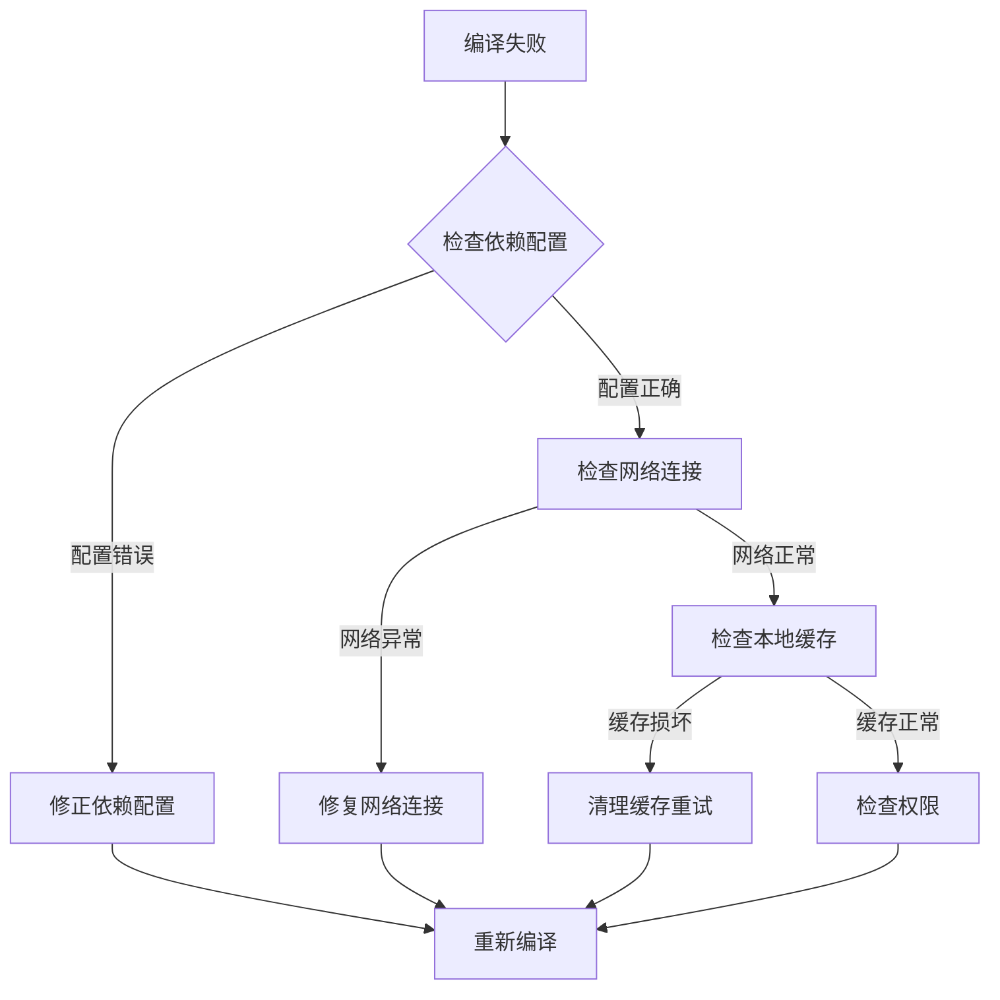
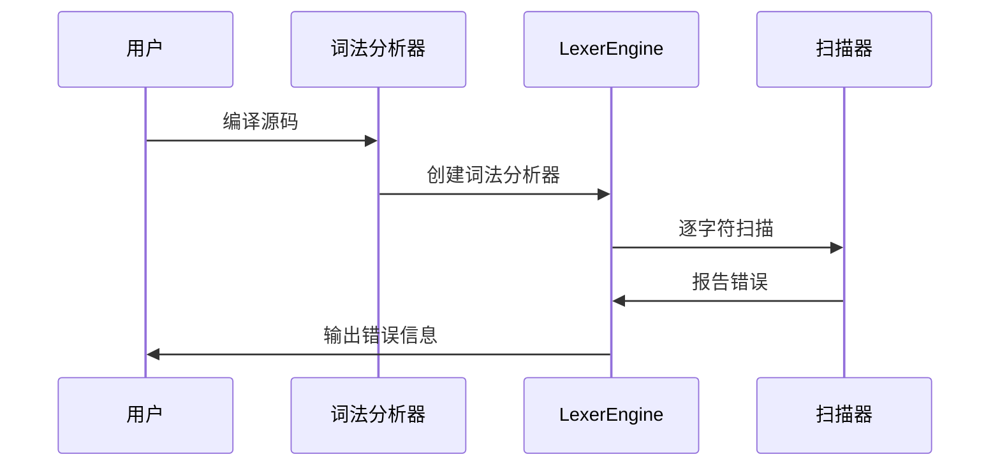
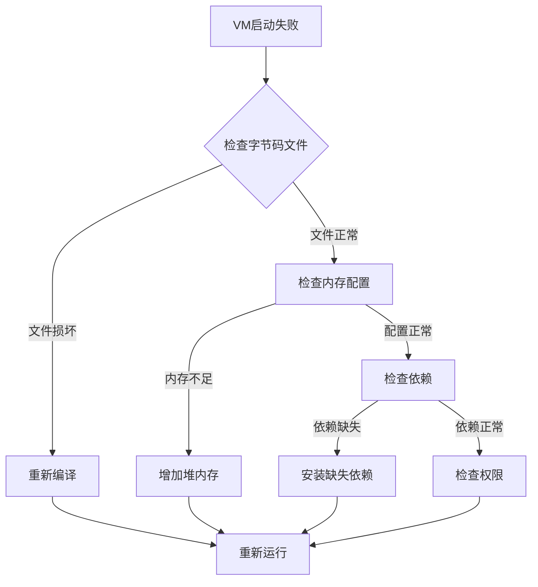
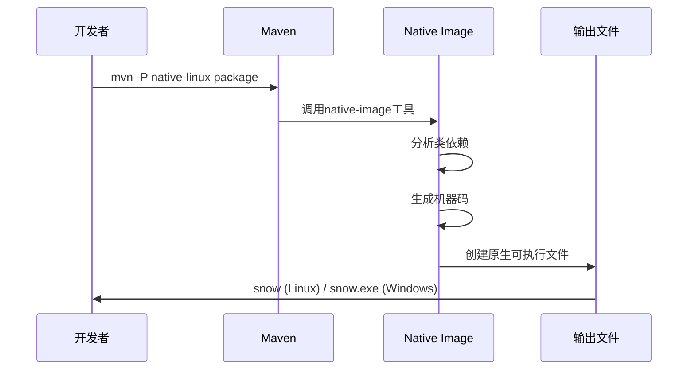
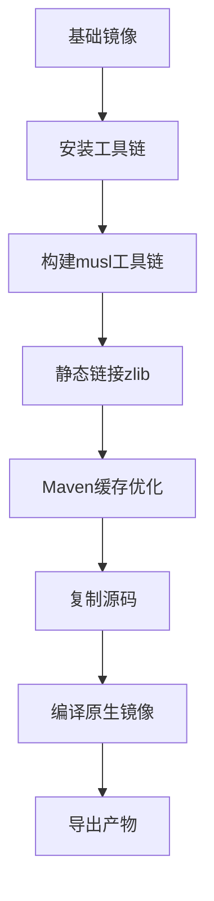
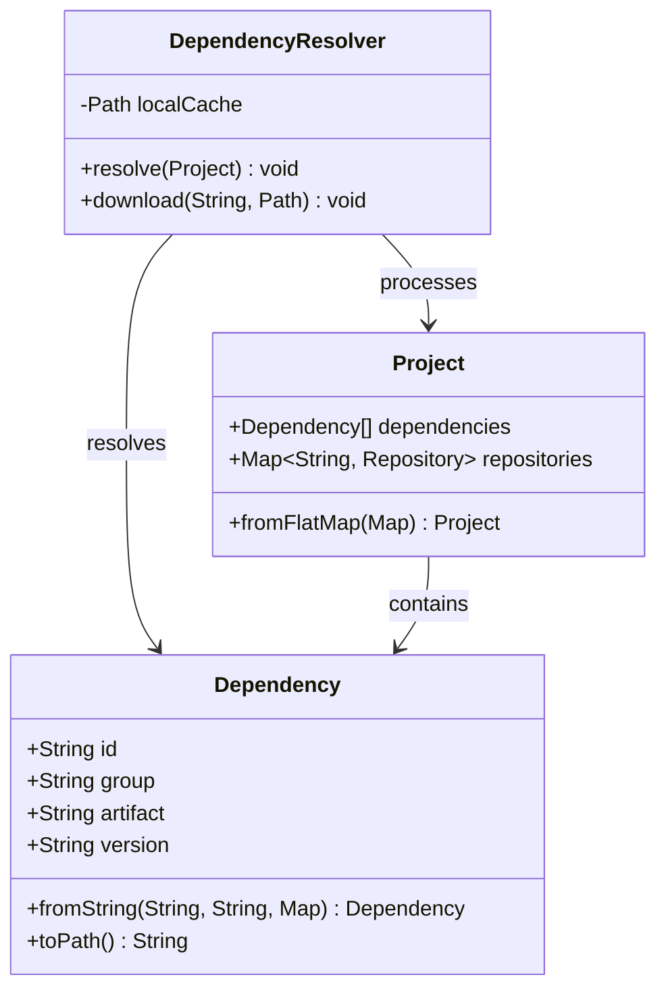
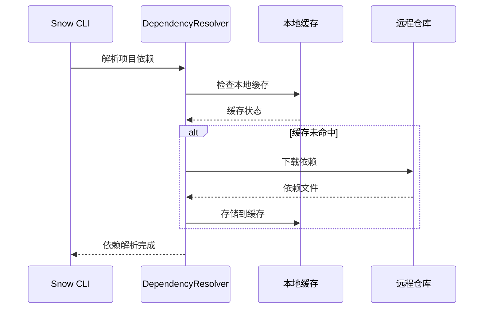
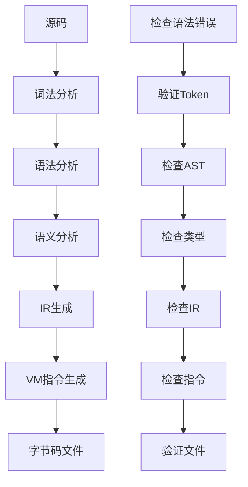

# Snow项目常见问题解答（FAQ）

<cite>
**本文档中引用的文件**
- [README.md](file://README.md)
- [SnowCLI.java](file://src/main/java/org/jcnc/snow/cli/SnowCLI.java)
- [RunCommand.java](file://src/main/java/org/jcnc/snow/cli/commands/RunCommand.java)
- [CompileTask.java](file://src/main/java/org/jcnc/snow/pkg/tasks/CompileTask.java)
- [RunTask.java](file://src/main/java/org/jcnc/snow/pkg/tasks/RunTask.java)
- [Project.java](file://src/main/java/org/jcnc\snow/pkg/model/Project.java)
- [SnowConfig.java](file://src/main/java/org/jcnc\snow/common/SnowConfig.java)
- [LexerEngine.java](file://src/main/java/org/jcnc\snow/compiler/lexer/core/LexerEngine.java)
- [Dockerfile](file://Dockerfile)
- [docker-compose.yml](file://docker-compose.yml)
- [PERFORMANCE_TESTING_GUIDE.md](file://playground/PerformanceTest/PERFORMANCE_TESTING_GUIDE.md)
- [pom.xml](file://pom.xml)
</cite>

## 目录
1. [项目概述](#项目概述)
2. [安装与配置](#安装与配置)
3. [编译问题排查](#编译问题排查)
4. [运行时异常处理](#运行时异常处理)
5. [性能优化指南](#性能优化指南)
6. [GraalVM原生镜像构建](#graalvm原生镜像构建)
7. [Docker部署](#docker部署)
8. [依赖管理](#依赖管理)
9. [故障排除](#故障排除)
10. [最佳实践](#最佳实践)

## 项目概述

Snow是一个面向AI时代的新型编程语言，专为大型语言模型（LLM）设计，旨在提升人与AI协同编程的效率。项目完整实现了从词法分析、语法分析、语义分析到虚拟机指令生成与执行的完整编译流程。

### 核心特性
- **AI友好语法**：简洁清晰的语法结构，便于LLM理解和生成
- **完整编译链**：支持从源码到虚拟机字节码的完整编译流程
- **跨平台支持**：支持Windows、Linux、macOS等多个平台
- **原生镜像支持**：基于GraalVM的原生镜像构建能力
- **容器化部署**：提供Docker支持，便于生产环境部署

## 安装与配置

### 开发环境要求

#### 系统要求
- **操作系统**：Windows 10+、Linux、macOS
- **Java版本**：GraalVM JDK 24或更高版本
- **Maven**：3.8+（用于构建和依赖管理）
- **Docker**：20.10+（用于容器化部署）

#### 安装步骤

1. **安装GraalVM JDK 24**
   ```bash
   # 下载并安装GraalVM
   # https://www.graalvm.org/downloads/
   
   # 设置JAVA_HOME
   export JAVA_HOME=/path/to/graalvm
   export PATH=$JAVA_HOME/bin:$PATH
   ```

2. **验证安装**
   ```bash
   java -version
   javac -version
   native-image --version
   ```

3. **克隆项目**
   ```bash
   git clone https://gitee.com/jcnc-org/snow.git
   cd snow
   ```

4. **构建项目**
   ```bash
   mvn clean package
   ```

### 环境变量配置

#### 标准库路径配置
```bash
# 设置标准库路径
export SNOW_LIB=/path/to/snow/lib
# 或
export SNOW_HOME=/path/to/snow-sdk
```

#### 调试模式配置
```bash
# 启用调试模式
export SNOW_DEBUG=true
```

**章节来源**
- [README.md](file://README.md#L100-L150)
- [SnowConfig.java](file://src/main/java/org/jcnc\snow/common/SnowConfig.java#L20-L40)

## 编译问题排查

### 常见编译错误

#### 1. 无法解析依赖

**症状**：编译时提示找不到模块或依赖项

**排查步骤**：


**解决方案**：
1. **检查项目配置**：确认`project.cloud`文件中的依赖配置正确
2. **清理缓存**：
   ```bash
   snow clean
   mvn clean
   ```
3. **手动下载依赖**：
   ```bash
   mvn dependency:resolve
   ```

#### 2. 词法分析错误

**症状**：编译器报告词法错误，如非法字符或语法错误

**常见错误类型**：
- **非法字符**：源码中包含不可识别的特殊字符
- **编码问题**：文件编码与预期不符
- **语法错误**：不符合Snow语言规范的语法结构

**排查方法**：


**解决步骤**：
1. **启用调试模式**：
   ```bash
   snow compile --debug Main.snow
   ```
2. **检查错误位置**：根据错误提示定位问题代码
3. **验证文件编码**：确保文件使用UTF-8编码
4. **检查语法规范**：参考Snow语言语法文档

#### 3. 语法分析错误

**症状**：编译器报告语法错误，如缺少关键字、括号不匹配等

**常见场景**：
- **模块声明错误**：`module:`后缺少模块名
- **函数定义错误**：`function:`声明不完整
- **语句结构错误**：缺少必要的冒号或换行

**解决方案**：
```bash
# 使用帮助命令查看语法规范
snow compile --help
```

**章节来源**
- [CompileTask.java](file://src/main/java/org/jcnc\snow/pkg/tasks/CompileTask.java#L300-L400)
- [LexerEngine.java](file://src/main/java/org/jcnc\snow/compiler/lexer/core/LexerEngine.java#L80-L120)

## 运行时异常处理

### VM启动失败

#### 1. 虚拟机初始化错误

**症状**：运行`.water`文件时虚拟机无法启动

**排查流程**：


**解决方案**：
1. **验证字节码文件完整性**：
   ```bash
   # 检查文件大小
   ls -la program.water
   
   # 重新编译
   snow compile Main.snow -o program
   ```

2. **增加内存配置**：
   ```bash
   # 设置堆内存大小
   export JAVA_OPTS="-Xmx2g"
   snow run program.water
   ```

#### 2. 系统调用异常

**症状**：运行时出现系统调用相关的错误

**常见错误类型**：
- **文件访问权限**：无法读取或写入文件
- **网络连接失败**：socket操作失败
- **进程创建失败**：fork或exec调用失败

**调试方法**：
```bash
# 启用系统调用调试
export SNOW_DEBUG_SYS_CALLS=true
snow run program.water
```

**章节来源**
- [RunTask.java](file://src/main/java/org/jcnc\snow/pkg/tasks/RunTask.java#L25-L40)
- [RunCommand.java](file://src/main/java/org/jcnc\snow/cli/commands/RunCommand.java#L40-L60)

## 性能优化指南

### 性能测试基础

Snow语言的性能特征分析：

| 性能指标 | 相对Java性能 | 主要影响因素 |
|---------|-------------|-------------|
| 算术运算 | 慢约1940倍 | 解释执行开销 |
| 字符串操作 | 慢约1275倍 | 字符串处理机制 |
| 循环执行 | 慢约79倍 | 循环优化程度 |
| 函数调用 | 几乎无开销 | 调用栈管理 |

### 性能测试实践

#### 1. 基本测试框架

```snow
module: PerformanceTest
    import: stdio
    import: os.time

    function: measureExecutionTime
        returns: long
        body:
            declare startTime: long = time.mono_ms()
            
            // 测试代码放在这里
            
            declare endTime: long = time.mono_ms()
            return endTime - startTime
        end body
    end function
end module
```

#### 2. 多轮测试策略


**实施步骤**：
1. **预热阶段**：运行测试代码至少2次，丢弃结果
2. **正式测试**：进行5-10轮测试，收集每轮执行时间
3. **统计分析**：计算平均值、标准差等统计指标

#### 3. 性能优化建议

**算法层面优化**：
- 选择时间复杂度更低的算法
- 避免嵌套循环，特别是大数据集上的嵌套
- 考虑使用更高效的数据结构

**代码层面优化**：
- 减少字符串连接操作
- 避免重复的函数调用
- 最小化系统调用次数

**章节来源**
- [PERFORMANCE_TESTING_GUIDE.md](file://playground/PerformanceTest/PERFORMANCE_TESTING_GUIDE.md#L50-L150)

## GraalVM原生镜像构建

### 构建配置

#### 1. 平台特定配置

**Linux平台构建**：
```xml
<!-- pom.xml中的native-linux配置 -->
<profile>
    <id>native-linux</id>
    <build>
        <plugins>
            <plugin>
                <groupId>org.graalvm.buildtools</groupId>
                <artifactId>native-maven-plugin</artifactId>
                <configuration>
                    <buildArgs>
                        <buildArg>--static</buildArg>
                        <buildArg>--libc=musl</buildArg>
                        <buildArg>-O2</buildArg>
                        <buildArg>-H:Class=org.jcnc.snow.cli.SnowCLI</buildArg>
                    </buildArgs>
                </configuration>
            </plugin>
        </plugins>
    </build>
</profile>
```

**Windows平台构建**：
```xml
<profile>
    <id>native-windows</id>
    <build>
        <plugins>
            <plugin>
                <groupId>org.graalvm.buildtools</groupId>
                <artifactId>native-maven-plugin</artifactId>
                <configuration>
                    <buildArgs>
                        <buildArg>-O2</buildArg>
                        <buildArg>-H:Class=org.jcnc.snow.cli.SnowCLI</buildArg>
                    </buildArgs>
                </configuration>
            </plugin>
        </plugins>
    </build>
</profile>
```

#### 2. 构建流程



### 常见构建问题

#### 1. 依赖分析失败

**症状**：native-image构建时报错，提示无法分析某些类

**解决方案**：
```bash
# 启用详细日志
mvn -P native-linux -Dnative.image.verbose=true package

# 添加反射配置
-H:ReflectionConfigurationFiles=reflection-config.json
```

#### 2. 内存不足

**症状**：构建过程中出现OutOfMemoryError

**解决方案**：
```bash
# 增加构建内存
export MAVEN_OPTS="-Xmx4g -XX:MaxMetaspaceSize=1g"
mvn -P native-linux package
```

**章节来源**
- [pom.xml](file://pom.xml#L59-L146)

## Docker部署

### Dockerfile分析

Snow项目提供了完整的Docker构建流程：



### 部署配置

#### 1. Docker Compose配置

```yaml
services:
  snow-runtime:
    image: snow:latest
    volumes:
      - ./programs:/app/programs
      - ./data:/app/data
    environment:
      - SNOW_LIB=/app/lib
    command: ["run", "/app/programs/main.water"]
```

#### 2. 生产环境部署

**部署步骤**：
1. **构建镜像**：
   ```bash
   docker build -t snow:production .
   ```

2. **运行容器**：
   ```bash
   docker run -d \
     --name snow-app \
     -v /path/to/programs:/app/programs \
     -v /path/to/lib:/app/lib \
     snow:production run /app/programs/app.water
   ```

#### 3. 容器化最佳实践

**资源限制**：
```yaml
services:
  snow-app:
    deploy:
      resources:
        limits:
          memory: 2G
          cpus: '1.0'
        reservations:
          memory: 512M
          cpus: '0.5'
```

**健康检查**：
```yaml
healthcheck:
  test: ["CMD", "snow", "version"]
  interval: 30s
  timeout: 10s
  retries: 3
```

**章节来源**
- [Dockerfile](file://Dockerfile#L1-L58)
- [docker-compose.yml](file://docker-compose.yml#L1-L25)

## 依赖管理

### 依赖解析机制

Snow项目使用自定义的依赖解析器来管理项目依赖：



### 依赖配置

#### 1. 项目配置格式

```properties
# project.cloud配置示例
project.group=com.example
project.artifact=snow-app
project.version=1.0.0

# 依赖配置
dependencies.core=com.example:core:1.2.3
dependencies.utils=com.example:utils:@{version}

# 仓库配置
repositories.central=https://repo.maven.apache.org/maven2
repositories.internal=http://internal.repo.com/maven2

# 构建配置
build.sourceEncoding=UTF-8
build.targetJavaVersion=21
```

#### 2. 依赖解析流程



### 依赖问题排查

#### 1. 依赖冲突

**症状**：多个版本的相同依赖同时存在

**解决方法**：
```bash
# 清理依赖缓存
rm -rf ~/.m2/repository/com/example

# 强制更新依赖
mvn dependency:resolve -U
```

#### 2. 仓库访问问题

**症状**：无法从指定仓库下载依赖

**排查步骤**：
1. **检查网络连接**：
   ```bash
   curl -I https://repo.maven.apache.org/maven2
   ```

2. **验证认证信息**：
   ```bash
   # 检查settings.xml配置
   cat ~/.m2/settings.xml
   ```

**章节来源**
- [Project.java](file://src/main/java/org/jcnc\snow/pkg/model/Project.java#L80-L150)
- [DependencyResolver.java](file://src/main/java/org/jcnc\snow/pkg/resolver/DependencyResolver.java#L40-L80)

## 故障排除

### 常见问题分类

#### 1. 编译时问题

| 问题类型 | 症状 | 可能原因 | 解决方案 |
|---------|------|---------|---------|
| 语法错误 | 编译失败，语法分析报错 | 语法不符合规范 | 检查语法，参考文档 |
| 依赖缺失 | 找不到模块或类型 | 依赖未正确配置 | 检查project.cloud配置 |
| 编码问题 | 字符乱码或解析错误 | 文件编码不正确 | 确保UTF-8编码 |

#### 2. 运行时问题

| 问题类型 | 症状 | 可能原因 | 解决方案 |
|---------|------|---------|---------|
| VM启动失败 | 无法启动虚拟机 | 字节码文件损坏 | 重新编译 |
| 内存溢出 | OutOfMemoryError | 堆内存不足 | 增加-Xmx参数 |
| 权限错误 | 文件访问被拒绝 | 权限不足 | 检查文件权限 |

#### 3. 构建问题

| 问题类型 | 症状 | 可能原因 | 解决方案 |
|---------|------|---------|---------|
| 依赖解析失败 | 无法下载依赖 | 网络或仓库配置问题 | 检查网络和仓库配置 |
| 原生镜像构建失败 | native-image报错 | 类依赖分析失败 | 添加反射配置 |
| Docker构建失败 | 容器构建中断 | 资源不足或配置错误 | 检查资源和配置 |

### 调试技巧

#### 1. 启用详细日志

```bash
# 启用编译器调试
export SNOW_DEBUG=true

# 启用VM调试
export SNOW_VM_DEBUG=true

# 启用系统调用调试
export SNOW_DEBUG_SYS_CALLS=true
```

#### 2. 分阶段测试



#### 3. 性能分析

```bash
# 性能测试
snow compile --debug Main.snow

# 运行测试
snow test-all --verbose

# 检查内存使用
java -XX:+PrintGCDetails -Xmx1g -jar snow.jar
```

**章节来源**
- [SnowConfig.java](file://src/main/java/org/jcnc\snow/common/SnowConfig.java#L40-L90)

## 最佳实践

### 开发工作流

#### 1. 项目结构建议

```
my-snow-project/
├── src/
│   ├── main/
│   │   ├── snow/
│   │   │   ├── Main.snow
│   │   │   └── utils/
│   │   │       └── Helper.snow
│   └── test/
│       └── snow/
│           └── TestMain.snow
├── lib/
│   └── std/
│       └── os.snow
├── project.cloud
├── README.md
└── pom.xml
```

#### 2. 开发环境配置

**IDE配置**：
- 使用IntelliJ IDEA或VS Code
- 安装Snow语言插件
- 配置代码格式化规则

**版本控制**：
```bash
# .gitignore示例
/target/
*.water
*.class
.idea/
*.iml
```

#### 3. 测试策略

**单元测试**：
```bash
# 运行所有测试
snow test-all

# 仅编译不运行
snow test-all --no-run

# 设置超时
snow test-all --timeout=5000
```

**集成测试**：
```bash
# 测试构建流程
snow build

# 测试运行
snow run target/my-program.water
```

### 性能优化实践

#### 1. 代码优化原则

**算法优化**：
- 选择合适的时间复杂度
- 避免不必要的重复计算
- 使用缓存机制

**数据结构优化**：
- 根据使用场景选择最优数据结构
- 减少内存分配和垃圾回收
- 避免过度使用动态类型

#### 2. 运行时优化

**内存管理**：
```bash
# 设置合适的堆内存
export JAVA_OPTS="-Xms512m -Xmx2g"

# 启用垃圾回收日志
export JAVA_OPTS="$JAVA_OPTS -XX:+PrintGC -Xloggc:gc.log"
```

**并发优化**：
```snow
# 使用并发特性（如果可用）
module: ConcurrentApp
    import: stdio
    import: os.thread
    
    function: main
        returns: int
        body:
            declare thread1: thread = thread.create(worker1)
            declare thread2: thread = thread.create(worker2)
            
            thread.join(thread1)
            thread.join(thread2)
            
            return 0
        end body
    end function
end module
```

### 部署最佳实践

#### 1. 生产环境配置

**资源配置**：
```yaml
services:
  snow-app:
    image: snow:production
    deploy:
      resources:
        limits:
          memory: 1G
          cpus: '0.5'
        reservations:
          memory: 256M
          cpus: '0.25'
    restart: unless-stopped
```

**监控配置**：
```yaml
logging:
  driver: "json-file"
  options:
    max-size: "10m"
    max-file: "3"
```

#### 2. 安全考虑

**权限控制**：
```bash
# 设置最小权限
chmod 755 snow
chown root:root snow

# 限制文件访问
chmod 644 *.water
```

**网络安全**：
```yaml
services:
  snow-app:
    network_mode: bridge
    cap_drop:
      - ALL
    cap_add:
      - CHOWN
      - SETUID
      - SETGID
```

通过遵循这些最佳实践，可以确保Snow项目的开发、构建、部署和维护过程更加高效和可靠。定期回顾和更新这些实践，有助于保持项目的质量和性能水平。