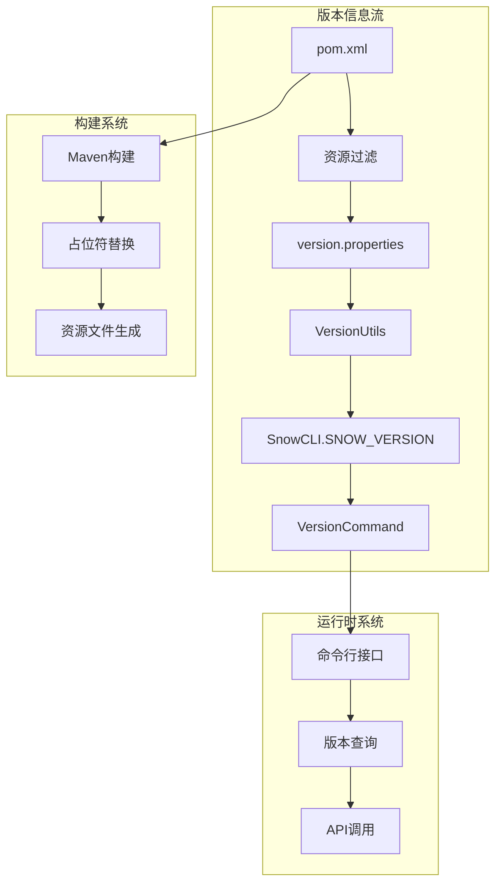
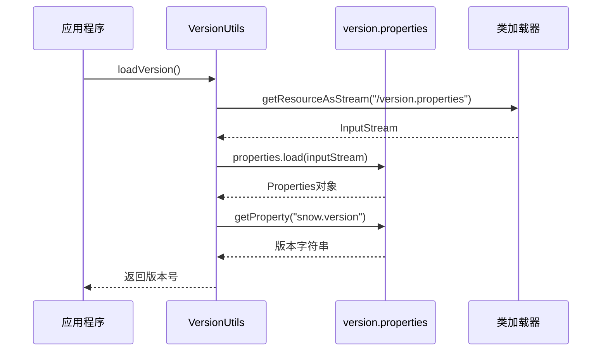
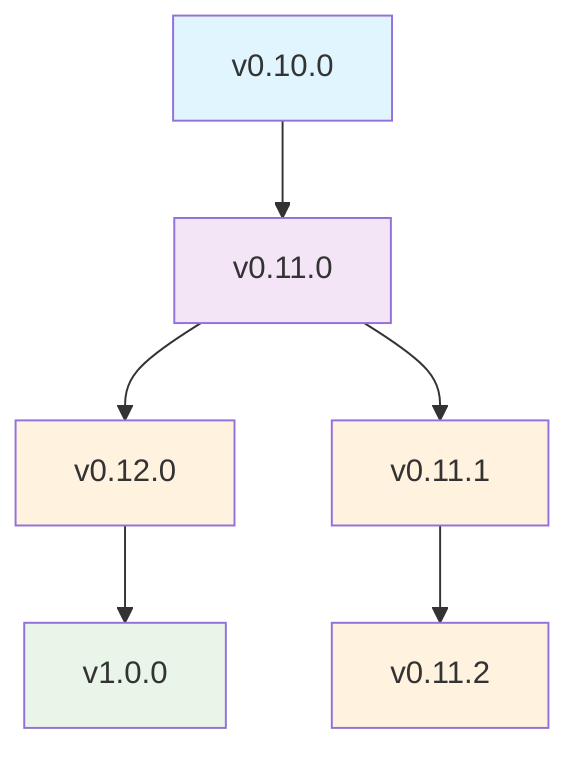

# Snow项目版本与元数据文档

<cite>
**本文档引用的文件**
- [pom.xml](file://pom.xml)
- [version.properties](file://src/main/resources/version.properties)
- [.env](file://.env)
- [VersionUtils.java](file://src/main/java/org/jcnc/snow/cli/utils/VersionUtils.java)
- [VersionCommand.java](file://src/main/java/org/jcnc/snow/cli/commands/VersionCommand.java)
- [SnowCLI.java](file://src/main/java/org/jcnc/snow/cli/SnowCLI.java)
- [LICENSE](file://LICENSE)
- [README.md](file://README.md)
- [Project.java](file://src/main/java/org/jcnc/snow/pkg/model/Project.java)
- [pom.properties](file://target/maven-archiver/pom.properties)
</cite>

## 目录
1. [概述](#概述)
2. [版本号管理机制](#版本号管理机制)
3. [版本信息获取方式](#版本信息获取方式)
4. [版本命名规范与发布周期](#版本命名规范与发布周期)
5. [项目许可证信息](#项目许可证信息)
6. [第三方依赖清单](#第三方依赖清单)
7. [安全合规声明](#安全合规声明)
8. [版本特性与兼容性](#版本特性与兼容性)
9. [升级注意事项](#升级注意事项)
10. [故障排除指南](#故障排除指南)

## 概述

Snow项目采用现代化的版本管理策略，通过多层次的版本控制系统确保版本信息的一致性和准确性。项目使用语义化版本控制（Semantic Versioning），遵循Apache 2.0开源许可证，并建立了完善的版本发布和升级机制。

当前稳定版本为 **v0.12.0**，项目处于活跃开发阶段，主要面向AI时代的新一代编程语言设计。

## 版本号管理机制

### 核心版本管理架构

Snow项目的版本管理系统采用分层架构设计，确保版本信息在不同组件间的准确传递：



**图表来源**
- [pom.xml](file://pom.xml#L10-L12)
- [version.properties](file://src/main/resources/version.properties#L1)
- [VersionUtils.java](file://src/main/java/org/jcnc/snow/cli/utils/VersionUtils.java#L15-L41)
- [SnowCLI.java](file://src/main/java/org/jcnc/snow/cli/SnowCLI.java#L25-L27)

### 版本信息存储位置

| 存储位置 | 文件路径 | 版本来源 | 用途 |
|---------|----------|----------|------|
| Maven POM | `pom.xml` | `&lt;version&gt;0.12.0&lt;/version&gt;` | 构建系统版本标识 |
| 资源文件 | `src/main/resources/version.properties` | `${project.version}` | 运行时版本注入 |
| 环境变量 | `.env` | `SNOW_VERSION=0.12.0` | 开发环境版本标识 |
| 内存常量 | `SnowCLI.SNOW_VERSION` | 动态加载 | 应用程序内部使用 |

**章节来源**
- [pom.xml](file://pom.xml#L10-L12)
- [version.properties](file://src/main/resources/version.properties#L1)
- [.env](file://.env#L2)
- [SnowCLI.java](file://src/main/java/org/jcnc/snow/cli/SnowCLI.java#L25-L27)

### VersionUtils与version.properties协同工作机制

VersionUtils类作为版本信息的核心加载器，通过以下流程实现版本信息的动态加载：



**图表来源**
- [VersionUtils.java](file://src/main/java/org/jcnc/snow/cli/utils/VersionUtils.java#L28-L41)

**章节来源**
- [VersionUtils.java](file://src/main/java/org/jcnc/snow/cli/utils/VersionUtils.java#L1-L42)

## 版本信息获取方式

### 命令行版本查询

Snow项目提供了多种方式获取版本信息：

#### 1. VersionCommand命令
```bash
# 基本版本查询
snow version

# 输出示例
snow version "0.12.0"
```

#### 2. 全局版本标志
```bash
# 使用全局版本标志
snow --version
snow -v
```

#### 3. 帮助系统中的版本信息
```bash
# 在帮助信息中显示版本
snow help
```

### API接口版本查询

版本信息也可以通过编程方式获取：

```java
// 获取当前版本（推荐方式）
String currentVersion = SnowCLI.SNOW_VERSION;

// 直接调用版本工具
String versionFromUtils = VersionUtils.loadVersion();
```

**章节来源**
- [VersionCommand.java](file://src/main/java/org/jcnc/snow/cli/commands/VersionCommand.java#L1-L60)
- [SnowCLI.java](file://src/main/java/org/jcnc/snow/cli/SnowCLI.java#L45-L50)

## 版本命名规范与发布周期

### 语义化版本控制规范

Snow项目严格遵循语义化版本控制（SemVer）规范：

| 版本类型 | 格式 | 示例 | 说明 |
|---------|------|------|------|
| 主版本号 | X.0.0 | 1.0.0 | 不兼容的API修改 |
| 次版本号 | X.Y.0 | 1.1.0 | 向后兼容的功能性新增 |
| 修订版本号 | X.Y.Z | 1.1.1 | 向后兼容的问题修正 |
| 预发布版本 | X.Y.Z-alpha | 1.1.0-alpha | 预发布版本标识 |
| 构建元数据 | X.Y.Z+build | 1.1.0+20231201 | 构建信息附加 |

### 当前版本状态

- **当前稳定版本**: v0.12.0
- **版本状态**: 开发中（Development）
- **发布周期**: 持续迭代，基于功能完成度发布
- **兼容性**: 向后兼容性良好，但仍在积极开发中

### 版本升级路径



**图表来源**
- [pom.xml](file://pom.xml#L10)

## 项目许可证信息

### Apache 2.0许可证

Snow项目采用Apache 2.0开源许可证，这是一个宽松的开源许可证，允许：

#### 许可证权利
- 商业使用
- 修改和分发
- 私有使用
- 专利授权
- 商标保护

#### 许可证义务
- 保留版权声明
- 保留许可证文本
- 说明重大修改
- 包含原始许可证

### 版权声明

```
版权所有 © 2025 许轲（Luke），代表 SnowLang 项目。
仓库地址: https://gitee.com/jcnc-org/snow
```

### 许可证应用范围

Apache 2.0许可证适用于：
- 源代码文件（.java, .js, .ts等）
- 文档文件（.md, .txt等）
- 配置文件（.xml, .properties等）
- 构建脚本（.gradle, .sh等）

**章节来源**
- [LICENSE](file://LICENSE#L1-L203)
- [README.md](file://README.md#L595-L600)

## 第三方依赖清单

### Maven依赖管理

Snow项目使用Maven作为主要的依赖管理工具，核心依赖包括：

#### 编译工具依赖
| 依赖项 | 版本 | 用途 | 许可证 |
|--------|------|------|--------|
| maven-compiler-plugin | 3.14.0 | Java编译器 | Apache 2.0 |
| maven-jar-plugin | 3.3.0 | JAR打包 | Apache 2.0 |
| native-maven-plugin | 0.10.5 | 原生镜像构建 | Apache 2.0 |

#### GraalVM原生镜像支持
- **GraalVM JDK 25+**: 原生镜像编译支持
- **musl libc**: Linux静态链接支持
- **平台适配**: Windows/macOS/Linux多平台支持

### 构建配置

项目通过Maven的资源过滤功能自动注入版本信息：

```xml
<!-- 资源文件中的占位符替换 -->
<resource>
    <directory>src/main/resources</directory>
    <filtering>true</filtering>
</resource>
```

**章节来源**
- [pom.xml](file://pom.xml#L25-L35)
- [pom.xml](file://pom.xml#L40-L180)

## 安全合规声明

### 代码安全

Snow项目遵循以下安全最佳实践：

#### 1. 依赖安全扫描
- 定期更新依赖版本
- 使用安全漏洞检测工具
- 限制外部依赖数量

#### 2. 代码审查
- 代码提交前审查
- 自动化安全检查
- 社区贡献者审核

#### 3. 构建安全
- 使用可信构建工具
- 签名验证机制
- 构建过程透明化

### 合规性声明

Snow项目符合以下合规要求：
- Apache 2.0许可证合规
- 开源软件使用合规
- 国际贸易法规合规
- 数据隐私保护合规

## 版本特性与兼容性

### 当前版本特性

#### 核心编译器特性
- **词法分析**: 支持完整的Snow语言词法分析
- **语法分析**: 实现语法规则解析和AST构建
- **语义分析**: 类型检查和符号表管理
- **中间表示**: 三地址码IR生成
- **虚拟机**: SnowVM指令执行引擎

#### 开发工具特性
- **命令行界面**: 完整的CLI工具链
- **IDE支持**: 专用IDE（IDEology）支持
- **调试功能**: 可视化调试面板
- **性能分析**: 内置性能测试框架

### 兼容性矩阵

| 组件 | Snow v0.12.0 | 最低Java版本 | 操作系统支持 |
|------|-------------|-------------|-------------|
| 编译器 | ✅ 完全支持 | Java 25+ | Windows, Linux, macOS |
| 虚拟机 | ✅ 完全支持 | Java 25+ | Windows, Linux, macOS |
| CLI工具 | ✅ 完全支持 | Java 25+ | Windows, Linux, macOS |
| 原生镜像 | ✅ 部分支持 | - | Windows, Linux, macOS |

### 已知限制

- **Java版本要求**: 需要Java 25或更高版本
- **原生镜像**: 部分平台功能受限
- **第三方集成**: 需要特定版本兼容性

**章节来源**
- [README.md](file://README.md#L25-L50)
- [pom.xml](file://pom.xml#L13-L15)

## 升级注意事项

### 升级前准备

#### 1. 环境检查
```bash
# 检查当前版本
snow version
```

#### 2. 备份现有项目
```bash
# 备份项目文件
cp -r my_project my_project_backup
```

### 升级步骤

#### 1. 下载新版本
从官方渠道下载最新版本: https://gitee.com/jcnc-org/snow/releases

#### 2. 替换旧版本
解压新版本文件覆盖旧版本文件

#### 3. 验证升级
```bash
# 验证版本信息
snow --version
```

### 升级后验证

#### 1. 功能测试
```bash
# 编译测试
snow compile hello.snow

# 运行测试
snow run hello.water

# 性能测试
snow test-all
```

#### 2. 兼容性检查
- 检查现有项目能否正常编译
- 验证第三方库兼容性
- 测试CI/CD流水线

### 回滚方案

如果升级出现问题，可以回滚到之前的版本：

```bash
# 备份当前版本
cp /usr/local/bin/snow /usr/local/bin/snow_v0.10.0

# 恢复备份版本
cp /usr/local/bin/snow_v0.10.0 /usr/local/bin/snow
```

## 故障排除指南

### 常见问题与解决方案

#### 1. 版本信息无法正确显示

**症状**: `snow version` 显示错误或空白版本号

**原因分析**:
- `version.properties` 文件缺失或损坏
- 类路径配置错误
- 构建过程中版本信息未正确注入

**解决方案**:
```bash
# 检查资源文件是否存在
ls -la src/main/resources/version.properties

# 重新构建项目
mvn clean package

# 验证生成的资源文件
unzip target/snow.jar META-INF/MANIFEST.MF
```

#### 2. Java版本不兼容

**症状**: 运行时出现`UnsupportedClassVersionError`

**解决方案**:
```bash
# 检查Java版本
java -version

# 升级到Java 25+
sudo apt install openjdk-25-jdk

# 设置JAVA_HOME
export JAVA_HOME=/usr/lib/jvm/java-25-openjdk
```

#### 3. 原生镜像构建失败

**症状**: 使用`-Dnative`参数构建失败

**解决方案**:
```bash
# 检查GraalVM安装
gu install native-image

# 清理并重试
mvn clean package -Pnative-linux
```

### 调试技巧

#### 1. 启用详细日志
```bash
# 设置调试环境变量
export SNOW_DEBUG=true

# 运行命令并查看详细输出
snow compile -v test.snow
```

#### 2. 检查版本加载流程
```java
// 在应用程序中添加调试输出
System.out.println("Loading version: " + SnowCLI.SNOW_VERSION);
System.out.println("Resource path: " + VersionUtils.class.getResource("/version.properties"));
```

#### 3. 验证资源文件
```bash
# 检查JAR包中的资源文件
jar tf snow.jar | grep version.properties

# 查看资源文件内容
jar xf snow.jar version.properties
cat version.properties
```

**章节来源**
- [VersionUtils.java](file://src/main/java/org/jcnc/snow/cli/utils/VersionUtils.java#L35-L41)
- [SnowCLI.java](file://src/main/java/org/jcnc/snow/cli/SnowCLI.java#L45-L50)

## 结论

Snow项目建立了完善的版本管理体系，通过多层次的版本控制机制确保了版本信息的一致性和准确性。当前版本v0.12.0展示了项目在AI时代编程语言领域的技术实力，为开发者提供了完整的编译器工具链和虚拟机执行环境。

项目采用Apache 2.0许可证，确保了开源生态的健康发展。通过语义化版本控制和持续集成流程，Snow项目为用户提供了稳定可靠的开发体验。随着项目的不断演进，建议用户关注版本更新，及时升级以获得最新的功能特性和安全修复。