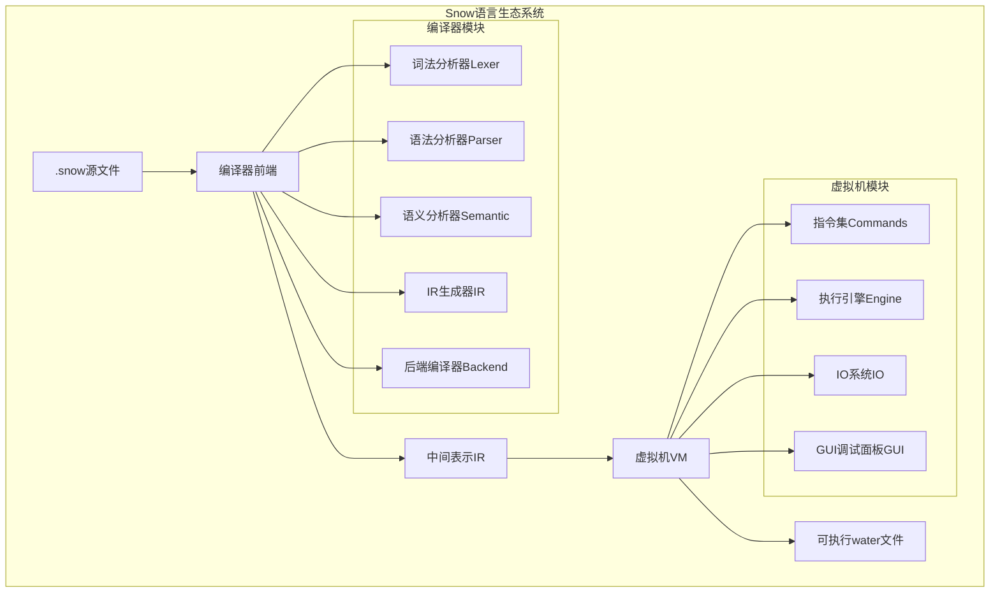
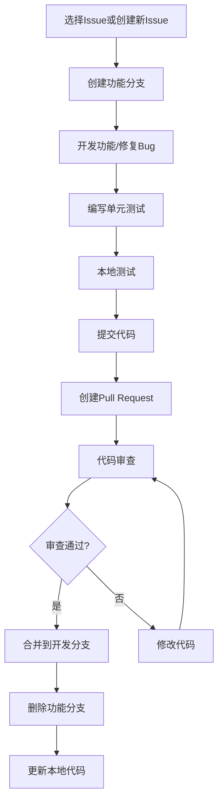
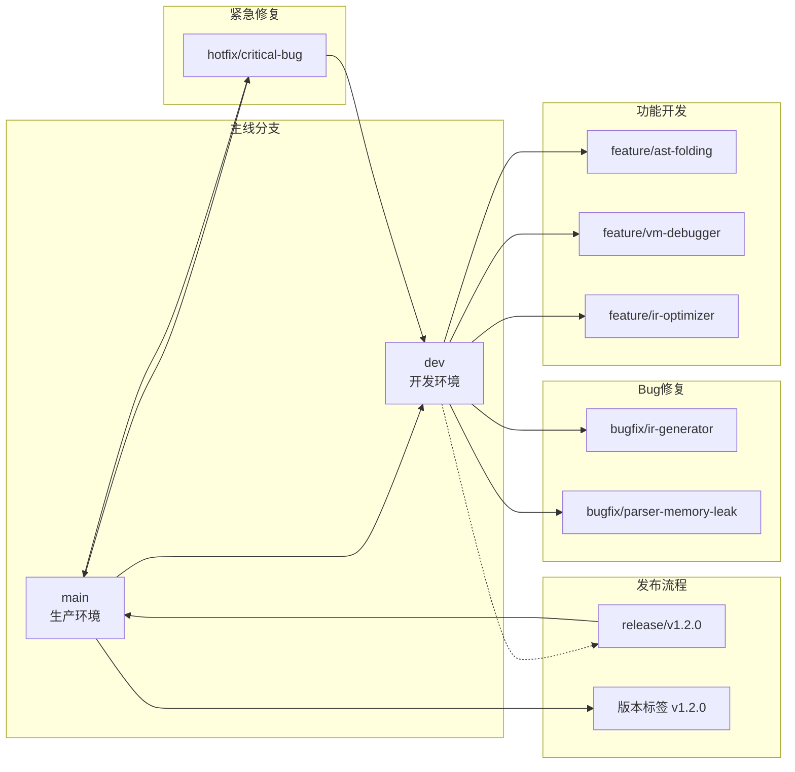
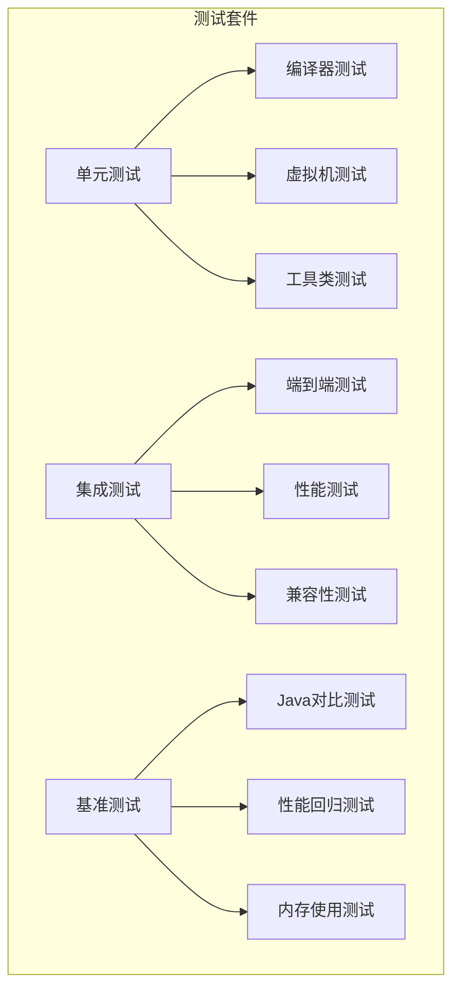

# Snow项目贡献指南

<cite>
**本文档引用的文件**
- [README.md](file://README.md)
- [pom.xml](file://pom.xml)
- [docs/Snow-Lang-Git-Management/Snow-Lang-Git-Management.md](file://docs/Snow-Lang-Git-Management/Snow-Lang-Git-Management.md)
- [src/main/java/org/jcnc/snow/cli/doc/README.md](file://src/main/java/org/jcnc/snow/cli/doc/README.md)
- [src/main/java/org/jcnc/snow/compiler/ir/doc/README.md](file://src/main/java/org/jcnc/snow/compiler/ir/doc/README.md)
- [src/main/java/org/jcnc/snow/cli/commands/TestAllCommand.java](file://src/main/java/org/jcnc/snow/cli/commands/TestAllCommand.java)
- [src/main/resources/version.properties](file://src/main/resources/version.properties)
- [src/main/java/org/jcnc/snow/pkg/model/Project.java](file://src/main/java/org/jcnc/snow/pkg/model/Project.java)
- [src/main/java/org/jcnc/snow/common/SnowConfig.java](file://src/main/java/org/jcnc/snow/common/SnowConfig.java)
- [playground/Test/README.md](file://playground/Test/README.md)
- [playground/PerformanceTest/README.md](file://playground/PerformanceTest/README.md)
</cite>

## 目录
1. [项目简介](#项目简介)
2. [开发环境搭建](#开发环境搭建)
3. [代码贡献流程](#代码贡献流程)
4. [分支管理策略](#分支管理策略)
5. [Pull Request规范](#pull-request规范)
6. [代码审查标准](#代码审查标准)
7. [Java代码风格要求](#java代码风格要求)
8. [单元测试要求](#单元测试要求)
9. [文档更新规范](#文档更新规范)
10. [开发环境构建](#开发环境构建)
11. [测试套件运行](#测试套件运行)
12. [调试指南](#调试指南)
13. [社区参与](#社区参与)
14. [核心组件注意事项](#核心组件注意事项)
15. [故障排除](#故障排除)

## 项目简介

Snow是一门面向AI时代的新型编程语言，旨在让大型语言模型(LLM)更容易生成和理解代码，从而提升人与AI协同编程的效率。项目完整实现了Snow语言的编译流程，包括词法分析、语法分析、语义分析、中间表示(IR)生成，以及最终的虚拟机(VM)指令生成与执行。

### 项目架构概览



**图表来源**
- [README.md](file://README.md#L569-L638)
- [src/main/java/org/jcnc/snow/cli/doc/README.md](file://src/main/java/org/jcnc/snow/cli/doc/README.md#L1-L82)

**章节来源**
- [README.md](file://README.md#L1-L50)

## 开发环境搭建

### 系统要求

- **JDK版本**: GraalVM JDK 24 或更高版本
- **构建工具**: Maven 3.8+
- **推荐IDE**: IntelliJ IDEA Ultimate
- **操作系统**: Windows 10+/macOS 10.15+/Linux

### 环境配置步骤

1. **安装GraalVM JDK 24**
   ```bash
   # 下载并安装GraalVM JDK 24
   # 配置JAVA_HOME指向GraalVM安装目录
   export JAVA_HOME=/path/to/graalvm
   ```

2. **克隆项目**
   ```bash
   git clone https://gitee.com/jcnc-org/snow.git
   cd snow
   ```

3. **验证环境**
   ```bash
   # 检查Java版本
   java -version
   
   # 检查Maven版本
   mvn -version
   
   # 构建项目
   mvn clean install
   ```

### IDE配置

推荐使用IntelliJ IDEA配置项目：

1. 导入项目为Maven项目
2. 设置项目SDK为GraalVM JDK 24
3. 启用注解处理器
4. 配置代码格式化规则

**章节来源**
- [README.md](file://README.md#L132-L180)
- [pom.xml](file://pom.xml#L10-L20)

## 代码贡献流程

### 贡献流程概览



### 详细步骤

1. **Issue管理**
   - 在GitHub Issues中查找或创建相关Issue
   - 与项目维护者确认Issue需求
   - 获得Issue分配权限

2. **分支创建**
   ```bash
   # 从dev分支创建新分支
   git checkout dev
   git pull origin dev
   git checkout -b feature/your-feature-name
   ```

3. **开发工作**
   - 遵循项目代码风格
   - 编写充分的单元测试
   - 更新相关文档

4. **提交规范**
   ```bash
   # 提交示例
   git commit -m "feat: 添加IR折叠功能"
   git push origin feature/your-feature-name
   ```

**章节来源**
- [docs/Snow-Lang-Git-Management/Snow-Lang-Git-Management.md](file://docs/Snow-Lang-Git-Management/Snow-Lang-Git-Management.md#L1-L50)

## 分支管理策略

Snow项目采用严格的分支管理策略，确保代码质量和发布稳定性。

### 分支类型

| 分支类型 | 命名规范 | 用途 | 合并目标 |
|---------|---------|------|---------|
| 功能分支 | `feature/*` | 新功能开发 | `dev` |
| 修复分支 | `bugfix/*` | Bug修复 | `dev` |
| 发布分支 | `release/*` | 版本发布准备 | `main` |
| 热修复分支 | `hotfix/*` | 生产环境紧急修复 | `main` + `dev` |

### 分支流程图



**图表来源**
- [docs/Snow-Lang-Git-Management/Snow-Lang-Git-Management.md](file://docs/Snow-Lang-Git-Management/Snow-Lang-Git-Management.md#L80-L150)

### 分支管理规则

1. **主分支规则**
   - `main`分支始终保持可部署状态
   - 仅允许从`release`分支合并
   - 每次合并后必须打版本标签

2. **开发分支规则**
   - `dev`分支集成所有新功能
   - 保持可运行状态
   - 定期与`main`分支同步

3. **功能分支规则**
   - 每个功能一个独立分支
   - 开发完成后合并到`dev`
   - 合并后删除功能分支

**章节来源**
- [docs/Snow-Lang-Git-Management/Snow-Lang-Git-Management.md](file://docs/Snow-Lang-Git-Management/Snow-Lang-Git-Management.md#L20-L120)

## Pull Request规范

### PR创建要求

1. **标题格式**
   ```
   [类型] 简短描述
   
   示例:
   feat: 添加IR指令优化功能
   fix: 修复词法分析器内存泄漏
   docs: 更新API文档
   refactor: 优化编译器性能
   ```

2. **描述内容**
   - 详细说明变更内容和目的
   - 引用相关Issue（如`close #123`）
   - 说明测试情况
   - 列出 Breaking Changes

3. **PR模板**
   ```markdown
   ## 变更类型
   - [ ] 新功能
   - [ ] Bug修复
   - [ ] 文档更新
   - [ ] 性能优化
   - [ ] 代码重构

   ## 变更描述
   简要说明本次变更的内容和目的。

   ## 测试
   - [ ] 单元测试通过
   - [ ] 集成测试通过
   - [ ] 手动测试验证

   ## 相关Issue
   close #123
   ```

### PR合并要求

1. 至少一名维护者代码审查通过
2. CI流水线通过
3. 单元测试覆盖率达标
4. 文档同步更新

**章节来源**
- [docs/Snow-Lang-Git-Management/Snow-Lang-Git-Management.md](file://docs/Snow-Lang-Git-Management/Snow-Lang-Git-Management.md#L180-L220)

## 代码审查标准

### 审查重点

1. **代码质量**
   - 遵循项目编码规范
   - 无冗余代码和复杂度过高部分
   - 适当的注释和文档

2. **功能正确性**
   - 功能按预期工作
   - 边界条件处理正确
   - 错误处理完善

3. **性能考虑**
   - 无性能瓶颈
   - 内存使用合理
   - 算法复杂度适当

4. **测试覆盖**
   - 单元测试充分
   - 集成测试通过
   - 性能测试达标

### 审查清单

- [ ] 代码风格符合项目规范
- [ ] 变量和方法命名清晰
- [ ] 无硬编码字符串
- [ ] 异常处理完善
- [ ] 单元测试覆盖率≥80%
- [ ] 文档同步更新
- [ ] 无敏感信息泄露

**章节来源**
- [docs/Snow-Lang-Git-Management/Snow-Lang-Git-Management.md](file://docs/Snow-Lang-Git-Management/Snow-Lang-Git-Management.md#L220-L250)

## Java代码风格要求

### 基本规范

1. **命名规范**
   - 类名使用PascalCase：`IRProgramBuilder`
   - 方法名使用camelCase：`buildFunction`
   - 常量使用UPPER_SNAKE_CASE：`MAX_DEPTH`
   - 包名使用小写：`org.jcnc.snow.compiler.ir`

2. **代码格式**
   - 使用4个空格缩进
   - 行长度不超过120字符
   - 大括号独占一行
   - 方法间空一行

3. **注释规范**
   - 类和公共方法必须有Javadoc注释
   - 复杂逻辑需要内联注释
   - TODO注释格式：`// TODO: 需要优化性能`

### 代码示例规范

```java
/**
 * IR程序构建器，负责将AST转换为IR表示。
 */
public final class IRProgramBuilder {
    
    /**
     * 构建IR程序。
     * 
     * @param ast AST根节点
     * @return 构建完成的IR程序
     * @throws IllegalStateException 如果构建失败
     */
    public IRProgram build(ASTNode ast) {
        // 验证输入
        Objects.requireNonNull(ast, "AST不能为空");
        
        // 初始化构建上下文
        IRContext context = new IRContext();
        
        try {
            // 执行构建过程
            return doBuild(ast, context);
        } catch (Exception e) {
            throw new IllegalStateException("IR构建失败", e);
        }
    }
    
    private IRProgram doBuild(ASTNode ast, IRContext context) {
        // 实际构建逻辑
    }
}
```

### 项目特定规范

1. **SnowVM相关代码**
   - 指令名称使用大写：`I_PUSH`, `I_LOAD`
   - 操作码枚举：`IROpCode.ADD_I32`

2. **编译器相关代码**
   - IR指令：`IRVirtualRegister`, `IRConstant`
   - 访问者模式：`IRVisitor`

3. **CLI相关代码**
   - 命令名称：`BuildCommand`, `CompileCommand`
   - 参数解析：使用`CLIUtils`

**章节来源**
- [src/main/java/org/jcnc/snow/compiler/ir/doc/README.md](file://src/main/java/org/jcnc/snow/compiler/ir/doc/README.md#L1-L50)
- [src/main/java/org/jcnc/snow/cli/doc/README.md](file://src/main/java/org/jcnc/snow/cli/doc/README.md#L1-L50)

## 单元测试要求

### 测试框架

项目使用JUnit 5作为测试框架，所有新功能必须包含相应的单元测试。

### 测试覆盖率要求

- 新功能：单元测试覆盖率≥80%
- 核心组件：单元测试覆盖率≥90%
- IR相关：单元测试覆盖率≥95%

### 测试结构

```java
@Test
void testIRProgramBuilder_Build_Success() {
    // Arrange - 准备测试数据
    ASTNode mockAst = createMockAST();
    IRProgramBuilder builder = new IRProgramBuilder();
    
    // Act - 执行被测试方法
    IRProgram result = builder.build(mockAst);
    
    // Assert - 验证结果
    assertNotNull(result);
    assertEquals(1, result.getFunctions().size());
    assertTrue(result.getInstructions().stream()
        .anyMatch(inst -> inst.getOpCode() == IROpCode.RET));
}
```

### 测试工具类

项目提供了专门的测试工具类：

```java
@TestAllCommand testAllCommand = new TestAllCommand();
// 运行特定测试目录
testAllCommand.execute(new String[]{"--dir=test-directory"});
```

### 性能测试

对于性能敏感的功能，需要包含性能测试：

```java
@Test
void testCompilationPerformance() {
    // 测试编译性能
    long startTime = System.currentTimeMillis();
    compileLargeSourceFile();
    long duration = System.currentTimeMillis() - startTime;
    
    assertTrue(duration < 5000, "编译时间超过5秒");
}
```

**章节来源**
- [src/main/java/org/jcnc/snow/cli/commands/TestAllCommand.java](file://src/main/java/org/jcnc/snow/cli/commands/TestAllCommand.java#L1-L50)
- [playground/Test/README.md](file://playground/Test/README.md#L1-L40)

## 文档更新规范

### 文档类型

1. **代码文档**
   - Javadoc注释
   - 内联注释
   - README文件

2. **设计文档**
   - 架构说明
   - 设计决策记录
   - API规范

3. **用户文档**
   - 使用指南
   - 教程
   - FAQ

### 文档更新要求

1. **代码变更**
   - 新增类/方法必须添加Javadoc
   - 修改接口需要更新相关文档
   - 删除功能需要标记为废弃

2. **功能变更**
   - 更新用户手册
   - 更新API文档
   - 更新示例代码

3. **架构变更**
   - 更新设计文档
   - 更新架构图
   - 更新技术规范

### 文档格式

- 使用Markdown格式
- 保持一致性
- 包含示例代码
- 提供链接引用

**章节来源**
- [README.md](file://README.md#L180-L220)

## 开发环境构建

### Maven构建配置

项目使用Maven作为构建工具，支持多种构建配置：

```xml
<!-- 核心编译配置 -->
<properties>
    <maven.compiler.source>25</maven.compiler.source>
    <maven.compiler.target>25</maven.compiler.target>
    <project.build.sourceEncoding>UTF-8</project.build.sourceEncoding>
</properties>
```

### 构建命令

1. **标准构建**
   ```bash
   # 清理并构建
   mvn clean install
   
   # 仅构建
   mvn compile
   
   # 运行测试
   mvn test
   ```

2. **原生镜像构建**
   ```bash
   # Linux原生镜像
   mvn -P native-linux package
   
   # Windows原生镜像
   mvn -P native-windows package
   
   # macOS原生镜像
   mvn -P native-mac package
   ```

3. **开发构建**
   ```bash
   # 跳过测试
   mvn clean install -DskipTests
   
   # 仅构建特定模块
   mvn clean install -pl frontend-lexer
   ```

### 构建配置

项目支持多种构建配置：

- **标准JAR**: 生成可运行的Java JAR文件
- **原生镜像**: 生成平台特定的原生可执行文件
- **测试配置**: 包含测试专用配置

**章节来源**
- [pom.xml](file://pom.xml#L10-L100)

## 测试套件运行

### 测试套件概述

Snow项目包含多个测试套件，涵盖不同的测试场景：



**图表来源**
- [playground/PerformanceTest/README.md](file://playground/PerformanceTest/README.md#L1-L30)

### 运行测试套件

1. **运行所有测试**
   ```bash
   # 运行所有单元测试
   mvn test
   
   # 运行特定模块测试
   mvn test -pl src/main/java/org/jcnc/snow/compiler/ir
   ```

2. **运行性能测试**
   ```bash
   # 运行性能基准测试
   snow compile Main.snow Benchmark.snow run
   
   # 运行简化版测试
   snow compile SimpleBenchmark.snow run
   ```

3. **运行测试套件**
   ```bash
   # 使用TestAllCommand运行多个测试
   snow test-all --dir=playground/Test/basic_tests
   snow test-all --dir=playground/Test/advanced_tests
   ```

### 测试配置

测试套件支持多种配置选项：

- `--no-run`: 仅编译不运行
- `--verbose`: 输出详细信息
- `--stop-on-failure`: 首次失败时停止
- `--timeout=<ms>`: 设置超时时间

**章节来源**
- [src/main/java/org/jcnc/snow/cli/commands/TestAllCommand.java](file://src/main/java/org/jcnc/snow/cli/commands/TestAllCommand.java#L140-L200)
- [playground/Test/README.md](file://playground/Test/README.md#L20-L40)

## 调试指南

### 调试环境配置

1. **IDE调试配置**
   - 配置Debug配置文件
   - 设置断点
   - 配置环境变量

2. **命令行调试**
   ```bash
   # 启用调试模式
   snow compile --debug Main.snow
   
   # 运行虚拟机调试
   snow run --debug program.water
   ```

### 调试工具

1. **SnowVM GUI调试器**
   - Swing可视化面板
   - 实时变量监控
   - 执行流程跟踪

2. **日志系统**
   ```java
   // 在SnowConfig中启用调试
   SnowConfig.MODE = Mode.DEBUG;
   SnowConfig.print("调试信息");
   ```

3. **性能分析**
   - 内置性能计数器
   - 内存使用监控
   - 执行时间统计

### 调试技巧

1. **编译器调试**
   - 使用`--verbose`选项
   - 检查AST生成
   - 验证IR输出

2. **虚拟机调试**
   - 观察指令执行
   - 监控寄存器状态
   - 检查栈帧变化

**章节来源**
- [src/main/java/org/jcnc/snow/common/SnowConfig.java](file://src/main/java/org/jcnc/snow/common/SnowConfig.java#L1-L48)

## 社区参与

### 参与方式

1. **代码贡献**
   - 提交Bug报告
   - 提交功能建议
   - 贡献代码

2. **文档改进**
   - 修复文档错误
   - 添加使用示例
   - 翻译文档

3. **社区建设**
   - 回答问题
   - 分享经验
   - 推广项目

### 沟通渠道

- **GitHub Issues**: Bug报告和功能请求
- **微信**: xuxiaolankaka
- **QQ**: 1399528359
- **邮箱**: luke.k.xu [at] hotmail.com

### 行为准则

1. **尊重他人**
   - 保持友善和专业的态度
   - 尊重不同的观点和经验
   - 接受建设性的批评

2. **协作精神**
   - 乐于分享知识
   - 帮助新手入门
   - 共同改进项目

3. **质量保证**
   - 关注代码质量
   - 重视用户体验
   - 追求技术卓越

**章节来源**
- [README.md](file://README.md#L620-L638)

## 核心组件注意事项

### IRProgram修改注意事项

IRProgram是Snow编译器的核心组件，修改时需要特别注意：

1. **向后兼容性**
   - 确保IR格式稳定
   - 避免破坏现有的IR生成逻辑
   - 测试与现有虚拟机的兼容性

2. **性能影响**
   - IR生成性能
   - 虚拟机执行效率
   - 内存使用情况

3. **测试覆盖**
   - 全面的单元测试
   - 集成测试验证
   - 性能回归测试

### SnowCLI修改注意事项

SnowCLI是项目的命令行接口，修改时需要：

1. **命令兼容性**
   - 保持现有命令不变
   - 新增命令需向后兼容
   - 更新帮助文档

2. **错误处理**
   - 完善异常处理
   - 提供清晰的错误信息
   - 正确的退出码

3. **用户体验**
   - 响应速度优化
   - 输出格式美化
   - 交互友好性

### 虚拟机模块修改注意事项

虚拟机模块是最底层的组件，修改时必须：

1. **稳定性保证**
   - 严格的测试要求
   - 性能基准测试
   - 内存安全检查

2. **指令集兼容**
   - 指令格式稳定
   - 操作语义一致
   - 执行结果可预测

3. **调试支持**
   - 完善的调试信息
   - 错误诊断能力
   - 性能监控工具

**章节来源**
- [src/main/java/org/jcnc/snow/compiler/ir/doc/README.md](file://src/main/java/org/jcnc/snow/compiler/ir/doc/README.md#L1-L98)
- [src/main/java/org/jcnc/snow/cli/doc/README.md](file://src/main/java/org/jcnc/snow/cli/doc/README.md#L1-L82)

## 故障排除

### 常见问题

1. **编译错误**
   - 检查Java版本是否为GraalVM JDK 24
   - 确认Maven配置正确
   - 清理并重新构建项目

2. **测试失败**
   - 检查测试环境配置
   - 验证测试数据完整性
   - 查看详细错误日志

3. **性能问题**
   - 使用性能分析工具
   - 检查内存使用情况
   - 优化算法复杂度

### 调试步骤

1. **问题识别**
   - 重现问题步骤
   - 收集错误信息
   - 分析日志输出

2. **定位问题**
   - 使用调试器
   - 添加日志输出
   - 单元测试隔离

3. **解决问题**
   - 编写修复代码
   - 添加测试用例
   - 验证修复效果

### 支持资源

- **官方文档**: https://snow-lang.com
- **GitHub仓库**: https://gitee.com/jcnc-org/snow
- **问题跟踪**: GitHub Issues
- **社区讨论**: 微信/QQ群

**章节来源**
- [README.md](file://README.md#L180-L220)