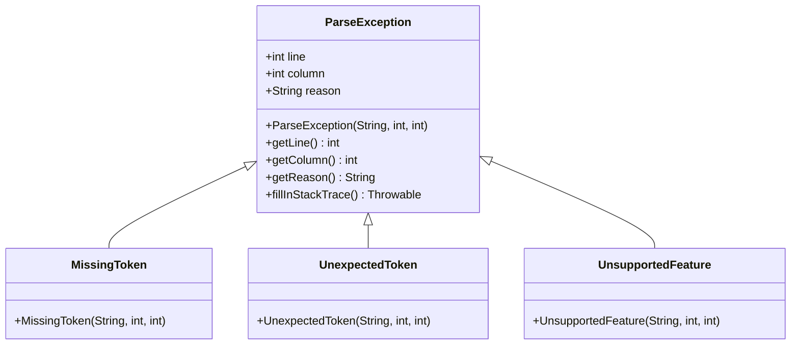
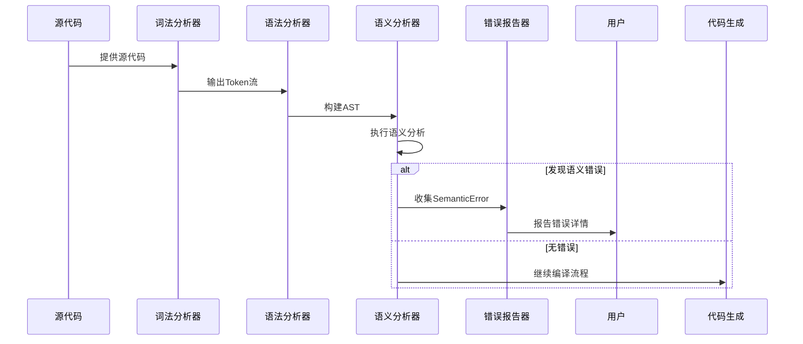
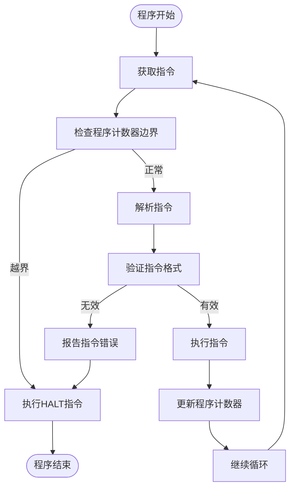

# 错误代码参考

<cite>
**本文档引用的文件**
- [LexicalException.java](file://src/main/java/org/jcnc/snow/compiler/lexer/core/LexicalException.java)
- [ParseException.java](file://src/main/java/org/jcnc/snow/compiler/parser/context/ParseException.java)
- [SemanticError.java](file://src/main/java/org/jcnc/snow/compiler/semantic/error/SemanticError.java)
- [MissingToken.java](file://src/main/java/org/jcnc/snow/compiler/parser/context/MissingToken.java)
- [UnexpectedToken.java](file://src/main/java/org/jcnc/snow/compiler/parser/context/UnexpectedToken.java)
- [UnsupportedFeature.java](file://src/main/java/org/jcnc/snow/compiler/parser/context/UnsupportedFeature.java)
- [LexicalError.java](file://src/main/java/org/jcnc/snow/compiler/lexer/core/LexicalError.java)
- [ParseError.java](file://src/main/java/org/jcnc/snow/compiler/parser/context/ParseError.java)
- [DependencyResolver.java](file://src/main/java/org/jcnc/snow/pkg/resolver/DependencyResolver.java)
- [VirtualMachineEngine.java](file://src/main/java/org/jcnc/snow/vm/engine/VirtualMachineEngine.java)
- [SemanticAnalysisReporter.java](file://src/main/java/org/jcnc/snow/compiler/semantic/utils/SemanticAnalysisReporter.java)
</cite>

## 目录
1. [简介](#简介)
2. [编译阶段错误](#编译阶段错误)
   1. [词法分析错误](#词法分析错误)
   2. [语法分析错误](#语法分析错误)
   3. [语义分析错误](#语义分析错误)
3. [运行阶段错误](#运行阶段错误)
   1. [包解析错误](#包解析错误)
   2. [虚拟机执行错误](#虚拟机执行错误)
4. [调试与故障排除](#调试与故障排除)

## 简介
本文档详细介绍了Snow编程语言在编译和运行阶段可能出现的所有错误代码及其含义。文档涵盖了从词法、语法、语义分析到虚拟机执行和包解析的完整错误处理体系。通过分析`LexicalException`、`ParseException`、`SemanticError`等核心异常类的实现，为开发者提供详细的错误触发条件、消息格式和解决方案。文档还包含实际错误示例和修复建议，帮助用户快速定位和解决常见问题，如依赖解析失败、类型不匹配、语法错误和未定义符号等。

## 编译阶段错误

### 词法分析错误
词法分析阶段的错误主要由`LexicalException`类表示，当词法分析器在扫描源代码时遇到非法或无法识别的字符序列时抛出。这些错误通常与源代码的字符级问题相关。

**错误类型：**
- **非法字符序列**：当遇到无法识别的字符或字符组合时
- **字符串字面量未闭合**：当字符串开始但未正确结束时
- **数字字面量格式错误**：当数字格式不符合语言规范时

**错误消息格式：**
```
[文件路径]: 行 X, 列 Y: 词法错误: [具体原因]
```

**示例：**
```
Main.snow: 行 7, 列 20: 词法错误: 非法字符序列 '@'
```

**解决方案：**
1. 检查指定位置的字符是否为有效符号
2. 确保所有字符串字面量使用正确的引号闭合
3. 验证数字字面量的格式是否符合规范

**Section sources**
- [LexicalException.java](file://src/main/java/org/jcnc/snow/compiler/lexer/core/LexicalException.java#L1-L80)
- [LexicalError.java](file://src/main/java/org/jcnc/snow/compiler/lexer/core/LexicalError.java#L1-L55)

### 语法分析错误
语法分析阶段的错误由`ParseException`类及其子类表示，当解析器检测到源代码不符合语言语法规则时抛出。`ParseException`是一个密封类，其子类包括`MissingToken`、`UnexpectedToken`和`UnsupportedFeature`。



**Diagram sources**
- [ParseException.java](file://src/main/java/org/jcnc/snow/compiler/parser/context/ParseException.java#L1-L81)
- [MissingToken.java](file://src/main/java/org/jcnc/snow/compiler/parser/context/MissingToken.java#L1-L22)
- [UnexpectedToken.java](file://src/main/java/org/jcnc/snow/compiler/parser/context/UnexpectedToken.java#L1-L21)
- [UnsupportedFeature.java](file://src/main/java/org/jcnc/snow/compiler/parser/context/UnsupportedFeature.java#L1-L21)

#### MissingToken（缺失Token）
当语法分析器期望某个Token但未在输入流中找到时抛出。

**触发条件：**
- 缺少必需的语法元素，如括号、分号或关键字
- 函数声明缺少参数列表的闭合括号

**错误消息格式：**
```
[文件路径]: 行 X, 列 Y: 缺失 Token: [预期的Token]
```

**示例：**
```
Main.snow: 行 5, 列 10: 缺失 Token: )
```

**解决方案：**
1. 检查语法结构的完整性
2. 确保所有开括号都有对应的闭括号
3. 验证语句是否以正确的终止符结束

#### UnexpectedToken（意外Token）
当语法分析器遇到与预期类型不符或无法识别的Token时抛出。

**触发条件：**
- 在错误的位置使用了有效的Token
- Token类型与当前语法上下文不匹配

**错误消息格式：**
```
[文件路径]: 行 X, 列 Y: 意外的 Token: [实际遇到的Token]
```

**示例：**
```
Main.snow: 行 8, 列 15: 意外的 Token: @
```

**解决方案：**
1. 检查指定位置的Token是否符合语法规则
2. 验证操作符和分隔符的使用是否正确
3. 确认标识符命名是否遵循命名规范

#### UnsupportedFeature（不支持的特性）
当用户使用了当前编译器实现尚不支持的语法或语言特性时抛出。

**触发条件：**
- 使用了实验性或未实现的语言特性
- 尝试使用未来版本才支持的语法结构

**错误消息格式：**
```
[文件路径]: 行 X, 列 Y: 暂未支持的语法/特性: [未支持的特性描述]
```

**示例：**
```
Main.snow: 行 12, 列 5: 暂未支持的语法/特性: 泛型
```

**解决方案：**
1. 查阅语言文档确认特性是否已支持
2. 使用替代语法实现相同功能
3. 更新到支持该特性的编译器版本

**Section sources**
- [ParseException.java](file://src/main/java/org/jcnc/snow/compiler/parser/context/ParseException.java#L1-L81)
- [MissingToken.java](file://src/main/java/org/jcnc/snow/compiler/parser/context/MissingToken.java#L1-L22)
- [UnexpectedToken.java](file://src/main/java/org/jcnc/snow/compiler/parser/context/UnexpectedToken.java#L1-L21)
- [UnsupportedFeature.java](file://src/main/java/org/jcnc/snow/compiler/parser/context/UnsupportedFeature.java#L1-L21)
- [ParseError.java](file://src/main/java/org/jcnc/snow/compiler/parser/context/ParseError.java#L1-L53)

### 语义分析错误
语义分析阶段的错误由`SemanticError`记录，这些错误在语法正确但语义不合法时发生。语义分析器检查类型匹配、符号定义、作用域规则等。



**Diagram sources**
- [SemanticError.java](file://src/main/java/org/jcnc/snow/compiler/semantic/error/SemanticError.java#L1-L57)
- [SemanticAnalysisReporter.java](file://src/main/java/org/jcnc/snow/compiler/semantic/utils/SemanticAnalysisReporter.java#L1-L49)

#### 常见语义错误类型

**类型不匹配错误**
当表达式中的操作数类型不兼容或函数调用参数类型与声明不匹配时发生。

**触发条件：**
- 将long类型值赋给int类型变量
- 函数调用时参数数量或类型与声明不符
- 操作符应用于不兼容的类型

**错误消息格式：**
```
[文件路径]: 行 X, 列 Y: 参数类型不匹配 (位置 Z): 期望 [期望类型], 实际 [实际类型]
```

**示例：**
```
Main.snow: 行 7, 列 28: 参数类型不匹配 (位置 1): 期望 int, 实际 long
```

**解决方案：**
1. 检查变量声明和赋值的类型一致性
2. 验证函数调用参数与函数声明的匹配性
3. 使用类型转换操作符进行显式转换

**未定义符号错误**
当引用了未声明的变量、函数或类型时发生。

**触发条件：**
- 使用未声明的变量
- 调用未定义的函数
- 引用不存在的类型

**错误消息格式：**
```
[文件路径]: 行 X, 列 Y: 未定义的符号: [符号名称]
```

**示例：**
```
Main.snow: 行 10, 列 12: 未定义的符号: undefinedVar
```

**解决方案：**
1. 确认符号是否已正确定义
2. 检查作用域规则，确保符号在当前作用域可见
3. 验证导入语句是否包含所需模块

**重复声明错误**
当在同一作用域内多次声明同一符号时发生。

**触发条件：**
- 同一作用域内声明同名变量
- 函数重载冲突
- 类型重复定义

**错误消息格式：**
```
[文件路径]: 行 X, 列 Y: 重复声明: [符号名称]
```

**示例：**
```
Main.snow: 行 15, 列 5: 重复声明: myVariable
```

**解决方案：**
1. 检查作用域内是否存在同名声明
2. 重命名冲突的符号
3. 确认导入的符号是否与本地声明冲突

**常量初始化错误**
当常量声明未提供初始化值时发生。

**触发条件：**
- 常量声明缺少初始化表达式
- 初始化表达式在编译时无法确定

**错误消息格式：**
```
[文件路径]: 行 X, 列 Y: 常量必须在声明时初始化: [常量名称]
```

**示例：**
```
Main.snow: 行 20, 列 10: 常量必须在声明时初始化: PI
```

**解决方案：**
1. 为常量提供初始化表达式
2. 确保初始化表达式是编译时常量
3. 检查表达式中引用的符号是否已定义

**Section sources**
- [SemanticError.java](file://src/main/java/org/jcnc/snow/compiler/semantic/error/SemanticError.java#L1-L57)
- [SemanticAnalysisReporter.java](file://src/main/java/org/jcnc/snow/compiler/semantic/utils/SemanticAnalysisReporter.java#L1-L49)
- [DeclarationAnalyzer.java](file://src/main/java/org/jcnc/snow/compiler/semantic/analyzers/statement/DeclarationAnalyzer.java#L49-L77)
- [UnsupportedExpressionAnalyzer.java](file://src/main/java/org/jcnc/snow/compiler/semantic/analyzers/expression/UnsupportedExpressionAnalyzer.java#L27-L59)

## 运行阶段错误

### 包解析错误
包解析错误发生在编译或运行时尝试加载依赖包的过程中，由`DependencyResolver`类处理。

**错误类型：**
- **依赖未找到**：指定的依赖包在本地缓存和远程仓库中均不存在
- **仓库配置错误**：项目配置的仓库URL无效或无法访问
- **网络连接问题**：下载依赖时网络连接失败
- **缓存权限问题**：无法写入本地缓存目录

**触发条件：**
- `import`语句引用的模块在标准库或项目依赖中不存在
- 项目配置文件中指定的依赖版本不存在
- 网络环境阻止访问远程仓库

**错误消息格式：**
```
[错误级别] [错误描述]
```

**示例：**
```
[download] https://example.com/repo/com/example/mypackage/1.0.0/mypackage-1.0.0.jar
java.io.IOException: Unable to connect to repository
```

**解决方案：**
1. 检查`import`语句的模块名称是否正确
2. 验证项目依赖配置是否准确
3. 确认网络连接正常且仓库URL可达
4. 检查本地缓存目录的读写权限

**Section sources**
- [DependencyResolver.java](file://src/main/java/org/jcnc/snow/pkg/resolver/DependencyResolver.java#L1-L84)
- [CompileTask.java](file://src/main/java/org/jcnc/snow/pkg/tasks/CompileTask.java#L221-L254)

### 虚拟机执行错误
虚拟机执行错误发生在代码运行时，由`VirtualMachineEngine`处理。



**Diagram sources**
- [VirtualMachineEngine.java](file://src/main/java/org/jcnc/snow/vm/engine/VirtualMachineEngine.java#L1-L190)

#### 常见执行错误

**无效指令格式错误**
当虚拟机遇到格式不正确的指令时发生。

**触发条件：**
- 指令缺少操作码
- 操作数数量与操作码要求不符
- 操作数格式错误

**错误消息格式：**
```
Command error at PC=[程序计数器值] -> [错误详情]
```

**示例：**
```
Command error at PC=45 -> Invalid command format at PC=45 -> Missing opcode
```

**解决方案：**
1. 检查编译生成的VM代码是否完整
2. 验证指令序列的正确性
3. 确认代码生成器没有产生格式错误的指令

**非法操作码错误**
当虚拟机遇到无法识别的操作码时发生。

**触发条件：**
- 操作码不是有效的整数
- 操作码超出有效范围
- 操作码对应的操作未实现

**错误消息格式：**
```
Command error at PC=[程序计数器值] -> Invalid opcode -> [操作码值]
```

**示例：**
```
Command error at PC=100 -> Invalid opcode -> abc
```

**解决方案：**
1. 检查操作码是否为有效整数
2. 验证操作码值在有效范围内
3. 确认VM实现支持该操作码

**运行时异常错误**
当执行系统调用或特定操作时发生异常。

**触发条件：**
- 空指针访问
- 数组越界访问
- 除零操作
- 资源访问失败

**错误消息格式：**
```
[异常类型]: [异常消息]
```

**示例：**
```
NullPointerException: Cannot invoke method on null object
```

**解决方案：**
1. 在访问对象前检查是否为null
2. 验证数组索引在有效范围内
3. 检查除法操作的除数是否为零
4. 确保资源在访问前已正确初始化

**Section sources**
- [VirtualMachineEngine.java](file://src/main/java/org/jcnc/snow/vm/engine/VirtualMachineEngine.java#L1-L190)
- [VMCommandExecutor.java](file://src/main/java/org/jcnc/snow/vm/engine/VMCommandExecutor.java#L1-L33)
- [SyscallUtils.java](file://src/main/java/org/jcnc/snow/vm/commands/system/control/SyscallUtils.java#L43-L85)

## 调试与故障排除
当遇到编译或运行错误时，可以按照以下步骤进行调试：

1. **定位错误位置**：根据错误消息中的文件路径、行号和列号精确定位问题代码
2. **理解错误类型**：区分是词法、语法、语义还是运行时错误
3. **检查上下文**：查看错误位置周围的代码，理解其上下文和意图
4. **验证假设**：确认对语言特性的理解是否正确
5. **查阅文档**：参考语言规范和API文档
6. **简化问题**：创建最小可复现示例来隔离问题
7. **逐步验证**：通过添加调试输出或使用调试器逐步验证执行流程

对于复杂问题，可以启用编译器的调试模式，查看详细的编译过程信息，包括词法分析结果、AST结构和生成的中间代码，这有助于深入理解问题根源。

**Section sources**
- [SnowCLI.java](file://src/main/java/org/jcnc/snow/cli/SnowCLI.java#L1-L98)
- [VMUtils.java](file://src/main/java/org/jcnc/snow/vm/utils/VMUtils.java#L36-L60)
- [VMStateLogger.java](file://src/main/java/org/jcnc/snow/vm/utils/VMStateLogger.java#L1-L50)