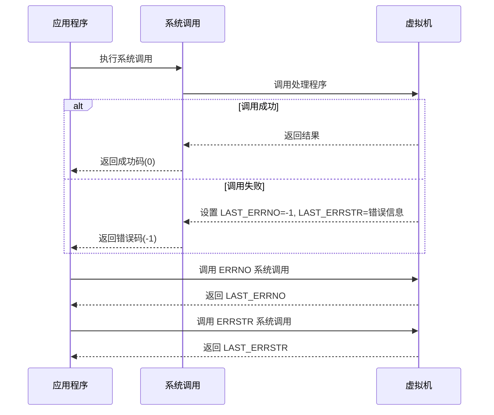
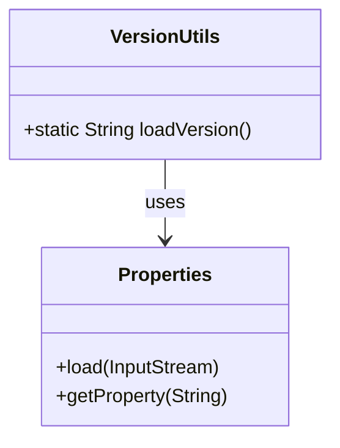

# 附录

<cite>
**本文档中引用的文件**   
- [README.md](file://README.md)
- [VersionUtils.java](file://src/main/java/org/jcnc/snow/cli/utils/VersionUtils.java)
- [version.properties](file://src/main/resources/version.properties)
- [pom.xml](file://pom.xml)
- [CLIUtils.java](file://src/main/java/org/jcnc/snow/cli/utils/CLIUtils.java)
- [LexicalError.java](file://src/main/java/org/jcnc/snow/compiler/lexer/core/LexicalError.java)
- [LexicalException.java](file://src/main/java/org/jcnc/snow/compiler/lexer/core/LexicalException.java)
- [ParseException.java](file://src/main/java/org/jcnc/snow/compiler/parser/context/ParseException.java)
- [SemanticError.java](file://src/main/java/org/jcnc/snow/compiler/semantic/error/SemanticError.java)
- [SyscallUtils.java](file://src/main/java/org/jcnc/snow/vm/commands/system/control/SyscallUtils.java)
- [ErrnoHandler.java](file://src/main/java/org/jcnc/snow/vm/commands/system/control/sys/ErrnoHandler.java)
- [ErrStrHandler.java](file://src/main/java/org/jcnc/snow/vm/commands/system/control/sys/ErrStrHandler.java)
- [Project.java](file://src/main/java/org/jcnc/snow/pkg/model/Project.java)
</cite>

## 目录
1. [错误代码参考](#错误代码参考)
2. [常见问题解答（FAQ）](#常见问题解答faq)
3. [贡献指南](#贡献指南)
4. [版本发布说明与升级指南](#版本发布说明与升级指南)
5. [项目元数据](#项目元数据)

## 错误代码参考

Snow 语言在编译和运行过程中会生成详细的错误信息，帮助开发者快速定位问题。错误主要分为三类：词法错误、语法错误和语义错误。此外，运行时系统调用也会返回错误码。

### 词法错误 (Lexical Errors)
词法错误发生在源代码被分解为 Token 的阶段。当遇到无法识别的字符序列时，会抛出此类错误。

- **错误类型**: `LexicalException`
- **可能原因**: 源代码中包含非法字符（如 `@`、`$` 等非标准符号）或不完整的符号。
- **解决方案**: 检查错误提示的行和列，移除或修正非法字符。确保所有字符串、注释和符号都正确闭合。

**Section sources**
- [LexicalError.java](file://src/main/java/org/jcnc/snow/compiler/lexer/core/LexicalError.java#L1-L55)
- [LexicalException.java](file://src/main/java/org/jcnc/snow/compiler/lexer/core/LexicalException.java#L1-L47)

### 语法错误 (Syntax Errors)
语法错误发生在将 Token 流解析为抽象语法树（AST）的阶段。当代码结构不符合语言文法时，会抛出此类错误。

- **错误类型**: `ParseException` 及其子类（如 `UnexpectedToken`、`MissingToken`）
- **可能原因**: 缺少必要的关键字或符号（如冒号、括号）、使用了错误的 Token 或语言特性尚未支持。
- **解决方案**: 根据错误信息检查代码结构，确保所有语句、表达式和模块定义都符合 Snow 语言的语法规则。

**Section sources**
- [ParseException.java](file://src/main/java/org/jcnc/snow/compiler/parser/context/ParseException.java#L1-L81)
- [UnexpectedToken.java](file://src/main/java/org/jcnc/snow/compiler/parser/context/UnexpectedToken.java#L1-L20)

### 语义错误 (Semantic Errors)
语义错误发生在分析代码含义的阶段，包括类型检查、符号解析等。当代码结构正确但逻辑或类型不匹配时，会抛出此类错误。

- **错误类型**: `SemanticError`
- **可能原因**: 变量未声明、类型不匹配、函数参数错误、返回值类型不符等。
- **解决方案**: 检查错误涉及的变量、函数和表达式，确保类型兼容且所有符号均已正确定义。

**Section sources**
- [SemanticError.java](file://src/main/java/org/jcnc/snow/compiler/semantic/error/SemanticError.java#L1-L57)

### 运行时错误码 (Runtime Error Codes)
在虚拟机执行阶段，系统调用会通过全局 errno 和 errstr 机制报告错误。

- **ERRNO (0x1905)**: 获取最近一次系统调用的错误码。成功时返回 `0`，失败时返回 `-1`。
- **ERRSTR (0x1904)**: 获取最近一次系统调用的错误信息字符串。无错误时返回空字符串。
- **解决方案**: 在调用可能失败的系统调用后，检查 `ERRNO` 和 `ERRSTR` 的返回值，根据错误信息进行相应处理。

**Diagram sources**
- [SyscallUtils.java](file://src/main/java/org/jcnc/snow/vm/commands/system/control/SyscallUtils.java#L1-L85)
- [ErrnoHandler.java](file://src/main/java/org/jcnc/snow/vm/commands/system/control/sys/ErrnoHandler.java#L1-L40)
- [ErrStrHandler.java](file://src/main/java/org/jcnc/snow/vm/commands/system/control/sys/ErrStrHandler.java#L1-L39)

## 常见问题解答（FAQ）

### 安装问题
**Q: 如何在 Arch Linux 上安装 Snow？**  
A: 可以通过 AUR 仓库或自建源仓库安装。使用 `yay -Syu snow` 或 `sudo pacman -Syu snow` 命令进行安装。

**Q: 开发环境需要哪些依赖？**  
A: 需要安装 IntelliJ IDEA 和 GraalVM JDK 24。项目使用 Maven 进行构建，确保已正确配置。

### 编译错误
**Q: 编译时提示“非法字符序列”怎么办？**  
A: 检查源文件中是否有非 ASCII 字符或特殊符号。Snow 语言目前仅支持标准的字母、数字、下划线和特定符号。

**Q: 如何编译整个项目目录？**  
A: 使用命令 `snow -d path/to/source_dir` 进行目录递归编译。

### 运行时异常
**Q: 运行时出现“未知系统调用错误”如何处理？**  
A: 此错误通常由底层 Java 异常引起。检查 `ERRSTR` 的详细信息，确认是文件 I/O、网络还是内存问题，并相应处理。

**Q: 如何启用调试模式查看执行过程？**  
A: 在运行命令时添加 `--debug` 标志，如 `snow run --debug`，可显示详细的执行日志和状态。

**Section sources**
- [README.md](file://README.md#L1-L638)
- [CLIUtils.java](file://src/main/java/org/jcnc/snow/cli/utils/CLIUtils.java#L1-L78)

## 贡献指南

欢迎为 Snow 项目贡献代码。请遵循以下规范以确保代码质量和一致性。

### 代码风格
- 遵循 Java 代码规范，使用 4 个空格进行缩进。
- 类名采用大驼峰命名法，方法名和变量名采用小驼峰命名法。
- 添加详细的 Javadoc 注释，特别是公共 API。

### 测试要求
- 所有新功能必须包含单元测试。
- 修复的 Bug 必须添加回归测试。
- 测试代码应覆盖正常路径和异常路径。

### Pull Request 流程
1. Fork 仓库并创建新分支。
2. 实现功能或修复 Bug。
3. 运行 `mvn test` 确保所有测试通过。
4. 提交 Pull Request，描述变更内容和测试结果。
5. 等待维护者审查和合并。

### 社区规范
- 尊重他人，保持友好和建设性的沟通。
- 在提出新特性前，先在 Issues 中讨论。
- 遵守 Apache 2.0 许可证的要求。

**Section sources**
- [README.md](file://README.md#L1-L638)

## 版本发布说明与升级指南

### 版本发布说明获取方式
最新的版本发布说明可以在 Gitee 仓库的 [Releases 页面](https://gitee.com/jcnc-org/snow/releases) 找到。每个版本都包含详细的变更日志、新增功能、修复的 Bug 和已知问题。

### 升级指南
1. **备份项目**: 升级前请备份现有项目和配置文件。
2. **下载新版本**: 从 Releases 页面下载最新版本的 SDK。
3. **替换文件**: 将新版本的 `bin` 和 `lib` 目录替换旧版本的对应目录。
4. **验证兼容性**: 使用 `snow version` 命令确认版本，并运行测试用例验证项目兼容性。
5. **更新文档**: 检查新版本的文档，了解是否有新的配置项或 API 变更。

**Section sources**
- [README.md](file://README.md#L1-L638)

## 项目元数据

### 版本号管理
Snow 项目的版本号通过 `version.properties` 文件和 `VersionUtils` 类进行管理。

- **version.properties**: 位于 `src/main/resources/` 目录下，内容为 `snow.version=${project.version}`，其中 `${project.version}` 由 Maven 构建时自动替换。
- **VersionUtils.java**: 提供 `loadVersion()` 方法，从 classpath 中读取 `version.properties` 文件并返回版本号。

**Diagram sources**
- [VersionUtils.java](file://src/main/java/org/jcnc/snow/cli/utils/VersionUtils.java#L1-L42)
- [version.properties](file://src/main/resources/version.properties#L1-L2)

### 许可证信息
Snow 项目依据 [Apache 2.0 许可证](LICENSE) 进行许可和发布。版权所有 © 2025 许轲（Luke），代表 SnowLang 项目。

### 第三方依赖清单
项目的第三方依赖由 Maven 管理，定义在 `pom.xml` 文件中。主要依赖包括：
- **GraalVM Build Tools**: 用于生成原生镜像。
- **Maven Compiler Plugin**: 用于 Java 源码编译。
- **Maven Jar Plugin**: 用于打包可执行 JAR 文件。

**Section sources**
- [pom.xml](file://pom.xml#L1-L227)
- [Project.java](file://src/main/java/org/jcnc/snow/pkg/model/Project.java#L1-L54)