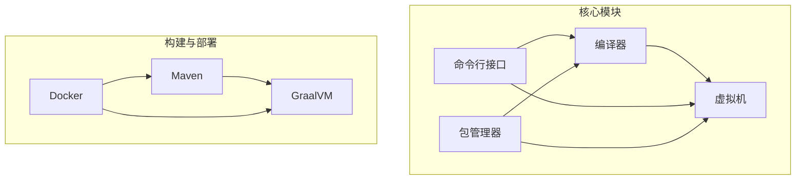
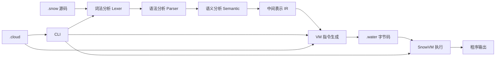
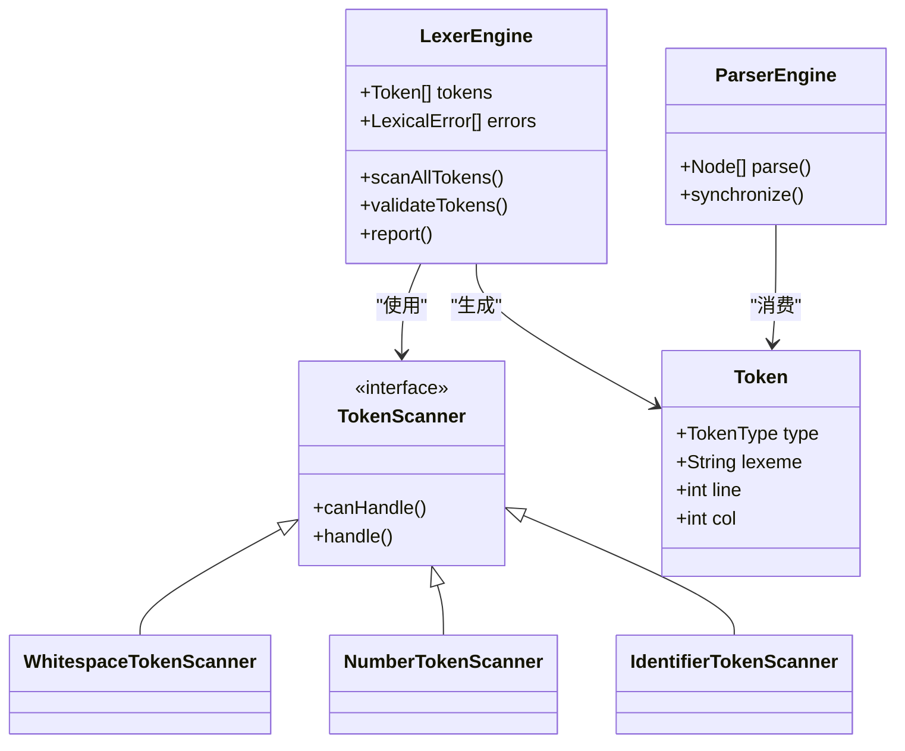
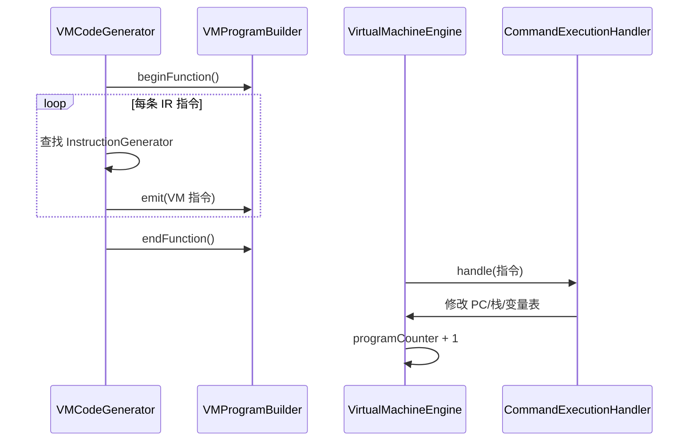
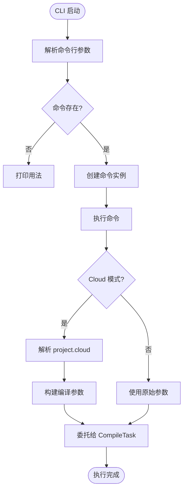
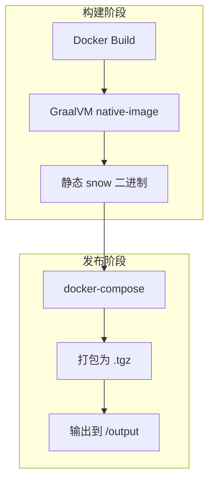

# 项目概述

<cite>
**本文档引用的文件**
- [README.md](file://README.md)
- [pom.xml](file://pom.xml)
- [SnowCLI.java](file://src/main/java/org/jcnc/snow/cli/SnowCLI.java)
- [SnowConfig.java](file://src/main/java/org/jcnc/snow/common/SnowConfig.java)
- [LexerEngine.java](file://src/main/java/org/jcnc/snow/compiler/lexer/core/LexerEngine.java)
- [ParserEngine.java](file://src/main/java/org/jcnc/snow/compiler/parser/core/ParserEngine.java)
- [VMCodeGenerator.java](file://src/main/java/org/jcnc/snow/compiler/backend/builder/VMCodeGenerator.java)
- [VirtualMachineEngine.java](file://src/main/java/org/jcnc/snow/vm/engine/VirtualMachineEngine.java)
- [Project.java](file://src/main/java/org/jcnc/snow/pkg/model/Project.java)
- [CompileCommand.java](file://src/main/java/org/jcnc/snow/cli/commands/CompileCommand.java)
- [RunCommand.java](file://src/main/java/org/jcnc/snow/cli/commands/RunCommand.java)
- [Dockerfile](file://Dockerfile)
- [docker-compose.yml](file://docker-compose.yml)
- [version.properties](file://src/main/resources/version.properties)
</cite>

## 目录
1. [简介](#简介)
2. [项目结构](#项目结构)
3. [核心组件](#核心组件)
4. [架构概览](#架构概览)
5. [详细组件分析](#详细组件分析)
6. [依赖分析](#依赖分析)
7. [性能考量](#性能考量)
8. [故障排除指南](#故障排除指南)
9. [结论](#结论)

## 简介
Snow 是一门面向 AI 时代的新型编程语言，其设计初衷是让大模型（LLM）更容易生成和理解代码，从而提升人与 AI 协同编程的效率。该项目完整实现了从 `.snow` 源码到 `.water` 虚拟机字节码的编译流程，并通过 SnowVM 执行。Snow 提供了完整的命令行接口（CLI）、包管理系统（snow pkg）、编译器、虚拟机以及项目生命周期管理功能，支持独立编译和集成编译两种模式。项目还支持通过 GraalVM 构建原生镜像，并可通过 Docker 进行跨平台构建与分发。

**Section sources**
- [README.md](file://README.md#L1-L638)

## 项目结构
Snow 项目采用模块化设计，主要分为编译器、虚拟机、包管理器和命令行接口四大核心部分。源码位于 `src/main/java/org/jcnc/snow/` 目录下，分为 `compiler`（词法、语法、语义、IR、后端）、`vm`（指令、引擎、执行、IO）、`pkg`（DSL、任务、模型）和 `cli`（命令、工具）等子模块。项目使用 Maven 构建，通过 `pom.xml` 配置多平台原生镜像构建流程，并利用 Docker 实现跨平台静态编译。

**Diagram sources**
- [README.md](file://README.md#L1-L638)
- [pom.xml](file://pom.xml#L1-L227)
- [Dockerfile](file://Dockerfile#L1-L58)

**Section sources**
- [README.md](file://README.md#L1-L638)

## 核心组件
Snow 的核心组件包括编译器前端（词法与语法分析）、中间表示（IR）、编译器后端（VM 指令生成）、虚拟机引擎（SnowVM）以及命令行接口（CLI）。编译器将 `.snow` 源码转换为三地址码形式的 IR，再生成 `.water` 字节码；虚拟机负责加载并执行字节码；CLI 提供 `compile`、`run`、`version` 等命令；包管理器通过 `.cloud` 文件管理项目配置、依赖和构建流程。

**Section sources**
- [README.md](file://README.md#L1-L638)
- [SnowCLI.java](file://src/main/java/org/jcnc/snow/cli/SnowCLI.java#L1-L98)

## 架构概览
Snow 的整体架构遵循典型的编译-执行流程：源码 → 词法分析 → 语法分析 → 语义分析 → 中间表示（IR）→ 虚拟机指令生成 → 字节码文件（.water）→ 虚拟机执行。CLI 作为用户入口，调用编译或运行任务；`pkg` 模块处理项目级配置；编译器负责前端和后端处理；VM 负责指令解释执行。整个流程支持调试模式输出 AST、IR 和 VM 状态。

**Diagram sources**
- [README.md](file://README.md#L1-L638)
- [LexerEngine.java](file://src/main/java/org/jcnc/snow/compiler/lexer/core/LexerEngine.java#L1-L186)
- [ParserEngine.java](file://src/main/java/org/jcnc/snow/compiler/parser/core/ParserEngine.java#L1-L98)
- [VMCodeGenerator.java](file://src/main/java/org/jcnc/snow/compiler/backend/builder/VMCodeGenerator.java#L1-L89)
- [VirtualMachineEngine.java](file://src/main/java/org/jcnc/snow/vm/engine/VirtualMachineEngine.java#L1-L191)

## 详细组件分析

### 编译器前端分析
Snow 的编译器前端由词法分析器（Lexer）和语法分析器（Parser）组成。词法分析器使用扫描器链（Scanner Chain）策略，依次处理空白、换行、注释、数字、标识符等 token。语法分析器采用 Pratt 解析法，支持表达式优先级，并通过错误恢复机制（synchronize）跳过错误 token，确保解析健壮性。

**Diagram sources**
- [LexerEngine.java](file://src/main/java/org/jcnc/snow/compiler/lexer/core/LexerEngine.java#L1-L186)
- [ParserEngine.java](file://src/main/java/org/jcnc/snow/compiler/parser/core/ParserEngine.java#L1-L98)

**Section sources**
- [LexerEngine.java](file://src/main/java/org/jcnc/snow/compiler/lexer/core/LexerEngine.java#L1-L186)
- [ParserEngine.java](file://src/main/java/org/jcnc/snow/compiler/parser/core/ParserEngine.java#L1-L98)

### 编译器后端与虚拟机分析
编译器后端将 IR 函数转换为 VM 指令。`VMCodeGenerator` 使用指令生成器注册表（registry）分发不同类型的 IR 指令，生成对应的 VM 指令并写入 `VMProgramBuilder`。虚拟机引擎（`VirtualMachineEngine`）维护程序计数器（PC）、操作数栈、局部变量表和调用栈，通过 `CommandExecutionHandler` 分发指令执行。

**Diagram sources**
- [VMCodeGenerator.java](file://src/main/java/org/jcnc/snow/compiler/backend/builder/VMCodeGenerator.java#L1-L89)
- [VirtualMachineEngine.java](file://src/main/java/org/jcnc/snow/vm/engine/VirtualMachineEngine.java#L1-L191)

**Section sources**
- [VMCodeGenerator.java](file://src/main/java/org/jcnc/snow/compiler/backend/builder/VMCodeGenerator.java#L1-L89)
- [VirtualMachineEngine.java](file://src/main/java/org/jcnc/snow/vm/engine/VirtualMachineEngine.java#L1-L191)

### 命令行与包管理分析
CLI 主入口 `SnowCLI` 解析命令行参数并调度子命令。`CompileCommand` 支持 Cloud 模式（使用 `project.cloud`）和 Local 模式（直接编译文件），并委托给 `CompileTask` 执行。`RunCommand` 调用 `RunTask` 执行 `.water` 文件。`Project` 模型通过 `fromFlatMap` 从配置映射构建项目元数据。

**Diagram sources**
- [SnowCLI.java](file://src/main/java/org/jcnc/snow/cli/SnowCLI.java#L1-L98)
- [CompileCommand.java](file://src/main/java/org/jcnc/snow/cli/commands/CompileCommand.java#L1-L93)
- [RunCommand.java](file://src/main/java/org/jcnc/snow/cli/commands/RunCommand.java#L1-L67)
- [Project.java](file://src/main/java/org/jcnc/snow/pkg/model/Project.java#L1-L235)

**Section sources**
- [SnowCLI.java](file://src/main/java/org/jcnc/snow/cli/SnowCLI.java#L1-L98)
- [CompileCommand.java](file://src/main/java/org/jcnc/snow/cli/commands/CompileCommand.java#L1-L93)
- [RunCommand.java](file://src/main/java/org/jcnc/snow/cli/commands/RunCommand.java#L1-L67)
- [Project.java](file://src/main/java/org/jcnc/snow/pkg/model/Project.java#L1-L235)

## 依赖分析
Snow 项目通过 Maven 管理依赖，并利用 GraalVM 的 `native-maven-plugin` 构建原生镜像。Dockerfile 定义了多阶段构建流程：第一阶段使用 GraalVM 镜像构建静态链接的 `snow` 可执行文件；第二阶段使用 `busybox` 导出二进制文件。`docker-compose.yml` 将构建产物打包为发布版本。

**Diagram sources**
- [pom.xml](file://pom.xml#L1-L227)
- [Dockerfile](file://Dockerfile#L1-L58)
- [docker-compose.yml](file://docker-compose.yml#L1-L25)

**Section sources**
- [pom.xml](file://pom.xml#L1-L227)
- [Dockerfile](file://Dockerfile#L1-L58)
- [docker-compose.yml](file://docker-compose.yml#L1-L25)

## 性能考量
Snow 通过 GraalVM AOT 编译生成原生镜像，实现快速启动和低内存占用。编译器采用分阶段处理和错误聚合策略，提升编译效率。虚拟机使用直接解释执行模式，适合脚本语言场景。未来可通过 JIT 优化热点代码。

## 故障排除指南
常见问题包括词法错误（如 `declare` 后标识符不合法）、语法错误（如缺少关键字）和运行时错误（如栈溢出）。可通过 `--debug` 模式查看详细执行状态，包括操作数栈、调用栈和局部变量表。使用 `snow compile --help` 可查看编译选项。

**Section sources**
- [SnowConfig.java](file://src/main/java/org/jcnc/snow/common/SnowConfig.java#L1-L92)
- [VirtualMachineEngine.java](file://src/main/java/org/jcnc/snow/vm/engine/VirtualMachineEngine.java#L1-L191)

## 结论
Snow 是一门为 AI 时代设计的现代编程语言，具备完整的编译、执行、包管理和构建工具链。其架构清晰，模块化良好，支持跨平台原生构建和容器化部署。通过 `.snow` 源码到 `.water` 字节码的转换，Snow 实现了高效、可移植的代码执行。未来可进一步优化性能，增强 LLM 友好性。