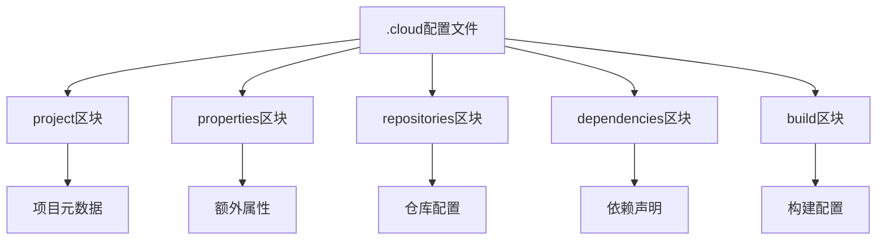
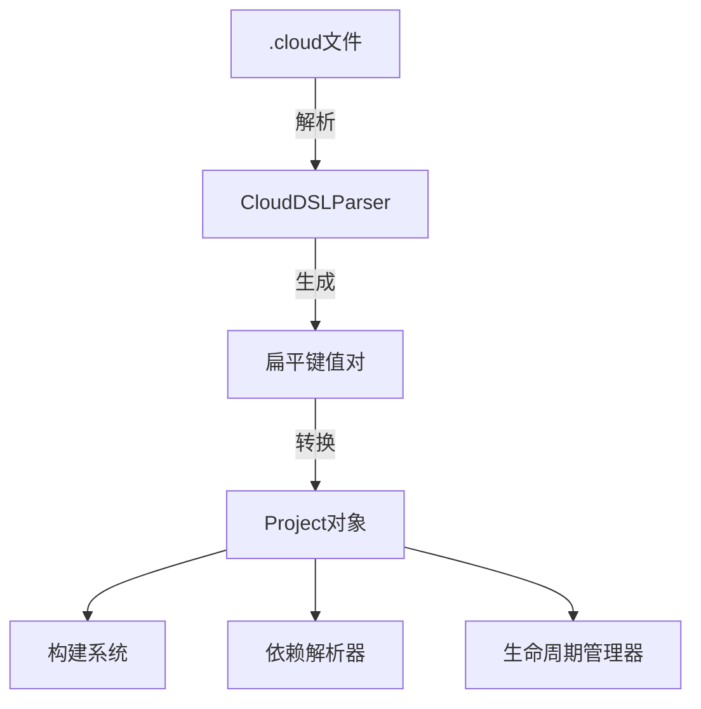
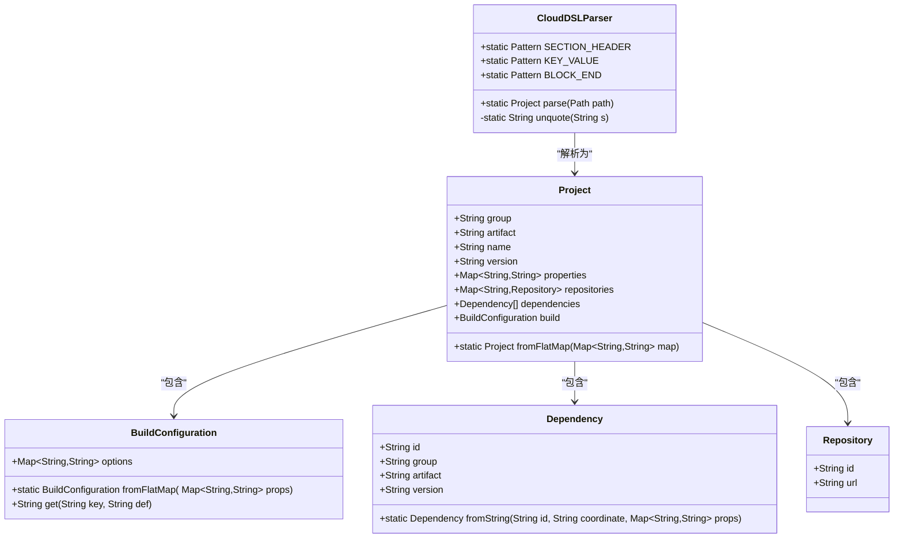
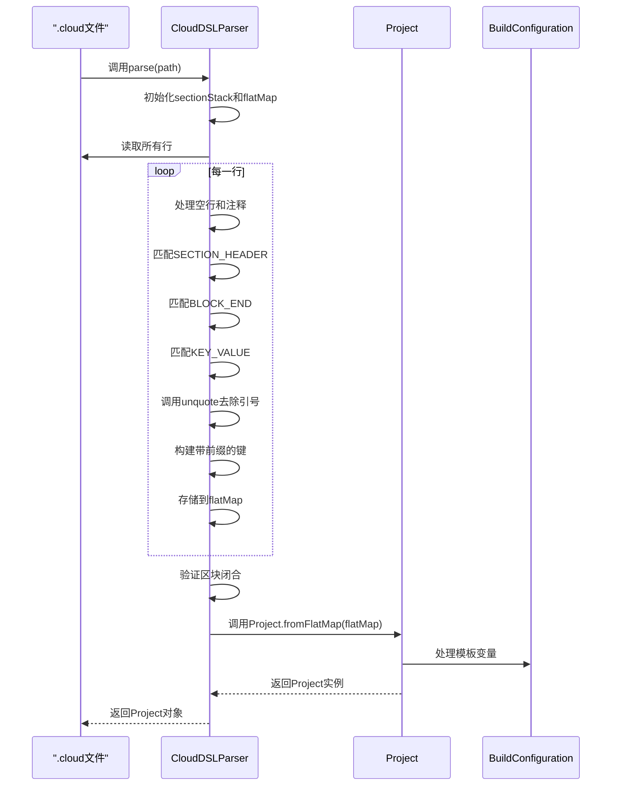
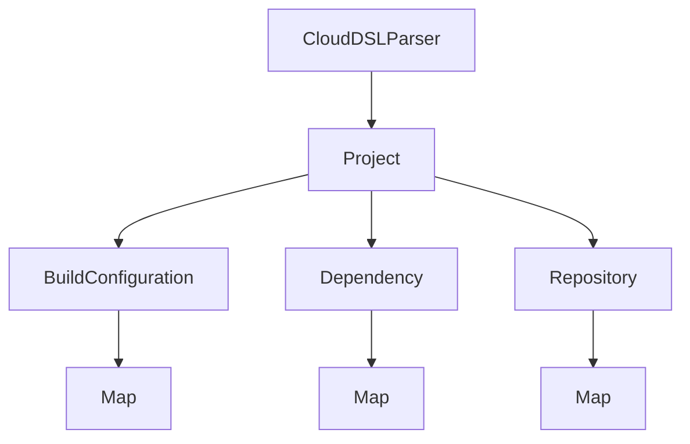

# CloudDSL语法

<cite>
**本文档引用的文件**
- [CloudDSLParser.java](file://src/main/java/org/jcnc/snow/pkg/dsl/CloudDSLParser.java)
- [Project.java](file://src/main/java/org/jcnc/snow/pkg/model/Project.java)
- [BuildConfiguration.java](file://src/main/java/org/jcnc/snow/pkg/model/BuildConfiguration.java)
- [Dependency.java](file://src/main/java/org/jcnc/snow/pkg/model/Dependency.java)
- [Repository.java](file://src/main/java/org/jcnc/snow/pkg/model/Repository.java)
- [ProjectCloudExample.java](file://src/main/java/org/jcnc/snow/cli/utils/ProjectCloudExample.java)
- [project.cloud](file://playground/PerformanceTest/project.cloud)
</cite>

## 目录
1. [简介](#简介)
2. [项目结构](#项目结构)
3. [核心组件](#核心组件)
4. [架构概述](#架构概述)
5. [详细组件分析](#详细组件分析)
6. [依赖分析](#依赖分析)
7. [性能考虑](#性能考虑)
8. [故障排除指南](#故障排除指南)
9. [结论](#结论)

## 简介
CloudDSL是一种专为Snow项目设计的领域特定语言(DSL)，用于定义和配置软件项目的构建过程。它提供了一种简洁、易读的语法来描述项目元数据、依赖关系、构建配置等关键信息。CloudDSL语法设计注重可读性和易用性，支持区块定义、键值对配置、嵌套结构和注释等功能。通过CloudDSL，开发者可以以声明式的方式定义项目配置，而无需编写复杂的构建脚本。该DSL被设计为轻量级且功能完整，能够满足大多数项目的构建需求，同时保持语法的简洁性。

## 项目结构
CloudDSL配置文件通常以`.cloud`为扩展名，位于项目根目录下。文件采用层次化的区块结构组织配置信息，每个区块以区块名称开始，后跟左大括号`{`，以右大括号`}`结束。主要的顶级区块包括`project`、`properties`、`repositories`、`dependencies`和`build`等。这些区块按逻辑分组相关配置，使配置文件结构清晰、易于维护。配置文件支持注释，使用`#`符号开始的行被视为注释，不会被解析器处理。整个文件采用UTF-8编码，支持国际化字符。

**图示来源**
- [CloudDSLParser.java](file://src/main/java/org/jcnc/snow/pkg/dsl/CloudDSLParser.java#L1-L50)

**本节来源**
- [CloudDSLParser.java](file://src/main/java/org/jcnc/snow/pkg/dsl/CloudDSLParser.java#L1-L100)

## 核心组件
CloudDSL的核心组件包括解析器、模型类和配置处理器。解析器负责将`.cloud`文件转换为内存中的数据结构，模型类表示解析后的项目信息，配置处理器则负责处理配置中的动态特性如模板变量替换。这些组件协同工作，将文本配置转换为可编程的对象模型，供构建系统使用。解析过程是单向的，从文本到对象，确保了配置的一致性和可靠性。整个系统设计为不可变对象，保证了配置在构建过程中的稳定性。

**本节来源**
- [CloudDSLParser.java](file://src/main/java/org/jcnc/snow/pkg/dsl/CloudDSLParser.java#L1-L146)
- [Project.java](file://src/main/java/org/jcnc/snow/pkg/model/Project.java#L1-L234)

## 架构概述
CloudDSL的架构采用分层设计，最底层是正则表达式驱动的文本解析器，中间层是扁平化的键值对映射，顶层是丰富的对象模型。解析器首先将`.cloud`文件解析为扁平的键值对映射，然后通过工厂方法转换为结构化的`Project`对象。这种设计分离了解析逻辑和业务逻辑，提高了代码的可维护性和可测试性。架构支持扩展，可以通过添加新的区块类型或配置项来增强功能，而不会影响现有代码。

**图示来源**
- [CloudDSLParser.java](file://src/main/java/org/jcnc/snow/pkg/dsl/CloudDSLParser.java#L1-L146)
- [Project.java](file://src/main/java/org/jcnc/snow/pkg/model/Project.java#L1-L234)

## 详细组件分析

### CloudDSL解析器分析
CloudDSL解析器是整个系统的核心，负责将文本配置转换为可编程的对象。它使用正则表达式来识别不同的语法元素，包括区块头、键值对和区块结束符。解析器采用行导向的处理方式，逐行读取文件内容，根据当前上下文决定如何处理每一行。这种设计简单高效，能够快速处理大型配置文件。

#### 对象导向组件

**图示来源**
- [CloudDSLParser.java](file://src/main/java/org/jcnc/snow/pkg/dsl/CloudDSLParser.java#L1-L146)
- [Project.java](file://src/main/java/org/jcnc/snow/pkg/model/Project.java#L1-L234)
- [BuildConfiguration.java](file://src/main/java/org/jcnc/snow/pkg/model/BuildConfiguration.java#L1-L66)
- [Dependency.java](file://src/main/java/org/jcnc/snow/pkg/model/Dependency.java#L1-L86)
- [Repository.java](file://src/main/java/org/jcnc/snow/pkg/model/Repository.java#L1-L17)

#### API/服务组件

**图示来源**
- [CloudDSLParser.java](file://src/main/java/org/jcnc/snow/pkg/dsl/CloudDSLParser.java#L1-L146)
- [Project.java](file://src/main/java/org/jcnc/snow/pkg/model/Project.java#L1-L234)

**本节来源**
- [CloudDSLParser.java](file://src/main/java/org/jcnc/snow/pkg/dsl/CloudDSLParser.java#L1-L146)
- [Project.java](file://src/main/java/org/jcnc/snow/pkg/model/Project.java#L1-L234)

### 语法规则详解
CloudDSL语法设计简洁明了，易于学习和使用。它支持区块定义、键值对配置、嵌套结构和注释等特性，能够满足大多数项目的配置需求。

#### 区块定义
CloudDSL使用区块来组织相关的配置项。每个区块以区块名称开始，后跟左大括号`{`，以右大括号`}`结束。常见的顶级区块包括：
- `project`：定义项目元数据
- `properties`：定义额外属性
- `repositories`：定义依赖仓库
- `dependencies`：定义项目依赖
- `build`：定义构建配置

区块支持嵌套，特别是`build`区块可以包含子区块，如`compile`、`package`等，形成层次化的配置结构。

#### 键值对格式
在区块内部，配置以键值对的形式存在，格式为`key = value`。键必须是有效的标识符，由字母、数字和下划线组成，不能以数字开头。值可以是字符串、数字或其他字面量，支持使用单引号或双引号包围。行尾可以包含注释，以`#`符号开始。

#### 嵌套结构
CloudDSL支持嵌套的区块结构，允许在区块内部定义子区块。这种设计使得配置更加模块化和可读。例如，在`build`区块内部可以定义`compile`、`test`等子区块，每个子区块有自己的配置项。解析器会自动将嵌套的键展平，使用点号`.`连接父区块和子键，形成类似`build.compile.enabled`的完整键名。

#### 注释支持
CloudDSL支持行注释，使用`#`符号开始的行被视为注释，不会被解析器处理。注释可以用于解释配置项的用途、记录修改历史或临时禁用某些配置。注释可以出现在文件的任何位置，包括区块内部和外部。

**本节来源**
- [CloudDSLParser.java](file://src/main/java/org/jcnc/snow/pkg/dsl/CloudDSLParser.java#L1-L146)
- [ProjectCloudExample.java](file://src/main/java/org/jcnc/snow/cli/utils/ProjectCloudExample.java#L1-L31)

## 依赖分析
CloudDSL的组件之间存在明确的依赖关系。`CloudDSLParser`依赖于`Project`类来创建最终的对象模型，`Project`类又依赖于`BuildConfiguration`、`Dependency`和`Repository`等模型类。这种依赖关系形成了一个清晰的层次结构，从解析器到模型类，再到具体的配置项。依赖关系是单向的，从高层到低层，避免了循环依赖的问题。所有依赖都通过接口或抽象类定义，提高了代码的可测试性和可维护性。

**图示来源**
- [CloudDSLParser.java](file://src/main/java/org/jcnc/snow/pkg/dsl/CloudDSLParser.java#L1-L146)
- [Project.java](file://src/main/java/org/jcnc/snow/pkg/model/Project.java#L1-L234)

**本节来源**
- [CloudDSLParser.java](file://src/main/java/org/jcnc/snow/pkg/dsl/CloudDSLParser.java#L1-L146)
- [Project.java](file://src/main/java/org/jcnc/snow/pkg/model/Project.java#L1-L234)

## 性能考虑
CloudDSL的设计考虑了性能因素。解析器采用流式处理方式，逐行读取文件内容，避免了一次性加载整个文件到内存。正则表达式经过优化，能够快速匹配各种语法元素。扁平化的键值对映射使用`LinkedHashMap`实现，保持了插入顺序，同时提供了O(1)的查找性能。对象创建过程也经过优化，使用静态工厂方法减少对象创建的开销。整体设计确保了即使在处理大型配置文件时也能保持良好的性能。

## 故障排除指南
在使用CloudDSL时可能会遇到一些常见问题，了解这些问题的解决方案有助于提高开发效率。

#### 语法错误处理
CloudDSL解析器具有严格的语法检查机制。当遇到语法错误时，如括号不匹配或无法识别的行，解析器会抛出`IllegalStateException`异常，并提供详细的错误信息，包括错误行号和内容。这有助于开发者快速定位和修复问题。例如，如果文件结束但区块未闭合，解析器会报告未闭合的区块列表。

#### 常见陷阱规避
- **引号处理**：值中的引号会被自动去除，因此不需要在代码中手动处理引号。
- **键名冲突**：由于嵌套键会被展平，需要注意避免键名冲突。
- **模板变量**：在`BuildConfiguration`中使用的模板变量`@{key}`会被自动替换，需要确保属性存在。
- **大小写敏感**：键名是大小写敏感的，需要注意一致性。

**本节来源**
- [CloudDSLParser.java](file://src/main/java/org/jcnc/snow/pkg/dsl/CloudDSLParser.java#L1-L146)
- [Project.java](file://src/main/java/org/jcnc/snow/pkg/model/Project.java#L1-L234)

## 结论
CloudDSL是一种简洁、强大且易于使用的配置语言，为Snow项目提供了灵活的构建配置能力。通过区块定义、键值对配置、嵌套结构和注释支持，它能够满足大多数项目的配置需求。解析器的设计高效可靠，能够快速将文本配置转换为可编程的对象模型。模型类的设计注重不可变性和类型安全，确保了配置在构建过程中的稳定性。整体架构清晰，组件职责明确，易于扩展和维护。CloudDSL的成功应用证明了领域特定语言在构建系统中的价值，为开发者提供了更好的配置体验。