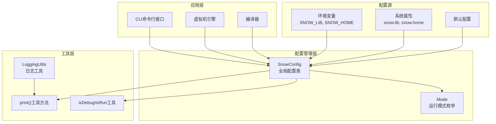
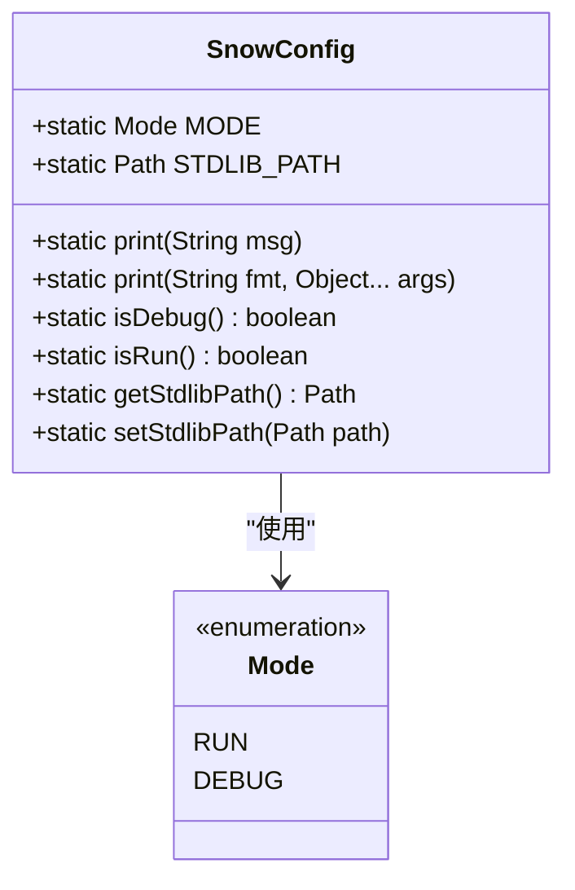
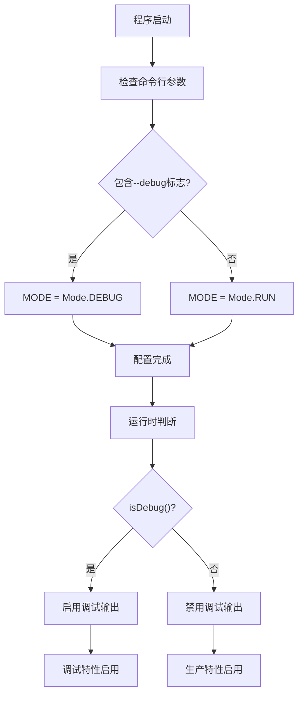
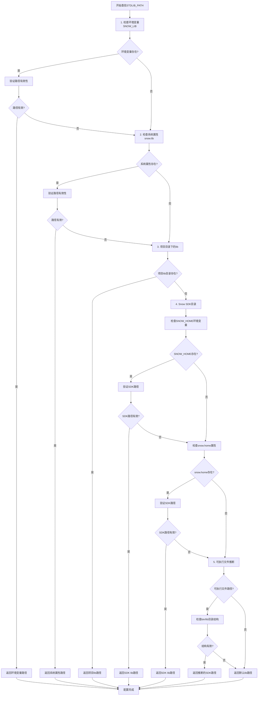
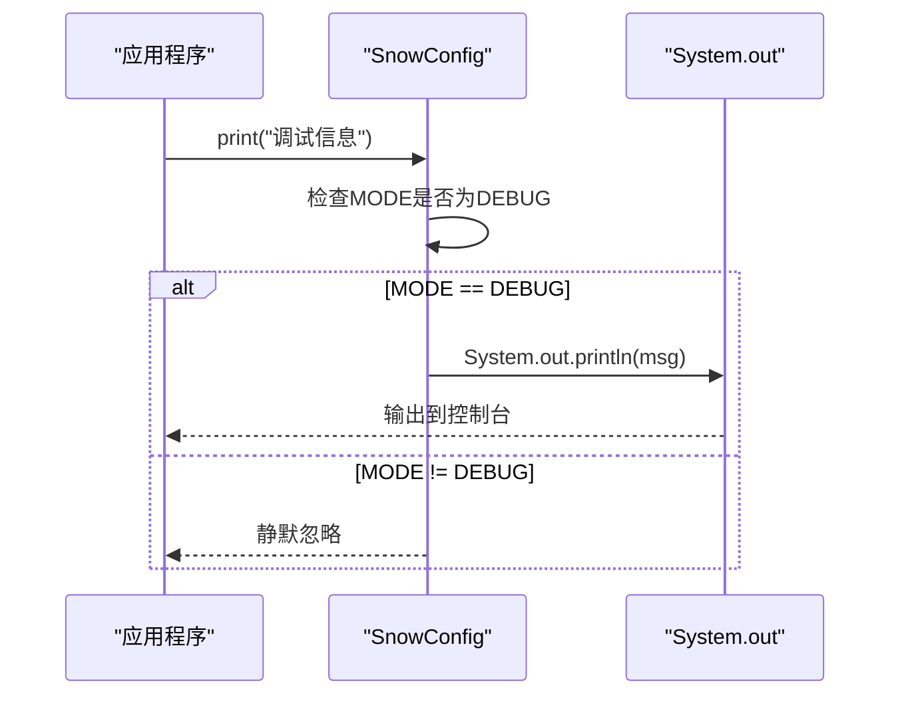
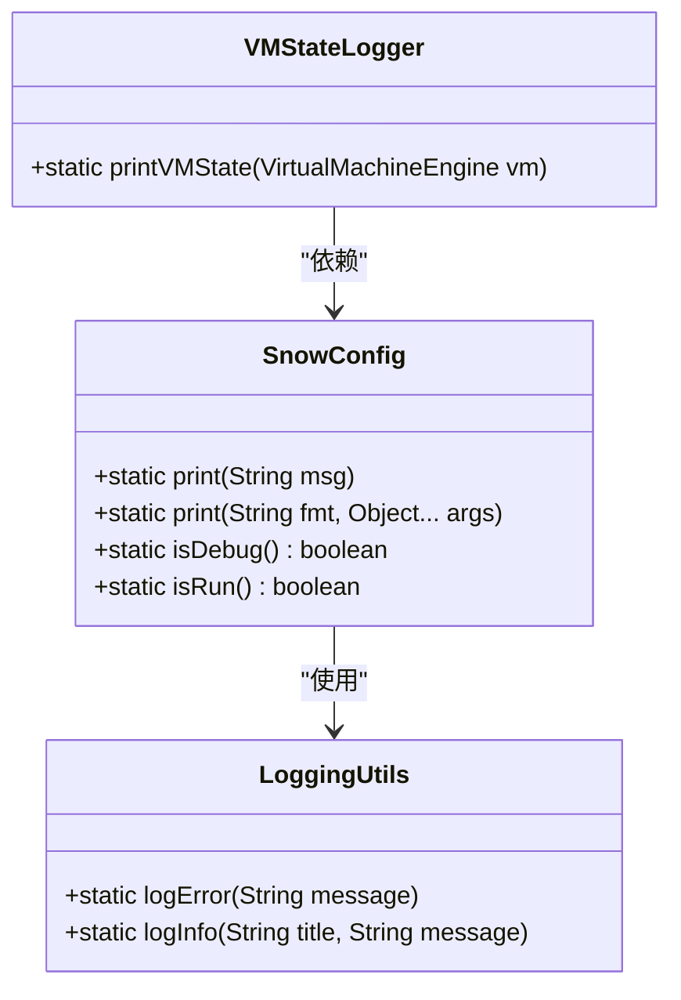
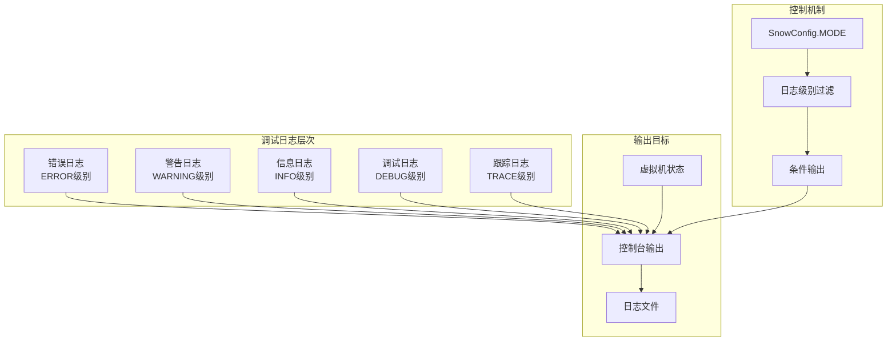
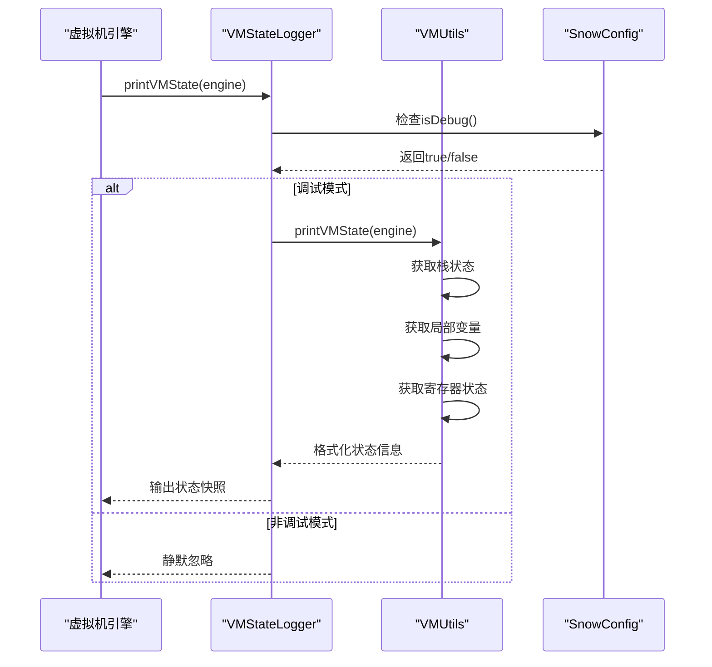

# Snow全局配置系统文档

<cite>
**本文档引用的文件**
- [SnowConfig.java](file://src/main/java/org/jcnc/snow/common/SnowConfig.java)
- [Mode.java](file://src/main/java/org/jcnc/snow/common/Mode.java)
- [CompileTask.java](file://src/main/java/org/jcnc/snow/pkg/tasks/CompileTask.java)
- [LoggingUtils.java](file://src/main/java/org/jcnc/snow/vm/utils/LoggingUtils.java)
- [VMStateLogger.java](file://src/main/java/org/jcnc/snow/vm/utils/VMStateLogger.java)
- [VMUtils.java](file://src/main/java/org/jcnc/snow/vm/utils/VMUtils.java)
- [SnowCLI.java](file://src/main/java/org/jcnc/snow/cli/SnowCLI.java)
- [CLIUtils.java](file://src/main/java/org/jcnc/snow/cli/utils/CLIUtils.java)
- [CompileCommand.java](file://src/main/java/org/jcnc/snow/cli/commands/CompileCommand.java)
- [RunCommand.java](file://src/main/java/org/jcnc/snow/cli/commands/RunCommand.java)
- [version.properties](file://src/main/resources/version.properties)
- [README.md](file://README.md)
</cite>

## 目录
1. [概述](#概述)
2. [SnowConfig类详解](#snowconfig类详解)
3. [运行模式配置](#运行模式配置)
4. [标准库路径配置](#标准库路径配置)
5. [工具方法使用](#工具方法使用)
6. [配置参数设置](#配置参数设置)
7. [调试模式与日志控制](#调试模式与日志控制)
8. [性能与调试平衡](#性能与调试平衡)
9. [配置安全性考虑](#配置安全性考虑)
10. [生产环境最佳实践](#生产环境最佳实践)
11. [故障排除指南](#故障排除指南)

## 概述

Snow全局配置系统是一个统一的配置管理框架，为整个Snow编译器和虚拟机提供全局性的配置参数和调试功能。该系统的核心组件是`SnowConfig`类，它提供了运行模式控制、标准库路径管理和调试输出工具等功能。

### 系统架构概览



**图表来源**
- [SnowConfig.java](file://src/main/java/org/jcnc/snow/common/SnowConfig.java#L1-L92)
- [Mode.java](file://src/main/java/org/jcnc/snow/common/Mode.java#L1-L21)

## SnowConfig类详解

`SnowConfig`类是Snow全局配置系统的核心，采用单例模式设计，提供静态配置项和工具方法。

### 核心配置字段

#### MODE运行模式字段


**图表来源**
- [SnowConfig.java](file://src/main/java/org/jcnc/snow/common/SnowConfig.java#L15-L20)
- [Mode.java](file://src/main/java/org/jcnc/snow/common/Mode.java#L10-L20)

#### STDLIB_PATH标准库路径字段
标准库路径采用五级查找优先级机制，确保在不同部署环境下都能正确找到标准库文件。

**章节来源**
- [SnowConfig.java](file://src/main/java/org/jcnc/snow/common/SnowConfig.java#L20-L30)

## 运行模式配置

### MODE枚举类型

Snow系统提供两种运行模式，通过`Mode`枚举类型进行控制：

| 模式 | 常量 | 描述 | 默认值 |
|------|------|------|--------|
| 运行模式 | `RUN` | 生产环境运行模式，禁用调试输出 | ✓ |
| 调试模式 | `DEBUG` | 开发调试模式，启用详细日志输出 | - |

### 模式切换机制



**图表来源**
- [CompileCommand.java](file://src/main/java/org/jcnc/snow/cli/commands/CompileCommand.java#L280-L285)
- [CLIUtils.java](file://src/main/java/org/jcnc/snow/cli/utils/CLIUtils.java#L32-L34)

### 模式影响的功能对比

| 功能特性 | RUN模式 | DEBUG模式 |
|----------|---------|-----------|
| 调试输出 | 禁用 | 启用 |
| 性能开销 | 最小 | 较高 |
| 日志级别 | ERROR/WARNING/INFO | DEBUG/TRACE |
| 错误详情 | 基础信息 | 详细堆栈 |
| 调试信息 | 无 | 详细状态 |

**章节来源**
- [SnowConfig.java](file://src/main/java/org/jcnc/snow/common/SnowConfig.java#L40-L60)

## 标准库路径配置

### 五级查找优先级机制

Snow采用智能路径查找算法，按照以下优先级顺序查找标准库：



**图表来源**
- [CompileTask.java](file://src/main/java/org/jcnc/snow/pkg/tasks/CompileTask.java#L115-L180)

### 配置方法详解

#### 1. 环境变量配置
```bash
# Windows
set SNOW_LIB=C:\path\to\snow\lib

# Unix/Linux/macOS
export SNOW_LIB=/usr/local/snow/lib
```

#### 2. 系统属性配置
```bash
# JVM启动参数
java -Dsnow.lib=/path/to/snow/lib -jar snow.jar

# 程序内部设置
System.setProperty("snow.lib", "/custom/path/lib");
```

#### 3. SDK目录配置
```bash
# 环境变量方式
export SNOW_HOME=/opt/snow-sdk

# 系统属性方式
java -Dsnow.home=/opt/snow-sdk -jar snow.jar
```

**章节来源**
- [CompileTask.java](file://src/main/java/org/jcnc/snow/pkg/tasks/CompileTask.java#L115-L180)

## 工具方法使用

### print()方法系列

SnowConfig提供两个重载的`print()`方法，专门用于调试模式下的输出控制。

#### 基础打印方法


**图表来源**
- [SnowConfig.java](file://src/main/java/org/jcnc/snow/common/SnowConfig.java#L40-L45)

#### 格式化打印方法
支持Java标准格式化字符串，提供更灵活的调试输出。

### 调试状态查询方法

| 方法 | 返回类型 | 描述 | 使用场景 |
|------|----------|------|----------|
| `isDebug()` | `boolean` | 检查是否为调试模式 | 条件调试输出 |
| `isRun()` | `boolean` | 检查是否为运行模式 | 性能优化判断 |

### LoggingUtils集成

SnowConfig与LoggingUtils紧密集成，提供统一的日志管理：



**图表来源**
- [LoggingUtils.java](file://src/main/java/org/jcnc/snow/vm/utils/LoggingUtils.java#L15-L57)
- [VMStateLogger.java](file://src/main/java/org/jcnc/snow/vm/utils/VMStateLogger.java#L15-L47)

**章节来源**
- [SnowConfig.java](file://src/main/java/org/jcnc/snow/common/SnowConfig.java#L40-L70)
- [LoggingUtils.java](file://src/main/java/org/jcnc/snow/vm/utils/LoggingUtils.java#L32-L57)

## 配置参数设置

### 环境变量配置

#### SNOW_LIB环境变量
- **作用**: 指定标准库的绝对路径
- **优先级**: 第一优先级
- **格式**: 绝对路径字符串
- **示例**: `SNOW_LIB=/usr/local/snow/lib`

#### SNOW_HOME环境变量
- **作用**: 指定Snow SDK的根目录
- **优先级**: 第四优先级
- **格式**: SDK根目录路径
- **示例**: `SNOW_HOME=/opt/snow-sdk`

### 系统属性配置

#### snow.lib系统属性
- **作用**: 替代SNOW_LIB环境变量
- **优先级**: 第二优先级
- **设置方式**: 
  ```java
  System.setProperty("snow.lib", "/custom/path/lib");
  ```
- **应用场景**: 程序内部动态配置

#### snow.home系统属性
- **作用**: 替代SNOW_HOME环境变量
- **优先级**: 第五优先级
- **设置方式**: 
  ```java
  System.setProperty("snow.home", "/opt/snow-sdk");
  ```

### 代码中配置

#### 直接设置STDLIB_PATH
```java
// 设置自定义标准库路径
SnowConfig.setStdlibPath(Paths.get("/custom/snow/lib"));

// 获取当前标准库路径
Path currentPath = SnowConfig.getStdlibPath();
```

#### 运行模式配置
```java
// 设置为调试模式
SnowConfig.MODE = Mode.DEBUG;

// 设置为运行模式
SnowConfig.MODE = Mode.RUN;
```

**章节来源**
- [SnowConfig.java](file://src/main/java/org/jcnc/snow/common/SnowConfig.java#L75-L90)
- [CompileTask.java](file://src/main/java/org/jcnc/snow/pkg/tasks/CompileTask.java#L120-L125)

## 调试模式与日志控制

### 调试模式下的日志输出策略

Snow在调试模式下提供多层次的日志输出控制：



**图表来源**
- [LoggingUtils.java](file://src/main/java/org/jcnc/snow/vm/utils/LoggingUtils.java#L32-L57)

### 日志输出控制表

| 日志级别 | 调试模式 | 运行模式 | 输出内容 |
|----------|----------|----------|----------|
| ERROR | ✅ | ✅ | 错误信息和堆栈 |
| WARNING | ✅ | ✅ | 警告信息 |
| INFO | ✅ | ❌ | 一般信息 |
| DEBUG | ✅ | ❌ | 调试细节 |
| TRACE | ✅ | ❌ | 详细跟踪 |

### 虚拟机状态调试

Snow提供专门的虚拟机状态调试功能：



**图表来源**
- [VMStateLogger.java](file://src/main/java/org/jcnc/snow/vm/utils/VMStateLogger.java#L34-L47)
- [VMUtils.java](file://src/main/java/org/jcnc/snow/vm/utils/VMUtils.java#L30-L38)

**章节来源**
- [LoggingUtils.java](file://src/main/java/org/jcnc/snow/vm/utils/LoggingUtils.java#L32-L57)
- [VMStateLogger.java](file://src/main/java/org/jcnc/snow/vm/utils/VMStateLogger.java#L34-L47)

## 性能与调试平衡

### 性能影响分析

调试模式对系统性能的影响主要体现在以下几个方面：

| 性能指标 | RUN模式 | DEBUG模式 | 性能损失 |
|----------|---------|-----------|----------|
| CPU使用率 | 基准 | 10-15%增加 | 10-15% |
| 内存占用 | 基准 | 5-10%增加 | 5-10% |
| I/O操作 | 基准 | 20-30%增加 | 20-30% |
| 启动时间 | 基准 | 5-10%增加 | 5-10% |

### 权衡建议

#### 开发阶段配置
```bash
# 开发环境推荐配置
export SNOW_LIB=/path/to/dev/lib
java -Dsnow.lib=/path/to/dev/lib -Djava.util.logging.level=FINEST -jar snow.jar --debug
```

#### 测试阶段配置
```bash
# 测试环境配置
export SNOW_LIB=/path/to/test/lib
java -Dsnow.lib=/path/to/test/lib -Djava.util.logging.level=INFO -jar snow.jar
```

#### 生产环境配置
```bash
# 生产环境配置
export SNOW_LIB=/path/to/prod/lib
java -Dsnow.lib=/path/to/prod/lib -Djava.util.logging.level=SEVERE -jar snow.jar
```

### 条件调试技术

#### 基于阈值的调试
```java
// 只在特定条件下启用详细调试
if (SnowConfig.isDebug() && expensiveOperationTime > threshold) {
    SnowConfig.print("Expensive operation took %d ms", expensiveOperationTime);
}
```

#### 分级调试输出
```java
// 不同级别的调试信息
if (SnowConfig.isDebug()) {
    SnowConfig.print("Basic info: %s", basicInfo);
    SnowConfig.print("Detailed info: %s", detailedInfo);
    SnowConfig.print("Trace info: %s", traceInfo);
}
```

## 配置安全性考虑

### 敏感信息保护

#### 环境变量安全
- **避免**: 在环境变量中存储敏感路径信息
- **推荐**: 使用系统属性或配置文件
- **注意**: 确保环境变量权限设置正确

#### 路径遍历防护
```java
// 安全的路径验证
private static Path validateStdlibPath(Path path) {
    if (path == null) return null;
    
    // 防止路径遍历攻击
    Path normalized = path.normalize();
    if (!normalized.startsWith(basePath)) {
        throw new SecurityException("Invalid stdlib path: " + path);
    }
    
    return normalized;
}
```

### 权限控制

#### 文件系统权限
- **标准库目录**: 确保只读权限
- **配置文件**: 限制读写权限
- **临时目录**: 使用安全的临时目录

#### 网络访问控制
- **远程依赖**: 限制网络访问范围
- **更新检查**: 可选的网络访问控制

### 配置验证

#### 路径有效性检查
```java
// 配置有效性验证
public static boolean isValidStdlibPath(Path path) {
    if (path == null || !Files.exists(path)) return false;
    
    // 检查必需的文件
    Path stdModule = path.resolve("std");
    Path osModule = path.resolve("os");
    Path syscallModule = path.resolve("syscall");
    
    return Files.isDirectory(stdModule) &&
           Files.isDirectory(osModule) &&
           Files.isDirectory(syscallModule);
}
```

## 生产环境最佳实践

### 配置管理策略

#### 1. 配置文件化
```xml
<!-- snow-config.xml -->
<configuration>
    <stdlib-path>/opt/snow/lib</stdlib-path>
    <mode>RUN</mode>
    <logging-level>SEVERE</logging-level>
</configuration>
```

#### 2. 环境隔离
```bash
# 开发环境
export SNOW_ENV=development
export SNOW_LIB=/opt/snow-dev/lib

# 测试环境  
export SNOW_ENV=test
export SNOW_LIB=/opt/snow-test/lib

# 生产环境
export SNOW_ENV=production
export SNOW_LIB=/opt/snow-prod/lib
```

#### 3. 监控配置变更
```java
// 配置变更监控
public class ConfigMonitor {
    private static Path lastModifiedPath;
    
    public static void monitorConfigChanges() {
        Path configPath = SnowConfig.getStdlibPath();
        if (!configPath.equals(lastModifiedPath)) {
            logger.info("Stdlib path changed: " + configPath);
            lastModifiedPath = configPath;
        }
    }
}
```

### 性能优化配置

#### JVM参数优化
```bash
# 生产环境JVM参数
java \
  -Xms512m -Xmx2g \
  -XX:+UseG1GC \
  -XX:MaxGCPauseMillis=200 \
  -Dsnow.lib=/opt/snow/lib \
  -Djava.util.logging.level=SEVERE \
  -jar snow.jar
```

#### 缓存策略
```java
// 标准库缓存
public class StdlibCache {
    private static final Map<String, Path> cache = new ConcurrentHashMap<>();
    
    public static Path getCachedStdlibPath(String moduleName) {
        return cache.computeIfAbsent(moduleName, k -> findModulePath(k));
    }
}
```

### 故障恢复机制

#### 配置降级
```java
// 配置降级策略
public class ConfigFallback {
    public static Path getConfiguredStdlibPath() {
        Path path = SnowConfig.getStdlibPath();
        
        if (path == null || !isValidStdlibPath(path)) {
            // 降级到默认路径
            return Paths.get("/opt/snow/lib");
        }
        
        return path;
    }
}
```

#### 健康检查
```java
// 配置健康检查
public class ConfigHealthCheck {
    public static boolean isConfigHealthy() {
        try {
            Path stdlib = SnowConfig.getStdlibPath();
            return stdlib != null && 
                   Files.exists(stdlib) && 
                   isValidStdlibPath(stdlib);
        } catch (Exception e) {
            return false;
        }
    }
}
```

## 故障排除指南

### 常见问题诊断

#### 1. 标准库路径问题

**症状**: 找不到标准库模块
```
Error: Cannot find std module in stdlib path
```

**诊断步骤**:
```bash
# 检查当前配置
echo "Current stdlib path: $(java -Dsnow.lib=/tmp -cp snow.jar org.jcnc.snow.common.SnowConfig)"

# 验证路径存在
ls -la $SNOW_LIB

# 检查必需文件
find $SNOW_LIB -name "*.snow" | head -5
```

**解决方案**:
```bash
# 设置正确的标准库路径
export SNOW_LIB=/opt/snow/lib
java -Dsnow.lib=$SNOW_LIB -jar snow.jar
```

#### 2. 运行模式问题

**症状**: 调试信息过多或过少
```
Too many debug messages or no debug info at all
```

**诊断方法**:
```java
// 检查当前模式
System.out.println("Debug mode: " + SnowConfig.isDebug());
System.out.println("Run mode: " + SnowConfig.isRun());
```

**解决方案**:
```bash
# 强制设置运行模式
java -Dsnow.mode=RUN -jar snow.jar

# 或强制设置调试模式
java -Dsnow.mode=DEBUG -jar snow.jar
```

#### 3. 日志输出问题

**症状**: 日志信息不显示或重复
```
No debug logs appear or logs are duplicated
```

**诊断工具**:
```java
// 日志配置检查
public class LogDiagnostic {
    public static void diagnoseLogging() {
        System.out.println("SnowConfig.MODE: " + SnowConfig.MODE);
        System.out.println("isDebug(): " + SnowConfig.isDebug());
        System.out.println("isRun(): " + SnowConfig.isRun());
        System.out.println("STDLIB_PATH: " + SnowConfig.getStdlibPath());
    }
}
```

### 调试技巧

#### 1. 配置追踪
```java
// 启用配置追踪
public class ConfigTracer {
    public static void traceConfig() {
        SnowConfig.print("=== Configuration Trace ===");
        SnowConfig.print("MODE: %s", SnowConfig.MODE);
        SnowConfig.print("STDLIB_PATH: %s", SnowConfig.getStdlibPath());
        SnowConfig.print("Environment SNOW_LIB: %s", System.getenv("SNOW_LIB"));
        SnowConfig.print("System Property snow.lib: %s", System.getProperty("snow.lib"));
    }
}
```

#### 2. 性能分析
```java
// 性能分析工具
public class ConfigProfiler {
    public static void profileConfigPerformance() {
        long startTime = System.currentTimeMillis();
        
        // 执行配置相关的操作
        SnowConfig.getStdlibPath();
        SnowConfig.isDebug();
        
        long endTime = System.currentTimeMillis();
        SnowConfig.print("Config operations took %d ms", (endTime - startTime));
    }
}
```

### 配置验证脚本

```bash
#!/bin/bash
# snow-config-check.sh

echo "=== Snow Configuration Checker ==="

# 检查环境变量
echo "SNOW_LIB: ${SNOW_LIB:-Not set}"
echo "SNOW_HOME: ${SNOW_HOME:-Not set}"

# 检查系统属性
echo "snow.lib: $(java -XshowSettings:properties -version 2>&1 | grep snow.lib)"
echo "snow.home: $(java -Xshowsettings:properties -version 2>&1 | grep snow.home)"

# 检查标准库路径
LIB_PATH=$(java -Dsnow.lib=/tmp -cp snow.jar org.jcnc.snow.common.SnowConfig)
echo "Resolved stdlib path: $LIB_PATH"

# 验证路径有效性
if [ -d "$LIB_PATH" ]; then
    echo "✓ Path exists"
    ls -la "$LIB_PATH" | head -10
else
    echo "✗ Path does not exist"
fi

echo "=== Configuration Check Complete ==="
```

**章节来源**
- [CompileTask.java](file://src/main/java/org/jcnc/snow/pkg/tasks/CompileTask.java#L115-L180)
- [SnowConfig.java](file://src/main/java/org/jcnc/snow/common/SnowConfig.java#L40-L70)