# 前端模块版本同步

<cite>
**本文档中引用的文件**
- [pom.xml](file://pom.xml)
- [src/main/resources/version.properties](file://src/main/resources/version.properties)
- [src/main/java/org/jcnc/snow/cli/utils/VersionUtils.java](file://src/main/java/org/jcnc/snow/cli/utils/VersionUtils.java)
- [src/main/java/org/jcnc/snow/cli/commands/VersionCommand.java](file://src/main/java/org/jcnc/snow/cli/commands/VersionCommand.java)
- [src/main/java/org/jcnc/snow/cli/SnowCLI.java](file://src/main/java/org/jcnc/snow/cli/SnowCLI.java)
- [frontend-lexer/pom.xml](file://frontend-lexer/pom.xml)
- [frontend-parser/pom.xml](file://frontend-parser/pom.xml)
- [src/main/java/org/jcnc/snow/pkg/model/Dependency.java](file://src/main/java/org/jcnc/snow/pkg/model/Dependency.java)
- [src/main/java/org/jcnc/snow/pkg/resolver/DependencyResolver.java](file://src/main/java/org/jcnc/snow/pkg/resolver/DependencyResolver.java)
- [src/main/java/org/jcnc\snow\pkg\dsl\CloudDSLParser.java](file://src/main/java/org/jcnc\snow/pkg\dsl\CloudDSLParser.java)
</cite>

## 目录
1. [项目概述](#项目概述)
2. [版本管理系统](#版本管理系统)
3. [前端模块分离架构](#前端模块分离架构)
4. [依赖版本同步机制](#依赖版本同步机制)
5. [构建系统与版本管理](#构建系统与版本管理)
6. [版本一致性保证](#版本一致性保证)
7. [最佳实践与建议](#最佳实践与建议)
8. [故障排除指南](#故障排除指南)

## 项目概述

Snow编程语言是一个面向AI时代的新型编程语言，采用模块化架构设计，支持前后端分离的编译器组件。项目通过Maven构建系统管理多个子模块，包括前端词法分析器（frontend-lexer）、前端语法分析器（frontend-parser）以及核心编译器模块。

### 核心特性
- **模块化设计**：前端词法分析器和语法分析器独立构建
- **版本统一管理**：所有模块共享相同的版本号
- **依赖解析**：自动化的依赖版本同步机制
- **构建自动化**：基于Maven的完整构建流程

## 版本管理系统

### 版本号定义与管理

Snow项目采用统一的版本号管理模式，所有模块共享相同的版本信息：


**图表来源**
- [pom.xml](file://pom.xml#L10)
- [src/main/resources/version.properties](file://src/main/resources/version.properties#L1)
- [src/main/java/org/jcnc/snow/cli/SnowCLI.java](file://src/main/java/org/jcnc/snow/cli/SnowCLI.java#L24)

### 版本加载机制

版本信息通过多层次的加载机制确保一致性：

#### 1. 主版本定义
项目主版本在根目录的`pom.xml`中定义，使用Maven的资源过滤功能自动替换版本占位符。

#### 2. 资源文件加载
版本信息存储在`src/main/resources/version.properties`中，通过`version.properties`占位符实现动态替换。

#### 3. 运行时版本获取
`VersionUtils.loadVersion()`方法负责从classpath中加载版本信息，确保运行时获取正确的版本号。

**章节来源**
- [pom.xml](file://pom.xml#L10-L12)
- [src/main/resources/version.properties](file://src/main/resources/version.properties#L1)
- [src/main/java/org/jcnc/snow/cli/utils/VersionUtils.java](file://src/main/java/org/jcnc/snow/cli/utils/VersionUtils.java#L32-L40)

## 前端模块分离架构

### 模块结构设计

Snow项目采用前后端分离的编译器架构，将词法分析和语法分析功能分离到独立的模块中：


**图表来源**
- [frontend-lexer/pom.xml](file://frontend-lexer/pom.xml#L7)
- [frontend-parser/pom.xml](file://frontend-parser/pom.xml#L7)

### 前端模块版本管理

#### 词法分析器模块
- **Artifact ID**: `snow-frontend-lexer`
- **版本**: `0.13.0`（与主项目版本同步）
- **Java版本**: `21`
- **用途**: 独立的词法分析功能，支持IDE集成

#### 语法分析器模块
- **Artifact ID**: `snow-frontend-parser`
- **版本**: `0.13.0`
- **依赖**: 依赖`snow-frontend-lexer`模块
- **Java版本**: `21`

**章节来源**
- [frontend-lexer/pom.xml](file://frontend-lexer/pom.xml#L7)
- [frontend-parser/pom.xml](file://frontend-parser/pom.xml#L7)

## 依赖版本同步机制

### 依赖解析与版本管理

Snow项目通过`DependencyResolver`实现自动化的依赖版本同步：


**图表来源**
- [src/main/java/org/jcnc/snow/pkg/resolver/DependencyResolver.java](file://src/main/java/org/jcnc/snow/pkg/resolver/DependencyResolver.java#L48-L65)

### 依赖坐标管理

项目使用标准的`group:artifact:version`坐标格式管理依赖：

#### 依赖定义格式
- **ID**: 依赖的唯一标识
- **Group**: 组织/分组名（如`org.jcnc.snow`）
- **Artifact**: 构件名（如`snow-frontend-lexer`）
- **Version**: 版本号（支持占位符替换）

#### 版本占位符支持
项目支持在依赖定义中使用占位符进行动态版本替换，例如：
```java
Dependency.fromString("core", "com.example:core:@{version}", props);
```

**章节来源**
- [src/main/java/org/jcnc\snow/pkg\model/Dependency.java](file://src/main/java/org/jcnc/snow/pkg/model/Dependency.java#L50-L61)
- [src/main/java/org/jcnc/snow/pkg/resolver/DependencyResolver.java](file://src/main/java/org/jcnc/snow/pkg/resolver/DependencyResolver.java#L48-L65)

## 构建系统与版本管理

### Maven多模块构建

Snow项目采用Maven多模块构建系统，确保各个模块的版本一致性：

```mermaid
graph TD
subgraph "Maven构建流程"
A[根pom.xml<br/>版本定义] --> B[frontend-lexer<br/>独立构建]
A --> C[frontend-parser<br/>独立构建]
A --> D[核心模块<br/>compiler/vm/pkg]
B --> E[生成JAR包]
C --> F[生成JAR包]
D --> G[生成JAR包]
E --> H[版本验证]
F --> H
G --> H
H --> I[部署发布]
end
```



**图表来源**
- [pom.xml](file://pom.xml#L10)
- [frontend-lexer/pom.xml](file://frontend-lexer/pom.xml#L7)
- [frontend-parser/pom.xml](file://frontend-parser/pom.xml#L7)

### 构建配置特点

#### 1. 版本继承机制
所有子模块自动继承根pom.xml中的版本定义，确保版本一致性。

#### 2. 资源过滤
Maven资源过滤功能自动将主版本号替换到所有资源文件中。

#### 3. 多平台支持
项目支持Windows、Linux和macOS平台的原生镜像构建，每个平台都有特定的构建配置。

**章节来源**
- [pom.xml](file://pom.xml#L10-L12)
- [frontend-lexer/pom.xml](file://frontend-lexer/pom.xml#L11-L13)
- [frontend-parser/pom.xml](file://frontend-parser/pom.xml#L11-L13)

## 版本一致性保证

### 自动化版本同步

Snow项目通过多种机制确保版本一致性：

#### 1. 构建时版本验证
每次构建都会验证所有模块的版本号是否一致，防止版本不匹配问题。

#### 2. 依赖版本锁定
通过Maven的依赖管理功能锁定依赖版本，确保构建环境的一致性。

#### 3. CI/CD集成
持续集成系统自动验证版本同步，确保发布的版本正确无误。

### 版本信息输出

项目提供了多种方式输出版本信息：

#### 命令行版本查询
```bash
snow version
```
输出格式：`snow version "0.13.0"`

#### 内置版本常量
`SnowCLI.SNOW_VERSION`提供运行时版本信息，用于程序内部版本检查。

**章节来源**
- [src/main/java/org/jcnc/snow/cli/commands/VersionCommand.java](file://src/main/java/org/jcnc/snow/cli/commands/VersionCommand.java#L56)
- [src/main/java/org/jcnc/snow/cli/SnowCLI.java](file://src/main/java/org/jcnc/snow/cli/SnowCLI.java#L24)

## 最佳实践与建议

### 版本管理最佳实践

#### 1. 版本号命名规范
- 使用语义化版本号（SemVer）格式：`主版本.次版本.修订版本`
- 遵循`MAJOR.MINOR.PATCH`模式
- 重大变更时增加主版本号

#### 2. 模块版本同步策略
- 所有模块使用相同的版本号
- 通过根pom.xml统一管理版本
- 避免手动修改子模块版本号

#### 3. 依赖版本管理
- 使用固定版本号而非范围
- 定期更新依赖版本
- 测试新版本的兼容性

### 开发工作流程

#### 1. 开发阶段
- 修改根pom.xml中的版本号
- 执行完整构建验证
- 运行单元测试和集成测试

#### 2. 发布准备
- 更新CHANGELOG文件
- 执行版本标记
- 进行最终验证测试

#### 3. 发布部署
- 自动化构建和测试
- 上传到中央仓库
- 更新文档和示例

## 故障排除指南

### 常见版本同步问题

#### 1. 版本不一致问题
**症状**: 不同模块显示不同的版本号
**解决方案**: 
- 检查根pom.xml中的版本定义
- 清理并重新构建项目
- 验证所有模块的pom.xml配置

#### 2. 依赖版本冲突
**症状**: 构建过程中出现依赖冲突错误
**解决方案**:
- 使用`mvn dependency:tree`查看依赖树
- 检查依赖版本范围设置
- 强制指定冲突的依赖版本

#### 3. 资源文件版本未替换
**症状**: 运行时显示`${project.version}`而非实际版本号
**解决方案**:
- 确认Maven资源过滤已启用
- 检查`version.properties`文件内容
- 重新编译项目

### 调试技巧

#### 1. 版本信息调试
```bash
# 查看当前版本
snow version

# 检查依赖版本
mvn dependency:resolve

# 查看依赖树
mvn dependency:tree
```

#### 2. 构建问题排查
```bash
# 清理并重新构建
mvn clean install

# 跳过测试构建
mvn clean install -DskipTests

# 详细输出构建信息
mvn clean install -X
```

**章节来源**
- [src/main/java/org/jcnc/snow/cli/utils/VersionUtils.java](file://src/main/java/org/jcnc/snow/cli/utils/VersionUtils.java#L32-L40)
- [src/main/java/org/jcnc/snow/pkg/resolver/DependencyResolver.java](file://src/main/java/org/jcnc/snow/pkg/resolver/DependencyResolver.java#L48-L65)

## 总结

Snow项目的前端模块版本同步机制通过多层次的设计确保了系统的稳定性和一致性。从Maven多模块构建到自动化依赖管理，从版本号统一管理到构建时验证，每个环节都经过精心设计以保证版本同步的可靠性。

通过遵循本文档中的最佳实践和建议，开发团队可以有效地管理Snow项目的版本，确保各个前端模块和后端组件之间的协调一致，为用户提供稳定可靠的编程语言工具。