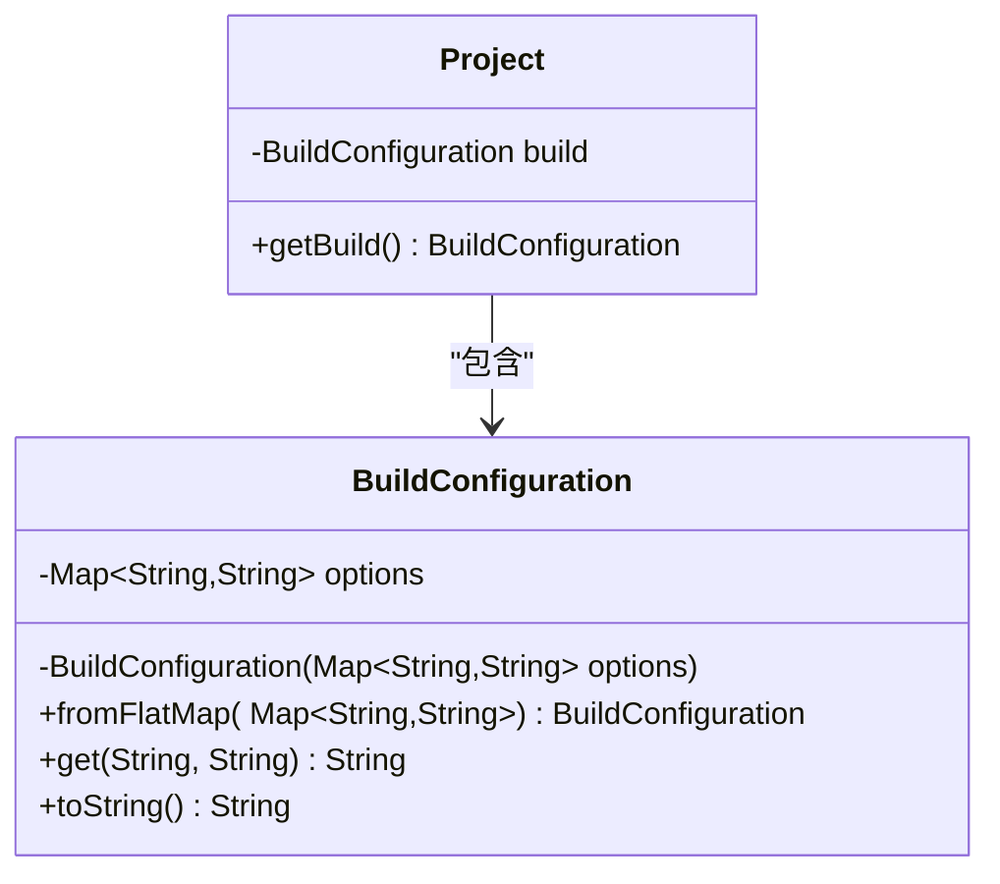
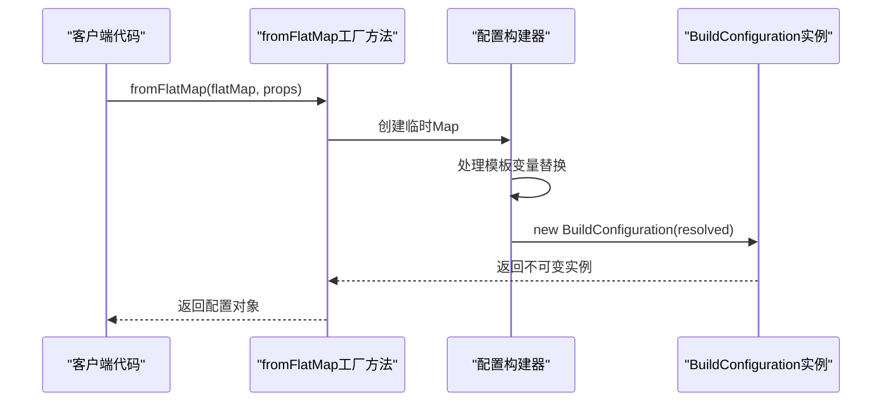
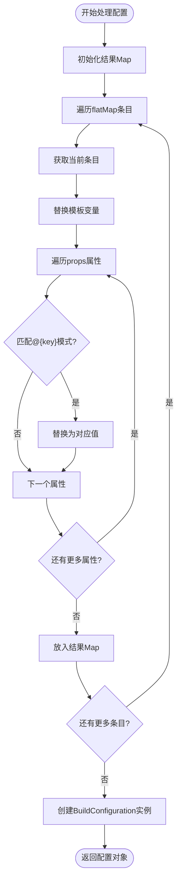
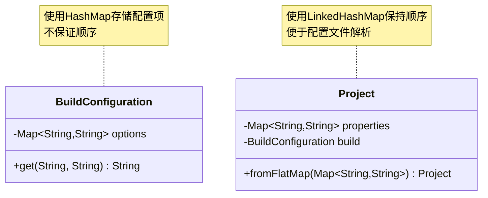
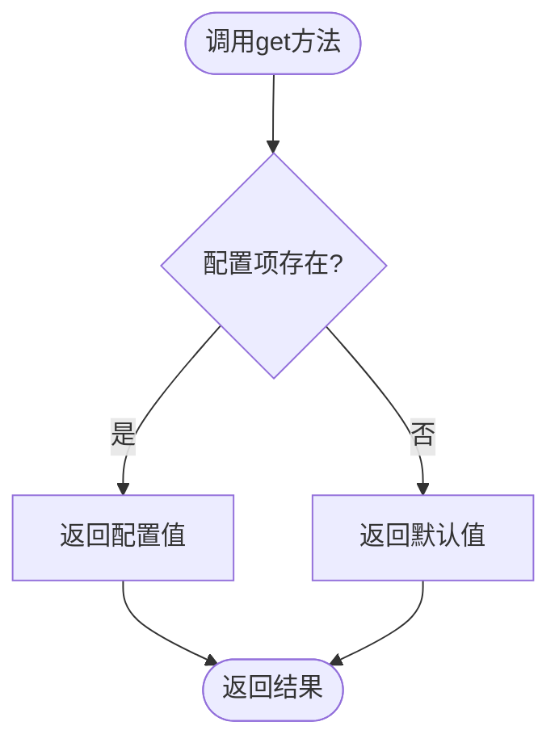
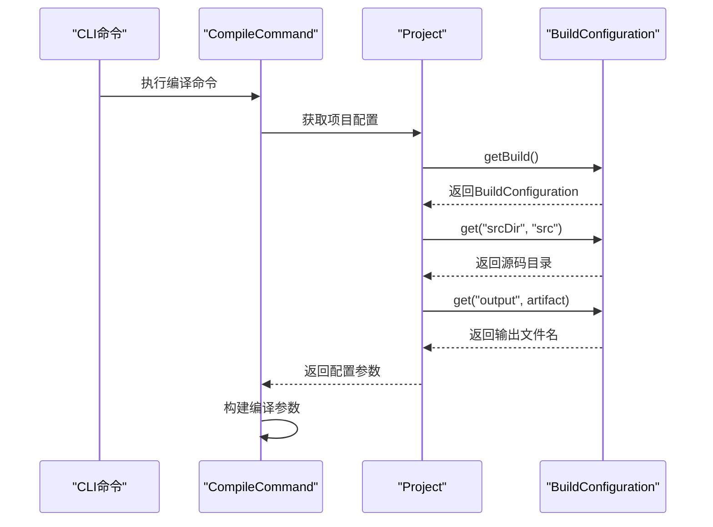
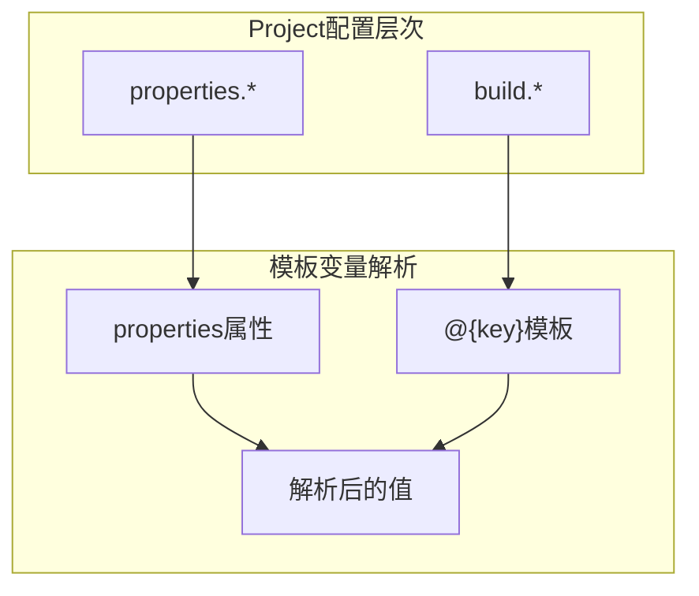
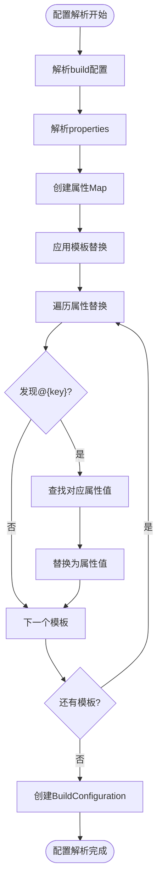
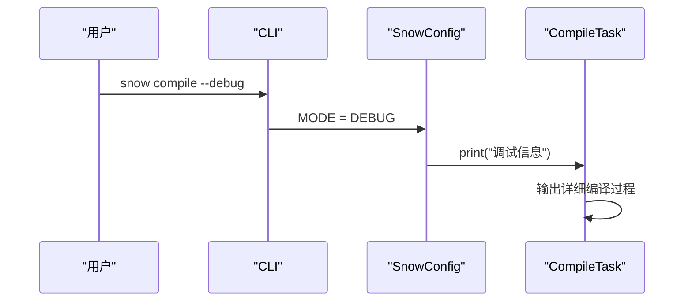

# 构建配置系统

<cite>
**本文档引用的文件**
- [BuildConfiguration.java](file://src/main/java/org/jcnc/snow/pkg/model/BuildConfiguration.java)
- [Project.java](file://src/main/java/org/jcnc/snow/pkg/model/Project.java)
- [CompileCommand.java](file://src/main/java/org/jcnc/snow/cli/commands/CompileCommand.java)
- [CompileTask.java](file://src/main/java/org/jcnc/snow/pkg/tasks/CompileTask.java)
- [project.cloud](file://playground/PerformanceTest/project.cloud)
</cite>

## 目录
1. [概述](#概述)
2. [BuildConfiguration类设计原理](#buildconfiguration类设计原理)
3. [模板变量替换机制](#模板变量替换机制)
4. [配置项存储结构](#配置项存储结构)
5. [默认值回退策略](#默认值回退策略)
6. [实际应用示例](#实际应用示例)
7. [高级用法](#高级用法)
8. [常用配置项详解](#常用配置项详解)
9. [外部属性覆盖机制](#外部属性覆盖机制)
10. [配置调试技巧](#配置调试技巧)
11. [常见问题排查](#常见问题排查)
12. [总结](#总结)

## 概述

BuildConfiguration是Snow项目构建系统的核心组件，负责封装和管理构建过程中的所有配置选项。它采用不可变设计模式，确保配置的一致性和线程安全性，同时提供了强大的模板变量替换功能，支持复杂的配置继承和作用域管理。

## BuildConfiguration类设计原理

### 不可变性设计

BuildConfiguration采用完全不可变的设计原则，通过final修饰符确保对象一旦创建就不能被修改：



**图表来源**
- [BuildConfiguration.java](file://src/main/java/org/jcnc/snow/pkg/model/BuildConfiguration.java#L15-L25)
- [Project.java](file://src/main/java/org/jcnc/snow/pkg/model/Project.java#L51-L55)

这种设计带来了以下优势：
- **线程安全**：多线程环境下无需额外同步
- **可预测性**：配置值不会意外改变
- **易于测试**：不可变对象更容易进行单元测试

**章节来源**
- [BuildConfiguration.java](file://src/main/java/org/jcnc/snow/pkg/model/BuildConfiguration.java#L15-L25)

### 私有构造函数约束

BuildConfiguration的构造函数被声明为private，强制通过静态工厂方法创建实例：



**图表来源**
- [BuildConfiguration.java](file://src/main/java/org/jcnc/snow/pkg/model/BuildConfiguration.java#L25-L30)

**章节来源**
- [BuildConfiguration.java](file://src/main/java/org/jcnc/snow/pkg/model/BuildConfiguration.java#L25-L30)

## 模板变量替换机制

### fromFlatMap工厂方法实现

BuildConfiguration的fromFlatMap方法是模板变量替换的核心实现，它遍历原始配置项并逐个替换模板变量：



**图表来源**
- [BuildConfiguration.java](file://src/main/java/org/jcnc/snow/pkg/model/BuildConfiguration.java#L32-L47)

### 模板变量语法

模板变量使用`@{key}`语法，其中：
- `@{` 和 `}` 是固定的分隔符
- `key` 是属性名称，在props中查找对应的值
- 未匹配到的模板变量会被保留原样

**章节来源**
- [BuildConfiguration.java](file://src/main/java/org/jcnc/snow/pkg/model/BuildConfiguration.java#L32-L47)

## 配置项存储结构

### LinkedHashMap的使用

BuildConfiguration内部使用HashMap存储配置项，但通过Project类的fromFlatMap方法可以看到，通常使用LinkedHashMap来保持配置项的插入顺序：



**图表来源**
- [BuildConfiguration.java](file://src/main/java/org/jcnc/snow/pkg/model/BuildConfiguration.java#L15-L17)
- [Project.java](file://src/main/java/org/jcnc/snow/pkg/model/Project.java#L105-L115)

### 顺序保持特性

虽然BuildConfiguration本身使用HashMap，但在实际使用中：
- Project类使用LinkedHashMap保持配置项顺序
- 模板变量替换按属性顺序进行
- 配置解析遵循定义顺序

**章节来源**
- [Project.java](file://src/main/java/org/jcnc/snow/pkg/model/Project.java#L105-L115)

## 默认值回退策略

### get方法的实现

BuildConfiguration的get方法提供了优雅的默认值回退机制：



**图表来源**
- [BuildConfiguration.java](file://src/main/java/org/jcnc/snow/pkg/model/BuildConfiguration.java#L50-L52)

### getOrDefault方法的应用

get方法内部使用Java 8的getOrDefault方法，提供简洁的默认值处理：

```java
// 内部实现逻辑
public String get(String key, String def) {
    return options.getOrDefault(key, def);
}
```

这种设计的优势：
- **简洁性**：单行代码完成复杂逻辑
- **性能**：避免不必要的条件判断
- **语义清晰**：明确表达"获取值或返回默认值"的意图

**章节来源**
- [BuildConfiguration.java](file://src/main/java/org/jcnc/snow/pkg/model/BuildConfiguration.java#L50-L52)

## 实际应用示例

### 编译命令中的配置使用

在CompileCommand中，BuildConfiguration被用来获取编译配置：



**图表来源**
- [CompileCommand.java](file://src/main/java/org/jcnc/snow/cli/commands/CompileCommand.java#L60-L80)

### Cloud模式下的配置解析

在Cloud模式下，BuildConfiguration从project.cloud文件解析而来：

**章节来源**
- [CompileCommand.java](file://src/main/java/org/jcnc/snow/cli/commands/CompileCommand.java#L60-L80)

## 高级用法

### 配置继承机制

BuildConfiguration支持通过Project的properties字段实现配置继承：



**图表来源**
- [Project.java](file://src/main/java/org/jcnc/snow/pkg/model/Project.java#L105-L115)

### 作用域管理

配置的作用域通过Project的分层结构管理：
- `project.*`：项目元数据
- `properties.*`：额外属性
- `repositories.*`：仓库配置
- `dependencies.*`：依赖配置
- `build.*`：构建配置

**章节来源**
- [Project.java](file://src/main/java/org/jcnc/snow/pkg/model/Project.java#L95-L105)

## 常用配置项详解

### build.srcDir - 源码目录

**用途**：指定源代码所在的目录
**默认值**：`src`
**示例**：
```yaml
build {
    srcDir = "src"
}
```

### build.output - 输出文件名

**用途**：指定编译输出的文件名
**默认值**：项目artifact名称
**示例**：
```yaml
build {
    output = "my-app"
}
```

### build.* - 其他常用配置

| 配置项 | 类型 | 默认值 | 说明 |
|--------|------|--------|------|
| `srcDir` | String | `"src"` | 源码目录 |
| `output` | String | `artifact` | 输出文件名 |
| `optimize` | Boolean | `false` | 是否启用优化 |
| `debug` | Boolean | `false` | 是否启用调试信息 |
| `target` | String | `"native"` | 目标平台 |

**章节来源**
- [project.cloud](file://playground/PerformanceTest/project.cloud#L9-L10)

## 外部属性覆盖机制

### 属性替换流程

BuildConfiguration支持通过外部属性覆盖配置值：



**图表来源**
- [BuildConfiguration.java](file://src/main/java/org/jcnc/snow/pkg/model/BuildConfiguration.java#L32-L47)

### 覆盖优先级

外部属性的覆盖遵循以下优先级：
1. **命令行参数**：最高优先级
2. **环境变量**：次之
3. **配置文件**：再次之
4. **默认值**：最低优先级

**章节来源**
- [Project.java](file://src/main/java/org/jcnc/snow/pkg/model/Project.java#L105-L115)

## 配置调试技巧

### 启用调试模式

在CompileTask中可以通过`--debug`标志启用调试模式：



**图表来源**
- [CompileTask.java](file://src/main/java/org/jcnc/snow/pkg/tasks/CompileTask.java#L280-L290)

### 配置验证技巧

1. **检查配置项存在性**：使用get方法的默认值功能
2. **验证模板替换**：确认`@{key}`被正确替换
3. **顺序检查**：验证配置项的解析顺序

**章节来源**
- [CompileTask.java](file://src/main/java/org/jcnc/snow/pkg/tasks/CompileTask.java#L280-L290)

## 常见问题排查

### 模板变量未替换

**问题症状**：`@{key}`出现在最终配置中而不是实际值

**排查步骤**：
1. 检查属性Map中是否存在对应的key
2. 确认模板语法正确（`@{key}`格式）
3. 验证属性值不为空

**解决方案**：
```java
// 错误示例
Map<String, String> props = Map.of();
String value = "@{missingKey}"; // 结果仍是"@{missingKey}"

// 正确示例
Map<String, String> props = Map.of("missingKey", "defaultValue");
String value = "@{missingKey}".replace("@{missingKey}", props.get("missingKey")); // 结果为"defaultValue"
```

### 配置项缺失

**问题症状**：get方法返回null或默认值

**排查步骤**：
1. 使用get方法的默认值功能
2. 检查配置项名称拼写
3. 验证配置文件格式

**解决方案**：
```java
// 推荐做法
String srcDir = buildConfig.get("srcDir", "src"); // 提供合理默认值
```

### 顺序问题

**问题症状**：配置项解析顺序不符合预期

**排查步骤**：
1. 检查Project是否使用LinkedHashMap
2. 验证配置文件中的定义顺序
3. 确认模板替换的属性顺序

**章节来源**
- [Project.java](file://src/main/java/org/jcnc/snow/pkg/model/Project.java#L105-L115)

## 总结

BuildConfiguration作为Snow构建系统的核心配置管理组件，通过以下关键特性实现了灵活而强大的配置管理：

1. **不可变设计**：确保配置的一致性和线程安全
2. **模板变量替换**：支持复杂的配置继承和动态配置
3. **默认值回退**：提供优雅的配置容错机制
4. **顺序保持**：通过LinkedHashMap保持配置项的解析顺序
5. **工厂模式**：通过静态工厂方法控制对象创建

这些特性共同构成了一个健壮、灵活且易于使用的构建配置系统，为Snow项目的构建过程提供了强有力的支持。开发者可以利用这些配置特性来定制构建行为，实现复杂的构建需求，同时保持代码的简洁性和可维护性。