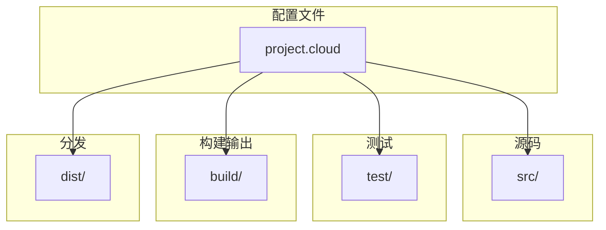
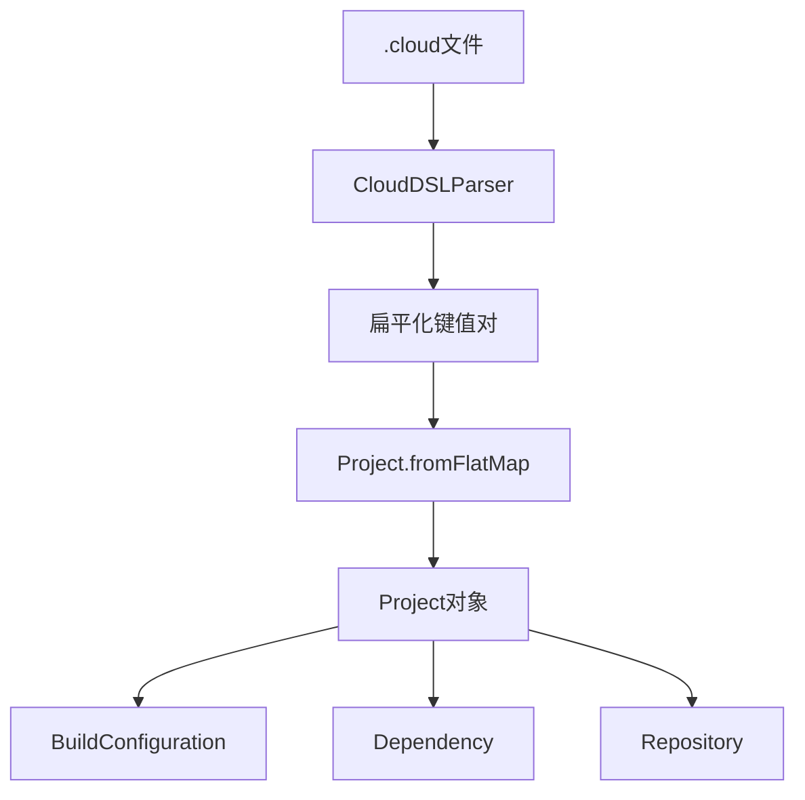
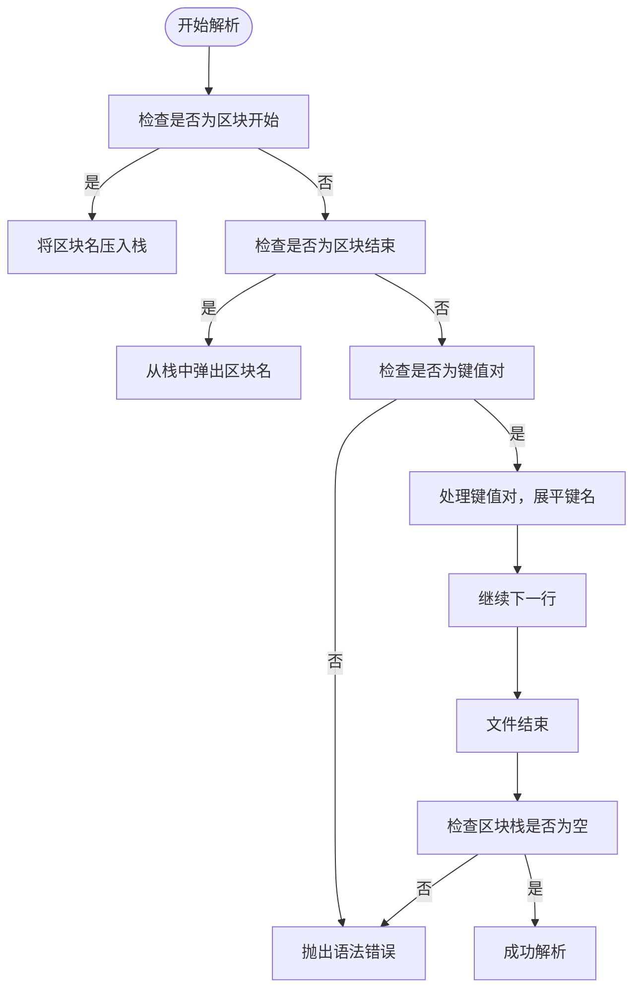
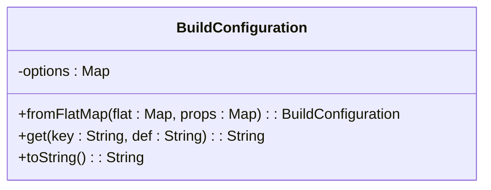
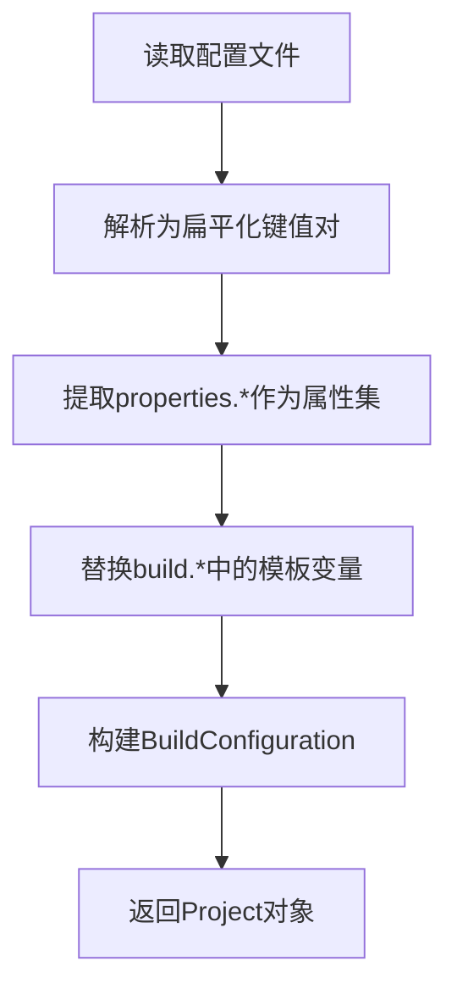
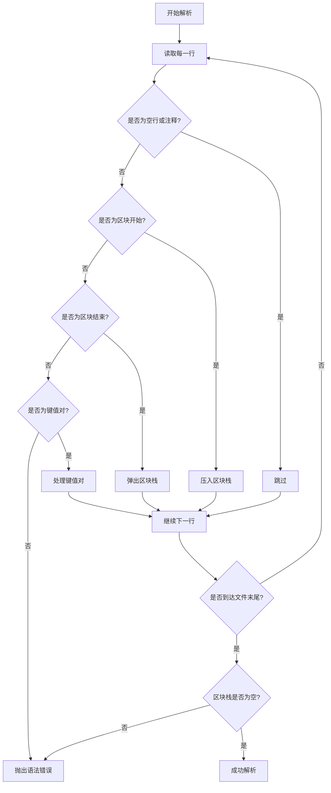
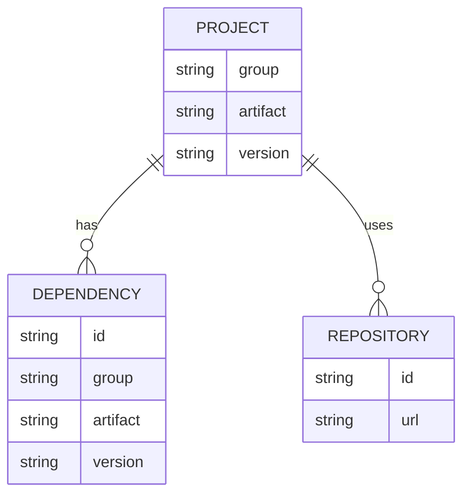

# 项目配置

<cite>
**本文档引用的文件**  
- [SnowConfig.java](file://src/main/java/org/jcnc/snow/common/SnowConfig.java)
- [CloudDSLParser.java](file://src/main/java/org/jcnc/snow/pkg/dsl/CloudDSLParser.java)
- [BuildConfiguration.java](file://src/main/java/org/jcnc/snow/pkg/model/BuildConfiguration.java)
- [Project.java](file://src/main/java/org/jcnc/snow/pkg/model/Project.java)
- [Dependency.java](file://src/main/java/org/jcnc/snow/pkg/model/Dependency.java)
- [Repository.java](file://src/main/java/org/jcnc/snow/pkg/model/Repository.java)
- [ProjectCloudExample.java](file://src/main/java/org/jcnc/snow/cli/utils/ProjectCloudExample.java)
- [CompileTask.java](file://src/main/java/org/jcnc/snow/pkg/tasks/CompileTask.java)
- [GenerateTask.java](file://src/main/java/org/jcnc/snow/pkg/tasks/GenerateTask.java)
- [SnowExample.java](file://src/main/java/org/jcnc/snow/pkg/utils/SnowExample.java)
</cite>

## 目录
1. [简介](#简介)
2. [项目结构](#项目结构)
3. [核心组件](#核心组件)
4. [架构概述](#架构概述)
5. [详细组件分析](#详细组件分析)
6. [依赖分析](#依赖分析)
7. [性能考虑](#性能考虑)
8. [故障排除指南](#故障排除指南)
9. [结论](#结论)

## 简介
本文档详细解释了Snow项目的配置系统，涵盖CloudDSL语法结构、配置选项、BuildConfiguration类的字段及其作用。文档提供了配置文件的完整示例和最佳实践，解释了配置的继承机制和作用域规则，描述了配置验证流程和常见配置错误的解决方案。此外，文档还涵盖了从简单项目到复杂多模块项目的配置策略，并为开发者提供了配置优化和调试的实用技巧。

## 项目结构
Snow项目的配置系统主要由CloudDSL配置文件和相关的Java类组成。配置文件使用自定义的.cloud文件格式，通过CloudDSLParser解析为Project模型。项目结构包括源码目录、测试目录、构建输出目录和分发目录。

**图示来源**
- [ProjectCloudExample.java](file://src/main/java/org/jcnc/snow/cli/utils/ProjectCloudExample.java#L15-L30)
- [GenerateTask.java](file://src/main/java/org/jcnc/snow/pkg/tasks/GenerateTask.java#L25-L45)

**本节来源**
- [ProjectCloudExample.java](file://src/main/java/org/jcnc/snow/cli/utils/ProjectCloudExample.java#L15-L30)
- [GenerateTask.java](file://src/main/java/org/jcnc/snow/pkg/tasks/GenerateTask.java#L25-L45)

## 核心组件
Snow项目的配置系统核心组件包括CloudDSLParser、Project、BuildConfiguration、Dependency和Repository。这些组件共同协作，解析和管理项目的配置信息。

**本节来源**
- [CloudDSLParser.java](file://src/main/java/org/jcnc/snow/pkg/dsl/CloudDSLParser.java#L1-L146)
- [Project.java](file://src/main/java/org/jcnc/snow/pkg/model/Project.java#L1-L234)
- [BuildConfiguration.java](file://src/main/java/org/jcnc/snow/pkg/model/BuildConfiguration.java#L1-L66)
- [Dependency.java](file://src/main/java/org/jcnc/snow/pkg/model/Dependency.java#L1-L87)
- [Repository.java](file://src/main/java/org/jcnc/snow/pkg/model/Repository.java#L1-L18)

## 架构概述
Snow项目的配置系统采用分层架构，从配置文件解析到项目模型构建，再到构建配置的处理。配置文件通过CloudDSLParser解析为扁平化的键值对，然后由Project.fromFlatMap方法构建Project对象，其中包含BuildConfiguration、Dependency和Repository等子模型。

**图示来源**
- [CloudDSLParser.java](file://src/main/java/org/jcnc/snow/pkg/dsl/CloudDSLParser.java#L1-L146)
- [Project.java](file://src/main/java/org/jcnc/snow/pkg/model/Project.java#L1-L234)

## 详细组件分析

### CloudDSL语法结构
CloudDSL是一种自定义的配置文件格式，用于定义Snow项目的配置。其语法结构包括顶级区块（如project、properties、repositories、dependencies、build），每个区块以`sectionName {`开始，以`}`结束。区块内部只识别`key = value`赋值，行尾可有`# 注释`。build区块支持嵌套，内部键通过`.`展平，例如`compile.enabled = true`。对`"value"`或`'value'`形式的字面量自动去引号，调用方得到的均是不含引号的裸字符串。

**图示来源**
- [CloudDSLParser.java](file://src/main/java/org/jcnc/snow/pkg/dsl/CloudDSLParser.java#L1-L146)

**本节来源**
- [CloudDSLParser.java](file://src/main/java/org/jcnc/snow/pkg/dsl/CloudDSLParser.java#L1-L146)

### BuildConfiguration类分析
BuildConfiguration类封装了构建过程中的所有选项，支持模板变量（形如`@{key}`）的值自动替换。该类通过fromFlatMap静态工厂方法创建，将原始配置项和属性集中的模板变量替换为实际值。

**图示来源**
- [BuildConfiguration.java](file://src/main/java/org/jcnc/snow/pkg/model/BuildConfiguration.java#L1-L66)

**本节来源**
- [BuildConfiguration.java](file://src/main/java/org/jcnc/snow/pkg/model/BuildConfiguration.java#L1-L66)

### 配置继承与作用域
Snow项目的配置系统支持通过属性集（properties）进行模板变量替换，实现配置的继承和作用域管理。在Project.fromFlatMap方法中，properties.*的配置项被提取为属性集，用于替换build.*等配置项中的模板变量。

**图示来源**
- [Project.java](file://src/main/java/org/jcnc/snow/pkg/model/Project.java#L1-L234)

**本节来源**
- [Project.java](file://src/main/java/org/jcnc/snow/pkg/model/Project.java#L1-L234)

### 配置验证与错误处理
配置验证主要在CloudDSLParser的parse方法中进行，包括检查括号是否配对、行是否可识别等。如果遇到语法错误，会抛出IllegalStateException异常。此外，BuildConfiguration的fromFlatMap方法也会在替换模板变量时进行基本的字符串处理。

**图示来源**
- [CloudDSLParser.java](file://src/main/java/org/jcnc/snow/pkg/dsl/CloudDSLParser.java#L1-L146)

**本节来源**
- [CloudDSLParser.java](file://src/main/java/org/jcnc/snow/pkg/dsl/CloudDSLParser.java#L1-L146)

## 依赖分析
Snow项目的配置系统通过Dependency和Repository类管理项目依赖。Dependency类表示一个依赖坐标（group:artifact:version），支持占位符替换。Repository类表示一个远程仓库，由唯一的ID和URL标识。

**图示来源**
- [Project.java](file://src/main/java/org/jcnc/snow/pkg/model/Project.java#L1-L234)
- [Dependency.java](file://src/main/java/org/jcnc/snow/pkg/model/Dependency.java#L1-L87)
- [Repository.java](file://src/main/java/org/jcnc/snow/pkg/model/Repository.java#L1-L18)

**本节来源**
- [Project.java](file://src/main/java/org/jcnc/snow/pkg/model/Project.java#L1-L234)
- [Dependency.java](file://src/main/java/org/jcnc/snow/pkg/model/Dependency.java#L1-L87)
- [Repository.java](file://src/main/java/org/jcnc/snow/pkg/model/Repository.java#L1-L18)

## 性能考虑
在配置解析过程中，CloudDSLParser使用LinkedHashMap保持配置项的顺序，这对于构建配置的处理非常重要。BuildConfiguration的fromFlatMap方法通过HashMap进行模板变量替换，确保了较高的性能。

## 故障排除指南
常见配置错误包括：
- 括号不配对：检查每个区块是否正确闭合。
- 无法识别的行：确保每行都是区块开始、结束或键值对。
- 模板变量未替换：检查属性集是否包含相应的键。

**本节来源**
- [CloudDSLParser.java](file://src/main/java/org/jcnc/snow/pkg/dsl/CloudDSLParser.java#L1-L146)
- [BuildConfiguration.java](file://src/main/java/org/jcnc/snow/pkg/model/BuildConfiguration.java#L1-L66)

## 结论
Snow项目的配置系统通过CloudDSL提供了一种简洁而强大的方式来定义项目配置。通过Project、BuildConfiguration、Dependency和Repository等核心组件，实现了配置的解析、继承和管理。开发者可以利用这些特性来构建从简单到复杂的多模块项目。