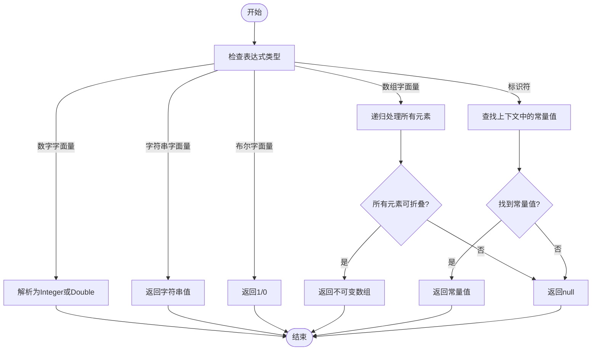
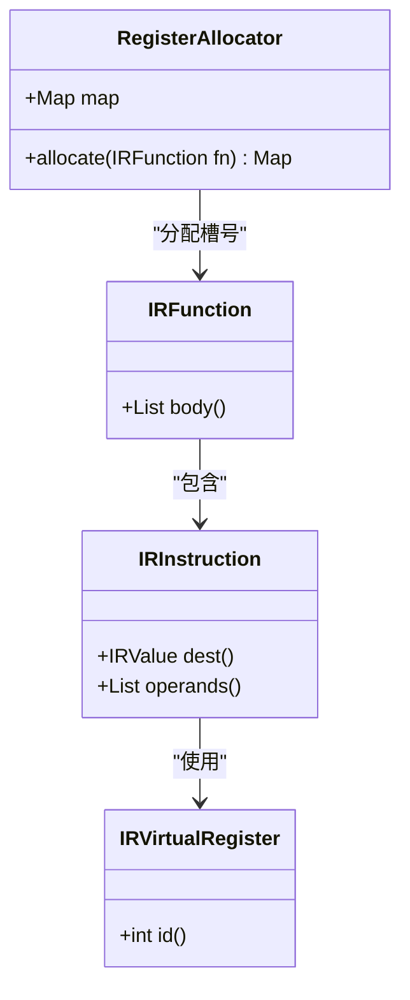
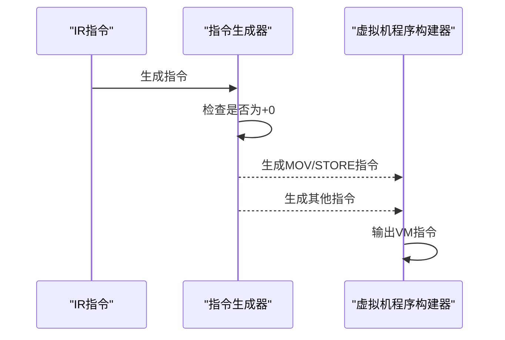
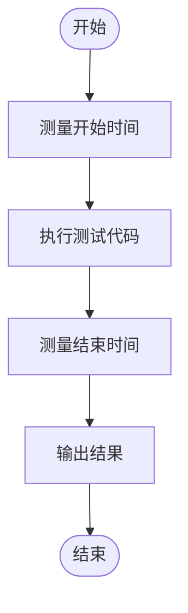

# 性能优化

<cite>
**本文档引用的文件**   
- [ConstFolder.java](file://src/main/java/org/jcnc/snow/compiler/ir/builder/statement/utils/ConstFolder.java)
- [TryFoldConst.java](file://src/main/java/org/jcnc/snow/compiler/ir/builder/utils/TryFoldConst.java)
- [IRProgramBuilder.java](file://src/main/java/org/jcnc/snow/compiler/ir/builder/core/IRProgramBuilder.java)
- [GlobalConstTable.java](file://src/main/java/org/jcnc/snow/compiler/ir/common/GlobalConstTable.java)
- [BinaryOpGenerator.java](file://src/main/java/org/jcnc/snow/compiler/backend/generator/BinaryOpGenerator.java)
- [UnaryOpGenerator.java](file://src/main/java/org/jcnc/snow/compiler/backend/generator/UnaryOpGenerator.java)
- [LoadConstGenerator.java](file://src/main/java/org/jcnc/snow/compiler/backend/generator/LoadConstGenerator.java)
- [VMCodeGenerator.java](file://src/main/java/org/jcnc/snow/compiler/backend/builder/VMCodeGenerator.java)
- [RegisterAllocator.java](file://src/main/java/org/jcnc/snow/compiler/backend/alloc/RegisterAllocator.java)
- [PERFORMANCE_TESTING_GUIDE.md](file://playground/PerformanceTest/PERFORMANCE_TESTING_GUIDE.md)
- [PERFORMANCE_COMPARISON.md](file://playground/PerformanceTest/PERFORMANCE_COMPARISON.md)
- [PERFORMANCE_REPORT.md](file://playground/PerformanceTest/PERFORMANCE_REPORT.md)
</cite>

## 目录
1. [引言](#引言)
2. [编译时优化](#编译时优化)
3. [运行时优化](#运行时优化)
4. [性能测试方法](#性能测试方法)
5. [性能对比与案例分析](#性能对比与案例分析)
6. [结论](#结论)

## 引言
Snow语言的性能优化技术文档旨在为开发者提供全面的性能优化策略。本文档重点介绍编译时和运行时的优化策略，详细说明常量折叠（IRConstantFolding）、死代码消除等编译期优化的实现机制和触发条件，结合IR优化器代码示例解释其工作原理。同时，描述循环优化、函数内联等高级优化技术的应用场景和效果。通过提供性能测试方法指导，包括如何使用PERFORMANCE_TESTING_GUIDE.md中的基准测试框架进行量化评估，帮助开发者识别性能瓶颈并应用合适的优化策略。

## 编译时优化

Snow语言的编译时优化主要集中在中间表示（IR）阶段，通过常量折叠、死代码消除等技术提升代码效率。这些优化在编译过程中自动应用，无需开发者手动干预。

### 常量折叠（IRConstantFolding）

常量折叠是Snow语言编译器的一项核心优化技术，它在编译期间将表达式中的常量进行计算，从而减少运行时的计算开销。该技术通过`TryFoldConst`和`ConstFolder`类实现，支持数字、字符串、布尔、数组等字面量及常量变量的折叠。

**图源**
- [TryFoldConst.java](file://src/main/java/org/jcnc/snow/compiler/ir/builder/utils/TryFoldConst.java#L30-L83)
- [ConstFolder.java](file://src/main/java/org/jcnc/snow/compiler/ir/builder/statement/utils/ConstFolder.java#L31-L64)

**本节来源**
- [TryFoldConst.java](file://src/main/java/org/jcnc/snow/compiler/ir/builder/utils/TryFoldConst.java#L30-L83)
- [ConstFolder.java](file://src/main/java/org/jcnc/snow/compiler/ir/builder/statement/utils/ConstFolder.java#L31-L64)

### 死代码消除

死代码消除是另一种重要的编译时优化技术，它通过分析代码的控制流和数据流，识别并移除不会被执行的代码段。虽然具体的实现细节未在提供的代码中直接展示，但可以通过IR生成过程中的条件判断和循环分析来推断其存在。

## 运行时优化

运行时优化主要涉及虚拟机（VM）层面的优化，包括寄存器分配、指令生成和Peephole优化等。

### 寄存器分配

Snow语言的寄存器分配器采用线性扫描策略，为IR中的虚拟寄存器分配物理槽号。这一过程确保了每个虚拟寄存器在函数作用域内分配唯一且连续的槽号，从而提高了运行时的执行效率。

**图源**
- [RegisterAllocator.java](file://src/main/java/org/jcnc/snow/compiler/backend/alloc/RegisterAllocator.java#L0-L38)

**本节来源**
- [RegisterAllocator.java](file://src/main/java/org/jcnc/snow/compiler/backend/alloc/RegisterAllocator.java#L0-L38)

### 指令生成与Peephole优化

指令生成器负责将IR指令转换为虚拟机可执行的指令序列。`BinaryOpGenerator`和`UnaryOpGenerator`等生成器在生成指令时会应用Peephole优化，例如识别`ADD_*`的`+0`情形并降解为`MOV/STORE`，避免无效运算。

**图源**
- [BinaryOpGenerator.java](file://src/main/java/org/jcnc/snow/compiler/backend/generator/BinaryOpGenerator.java#L74-L106)
- [UnaryOpGenerator.java](file://src/main/java/org/jcnc/snow/compiler/backend/generator/UnaryOpGenerator.java#L36-L68)

**本节来源**
- [BinaryOpGenerator.java](file://src/main/java/org/jcnc/snow/compiler/backend/generator/BinaryOpGenerator.java#L74-L106)
- [UnaryOpGenerator.java](file://src/main/java/org/jcnc/snow/compiler/backend/generator/UnaryOpGenerator.java#L36-L68)

## 性能测试方法

为了评估Snow语言的性能，开发者可以使用`PERFORMANCE_TESTING_GUIDE.md`中提供的基准测试框架。该框架支持多种性能测试模式，包括算术运算测试、字符串操作测试、循环性能测试和函数调用测试。

### 创建性能测试程序

性能测试程序通常包含时间测量函数、测试用例和结果输出。推荐使用`time.mono_ms()`或`time.mono_ns()`进行性能测试，因为它们不受系统时间调整的影响。

**图源**
- [PERFORMANCE_TESTING_GUIDE.md](file://playground/PerformanceTest/PERFORMANCE_TESTING_GUIDE.md#L0-L306)

**本节来源**
- [PERFORMANCE_TESTING_GUIDE.md](file://playground/PerformanceTest/PERFORMANCE_TESTING_GUIDE.md#L0-L306)

## 性能对比与案例分析

通过对Snow语言和Java在相同测试用例下的性能表现进行比较，可以发现Snow语言在性能方面与成熟的Java语言存在显著差距。以下是具体的性能对比数据：

| 测试项目 | Snow语言平均 | Java平均 | 性能差异 |
|---------|-------------|----------|---------|
| 算术运算测试 | 1944 ms | 0.33 ms | Snow比Java慢约5860倍 |
| 字符串操作测试 | 1259 ms | 1 ms | Snow比Java慢约1259倍 |
| 循环执行测试 | 235 ms | 2.67 ms | Snow比Java慢约88倍 |
| 函数调用测试 | 26.67 ms | 0 ms | Snow比Java慢（Java几乎无开销） |

这些数据表明，Snow语言在算术运算、字符串操作、循环执行和函数调用等方面均显著落后于Java。主要原因在于Snow语言需要在虚拟机中解释执行，而Java代码经过JIT编译优化后直接运行在硬件上。

**本节来源**
- [PERFORMANCE_COMPARISON.md](file://playground/PerformanceTest/PERFORMANCE_COMPARISON.md#L0-L108)
- [PERFORMANCE_REPORT.md](file://playground/PerformanceTest/PERFORMANCE_REPORT.md#L0-L72)

## 结论

Snow语言作为一个新兴的编程语言，在性能方面还有很大的提升空间。当前的性能瓶颈主要集中在虚拟机的解释执行效率和编译器的优化程度上。建议开发者持续优化虚拟机，改进解释执行效率，并考虑引入JIT编译功能。同时，优化字符串操作和减少函数调用开销也是重要的优化方向。随着编译器和虚拟机技术的不断发展，预计Snow语言的性能将逐步接近成熟语言的水平。

**本节来源**
- [PERFORMANCE_COMPARISON.md](file://playground/PerformanceTest/PERFORMANCE_COMPARISON.md#L0-L108)
- [PERFORMANCE_REPORT.md](file://playground/PerformanceTest/PERFORMANCE_REPORT.md#L0-L72)