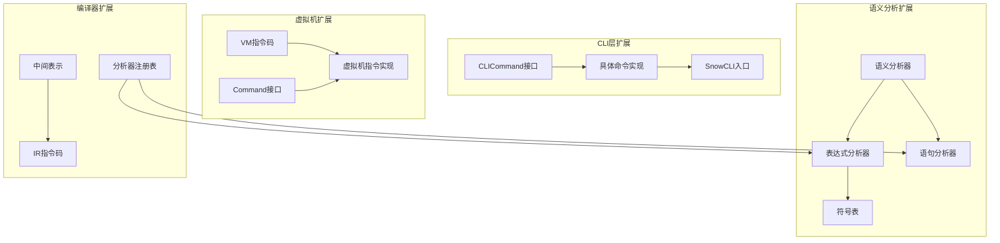
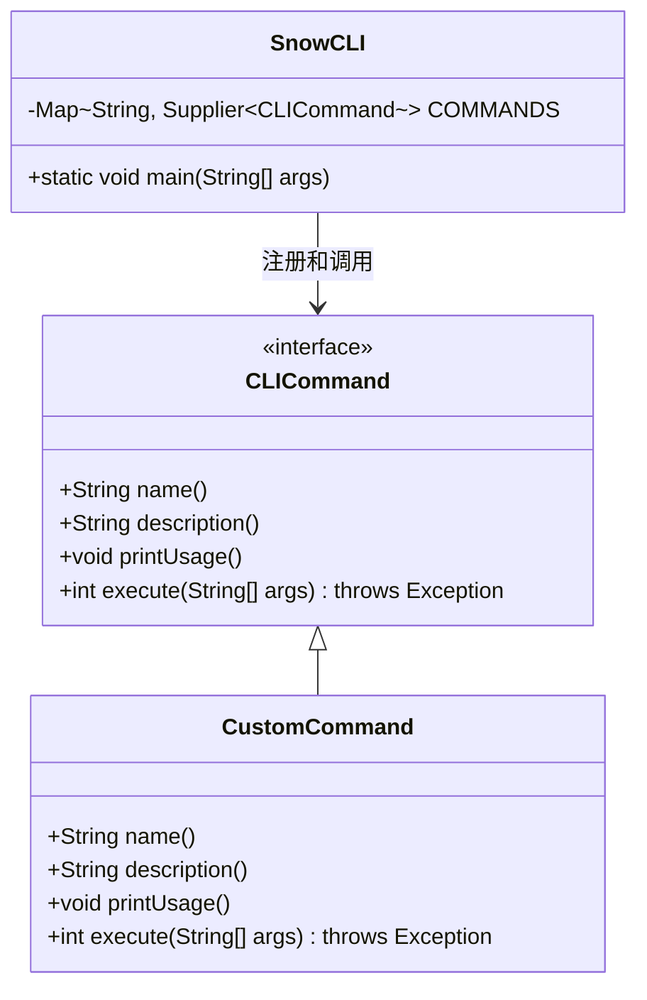
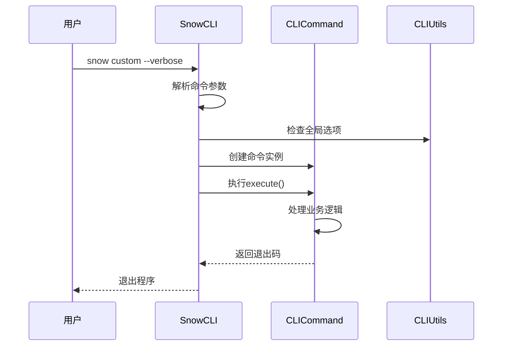
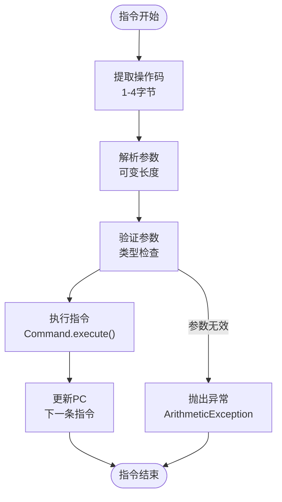
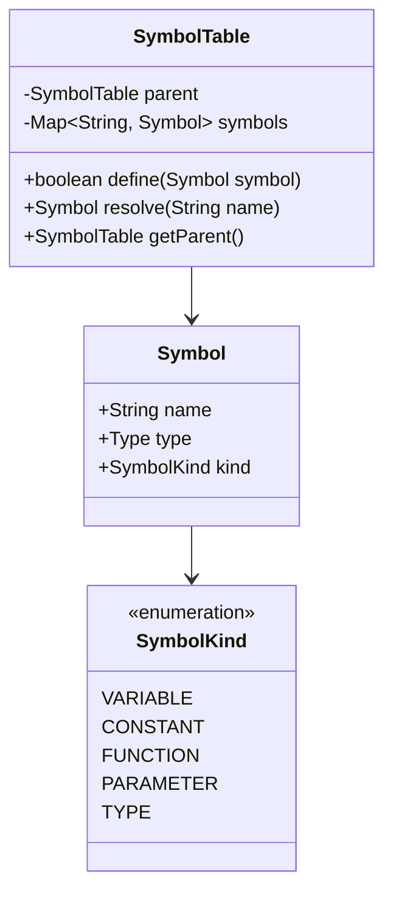
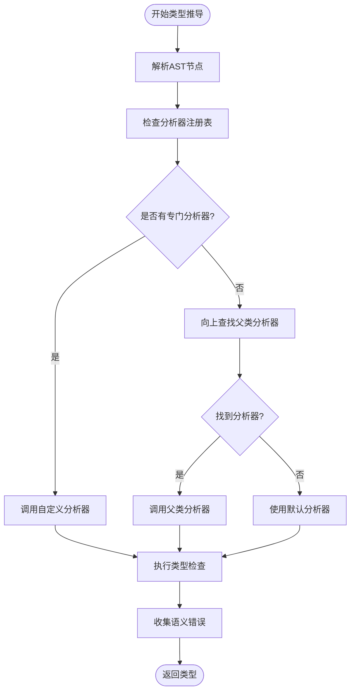
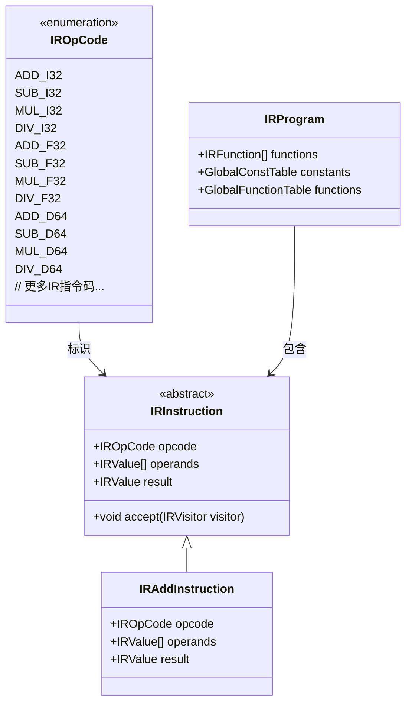
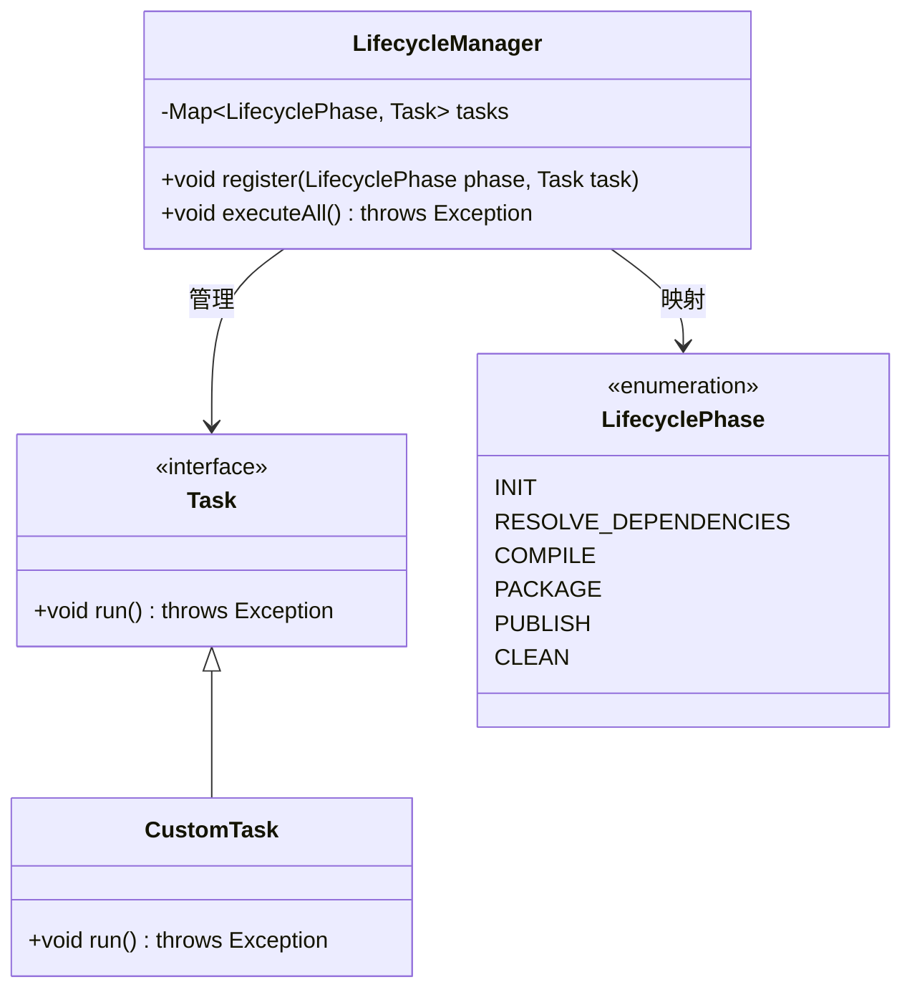
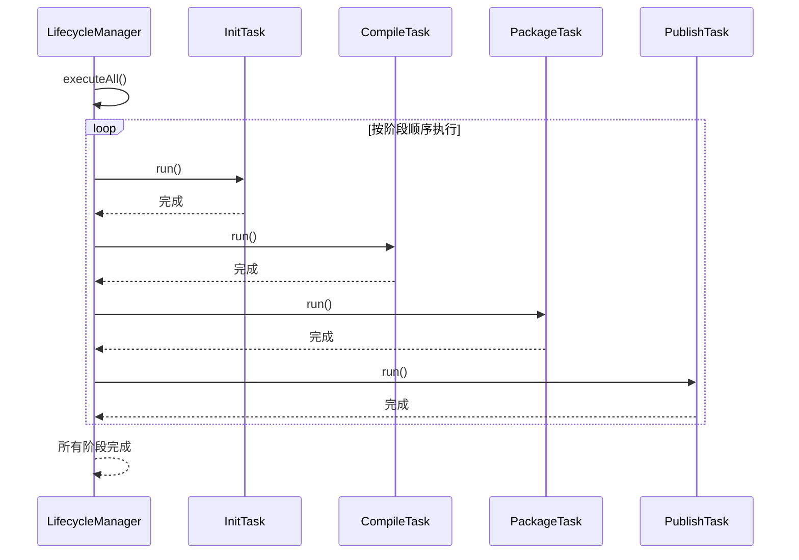

# Snow系统扩展开发指南

<cite>
**本文档中引用的文件**
- [CLICommand.java](file://src/main/java/org/jcnc/snow/cli/api/CLICommand.java)
- [SnowCLI.java](file://src/main/java/org/jcnc/snow/cli/SnowCLI.java)
- [CompileCommand.java](file://src/main/java/org/jcnc/snow/cli/commands/CompileCommand.java)
- [VMOpCode.java](file://src/main/java/org/jcnc/snow/vm/engine/VMOpCode.java)
- [Command.java](file://src/main/java/org/jcnc/snow/vm/interfaces/Command.java)
- [IAddCommand.java](file://src/main/java/org/jcnc/snow/vm/commands/type/control/int32/IAddCommand.java)
- [SemanticAnalyzer.java](file://src/main/java/org/jcnc/snow/compiler/semantic/core/SemanticAnalyzer.java)
- [AnalyzerRegistry.java](file://src/main/java/org/jcnc/snow/compiler/semantic/analyzers/AnalyzerRegistry.java)
- [ExpressionAnalyzer.java](file://src/main/java/org/jcnc/snow/compiler/semantic/analyzers/base/ExpressionAnalyzer.java)
- [SymbolTable.java](file://src/main/java/org/jcnc/snow/compiler/semantic/symbol/SymbolTable.java)
- [IROpCode.java](file://src/main/java/org/jcnc/snow/compiler/ir/core/IROpCode.java)
- [AnalyzerRegistrar.java](file://src/main/java/org/jcnc/snow/compiler/semantic/core/AnalyzerRegistrar.java)
- [LifecycleManager.java](file://src/main/java/org/jcnc/snow/pkg/lifecycle/LifecycleManager.java)
- [Task.java](file://src/main/java/org/jcnc/snow/pkg/tasks/Task.java)
</cite>

## 目录
1. [概述](#概述)
2. [CLI命令扩展](#cli命令扩展)
3. [虚拟机指令集扩展](#虚拟机指令集扩展)
4. [语义分析器扩展](#语义分析器扩展)
5. [编译器插件开发](#编译器插件开发)
6. [生命周期管理扩展](#生命周期管理扩展)
7. [最佳实践与测试](#最佳实践与测试)
8. [故障排除](#故障排除)

## 概述

Snow系统提供了多个扩展点，允许开发者自定义CLI命令、扩展虚拟机指令集、开发语义分析器插件和编译器扩展。本指南详细介绍了这些扩展机制的实现方法和最佳实践。

### 系统架构概览



**图表来源**
- [CLICommand.java](file://src/main/java/org/jcnc/snow/cli/api/CLICommand.java#L1-L48)
- [VMOpCode.java](file://src/main/java/org/jcnc/snow/vm/engine/VMOpCode.java#L1-L100)
- [SemanticAnalyzer.java](file://src/main/java/org/jcnc/snow/compiler/semantic/core/SemanticAnalyzer.java#L1-L87)

## CLI命令扩展

### CLICommand接口规范

所有CLI子命令必须实现`CLICommand`接口，该接口定义了命令的基本契约：



**图表来源**
- [CLICommand.java](file://src/main/java/org/jcnc/snow/cli/api/CLICommand.java#L10-L47)
- [SnowCLI.java](file://src/main/java/org/jcnc/snow/cli/SnowCLI.java#L30-L40)

### 实现自定义CLI命令

#### 基础命令模板

```java
// 自定义命令实现示例
public class CustomCommand implements CLICommand {
    
    @Override
    public String name() {
        return "custom"; // 命令名称
    }
    
    @Override
    public String description() {
        return "这是一个自定义命令示例"; // 命令描述
    }
    
    @Override
    public void printUsage() {
        System.out.println("Usage:");
        System.out.println("  snow custom [options]");
        System.out.println("Options:");
        System.out.println("  --verbose    启用详细输出");
        System.out.println("  --help       显示帮助信息");
    }
    
    @Override
    public int execute(String[] args) throws Exception {
        // 命令执行逻辑
        System.out.println("执行自定义命令...");
        
        // 参数解析
        boolean verbose = false;
        for (String arg : args) {
            if ("--verbose".equals(arg)) {
                verbose = true;
            }
        }
        
        if (verbose) {
            System.out.println("详细模式已启用");
        }
        
        // 执行业务逻辑
        // ...
        
        return 0; // 成功退出码
    }
}
```

#### 命令注册机制

命令注册有两种方式：

1. **静态注册**（推荐）：
```java
// 在SnowCLI中添加命令
private static final Map<String, Supplier<CLICommand>> COMMANDS = Map.of(
    "custom", CustomCommand::new, // 新增自定义命令
    // 其他命令...
);
```

2. **动态注册**（通过ServiceLoader）：
```java
// META-INF/services/org.jcnc.snow.cli.api.CLICommand
// 文件内容：
// com.example.CustomCommand
```

### 命令执行流程



**图表来源**
- [SnowCLI.java](file://src/main/java/org/jcnc/snow/cli/SnowCLI.java#L50-L98)

**章节来源**
- [CLICommand.java](file://src/main/java/org/jcnc/snow/cli/api/CLICommand.java#L1-L48)
- [SnowCLI.java](file://src/main/java/org/jcnc/snow/cli/SnowCLI.java#L1-L99)
- [CompileCommand.java](file://src/main/java/org/jcnc/snow/cli/commands/CompileCommand.java#L1-L93)

## 虚拟机指令集扩展

### VMOpCode扩展机制

Snow虚拟机采用紧凑的指令集架构，每条指令由唯一的操作码标识。扩展指令集需要同时修改指令码定义和对应的执行逻辑。

```mermaid
classDiagram
class VMOpCode {
<<enumeration>>
+int CUSTOM_OP
+int ANOTHER_CUSTOM
+static final int B_ADD
+static final int I_ADD
+static final int F_ADD
+static final int D_ADD
// 更多指令码...
}
class Command {
<<interface>>
+int execute(String[] parts, int currentPC,
OperandStack operandStack,
LocalVariableStore localVariableStore,
CallStack callStack)
}
class CustomCommand {
+int execute(String[] parts, int currentPC,
OperandStack operandStack,
LocalVariableStore localVariableStore,
CallStack callStack)
}
class CommandFactory {
+Command create(int opCode)
}
VMOpCode --> Command : 映射到
Command <|-- CustomCommand
CommandFactory --> Command : 创建
```

**图表来源**
- [VMOpCode.java](file://src/main/java/org/jcnc/snow/vm/engine/VMOpCode.java#L30-L100)
- [Command.java](file://src/main/java/org/jcnc/snow/vm/interfaces/Command.java#L1-L54)

### 新指令实现模式

#### 1. 定义指令码

在`VMOpCode`类中添加新的指令码：

```java
// 在VMOpCode.java中添加
public static final int CUSTOM_ADD = 0x0100; // 从0x0100开始分配
public static final int CUSTOM_MUL = 0x0101;
```

#### 2. 实现指令执行类

```java
// 自定义指令实现
public class CustomAddCommand implements Command {
    
    @Override
    public int execute(String[] parts, int currentPC, 
                      OperandStack operandStack, 
                      LocalVariableStore localVariableStore, 
                      CallStack callStack) {
        
        // 1. 从操作数栈弹出两个操作数
        int b = (int) operandStack.pop();
        int a = (int) operandStack.pop();
        
        // 2. 执行自定义加法逻辑
        int result = a + b + 1; // 示例：普通加法后加1
        
        // 3. 将结果压入操作数栈
        operandStack.push(result);
        
        // 4. 返回下一个指令地址
        return currentPC + 1;
    }
}
```

#### 3. 注册指令工厂

```java
// 在CommandFactory中注册新指令
COMMANDS[VMOpCode.CUSTOM_ADD] = new CustomAddCommand();
COMMANDS[VMOpCode.CUSTOM_MUL] = new CustomMulCommand();
```

### 字节码格式设计

#### 指令编码规范



**图表来源**
- [IAddCommand.java](file://src/main/java/org/jcnc/snow/vm/commands/type/control/int32/IAddCommand.java#L30-L58)

### 性能考量

#### 指令优化策略

1. **指令流水线**：确保指令执行时间尽可能短
2. **缓存友好**：优化内存访问模式
3. **分支预测**：减少条件跳转的使用
4. **寄存器分配**：合理利用虚拟寄存器

#### 执行效率对比

| 指令类型 | 执行时间 | 内存访问 | 适用场景 |
|---------|---------|---------|---------|
| 立即数操作 | 1周期 | 无 | 常量计算 |
| 寄存器操作 | 2周期 | 读写寄存器 | 变量操作 |
| 内存操作 | 5-10周期 | 读写内存 | 数组访问 |
| 控制流 | 3-5周期 | 条件判断 | 分支逻辑 |

**章节来源**
- [VMOpCode.java](file://src/main/java/org/jcnc/snow/vm/engine/VMOpCode.java#L1-L800)
- [Command.java](file://src/main/java/org/jcnc/snow/vm/interfaces/Command.java#L1-L54)
- [IAddCommand.java](file://src/main/java/org/jcnc/snow/vm/commands/type/control/int32/IAddCommand.java#L1-L59)

## 语义分析器扩展

### 分析器架构

Snow的语义分析器采用插件化架构，支持自定义表达式和语句分析器。

```mermaid
classDiagram
class SemanticAnalyzer {
-Context ctx
-AnalyzerRegistry registry
-ModuleRegistry moduleRegistry
-SignatureRegistrar signatureRegistrar
-FunctionChecker functionChecker
+SemanticError[] analyze(ModuleNode[] modules)
}
class AnalyzerRegistry {
-Map~Class, StatementAnalyzer~ stmtAnalyzers
-Map~Class, ExpressionAnalyzer~ exprAnalyzers
-ExpressionAnalyzer~ExpressionNode~ defaultUnsupported
+void registerStatementAnalyzer(Class clazz, StatementAnalyzer analyzer)
+void registerExpressionAnalyzer(Class clazz, ExpressionAnalyzer analyzer)
+StatementAnalyzer getStatementAnalyzer(StatementNode stmt)
+ExpressionAnalyzer getExpressionAnalyzer(ExpressionNode expr)
}
class ExpressionAnalyzer {
<<interface>>
+Type analyze(Context ctx, ModuleInfo mi, FunctionNode fn,
SymbolTable locals, E expr)
}
class CustomExprAnalyzer {
+Type analyze(Context ctx, ModuleInfo mi, FunctionNode fn,
SymbolTable locals, CustomExprNode expr)
}
class SymbolTable {
-SymbolTable parent
-Map~String, Symbol~ symbols
+boolean define(Symbol symbol)
+Symbol resolve(String name)
}
SemanticAnalyzer --> AnalyzerRegistry
AnalyzerRegistry --> ExpressionAnalyzer
ExpressionAnalyzer <|-- CustomExprAnalyzer
CustomExprAnalyzer --> SymbolTable
```

**图表来源**
- [SemanticAnalyzer.java](file://src/main/java/org/jcnc/snow/compiler/semantic/core/SemanticAnalyzer.java#L25-L87)
- [AnalyzerRegistry.java](file://src/main/java/org/jcnc/snow/compiler/semantic/analyzers/AnalyzerRegistry.java#L25-L111)

### 自定义表达式分析器

#### 实现步骤

1. **定义分析器接口**：
```java
public interface ExpressionAnalyzer<E extends ExpressionNode> {
    Type analyze(Context ctx, ModuleInfo mi, FunctionNode fn, 
                SymbolTable locals, E expr);
}
```

2. **实现自定义分析器**：
```java
public class CustomExprAnalyzer implements ExpressionAnalyzer<CustomExprNode> {
    
    @Override
    public Type analyze(Context ctx, ModuleInfo mi, FunctionNode fn, 
                       SymbolTable locals, CustomExprNode expr) {
        
        // 1. 解析子表达式
        Type leftType = ctx.getRegistry().getExpressionAnalyzer(expr.getLeft())
                          .analyze(ctx, mi, fn, locals, expr.getLeft());
        Type rightType = ctx.getRegistry().getExpressionAnalyzer(expr.getRight())
                          .analyze(ctx, mi, fn, locals, expr.getRight());
        
        // 2. 类型检查
        if (!isValidOperation(leftType, rightType)) {
            ctx.getErrors().add(new SemanticError(expr, 
                "不支持的操作类型: " + leftType + " 和 " + rightType));
            return BuiltinType.INT; // 降级类型
        }
        
        // 3. 返回结果类型
        return getResultType(leftType, rightType);
    }
    
    private boolean isValidOperation(Type left, Type right) {
        // 实现类型兼容性检查
        return true;
    }
    
    private Type getResultType(Type left, Type right) {
        // 根据操作确定结果类型
        return BuiltinType.INT;
    }
}
```

#### 注册分析器

```java
// 在AnalyzerRegistrar中注册
public static void registerAll(AnalyzerRegistry registry) {
    // 注册自定义表达式分析器
    registry.registerExpressionAnalyzer(CustomExprNode.class, new CustomExprAnalyzer());
    
    // 继续注册其他分析器...
}
```

### 符号表管理

#### 符号表结构



**图表来源**
- [SymbolTable.java](file://src/main/java/org/jcnc/snow/compiler/semantic/symbol/SymbolTable.java#L15-L78)

#### 作用域管理

```java
// 符号表层次结构
SymbolTable globalScope = new SymbolTable(null); // 全局作用域
SymbolTable functionScope = new SymbolTable(globalScope); // 函数作用域
SymbolTable blockScope = new SymbolTable(functionScope); // 块作用域

// 符号定义和查找
boolean success = functionScope.define(new Symbol("variable", type, SymbolKind.VARIABLE));
Symbol resolved = blockScope.resolve("variable"); // 向上查找
```

### 类型检查规则

#### 自定义类型系统

```java
// 自定义类型实现
public class CustomType implements Type {
    private String name;
    private List<Field> fields;
    
    @Override
    public boolean isCompatibleWith(Type other) {
        // 实现类型兼容性检查
        return this.equals(other);
    }
    
    @Override
    public String getName() {
        return name;
    }
}
```

#### 类型推导算法



**图表来源**
- [AnalyzerRegistry.java](file://src/main/java/org/jcnc/snow/compiler/semantic/analyzers/AnalyzerRegistry.java#L75-L111)

**章节来源**
- [SemanticAnalyzer.java](file://src/main/java/org/jcnc/snow/compiler/semantic/core/SemanticAnalyzer.java#L1-L87)
- [AnalyzerRegistry.java](file://src/main/java/org/jcnc/snow/compiler/semantic/analyzers/AnalyzerRegistry.java#L1-L111)
- [ExpressionAnalyzer.java](file://src/main/java/org/jcnc/snow/compiler/semantic/analyzers/base/ExpressionAnalyzer.java#L1-L45)
- [SymbolTable.java](file://src/main/java/org/jcnc/snow/compiler/semantic/symbol/SymbolTable.java#L1-L78)

## 编译器插件开发

### 中间表示扩展

Snow编译器使用中间表示（IR）作为代码生成的基础，支持多种数据类型和操作。



**图表来源**
- [IROpCode.java](file://src/main/java/org/jcnc/snow/compiler/ir/core/IROpCode.java#L1-L142)

### 自定义IR指令

#### 1. 定义IR操作码

```java
// 在IROpCode中添加新指令
public enum IROpCode {
    // 现有指令...
    
    // 自定义指令
    CUSTOM_OP,      // 自定义操作
    CUSTOM_CALL,    // 自定义函数调用
    CUSTOM_LOAD,    // 自定义加载
    CUSTOM_STORE    // 自定义存储
}
```

#### 2. 实现IR指令类

```java
// 自定义IR指令实现
public class IRCustomOpInstruction extends IRInstruction {
    
    public IRCustomOpInstruction(List<IRValue> operands, IRValue result) {
        super(IROpCode.CUSTOM_OP, operands, result);
    }
    
    @Override
    public void accept(IRVisitor visitor) {
        visitor.visit(this);
    }
    
    @Override
    public String toString() {
        return "CUSTOM_OP " + operands + " -> " + result;
    }
}
```

#### 3. 代码生成器扩展

```java
// IR到VM代码生成器扩展
public class CustomInstructionGenerator implements InstructionGenerator {
    
    @Override
    public void generate(IRInstruction instr, VMCodeGenerator gen) {
        if (instr instanceof IRCustomOpInstruction) {
            generateCustomOp((IRCustomOpInstruction) instr, gen);
        } else {
            // 调用父类处理其他指令
            super.generate(instr, gen);
        }
    }
    
    private void generateCustomOp(IRCustomOpInstruction instr, VMCodeGenerator gen) {
        // 生成自定义VM指令
        gen.emit(VMOpCode.CUSTOM_OP);
    }
}
```

### 语义分析插件

#### 插件注册机制

```java
// 插件注册示例
public class CustomSemanticPlugin {
    
    public static void registerPlugins(AnalyzerRegistry registry) {
        // 注册自定义语句分析器
        registry.registerStatementAnalyzer(
            CustomStmtNode.class, 
            new CustomStmtAnalyzer()
        );
        
        // 注册自定义表达式分析器
        registry.registerExpressionAnalyzer(
            CustomExprNode.class, 
            new CustomExprAnalyzer()
        );
    }
}
```

#### 生命周期集成

```java
// 在SemanticAnalyzer中集成插件
public class SemanticAnalyzer {
    
    public SemanticAnalyzer(boolean verbose) {
        // 初始化内置插件
        BuiltinTypeRegistry.init(ctx);
        AnalyzerRegistrar.registerAll(registry);
        
        // 注册自定义插件
        CustomSemanticPlugin.registerPlugins(registry);
        
        // 构造核心组件
        this.moduleRegistry = new ModuleRegistry(ctx);
        this.signatureRegistrar = new SignatureRegistrar(ctx);
        this.functionChecker = new FunctionChecker(ctx);
    }
}
```

**章节来源**
- [IROpCode.java](file://src/main/java/org/jcnc/snow/compiler/ir/core/IROpCode.java#L1-L142)
- [AnalyzerRegistrar.java](file://src/main/java/org/jcnc/snow/compiler/semantic/core/AnalyzerRegistrar.java#L1-L53)

## 生命周期管理扩展

### Task接口设计

Snow使用生命周期管理器来协调构建过程中的各个阶段。



**图表来源**
- [Task.java](file://src/main/java/org/jcnc/snow/pkg/tasks/Task.java#L1-L20)
- [LifecycleManager.java](file://src/main/java/org/jcnc/snow/pkg/lifecycle/LifecycleManager.java#L1-L65)

### 自定义任务实现

#### 任务模板

```java
// 自定义构建任务
public class CustomBuildTask implements Task {
    
    private final Project project;
    private final String[] args;
    
    public CustomBuildTask(Project project, String[] args) {
        this.project = project;
        this.args = args;
    }
    
    @Override
    public void run() throws Exception {
        // 1. 初始化阶段
        initialize();
        
        // 2. 执行构建逻辑
        build();
        
        // 3. 后处理
        postProcess();
    }
    
    private void initialize() throws Exception {
        // 初始化构建环境
        System.out.println("初始化自定义构建任务...");
    }
    
    private void build() throws Exception {
        // 执行构建逻辑
        System.out.println("执行自定义构建逻辑...");
        
        // 处理参数
        for (String arg : args) {
            if ("--verbose".equals(arg)) {
                System.out.println("详细模式启用");
            }
        }
    }
    
    private void postProcess() throws Exception {
        // 后处理逻辑
        System.out.println("自定义构建任务完成");
    }
}
```

#### 生命周期集成

```java
// 在LifecycleManager中注册自定义任务
public class CustomLifecycleManager {
    
    public static void setupCustomTasks(LifecycleManager manager) {
        // 注册自定义初始化任务
        manager.register(LifecyclePhase.INIT, new CustomInitTask());
        
        // 注册自定义编译任务
        manager.register(LifecyclePhase.COMPILE, new CustomCompileTask());
        
        // 注册自定义打包任务
        manager.register(LifecyclePhase.PACKAGE, new CustomPackageTask());
    }
}
```

### 任务链式执行



**图表来源**
- [LifecycleManager.java](file://src/main/java/org/jcnc/snow/pkg/lifecycle/LifecycleManager.java#L50-L65)

**章节来源**
- [Task.java](file://src/main/java/org/jcnc/snow/pkg/tasks/Task.java#L1-L20)
- [LifecycleManager.java](file://src/main/java/org/jcnc/snow/pkg/lifecycle/LifecycleManager.java#L1-L65)

## 最佳实践与测试

### 扩展点生命周期管理

#### 1. 初始化阶段

```java
// 扩展点初始化最佳实践
public class ExtensionManager {
    
    private static volatile boolean initialized = false;
    private static final Object lock = new Object();
    
    public static void initializeExtensions() {
        synchronized (lock) {
            if (initialized) {
                return;
            }
            
            // 1. 注册内置扩展
            registerBuiltInExtensions();
            
            // 2. 加载外部扩展
            loadExternalExtensions();
            
            // 3. 验证扩展兼容性
            validateExtensions();
            
            initialized = true;
        }
    }
    
    private static void registerBuiltInExtensions() {
        // 注册系统内置扩展
        AnalyzerRegistrar.registerAll(getDefaultRegistry());
    }
    
    private static void loadExternalExtensions() {
        // 通过ServiceLoader加载外部扩展
        ServiceLoader<CLICommand> loader = ServiceLoader.load(CLICommand.class);
        for (CLICommand command : loader) {
            registerCommand(command);
        }
    }
}
```

#### 2. 验证阶段

```java
// 扩展验证工具
public class ExtensionValidator {
    
    public static ValidationResult validateExtension(Object extension) {
        ValidationResult result = new ValidationResult();
        
        // 1. 接口实现检查
        if (!(extension instanceof CLICommand)) {
            result.addError("必须实现CLICommand接口");
        }
        
        // 2. 线程安全性检查
        if (!isThreadSafe(extension)) {
            result.addWarning("建议实现无状态、线程安全的设计");
        }
        
        // 3. 性能影响评估
        if (hasPerformanceIssues(extension)) {
            result.addWarning("可能存在性能问题");
        }
        
        return result;
    }
    
    private static boolean isThreadSafe(Object obj) {
        // 检查是否无状态
        return true;
    }
    
    private static boolean hasPerformanceIssues(Object obj) {
        // 检查潜在性能问题
        return false;
    }
}
```

### 错误处理策略

#### 1. 分层错误处理

```java
// 多层错误处理架构
public class ErrorHandler {
    
    // 1. 语法错误处理
    public static void handleSyntaxError(SyntaxException error) {
        System.err.println("语法错误: " + error.getMessage());
        System.err.println("位置: " + error.getLocation());
    }
    
    // 2. 语义错误处理
    public static void handleSemanticError(SemanticError error) {
        System.err.println("语义错误: " + error.getMessage());
        System.err.println("范围: " + error.getRange());
    }
    
    // 3. 运行时错误处理
    public static void handleRuntimeError(RuntimeException error) {
        System.err.println("运行时错误: " + error.getMessage());
        error.printStackTrace();
    }
}
```

#### 2. 错误恢复机制

```java
// 错误恢复策略
public class ErrorRecovery {
    
    public static void recoverFromError(Exception error) {
        if (error instanceof SemanticError) {
            recoverFromSemanticError((SemanticError) error);
        } else if (error instanceof CompilationException) {
            recoverFromCompilationError((CompilationException) error);
        } else {
            recoverFromUnknownError(error);
        }
    }
    
    private static void recoverFromSemanticError(SemanticError error) {
        // 使用降级类型继续分析
        error.setType(BuiltinType.INT);
    }
    
    private static void recoverFromCompilationError(CompilationException error) {
        // 跳过有问题的代码段
        error.skipCurrentSegment();
    }
}
```

### 测试验证方法

#### 1. 单元测试框架

```java
// 扩展测试基类
public abstract class ExtensionTestCase<T> {
    
    protected T extension;
    
    @Before
    public void setUp() {
        extension = createExtension();
        initializeExtension();
    }
    
    @After
    public void tearDown() {
        cleanupExtension();
    }
    
    protected abstract T createExtension();
    protected abstract void initializeExtension();
    protected abstract void cleanupExtension();
    
    @Test
    public void testBasicFunctionality() {
        assertNotNull(extension);
        assertTrue(isValidExtension(extension));
    }
    
    @Test
    public void testThreadSafety() {
        ExecutorService executor = Executors.newFixedThreadPool(10);
        List<Future<?>> futures = new ArrayList<>();
        
        for (int i = 0; i < 100; i++) {
            futures.add(executor.submit(() -> {
                performConcurrentTest(extension);
            }));
        }
        
        for (Future<?> future : futures) {
            assertNull(future.get());
        }
        
        executor.shutdown();
    }
}
```

#### 2. 集成测试

```java
// 集成测试示例
public class CLIExtensionIntegrationTest {
    
    @Test
    public void testCustomCommandIntegration() {
        // 准备测试环境
        String[] args = {"custom", "--test"};
        ByteArrayOutputStream outContent = new ByteArrayOutputStream();
        System.setOut(new PrintStream(outContent));
        
        // 执行测试
        SnowCLI.main(args);
        
        // 验证结果
        String output = outContent.toString();
        assertTrue(output.contains("执行自定义命令"));
    }
    
    @Test
    public void testVMExtensionIntegration() {
        // 测试自定义VM指令
        VirtualMachineEngine vm = new VirtualMachineEngine();
        vm.registerCommand(VMOpCode.CUSTOM_OP, new CustomCommand());
        
        // 执行测试指令
        vm.executeInstruction(VMOpCode.CUSTOM_OP, new String[]{});
        
        // 验证效果
        assertEquals(expectedResult, vm.getOperandStack().peek());
    }
}
```

#### 3. 性能测试

```java
// 性能基准测试
@BenchmarkMode(Mode.AverageTime)
@OutputTimeUnit(TimeUnit.NANOSECONDS)
public class ExtensionPerformanceTest {
    
    @Benchmark
    public int testCustomAnalyzerPerformance() {
        // 测试自定义分析器性能
        CustomExprAnalyzer analyzer = new CustomExprAnalyzer();
        ExpressionNode node = createTestExpression();
        
        long startTime = System.nanoTime();
        Type result = analyzer.analyze(context, moduleInfo, functionNode, symbolTable, node);
        long endTime = System.nanoTime();
        
        return (int) (endTime - startTime);
    }
    
    @Benchmark
    public int testCustomCommandPerformance() {
        // 测试自定义VM指令性能
        CustomCommand command = new CustomCommand();
        String[] params = {};
        
        long startTime = System.nanoTime();
        int result = command.execute(params, 0, operandStack, localVars, callStack);
        long endTime = System.nanoTime();
        
        return (int) (endTime - startTime);
    }
}
```

## 故障排除

### 常见问题与解决方案

#### 1. CLI命令扩展问题

**问题**: 自定义命令无法被识别
```bash
Unknown command: custom
```

**解决方案**:
```java
// 确保正确注册命令
private static final Map<String, Supplier<CLICommand>> COMMANDS = Map.of(
    "custom", CustomCommand::new, // 使用工厂方法
    // ... 其他命令
);

// 或者通过ServiceLoader
// META-INF/services/org.jcnc.snow.cli.api.CLICommand
// com.example.CustomCommand
```

**问题**: 命令参数解析错误
```java
// 正确的参数解析模式
@Override
public int execute(String[] args) throws Exception {
    boolean verbose = false;
    String outputFile = null;
    
    for (int i = 0; i < args.length; i++) {
        switch (args[i]) {
            case "--verbose":
                verbose = true;
                break;
            case "-o":
                if (i + 1 < args.length) {
                    outputFile = args[++i];
                }
                break;
            default:
                // 处理未知参数
                System.err.println("未知参数: " + args[i]);
                return 1;
        }
    }
    
    // 使用解析后的参数
    if (verbose) {
        System.out.println("详细模式: " + verbose);
    }
    
    return 0;
}
```

#### 2. 虚拟机指令扩展问题

**问题**: 指令执行异常
```java
// 安全的指令实现
public class SafeCustomCommand implements Command {
    
    @Override
    public int execute(String[] parts, int currentPC, 
                      OperandStack operandStack, 
                      LocalVariableStore localVariableStore, 
                      CallStack callStack) {
        
        try {
            // 参数验证
            if (parts == null || parts.length < 1) {
                throw new IllegalArgumentException("缺少必需的参数");
            }
            
            // 栈状态检查
            if (operandStack.size() < 2) {
                throw new IllegalStateException("操作数栈太浅");
            }
            
            // 执行指令
            int result = performOperation(parts, operandStack);
            operandStack.push(result);
            
            return currentPC + 1;
            
        } catch (Exception e) {
            // 错误处理
            handleError(e, currentPC);
            throw e;
        }
    }
    
    private void handleError(Exception e, int pc) {
        System.err.println("指令执行失败 (PC=" + pc + "): " + e.getMessage());
        // 记录详细错误信息
    }
}
```

#### 3. 语义分析器扩展问题

**问题**: 类型推导错误
```java
// 健壮的类型检查
public class RobustTypeAnalyzer implements ExpressionAnalyzer<CustomExprNode> {
    
    @Override
    public Type analyze(Context ctx, ModuleInfo mi, FunctionNode fn, 
                       SymbolTable locals, CustomExprNode expr) {
        
        try {
            // 1. 验证输入
            if (expr == null) {
                throw new IllegalArgumentException("表达式不能为空");
            }
            
            // 2. 递归分析子表达式
            Type leftType = analyzeChildExpression(ctx, mi, fn, locals, expr.getLeft());
            Type rightType = analyzeChildExpression(ctx, mi, fn, locals, expr.getRight());
            
            // 3. 类型兼容性检查
            if (!isCompatible(leftType, rightType)) {
                reportTypeError(ctx, expr, leftType, rightType);
                return BuiltinType.INT; // 降级类型
            }
            
            // 4. 计算结果类型
            return computeResultType(leftType, rightType);
            
        } catch (Exception e) {
            // 错误恢复
            ctx.getErrors().add(new SemanticError(expr, e.getMessage()));
            return BuiltinType.INT;
        }
    }
    
    private void reportTypeError(Context ctx, CustomExprNode expr, 
                                Type left, Type right) {
        String msg = String.format("类型不兼容: %s 和 %s", left, right);
        ctx.getErrors().add(new SemanticError(expr, msg));
    }
}
```

#### 4. 编译器插件扩展问题

**问题**: 内存泄漏
```java
// 防止内存泄漏的插件实现
public class MemoryEfficientPlugin {
    
    private static final WeakReference<AnalyzerRegistry> registryRef;
    
    public static void registerPlugin(AnalyzerRegistry registry) {
        // 使用弱引用防止内存泄漏
        registryRef = new WeakReference<>(registry);
        
        // 注册分析器
        registry.registerExpressionAnalyzer(
            CustomExprNode.class, 
            new CustomExprAnalyzer()
        );
    }
    
    public static void cleanup() {
        // 清理资源
        registryRef.clear();
    }
}
```

### 调试技巧

#### 1. 日志记录

```java
// 扩展调试日志
public class DebuggableExtension {
    
    private static final Logger logger = LoggerFactory.getLogger(DebuggableExtension.class);
    
    public void debugExecute(String[] args) {
        logger.debug("开始执行扩展命令");
        logger.debug("参数数量: {}", args.length);
        
        for (int i = 0; i < args.length; i++) {
            logger.debug("参数 {}: {}", i, args[i]);
        }
        
        try {
            // 执行逻辑
            executeLogic(args);
        } catch (Exception e) {
            logger.error("扩展执行失败", e);
            throw e;
        }
    }
}
```

#### 2. 性能监控

```java
// 性能监控工具
public class PerformanceMonitor {
    
    public static <T> T measureExecution(String operation, Supplier<T> task) {
        long startTime = System.currentTimeMillis();
        long startMemory = Runtime.getRuntime().totalMemory() - Runtime.getRuntime().freeMemory();
        
        try {
            T result = task.get();
            
            long endTime = System.currentTimeMillis();
            long endMemory = Runtime.getRuntime().totalMemory() - Runtime.getRuntime().freeMemory();
            
            logMetrics(operation, endTime - startTime, endMemory - startMemory);
            
            return result;
            
        } catch (Exception e) {
            logError(operation, e);
            throw e;
        }
    }
    
    private static void logMetrics(String operation, long duration, long memoryDelta) {
        System.out.printf("操作 '%s' 耗时: %d ms, 内存变化: %d bytes%n", 
                         operation, duration, memoryDelta);
    }
}
```

**章节来源**
- [CLICommand.java](file://src/main/java/org/jcnc/snow/cli/api/CLICommand.java#L1-L48)
- [VMOpCode.java](file://src/main/java/org/jcnc/snow/vm/engine/VMOpCode.java#L1-L800)
- [SemanticAnalyzer.java](file://src/main/java/org/jcnc/snow/compiler/semantic/core/SemanticAnalyzer.java#L1-L87)