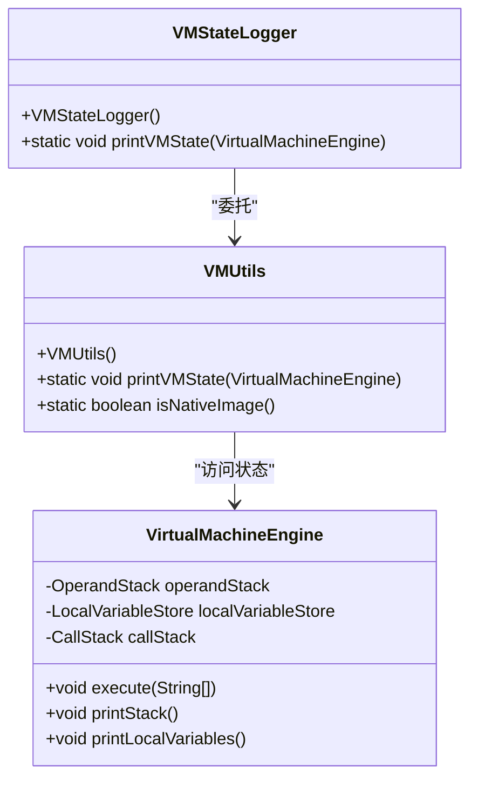
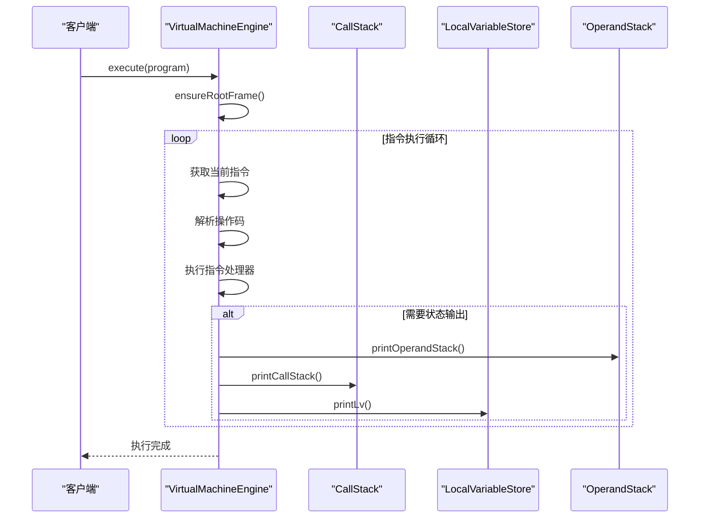
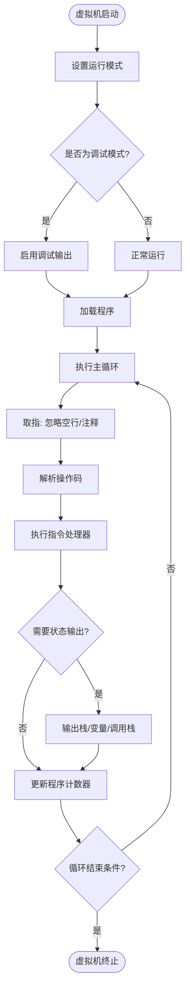

# 调试与监控

<cite>
**本文档引用的文件**   
- [VMStateLogger.java](file://src/main/java/org/jcnc/snow/vm/utils/VMStateLogger.java)
- [VMUtils.java](file://src/main/java/org/jcnc/snow/vm/utils/VMUtils.java)
- [VirtualMachineEngine.java](file://src/main/java/org/jcnc/snow/vm/engine/VirtualMachineEngine.java)
- [CallStack.java](file://src/main/java/org/jcnc/snow/vm/module/CallStack.java)
- [OperandStack.java](file://src/main/java/org/jcnc/snow/vm/module/OperandStack.java)
- [LocalVariableStore.java](file://src/main/java/org/jcnc/snow/vm/module/LocalVariableStore.java)
- [SnowConfig.java](file://src/main/java/org/jcnc/snow/common/SnowConfig.java)
- [CLIUtils.java](file://src/main/java/org/jcnc/snow/cli/utils/CLIUtils.java)
- [LexerEngine.java](file://src/main/java/org/jcnc/snow/compiler/lexer/core/LexerEngine.java)
- [ParserEngine.java](file://src/main/java/org/jcnc/snow/compiler/parser/core/ParserEngine.java)
- [RunCommand.java](file://src/main/java/org/jcnc/snow/cli/commands/RunCommand.java)
- [RunTask.java](file://src/main/java/org/jcnc/snow/pkg/tasks/RunTask.java)
</cite>

## 目录
1. [调试模式启用方式](#调试模式启用方式)
2. [VMStateLogger使用方法](#vmstatelogger使用方法)
3. [虚拟机状态分析](#虚拟机状态分析)
4. [前端编译器调试](#前端编译器调试)
5. [常见错误模式识别](#常见错误模式识别)
6. [性能瓶颈诊断](#性能瓶颈诊断)

## 调试模式启用方式

Snow虚拟机的调试模式通过命令行参数启用，当启用调试模式时，系统会输出详细的内部执行状态信息。调试模式的启用依赖于全局配置系统和命令行参数解析。

调试模式的启用流程如下：
1. 用户通过命令行参数 `--debug` 或 `-debug` 启用调试模式
2. CLI工具解析参数并设置全局运行模式
3. 虚拟机在执行时根据当前模式决定是否输出调试信息

调试模式的配置由 `SnowConfig` 类管理，该类定义了程序的运行模式枚举，包括 `RUN`（运行模式）和 `DEBUG`（调试模式）两种状态。当处于调试模式时，系统会启用详细的日志输出功能。

**Section sources**
- [SnowConfig.java](file://src/main/java/org/jcnc/snow/common/SnowConfig.java#L1-L92)
- [CLIUtils.java](file://src/main/java/org/jcnc/snow/cli/utils/CLIUtils.java#L1-L78)
- [RunCommand.java](file://src/main/java/org/jcnc/snow/cli/commands/RunCommand.java#L1-L67)

## VMStateLogger使用方法

`VMStateLogger` 是用于记录虚拟机状态的工具类，它提供了打印虚拟机当前执行状态的静态方法。该类作为 `VMUtils#printVMState` 方法的封装，简化了虚拟机状态的输出过程。

### 核心功能
`VMStateLogger` 的主要功能是通过 `printVMState` 静态方法输出虚拟机的完整状态信息。该方法接收一个 `VirtualMachineEngine` 实例作为参数，并验证其非空性，然后委托给 `VMUtils` 工具类执行实际的状态打印操作。

### 输出格式
`VMStateLogger` 输出的虚拟机状态信息主要包括：
- 操作数栈（Operand Stack）的当前内容
- 局部变量表（Local Variable Table）的值
- 调用栈（Call Stack）的层次结构

这些信息以结构化的方式输出，便于开发者分析虚拟机的执行上下文。



**Diagram sources **
- [VMStateLogger.java](file://src/main/java/org/jcnc/snow/vm/utils/VMStateLogger.java#L1-L48)
- [VMUtils.java](file://src/main/java/org/jcnc/snow/vm/utils/VMUtils.java#L1-L62)
- [VirtualMachineEngine.java](file://src/main/java/org/jcnc/snow/vm/engine/VirtualMachineEngine.java#L1-L191)

**Section sources**
- [VMStateLogger.java](file://src/main/java/org/jcnc/snow/vm/utils/VMStateLogger.java#L1-L48)
- [VMUtils.java](file://src/main/java/org/jcnc/snow/vm/utils/VMUtils.java#L1-L62)

## 虚拟机状态分析

### 执行状态监控

虚拟机的执行状态由 `VirtualMachineEngine` 类维护，该类实现了虚拟机的核心解释器循环。执行状态监控主要关注以下几个方面：

1. **程序计数器（PC）**：跟踪当前执行的指令位置
2. **指令执行流程**：处理指令的解析、执行和异常情况
3. **运行时数据结构**：维护操作数栈、局部变量表和调用栈

虚拟机在执行指令时会跳过空行和注释行（以 '#' 开头），确保指令流的正确解析。

### 调用栈分析

`CallStack` 类管理着虚拟机的调用栈，维护函数调用的层次结构。调用栈的主要功能包括：

- **栈帧管理**：支持栈帧的压入和弹出操作
- **深度保护**：设置最大栈深度（1024层）防止栈溢出
- **状态快照**：生成调用栈的文本快照用于调试

每个栈帧包含返回地址、局部变量表和方法上下文，这些信息共同构成了函数调用的完整上下文。



**Diagram sources **
- [VirtualMachineEngine.java](file://src/main/java/org/jcnc/snow/vm/engine/VirtualMachineEngine.java#L1-L191)
- [CallStack.java](file://src/main/java/org/jcnc/snow/vm/module/CallStack.java#L1-L97)

### 操作数栈监控

`OperandStack` 类实现了虚拟机的操作数栈，使用 `ArrayDeque` 作为底层数据结构。操作数栈的主要监控点包括：

- **栈操作**：支持 push、pop、peek 等基本栈操作
- **状态检查**：提供 isEmpty 和 size 方法检查栈状态
- **内容输出**：通过 printOperandStack 方法输出栈的当前内容

操作数栈是虚拟机执行算术运算、方法调用等操作的核心数据结构，其状态直接反映了当前计算的中间结果。

### 局部变量表分析

`LocalVariableStore` 类代表虚拟机的局部变量表，为每个栈帧提供局部变量存储。其主要特性包括：

- **动态扩容**：自动扩展以支持任意索引的变量存储
- **随机访问**：支持通过索引直接访问局部变量
- **内存优化**：提供 compact 方法移除尾部的 null 槽位

局部变量表使用 `ArrayList` 作为底层存储，支持通过 `setVariable` 和 `getVariable` 方法进行变量的存取操作。



**Diagram sources **
- [OperandStack.java](file://src/main/java/org/jcnc/snow/vm/module/OperandStack.java#L1-L104)
- [LocalVariableStore.java](file://src/main/java/org/jcnc/snow/vm/module/LocalVariableStore.java#L1-L182)

**Section sources**
- [VirtualMachineEngine.java](file://src/main/java/org/jcnc/snow/vm/engine/VirtualMachineEngine.java#L1-L191)
- [CallStack.java](file://src/main/java/org/jcnc/snow/vm/module/CallStack.java#L1-L97)
- [OperandStack.java](file://src/main/java/org/jcnc/snow/vm/module/OperandStack.java#L1-L104)
- [LocalVariableStore.java](file://src/main/java/org/jcnc/snow/vm/module/LocalVariableStore.java#L1-L182)

## 前端编译器调试

### 词法分析调试

`LexerEngine` 是Snow语言的词法分析器核心实现，采用"先扫描→后批量校验→统一报告"的策略。其调试输出主要包括：

1. **标记扫描**：将字符流拆分为 `Token` 序列
2. **后置校验**：基于token序列进行轻量级上下文校验
3. **错误报告**：一次性输出所有词法错误

词法分析器使用扫描器链模式，包含空白符、换行符、注释、数字、标识符、字符串、操作符、符号和未知标记等多种扫描器。

### 语法分析调试

`ParserEngine` 是语法解析引擎，负责驱动顶层语法解析并统一处理所有语法异常。其调试特性包括：

- **异常聚合**：收集所有语法异常并在最后统一抛出
- **错误恢复**：通过同步机制跳过错误片段，恢复到有效解析点
- **健壮性保证**：防止因指针停滞导致的死循环

语法解析采用Pratt解析器模式，支持基于同步点的错误恢复，适用于命令式和脚本式语法环境。

```mermaid
graph TB
subgraph "前端编译器"
Lexer[词法分析器]
Parser[语法分析器]
Semantic[语义分析器]
end
subgraph "词法分析"
LexerEngine[LexerEngine]
TokenScanner[TokenScanner]
LexerContext[LexerContext]
end
subgraph "语法分析"
ParserEngine[ParserEngine]
TopLevelParser[TopLevelParser]
ParserContext[ParserContext]
end
Lexer --> LexerEngine
LexerEngine --> TokenScanner
LexerEngine --> LexerContext
Parser --> ParserEngine
ParserEngine --> TopLevelParser
ParserEngine --> ParserContext
Lexer --> Parser : "Token流"
```

**Diagram sources **
- [LexerEngine.java](file://src/main/java/org/jcnc/snow/compiler/lexer/core/LexerEngine.java#L1-L186)
- [ParserEngine.java](file://src/main/java/org/jcnc/snow/compiler/parser/core/ParserEngine.java#L1-L98)

**Section sources**
- [LexerEngine.java](file://src/main/java/org/jcnc/snow/compiler/lexer/core/LexerEngine.java#L1-L186)
- [ParserEngine.java](file://src/main/java/org/jcnc/snow/compiler/parser/core/ParserEngine.java#L1-L98)

## 常见错误模式识别

### 语法分析错误定位

词法分析阶段的常见错误包括：
- **非法标识符**：`declare` 关键字后必须紧跟合法标识符
- **多余标识符**：`declare` 声明中出现多余的标识符
- **数字格式错误**：无效的数字字面量格式

这些错误通过 `validateTokens` 方法进行后置校验，并在 `errors` 列表中统一收集。

### 语义分析异常排查

语义分析阶段的异常主要通过 `SemanticAnalyzer` 组件处理，包括：
- **类型不匹配**：操作数类型与操作符要求不符
- **未声明变量**：使用未声明的标识符
- **函数签名错误**：函数调用参数与定义不匹配

### 运行时错误诊断

运行时错误主要包括：
- **栈溢出**：调用栈深度超过最大限制（1024层）
- **空栈弹出**：对空操作数栈执行 pop 操作
- **数组越界**：访问不存在的数组索引
- **空指针**：对 null 对象执行方法调用

这些错误通过异常机制捕获，并在调试模式下输出详细的错误信息和调用栈快照。

**Section sources**
- [LexerEngine.java](file://src/main/java/org/jcnc/snow/compiler/lexer/core/LexerEngine.java#L1-L186)
- [ParserEngine.java](file://src/main/java/org/jcnc/snow/compiler/parser/core/ParserEngine.java#L1-L98)
- [VirtualMachineEngine.java](file://src/main/java/org/jcnc/snow/vm/engine/VirtualMachineEngine.java#L1-L191)

## 性能瓶颈诊断

### 诊断流程

性能瓶颈的诊断流程如下：
1. **启用调试模式**：使用 `--debug` 参数运行程序
2. **监控执行状态**：通过 `VMStateLogger` 输出关键执行点的状态
3. **分析热点代码**：识别执行频率高的指令序列
4. **优化建议**：根据分析结果提出优化方案

### 监控指标

关键的性能监控指标包括：
- **指令执行频率**：统计各类指令的执行次数
- **栈操作开销**：监控栈 push/pop 操作的性能影响
- **方法调用开销**：分析函数调用的开销占比
- **内存使用模式**：观察局部变量表和操作数栈的内存使用趋势

通过这些指标的综合分析，可以识别出程序的性能瓶颈并进行针对性优化。

**Section sources**
- [VMStateLogger.java](file://src/main/java/org/jcnc/snow/vm/utils/VMStateLogger.java#L1-L48)
- [VirtualMachineEngine.java](file://src/main/java/org/jcnc/snow/vm/engine/VirtualMachineEngine.java#L1-L191)
- [SnowConfig.java](file://src/main/java/org/jcnc/snow/common/SnowConfig.java#L1-L92)