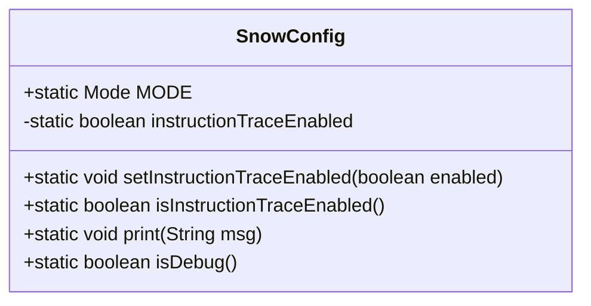
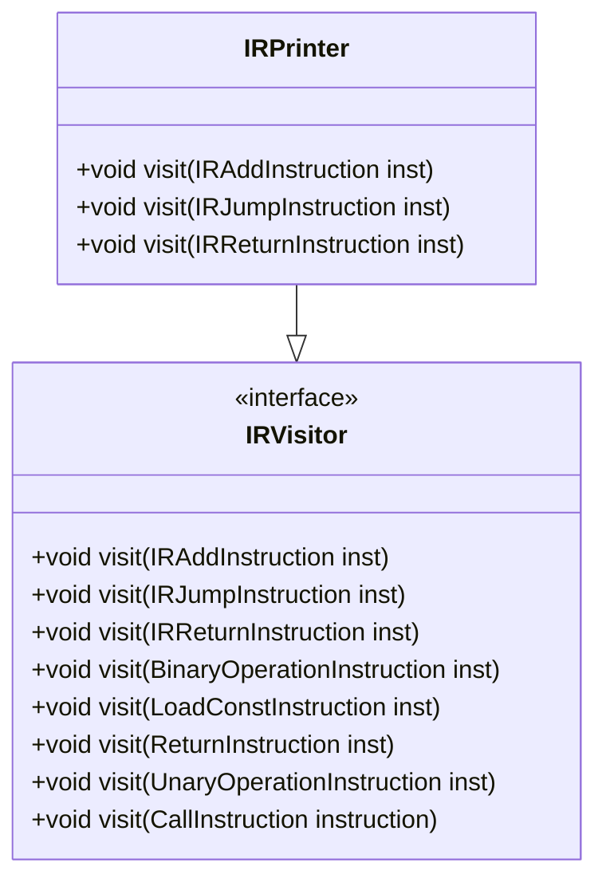
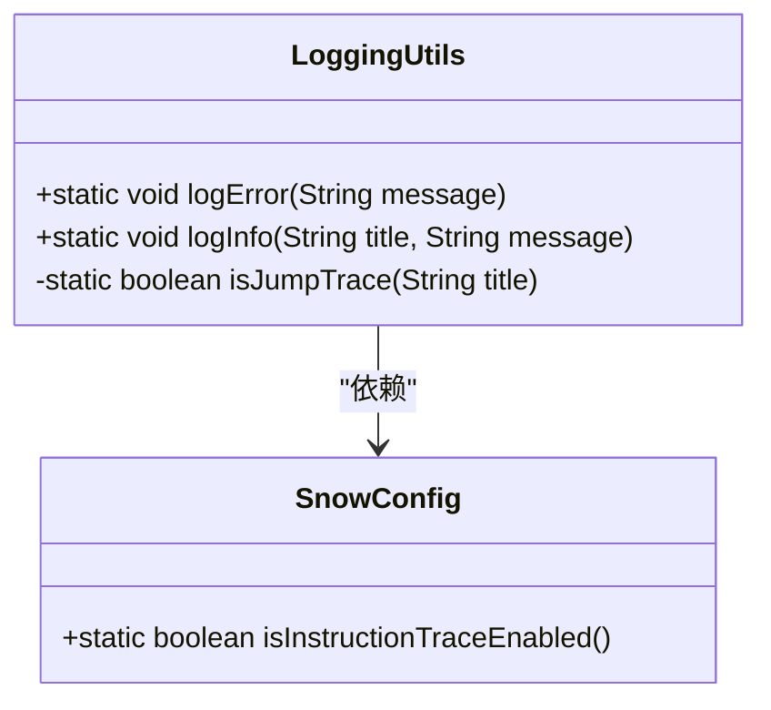
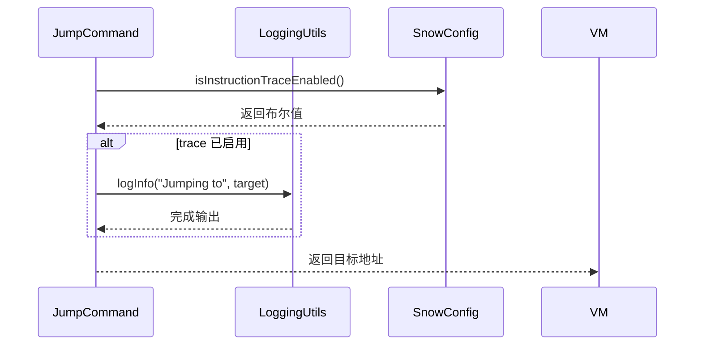
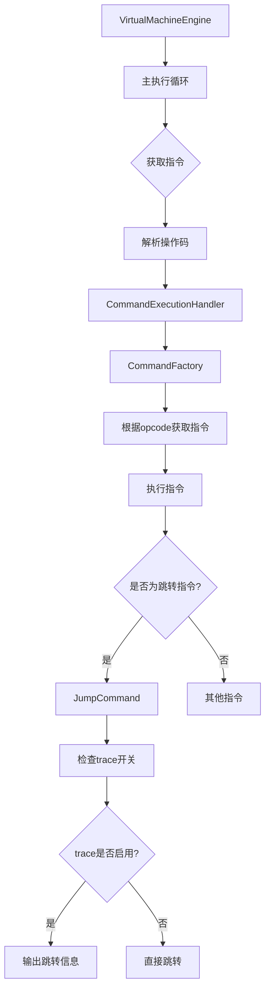

# 指令级 trace 输出功能

<cite>
**本文档引用的文件**  
- [SnowConfig.java](file://src/main/java/org/jcnc/snow/common/SnowConfig.java)
- [LoggingUtils.java](file://src/main/java/org/jcnc/snow/vm/utils/LoggingUtils.java)
- [IRPrinter.java](file://src/main/java/org/jcnc/snow/compiler/ir/core/IRPrinter.java)
- [JumpCommand.java](file://src/main/java/org/jcnc/snow/vm/commands/flow/control/JumpCommand.java)
- [VirtualMachineEngine.java](file://src/main/java/org/jcnc/snow/vm/engine/VirtualMachineEngine.java)
- [CommandExecutionHandler.java](file://src/main/java/org/jcnc/snow/vm/execution/CommandExecutionHandler.java)
- [CommandFactory.java](file://src/main/java/org/jcnc/snow/vm/factories/CommandFactory.java)
- [VMOpCode.java](file://src/main/java/org/jcnc/snow/vm/engine/VMOpCode.java)
- [IRJumpInstruction.java](file://src/main/java/org/jcnc/snow/compiler/ir/instruction/IRJumpInstruction.java)
- [JumpGenerator.java](file://src/main/java/org/jcnc/snow/compiler/backend/generator/JumpGenerator.java)
</cite>

## 目录
1. [简介](#简介)
2. [核心配置与控制](#核心配置与控制)
3. [IR 层级 trace 输出](#ir-层级-trace-输出)
4. [虚拟机指令 trace 输出](#虚拟机指令-trace-输出)
5. [控制流指令 trace 实现](#控制流指令-trace-实现)
6. [执行引擎与指令分发](#执行引擎与指令分发)
7. [指令级 trace 功能总结](#指令级-trace-功能总结)

## 简介
本项目提供了一套完整的指令级 trace 输出功能，用于调试和监控编译器中间表示（IR）和虚拟机执行过程。该功能允许开发者在调试模式下跟踪程序执行流程，特别是分支和跳转指令的执行情况。系统通过全局配置开关控制 trace 输出，并在关键的控制流指令执行时输出相关信息，帮助开发者理解程序的动态行为。

## 核心配置与控制
指令级 trace 功能由 `SnowConfig` 类统一管理，通过静态方法进行启用和禁用。

**图示来源**  
- [SnowConfig.java](file://src/main/java/org/jcnc/snow/common/SnowConfig.java#L17-L94)

**本节来源**  
- [SnowConfig.java](file://src/main/java/org/jcnc/snow/common/SnowConfig.java#L78-L94)

## IR 层级 trace 输出
在编译器的中间表示（IR）层级，系统提供了 `IRPrinter` 类用于输出 IR 指令的 trace 信息。该类实现了 `IRVisitor` 接口，通过访问者模式对不同类型的 IR 指令进行格式化输出。

**图示来源**  
- [IRPrinter.java](file://src/main/java/org/jcnc/snow/compiler/ir/core/IRPrinter.java#L18-L58)
- [IRVisitor.java](file://src/main/java/org/jcnc/snow/compiler/ir/core/IRVisitor.java#L22-L79)

**本节来源**  
- [IRPrinter.java](file://src/main/java/org/jcnc/snow/compiler/ir/core/IRPrinter.java#L7-L58)

## 虚拟机指令 trace 输出
虚拟机层级的 trace 输出由 `LoggingUtils` 类统一管理，该类提供了日志记录功能，包括错误信息和一般信息的输出。

**图示来源**  
- [LoggingUtils.java](file://src/main/java/org/jcnc/snow/vm/utils/LoggingUtils.java#L40-L67)
- [SnowConfig.java](file://src/main/java/org/jcnc/snow/common/SnowConfig.java#L83-L94)

**本节来源**  
- [LoggingUtils.java](file://src/main/java/org/jcnc/snow/vm/utils/LoggingUtils.java#L47-L67)

## 控制流指令 trace 实现
跳转指令（JumpCommand）是控制流指令的核心，其实现中包含了 trace 输出逻辑。当指令级 trace 功能启用时，跳转指令会输出目标地址信息。

**图示来源**  
- [JumpCommand.java](file://src/main/java/org/jcnc/snow/vm/commands/flow/control/JumpCommand.java#L60-L71)
- [LoggingUtils.java](file://src/main/java/org/jcnc/snow/vm/utils/LoggingUtils.java#L56-L62)
- [SnowConfig.java](file://src/main/java/org/jcnc/snow/common/SnowConfig.java#L92-L94)

**本节来源**  
- [JumpCommand.java](file://src/main/java/org/jcnc/snow/vm/commands/flow/control/JumpCommand.java#L60-L71)

## 执行引擎与指令分发
虚拟机的执行引擎（VirtualMachineEngine）负责指令的执行循环，而指令分发由 CommandExecutionHandler 完成。指令工厂（CommandFactory）根据操作码（opcode）创建相应的指令对象。

**图示来源**  
- [VirtualMachineEngine.java](file://src/main/java/org/jcnc/snow/vm/engine/VirtualMachineEngine.java#L89-L127)
- [CommandExecutionHandler.java](file://src/main/java/org/jcnc/snow/vm/execution/CommandExecutionHandler.java#L44-L58)
- [CommandFactory.java](file://src/main/java/org/jcnc/snow/vm/factories/CommandFactory.java#L244-L255)
- [VMOpCode.java](file://src/main/java/org/jcnc/snow/vm/engine/VMOpCode.java#L2771-L2782)

**本节来源**  
- [VirtualMachineEngine.java](file://src/main/java/org/jcnc/snow/vm/engine/VirtualMachineEngine.java#L89-L127)
- [CommandExecutionHandler.java](file://src/main/java/org/jcnc/snow/vm/execution/CommandExecutionHandler.java#L44-L58)

## 指令级 trace 功能总结
指令级 trace 功能通过多层次的协作实现，从编译器的 IR 生成到虚拟机的指令执行，形成了完整的 trace 输出体系。该功能的核心特点包括：

1. **集中式配置**：通过 `SnowConfig` 类统一管理 trace 开关状态
2. **条件性输出**：只有在 trace 功能启用时才输出跳转信息
3. **层级化实现**：在 IR 层和虚拟机层分别提供 trace 支持
4. **控制流聚焦**：主要关注跳转、调用等控制流指令的执行

该功能为开发者提供了强大的调试工具，能够清晰地观察程序的执行路径，特别是在复杂的控制流结构中，帮助快速定位问题。

**本节来源**  
- [SnowConfig.java](file://src/main/java/org/jcnc/snow/common/SnowConfig.java#L78-L94)
- [LoggingUtils.java](file://src/main/java/org/jcnc/snow/vm/utils/LoggingUtils.java#L56-L67)
- [JumpCommand.java](file://src/main/java/org/jcnc/snow/vm/commands/flow/control/JumpCommand.java#L60-L71)