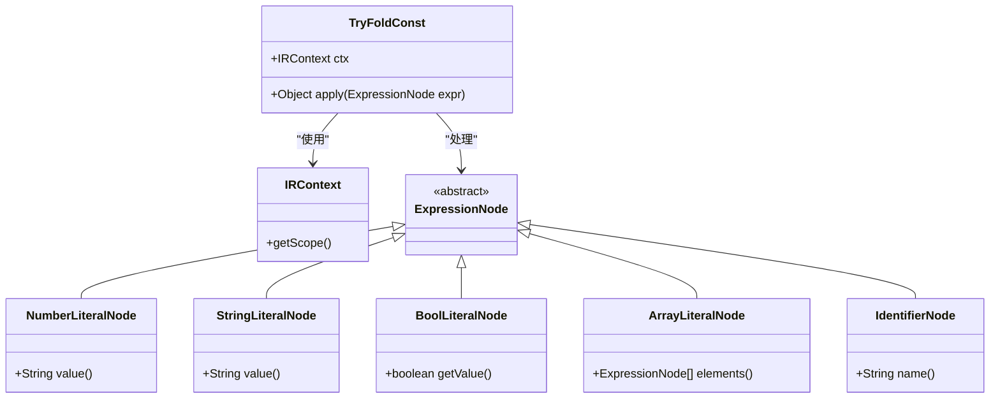
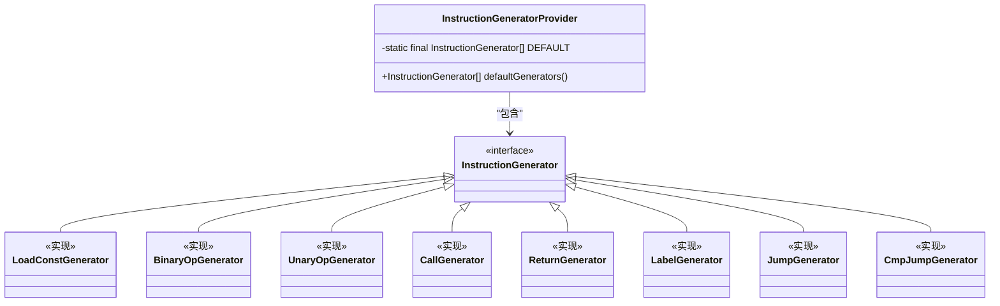
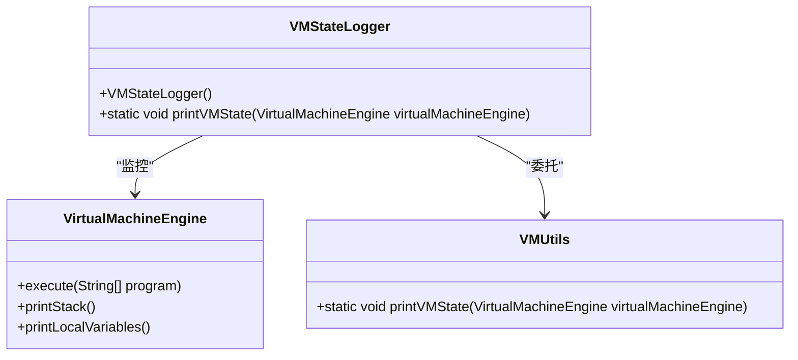
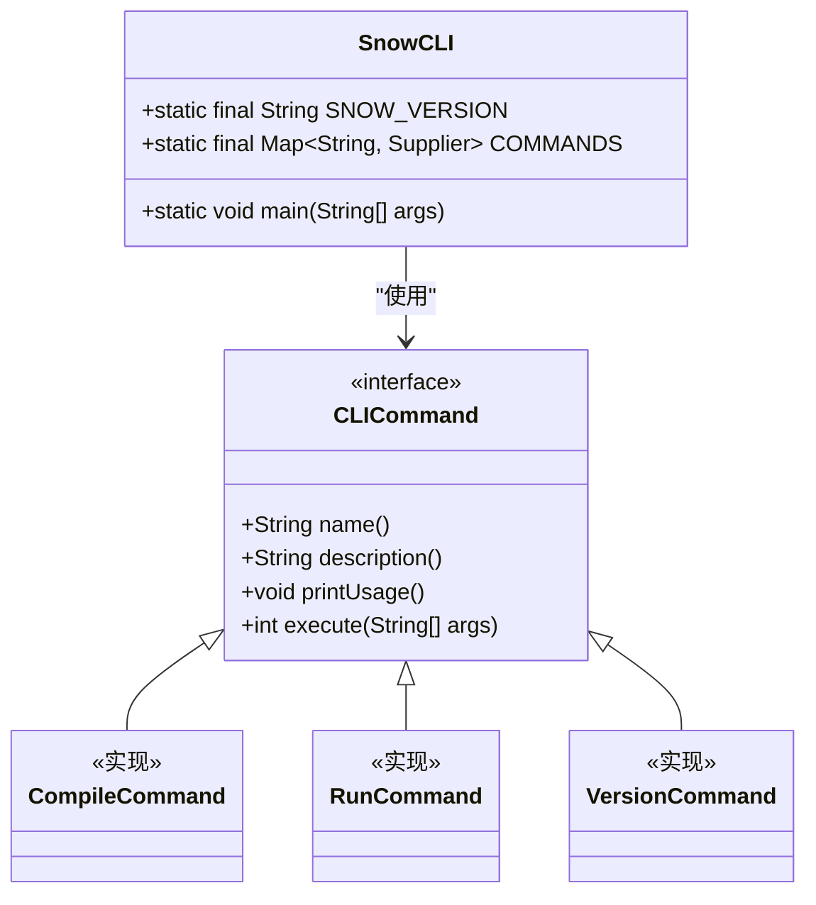
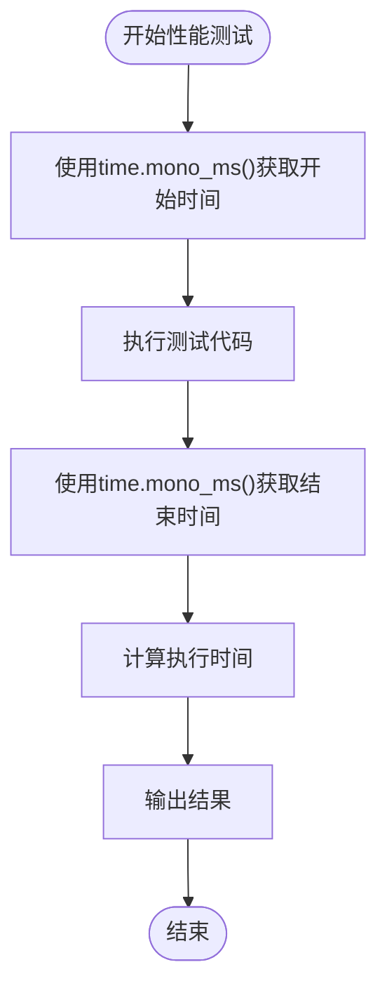
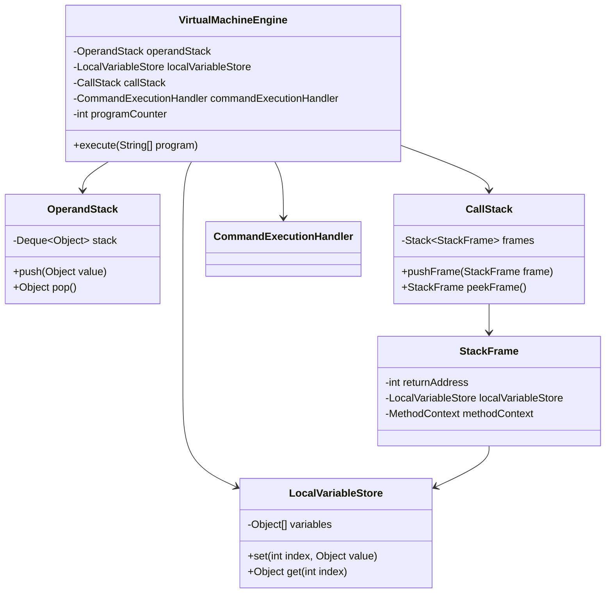
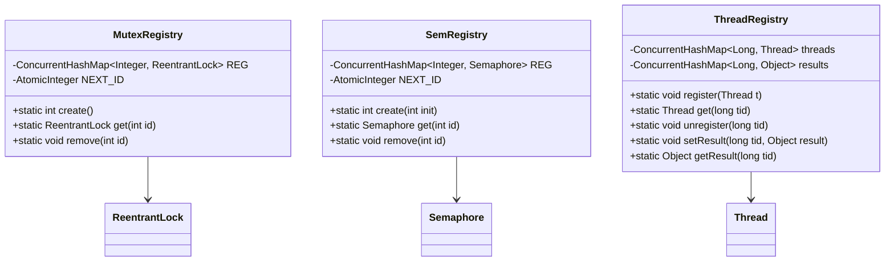
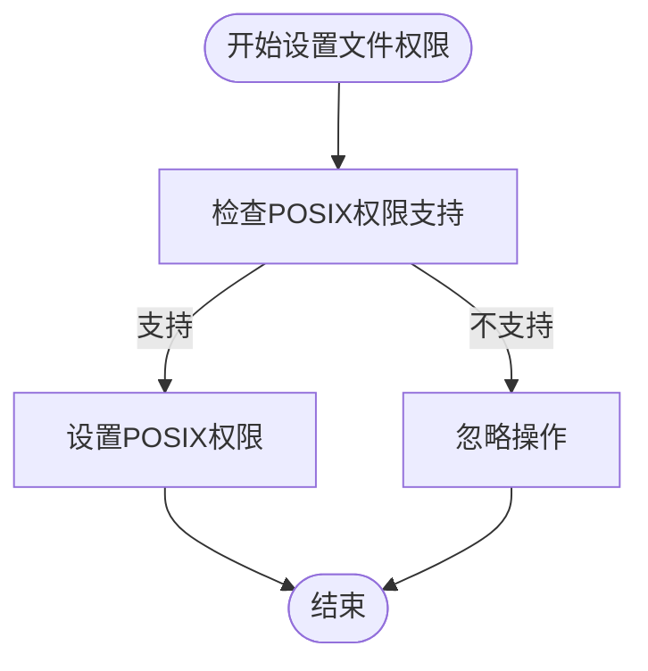

# 高级主题

<cite>
**本文档中引用的文件**  
- [PERFORMANCE_TESTING_GUIDE.md](file://playground/PerformanceTest/PERFORMANCE_TESTING_GUIDE.md)
- [VMStateLogger.java](file://src/main/java/org/jcnc/snow/vm/utils/VMStateLogger.java)
- [VirtualMachineEngine.java](file://src/main/java/org/jcnc/snow/vm/engine/VirtualMachineEngine.java)
- [SnowCLI.java](file://src/main/java/org/jcnc/snow/cli/SnowCLI.java)
- [CompileCommand.java](file://src/main/java/org/jcnc/snow/cli/commands/CompileCommand.java)
- [SnowConfig.java](file://src/main/java/org/jcnc/snow/common/SnowConfig.java)
- [InstructionGeneratorProvider.java](file://src/main/java/org/jcnc/snow/compiler/backend/generator/InstructionGeneratorProvider.java)
- [TryFoldConst.java](file://src/main/java/org/jcnc/snow/compiler/ir/builder/utils/TryFoldConst.java)
- [ThreadRegistry.java](file://src/main/java/org/jcnc/snow/vm/io/ThreadRegistry.java)
- [MutexRegistry.java](file://src/main/java/org/jcnc/snow/vm/io/MutexRegistry.java)
</cite>

## 目录
1. [性能优化技术](#性能优化技术)
2. [调试技巧](#调试技巧)
3. [系统扩展开发](#系统扩展开发)
4. [性能测试方法](#性能测试方法)
5. [专家级话题](#专家级话题)
6. [故障排除与系统调优](#故障排除与系统调优)

## 性能优化技术

Snow语言提供了多种性能优化技术，包括编译时优化和运行时优化策略。编译时优化主要通过常量折叠实现，而运行时优化则依赖于虚拟机的执行效率。

### 编译时优化

编译时优化主要通过`TryFoldConst`类实现常量折叠。该类在编译期尝试将表达式计算为具体常量值，支持数字、字符串、布尔、数组和简单标识符等字面量及常量变量的折叠。

**图示来源**
- [TryFoldConst.java](file://src/main/java/org/jcnc/snow/compiler/ir/builder/utils/TryFoldConst.java#L1-L84)

**本节来源**
- [TryFoldConst.java](file://src/main/java/org/jcnc/snow/compiler/ir/builder/utils/TryFoldConst.java#L1-L84)

### 运行时优化策略

运行时优化策略主要体现在指令生成器的组织和执行上。`InstructionGeneratorProvider`类集中注册了所有后端指令生成器，确保指令生成的顺序性和一致性。

**图示来源**
- [InstructionGeneratorProvider.java](file://src/main/java/org/jcnc/snow/compiler/backend/generator/InstructionGeneratorProvider.java#L1-L47)

**本节来源**
- [InstructionGeneratorProvider.java](file://src/main/java/org/jcnc/snow/compiler/backend/generator/InstructionGeneratorProvider.java#L1-L47)

## 调试技巧

### 使用VMStateLogger进行虚拟机状态监控

`VMStateLogger`类提供了记录虚拟机状态的实用方法。它作为`VMUtils.printVMState(VirtualMachineEngine)`方法的包装器，简化了状态记录过程。

**图示来源**
- [VMStateLogger.java](file://src/main/java/org/jcnc/snow/vm/utils/VMStateLogger.java#L1-L49)
- [VirtualMachineEngine.java](file://src/main/java/org/jcnc/snow/vm/engine/VirtualMachineEngine.java#L1-L191)

**本节来源**
- [VMStateLogger.java](file://src/main/java/org/jcnc/snow/vm/utils/VMStateLogger.java#L1-L49)

## 系统扩展开发

### 自定义CLI命令

Snow的命令行接口通过`SnowCLI`类实现，支持多种子命令。开发者可以通过实现`CLICommand`接口来创建自定义命令。

**图示来源**
- [SnowCLI.java](file://src/main/java/org/jcnc/snow/cli/SnowCLI.java#L1-L99)
- [CompileCommand.java](file://src/main/java/org/jcnc/snow/cli/commands/CompileCommand.java#L1-L93)

**本节来源**
- [SnowCLI.java](file://src/main/java/org/jcnc/snow/cli/SnowCLI.java#L1-L99)

### 编译器插件和虚拟机指令实现

编译器插件和虚拟机指令的实现需要深入了解Snow的编译和执行机制。通过扩展指令生成器和虚拟机命令，可以实现自定义功能。

## 性能测试方法

### 基准测试指南

根据`PERFORMANCE_TESTING_GUIDE.md`文档，性能测试主要关注算术运算、字符串操作、循环执行效率、函数调用开销和内存使用情况。推荐使用`time.mono_ms()`或`time.mono_ns()`进行时间测量，因为它们不受系统时间调整的影响。

**图示来源**
- [PERFORMANCE_TESTING_GUIDE.md](file://playground/PerformanceTest/PERFORMANCE_TESTING_GUIDE.md#L1-L307)

**本节来源**
- [PERFORMANCE_TESTING_GUIDE.md](file://playground/PerformanceTest/PERFORMANCE_TESTING_GUIDE.md#L1-L307)

## 专家级话题

### 内存管理优化

Snow虚拟机通过`VirtualMachineEngine`类管理内存，包括操作数栈、局部变量存储和调用栈。内存管理优化主要体现在这些数据结构的高效使用上。

**图示来源**
- [VirtualMachineEngine.java](file://src/main/java/org/jcnc/snow/vm/engine/VirtualMachineEngine.java#L1-L191)
- [OperandStack.java](file://src/main/java/org/jcnc/snow/vm/module/OperandStack.java#L1-L43)

**本节来源**
- [VirtualMachineEngine.java](file://src/main/java/org/jcnc/snow/vm/engine/VirtualMachineEngine.java#L1-L191)

### 并发编程模式

Snow支持多种并发编程模式，包括互斥量、信号量和条件变量。这些同步原语通过`MutexRegistry`、`SemRegistry`和`CondRegistry`等注册表进行管理。

**图示来源**
- [MutexRegistry.java](file://src/main/java/org/jcnc/snow/vm/io/MutexRegistry.java#L1-L86)
- [ThreadRegistry.java](file://src/main/java/org/jcnc/snow/vm/io/ThreadRegistry.java#L1-L84)

**本节来源**
- [MutexRegistry.java](file://src/main/java/org/jcnc/snow/vm/io/MutexRegistry.java#L1-L86)
- [ThreadRegistry.java](file://src/main/java/org/jcnc/snow/vm/io/ThreadRegistry.java#L1-L84)

### 安全加固

安全加固主要体现在文件系统操作和系统调用的安全性上。例如，`FchmodHandler`和`ChmodHandler`在设置文件权限时会检查POSIX权限支持。

**图示来源**
- [FchmodHandler.java](file://src/main/java/org/jcnc/snow/vm/commands/system/control/fs/FchmodHandler.java#L1-L72)
- [ChmodHandler.java](file://src/main/java/org/jcnc/snow/vm/commands/system/control/fs/ChmodHandler.java#L1-L60)

**本节来源**
- [FchmodHandler.java](file://src/main/java/org/jcnc/snow/vm/commands/system/control/fs/FchmodHandler.java#L1-L72)

## 故障排除与系统调优

### 故障排除流程

故障排除主要从编译错误、运行时错误和性能异常三个方面进行。编译错误需要检查语法、模块导入和函数声明；运行时错误需要检查数组越界、除零错误和类型不匹配；性能异常需要检查系统负载、其他程序干扰和测试代码正确性。

### 系统调优建议

系统调优建议包括避免不必要的操作、选择合适的数据结构和算法优化。具体建议如下：
- 减少字符串连接操作，特别是在循环中
- 避免重复的函数调用，可以考虑将结果缓存
- 尽量减少系统调用的次数
- 对于大量数据操作，考虑使用数组而不是链表
- 对于频繁查找操作，考虑使用哈希表
- 选择时间复杂度更低的算法
- 避免嵌套循环，特别是大数据集上的嵌套循环

**本节来源**
- [PERFORMANCE_TESTING_GUIDE.md](file://playground/PerformanceTest/PERFORMANCE_TESTING_GUIDE.md#L1-L307)