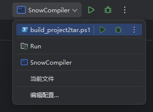

<p align="center">
  
<h1 align="center" style="margin: 30px 0 30px; font-weight: bold;">Snow编程语言</h1>

<p align="center">
<a href='https://gitee.com/jcnc-org/snow/stargazers'></img></a>
<a href='https://gitee.com/jcnc-org/snow/members'></img></a>
</p>

<p align="center">
    <a href="https://gitee.com/jcnc-org/JNotepad/blob/master/LICENSE">
        
    </a>
    <a href="https://gitee.com/jcnc-org/JNotepad/blob/master/LICENSE">
        
    </a>
</p>

<p align="center">
    <a href="https://gitee.com/jcnc-org/JNotepad/releases">
        
    </a>
    <a href="https://gitee.com/jcnc-org/JNotepad/releases">
        
    </a>
    <a href="https://gitee.com/jcnc-org/JNotepad/releases">
        
    </a>
</p>

## 项目简介

Snow 语言是一个正在发展的编程语言,采用类模块（module）语法风格,支持函数定义和类型注解。它设计目标是让大型语言模型（LLM）更容易生成和理解编程代码。该项目实现了 Snow 语言的完整编译流程,包括词法分析,语法分析,语义分析,中间表示（IR）生成以及最终的虚拟机（VM）指令生成和执行器。通过 Snow 编译器,可以将 `.snow` 源文件编译为中间表示和自定义的虚拟机指令,并在内置的虚拟机上直接运行。

## 背景理念

Snow 语言受到 LLM 驱动代码生成趋势的启发,强调简单而清晰的语法和严格的类型系统,以帮助人工智能模型更好地理解程序结构。语言使用显式的 `module` 声明来组织代码,用 `function`,`parameter`,`return_type`,`body` 等关键字分隔不同代码块,语法结构固定且易读。此外,Snow 实现了语义分析来检查变量作用域和类型一致性,在编译阶段捕获错误并确保生成的中间代码正确无误。这种自上而下的编译流程,使得代码设计和生成更加模块化,可解释,也有利于调试和优化。

相关背景: [心路历程](doc/Snow's-Journey/Snow's-Journey.md)

## 下载Snow发行版

访问:  https://gitee.com/jcnc-org/snow/releases

## 功能特性

* **模块化语法**：支持顶层的 `module:` 声明和 `import:` 导入语句,用于组织代码和依赖管理。
* **函数与类型**：支持函数定义,函数参数和返回值。在函数体中可以声明变量并进行类型检查。
* **丰富语句**：支持变量声明（`declare name:Type`,可选初始化）,条件语句（`if ... end if`）,循环语句（`loop ... end loop`）,返回语句等。
* **表达式解析**：实现了 Pratt 算法的表达式解析器,支持算术,比较和逻辑运算,以及函数调用,成员访问等操作。
* **完整编译器前端**：包含词法分析器（Lexer）,语法分析器（Parser）和语义分析器,对源代码生成抽象语法树（AST）并检查类型/作用域。
* **中间表示（IR）**：将高层 AST 转换为自定义的三地址式 IR（Intermediate Representation）,结构清晰便于后端优化。
* **后端指令生成**：IR 模块通过线性扫描寄存器分配器映射寄存器,使用指令生成器将 IR 翻译为定制的 VM 指令集。
* **虚拟机执行**：自带虚拟机引擎（VirtualMachineEngine）,能够加载并执行生成的指令序列,支持调试模式输出虚拟机状态。
* **调试与输出**：编译过程会输出源码,AST（JSON 格式）,IR 和最终生成的 VM 代码,方便用户查看编译中间结果和调试。

## 开发环境安装

1. **开发环境准备**：
    1. 安装集成开发环境 [IntelliJ IDEA](https://www.jetbrains.com/idea/download)
    2. 安装 Java 开发工具 [Graalvm-jdk-24](https://www.graalvm.org/downloads/)

2. **获取源码**：
   将项目源码下载或克隆到本地目录。
    ```bash
    git clone https://gitee.com/jcnc-org/snow.git
    ```

3. **运行项目**

     使用IDEA配置好的运行配置SnowCompiler

    

4. **运行成功**

``` snow
## 源代码 (main.snow)
module: Main
    import:Math
    function: main
        parameter:
        return_type: int
        body:
            Math.factorial(6L,1L)
            return 0
        end body
    end function
end module

## 源代码 (test.snow)
module: Math
    function: factorial
        parameter:
            declare n1: long
            declare n2: long
        return_type: long
        body:
           return n1+n2
        end body
    end function
end module

## 编译器输出
### AST
[
  {
    "type": "Module",
    "name": "Main",
    "imports": [
      {
        "module": "Math",
        "type": "Import"
      }
    ],
    "functions": [
      {
        "type": "Function",
        "name": "main",
        "parameters": [
          
        ],
        "returnType": "int",
        "body": [
          {
            "type": "ExpressionStatement",
            "expression": {
              "type": "CallExpression",
              "callee": {
                "type": "MemberExpression",
                "object": {
                  "type": "Identifier",
                  "name": "Math"
                },
                "member": "factorial"
              },
              "arguments": [
                {
                  "type": "NumberLiteral",
                  "value": "6L"
                },
                {
                  "type": "NumberLiteral",
                  "value": "1L"
                }
              ]
            }
          },
          {
            "type": "Return",
            "value": {
              "type": "NumberLiteral",
              "value": "0"
            }
          }
        ]
      }
    ]
  },
  {
    "type": "Module",
    "name": "Math",
    "imports": [
      
    ],
    "functions": [
      {
        "type": "Function",
        "name": "factorial",
        "parameters": [
          {
            "name": "n1",
            "type": "long"
          },
          {
            "name": "n2",
            "type": "long"
          }
        ],
        "returnType": "long",
        "body": [
          {
            "type": "Return",
            "value": {
              "type": "BinaryExpression",
              "left": {
                "type": "Identifier",
                "name": "n1"
              },
              "operator": "+",
              "right": {
                "type": "Identifier",
                "name": "n2"
              }
            }
          }
        ]
      }
    ]
  }
]
### IR
func main() {
  %0 = CONST 6
  %1 = CONST 1
  %2 = CALL Math.factorial, %0, %1
  %3 = CONST 0
  RET %3
}
func factorial(%0, %1) {
  %2 = ADD_L64 %0, %1
  RET %2
}

### VM code
112 6
152 0
112 1
152 1
162 0
162 1
201 12 2
152 2
111 0
151 3
161 3
255
162 0
162 1
11
152 2
162 2
202
Calling function at address: 12
Return 7
Process has ended


### VM Local Variable Table:
0: 6
1: 1
2: 7
3: 0

```
    

## 编译Snow源代码

1. **运行编译器**：
   运行 Snow 来编译 `.snow` 源文件 (Windows环境) 并且在Snow虚拟机运行,默认以 DEBUG 模式显示执行过程和状态。例如：

   ```bash
   # 单个文件编译
   Snow.exe [SnowCode].snow
   # 多个文件编译
   Snow.exe [SnowCode1].snow [SnowCode2].snow [SnowCode3].snow 
   # 目录递归编译（-d 参数）
   Snow.exe -d path/to/source_dir


   编译器会输出源代码,AST,IR 和 VM 指令等内容,并自动执行虚拟机引擎,最后打印所有局部变量的值
2. **查看 AST/IR/VM 输出**：在编译器输出中,可看到 `### AST`,`### IR` 和 `### VM code` 等分段内容。AST 部分为 JSON 格式,IR 和 VM 部分为逐行指令文本。

## 示例代码片段

以下是一个简单的 Snow 代码示例,演示模块定义,导入和函数声明的基本语法：

```snow
module: Math
    function: main
        parameter:
        return_type: int
        body:
            Math.factorial(6)
            return 0
        end body
    end function

    function: factorial
        parameter:
            declare n:int
        return_type: int
        body:
            declare num1:int = 1
            loop:
                initializer:
                    declare counter:int = 1
                condition:
                    counter <= n
                update:
                    counter = counter + 1
                body:
                    num1 = num1 * counter
                end body
            end loop
            return num1
        end body
    end function
end module

```

上述代码定义了一个名为 `Math` 的模块，其中包含两个函数：

* `main`：不接收任何参数，返回类型为 `int`。在函数体内调用了 `Math.factorial(6)`，然后返回 `0`。
* `factorial`：接收一个 `int` 类型的参数 `n`，返回类型为 `int`。函数体内先声明并初始化局部变量 `num1` 为 `1`，然后通过一个 `loop` 循环（从 `counter = 1` 到 `counter <= n`）依次将 `num1` 乘以 `counter`，循环结束后返回 `num1`，即 `n` 的阶乘值。


## 项目结构说明

* `compiler/`：Snow 编译器源代码目录

    * `cli/`：命令行接口,包括 `SnowCompiler` 主程序
    * `lexer/`：词法分析模块,负责将源码切分为 Token
    * `parser/`：语法分析模块,将 Token 流解析为 AST；包括模块解析,函数解析,语句解析等子模块
    * `semantic/`：语义分析模块,负责符号表管理,类型检查等
    * `ir/`：中间表示（IR）模块,生成和管理三地址码形式的中间代码
    * `backend/`：编译器后端模块,将 IR 翻译为虚拟机指令,包含寄存器分配和指令生成器
* `vm/`：虚拟机相关源代码目录

    * `commands/`：定义 VM 指令集的具体实现
    * `engine/`：核心执行引擎,提供指令执行和寄存器栈管理
    * `execution/`：执行流程控制（按指令顺序执行,分支跳转等）
    * `io/`：输入输出辅助类（加载指令,文件解析等）
    * 其他如 `factories/`,`utils/` 等目录包含指令创建和调试工具类

## 相关文档

[Git 管理规范](doc/Git-Management/Git-Management.md)


## 开发计划 / TODO

* 扩展标准库支持和更多内置模块,如字符串,文件操作等常用功能。
* 增强类型系统和错误检查,完善编译时诊断信息。
* 优化 IR 和虚拟机性能,实现更多优化策略（如常量折叠等）。
* 增加更多示例程序试,丰富项目文档和用例。

## 加入我们
* 微信: `xuxiaolankaka`
* QQ: `1399528359`
* E-Mail: `luke.k.xu@hotmail.com`