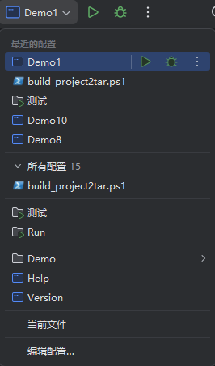

<p align="center">
  
<h1 align="center" style="margin: 30px 0 30px; font-weight: bold;">Snow编程语言</h1>

<p align="center">
<a href='https://gitee.com/jcnc-org/snow/stargazers'></a>
<a href='https://gitee.com/jcnc-org/snow/members'></a>
</p>

<p align="center">
    <a href="https://gitee.com/jcnc-org/snow/blob/main/LICENSE">
        
    </a>
    <a href="https://gitee.com/jcnc-org/snow/tree/v0.9.0/">
        
    </a>
</p>

<p align="center">
    <a href="https://gitee.com/jcnc-org/snow/releases">
        
    </a>
    <a href="https://gitee.com/jcnc-org/snow/releases">
        
    </a>
    <a href="https://gitee.com/jcnc-org/snow/releases">
        
    </a>
</p>

## 项目简介

Snow 是一门受 LLM 时代启发的、面向 AI 友好的编程语言。它设计目标是让 LLM 更容易生成和理解编程代码。

该项目实现了 Snow
语言的完整编译流程,包括词法分析,语法分析,语义分析,中间表示（IR）生成以及最终的虚拟机（VM）指令生成和执行器，提供从源码到字节码再到自研编程语言虚拟机 (
SnowVM) 的完整编译-执行链路。

通过 Snow 编译器,可以将 `.snow` 源文件编译为 `.water`虚拟机指令,并在 SnowVM 上直接运行。

从源码编译、构建管理、依赖管理、项目标准化、可视化调试面板到原生镜像发布，全部由 Snow 官方工具完成，降低学习与集成成本。

## 背景理念

Snow 语言受到 LLM 驱动代码生成趋势的启发,强调简单而清晰的语法和严格的类型系统,以帮助 LLM 更好地理解程序。

语言使用显式的 `module` 声明来组织代码,用 `function`,`params`,`returns`,`body` 等关键字分隔不同代码块,语法结构固定且易读。此外,Snow
实现了语义分析来检查变量作用域和类型一致性,在编译阶段捕获错误并确保生成的中间代码正确无误。这种自上而下的编译流程,使得代码设计和生成更加模块化,可解释,也有利于调试和优化。

相关背景: [心路历程](docs/Snow-Lang-Journey/Snow-Lang-Journey.md)

## 功能特性

| 类别       | 关键特性                                                                                              |
|----------|---------------------------------------------------------------------------------------------------|
| 语言层      | module / import / function / loop / if–else / Pratt 表达式解析<br>静态类型检查 & 作用域分析                       |
| 编译器前端    | Lexer / Parser / Semantic Analyzer 全栈自研，生成 JSON-AST                                               |
| IR & 后端  | 三地址式 IR ➜ 线性扫描寄存器分配 ➜ SnowVM 指令                                                                   |
| 虚拟机      | 栈 + 寄存器混合架构、GUI 局部变量监视                                                                            |
| snow pkg | - `.cloud` DSL 描述项目、依赖与构建<br>- 预设 `clean / compile / run / package / publish` 任务<br>- 离线缓存与远程仓库解析 |
| CLI      | init, compile,  run, clean,  build, generate,debug                                                |

## Snow-Lang 官网

[https://snow-lang.com](https://snow-lang.com)

## 下载 Snow 发行版

[https://gitee.com/jcnc-org/snow/releases](https://gitee.com/jcnc-org/snow/releases)

## 相关文档
[Snow-Lang 指南](docs/Snow-Lang-Syntax/Snow-Lang-Syntax.md)

[Snow-Lang 语法规范](docs/Snow-Lang-Syntax/Snow-Lang-Grammar-Specification.md)


[Git 管理规范](docs/Snow-Lang-Git-Management/Snow-Lang-Git-Management.md)

[SnowVM OpCode 指令表](docs/SnowVM-OpCode/SnowVM-OpCode.md)

[Snow-Lang GraalVM AOT 打包指南](docs/Snow-Lang-GraalVM-AOT-Native-Image-Package/Snow-Lang-GraalVM-AOT-Native-Image-Package.md)

## 开发计划

~~[Snow 语言现状和下一阶段开发路线图-2025-06-11-已废弃](docs/Snow-Lang-Roadmap/Snow-Lang-Roadmap-2025-06-11.md)~~

## 开发环境安装

1. **开发环境准备**: 
    1. 安装集成开发环境 [IntelliJ IDEA](https://www.jetbrains.com/idea/download)
    2. 安装 Java 开发工具 [Graalvm-jdk-24](https://www.graalvm.org/downloads/)

2. **获取源码**: 
   将项目源码下载或克隆到本地目录。
    ```bash
    git clone https://gitee.com/jcnc-org/snow.git
    ```

3. **运行项目**

   使用IDEA配置好的运行配置 `Demo1`

   

4. **运行成功**
    
    `````snow   
    ## 编译器输出
    ### Snow 源代码
    #### Main.snow
    module: Main
        import:Math
        function: main
            returns: int
            body:
                Math.add(6,1)
                return 0
            end body
        end function
    end module
    line   col    type             lexeme
    ----------------------------------------------------
    1      1      KEYWORD          module
    1      7      COLON            :
    1      9      IDENTIFIER       Main
    1      13     NEWLINE          \n
    
    2      5      KEYWORD          import
    2      11     COLON            :
    2      12     IDENTIFIER       Math
    2      16     NEWLINE          \n
    
    3      5      KEYWORD          function
    3      13     COLON            :
    3      15     IDENTIFIER       main
    3      19     NEWLINE          \n
    
    4      9      KEYWORD          returns
    4      20     COLON            :
    4      22     TYPE             int
    4      25     NEWLINE          \n
    
    5      9      KEYWORD          body
    5      13     COLON            :
    5      14     NEWLINE          \n
    
    6      13     IDENTIFIER       Math
    6      17     DOT              .
    6      18     IDENTIFIER       add
    6      21     LPAREN           (
    6      22     NUMBER_LITERAL   6
    6      23     COMMA            ,
    6      24     NUMBER_LITERAL   1
    6      25     RPAREN           )
    6      26     NEWLINE          \n
    
    7      13     KEYWORD          return
    7      20     NUMBER_LITERAL   0
    7      21     NEWLINE          \n
    
    8      9      KEYWORD          end
    8      13     KEYWORD          body
    8      17     NEWLINE          \n
    
    9      5      KEYWORD          end
    9      9      KEYWORD          function
    9      17     NEWLINE          \n
    
    10     1      KEYWORD          end
    10     5      KEYWORD          module
    10     1      EOF              
    ## 词法分析通过，没有发现错误
    
    #### Math.snow
    module: Math
        function: add
            params:
                declare n1: int
                declare n2: int
            returns: int
            body:
               return n1 + n2
            end body
        end function
    end module
    line   col    type             lexeme
    ----------------------------------------------------
    1      1      KEYWORD          module
    1      7      COLON            :
    1      9      IDENTIFIER       Math
    1      13     NEWLINE          \n
    
    2      5      KEYWORD          function
    2      13     COLON            :
    2      15     IDENTIFIER       add
    2      18     NEWLINE          \n
    
    3      9      KEYWORD          params
    3      18     COLON            :
    3      19     NEWLINE          \n
    
    4      13     KEYWORD          declare
    4      21     IDENTIFIER       n1
    4      23     COLON            :
    4      25     TYPE             int
    4      28     NEWLINE          \n
    
    5      13     KEYWORD          declare
    5      21     IDENTIFIER       n2
    5      23     COLON            :
    5      25     TYPE             int
    5      28     NEWLINE          \n
    
    6      9      KEYWORD          returns
    6      20     COLON            :
    6      22     TYPE             int
    6      25     NEWLINE          \n
    
    7      9      KEYWORD          body
    7      13     COLON            :
    7      14     NEWLINE          \n
    
    8      12     KEYWORD          return
    8      19     IDENTIFIER       n1
    8      22     PLUS             +
    8      24     IDENTIFIER       n2
    8      26     NEWLINE          \n
    
    9      9      KEYWORD          end
    9      13     KEYWORD          body
    9      17     NEWLINE          \n
    
    10     5      KEYWORD          end
    10     9      KEYWORD          function
    10     17     NEWLINE          \n
    
    11     1      KEYWORD          end
    11     5      KEYWORD          module
    11     1      EOF        
    
    ## 词法分析通过，没有发现错误
    
    ## 语义分析通过，没有发现错误
    
    ### AST
    [
      {
        "type": "Module",
        "name": "Main",
        "imports": [
          {
            "type": "Import",
            "module": "Math"
          }
        ],
        "functions": [
          {
            "type": "Function",
            "name": "main",
            "parameters": [
              
            ],
            "returnType": "int",
            "body": [
              {
                "type": "ExpressionStatement",
                "expression": {
                  "type": "CallExpression",
                  "callee": {
                    "type": "MemberExpression",
                    "object": {
                      "type": "Identifier",
                      "name": "Math"
                    },
                    "member": "add"
                  },
                  "arguments": [
                    {
                      "type": "NumberLiteral",
                      "value": "6"
                    },
                    {
                      "type": "NumberLiteral",
                      "value": "1"
                    }
                  ]
                }
              },
              {
                "type": "Return",
                "value": {
                  "type": "NumberLiteral",
                  "value": "0"
                }
              }
            ]
          }
        ]
      },
      {
        "type": "Module",
        "name": "Math",
        "imports": [
          
        ],
        "functions": [
          {
            "type": "Function",
            "name": "add",
            "parameters": [
              {
                "name": "n1",
                "type": "int"
              },
              {
                "name": "n2",
                "type": "int"
              }
            ],
            "returnType": "int",
            "body": [
              {
                "type": "Return",
                "value": {
                  "type": "BinaryExpression",
                  "left": {
                    "type": "Identifier",
                    "name": "n1"
                  },
                  "operator": "+",
                  "right": {
                    "type": "Identifier",
                    "name": "n2"
                  }
                }
              }
            ]
          }
        ]
      }
    ]
    ### IR
    func main() {
      %0 = CONST 6
      %1 = CONST 1
      %2 = CALL Math.add, %0, %1
      %3 = CONST 0
      RET %3
    }
    func add(%0, %1) {
      %2 = ADD_I32 %0, %1
      RET %2
    }
    
    ### VM code
    0000: I_PUSH     6
    0001: I_STORE    0
    0002: I_PUSH     1
    0003: I_STORE    1
    0004: I_LOAD     0
    0005: I_LOAD     1
    0006: CALL       13 2
    0007: I_STORE    2
    0008: I_PUSH     0
    0009: I_STORE    3
    0010: I_LOAD     3
    0011: HALT       
    0012: HALT       
    0013: I_LOAD     0
    0014: I_LOAD     1
    0015: I_ADD      
    0016: I_STORE    2
    0017: I_LOAD     2
    0018: RET        
    0019: RET        
    Written to D:\Devs\IdeaProjects\Snow\target\Demo1.water
    
    === Launching VM ===
    
    Calling function at address: 13
    
    Return 7
    
    Process has ended

    Operand Stack state:[0]
    
    --- Call Stack State ---
    
    ### VM Local Variable Table:
    0: 6
    1: 1
    2: 7
    3: 0
    
    === VM exited ===
    `````
    
## 编译 Snow 源代码

### 1. 独立编译 (Standalone Compilation)

独立编译不依赖 `.cloud` 文件，而是直接使用 `Snow` 编译器进行 `.snow` 文件的编译和执行。

#### 独立编译步骤: 

1. **运行编译器:**
   你可以通过以下命令来编译单个或多个 `.snow` 文件，或者递归编译一个目录中的所有 `.snow` 源文件为`.water`虚拟机指令。

    * **单个文件编译:**

      ```bash
      Snow complete [SnowCode].snow
      ```

    * **多个文件编译:**

      ```bash
      Snow complete [SnowCode1].snow [SnowCode2].snow [SnowCode3].snow -o [Name]
      ```

    * **目录递归编译:**

      ```bash
      Snow -d path/to/source_dir
      ```

2. **查看编译输出:**
   编译过程会输出源代码、抽象语法树（AST）、中间表示（IR）以及虚拟机指令等内容。你可以看到如下几个分段输出: 

    * **AST**（抽象语法树）部分以 JSON 格式输出。
    * **IR**（中间表示）部分会列出逐行的中间代码。
    * **VM code**（虚拟机指令）会展示虚拟机的字节码指令。

3. **默认执行模式:**
   编译器会在 **RUN 模式** 下运行，**DEBUG 模式**显示详细的执行过程和状态，并且在虚拟机中执行编译后的代码，最后会打印出所有局部变量的值。

---

### 2. **集成编译 (Integrated Compilation)**

集成编译需要使用 `.cloud` 文件来指定项目的配置和结构，适用于项目标准化、依赖管理、构建管理和项目分发等场景。

#### 集成编译命令: 

1. **基本用法:**

   ```bash
     snow [OPTIONS] <command>
   ```

2. **命令选项:**

    * `-h, --help`: 显示帮助信息并退出。
    * `-v, --version`: 打印 Snow 编程语言的版本并退出。

3. **可用命令:**

    * `compile`: 将 `.snow` 源文件编译成虚拟机字节码文件（`.water`）。此命令会使用 `.cloud` 文件来指导编译过程。
    * `clean`: 清理构建输出和本地缓存，移除中间产物，释放磁盘空间。
    * `version`: 打印 Snow 的版本。
    * `run`: 运行已编译的虚拟机字节码文件（`.water`）。
    * `init`: 初始化一个新项目，生成 `project.cloud` 文件。
    * `generate`: 根据 `project.cloud` 生成项目目录结构。
    * `build`: 构建当前项目，按顺序解析依赖、编译和打包。

4. **例如，执行集成编译命令:**

   ```bash
   snow compile [SnowCode].snow
   ```

    * 此命令会使用 `.cloud` 文件中的配置信息来指导编译过程，并生成 `.water`。

5. **使用帮助:**
   如果你需要了解某个命令的详细选项，可以使用: 

   ```bash
   snow <command> --help
   ```

   例如，查看 `compile` 命令的具体选项: 

   ```bash
   snow compile --help
   ```

---

## 示例代码片段

以下是一个简单的 Snow 代码示例,演示模块定义,导入和函数声明的基本语法: 

```snow
module: Math
    function: main
        returns: int
        body:
            Math.factorial(6)
            return 0
        end body
    end function

    function: factorial
        params:
            declare n:int
        returns: int
        body:
            declare num1:int = 1
            loop:
                init:
                    declare counter:int = 1
                cond:
                    counter <= n
                step:
                    counter = counter + 1
                body:
                    num1 = num1 * counter
                end body
            end loop
            return num1
        end body
    end function
end module
```

上述代码定义了一个名为 `Math` 的模块，其中包含两个函数: 

* `main`: 不接收任何参数，返回类型为 `int`。在函数体内调用了 `Math.factorial(6)`，然后返回 `0`。
* `factorial`: 接收一个 `int` 类型的参数 `n`，返回类型为 `int`。函数体内先声明并初始化局部变量 `num1` 为 `1`，然后通过一个
  `loop` 循环（从 `counter = 1` 到 `counter <= n`）依次将 `num1` 乘以 `counter`，循环结束后返回 `num1`，即 `n` 的阶乘值。


> 更多示例代码见 [playground 目录](https://gitee.com/jcnc-org/snow/tree/main/playground) 

## 项目结构说明

* `compiler/`: Snow 编译器源代码目录

    * `lexer/`: 词法分析模块，负责将源码切分为 Token
    * `parser/`: 语法分析模块，将 Token 流解析为 AST（含模块/函数/语句解析）
    * `semantic/`: 语义分析模块，负责符号表管理、类型检查等
    * `ir/`: 中间表示（IR）模块，生成并管理三地址码形式的中间代码
    * `backend/`: 编译器后端模块，将 IR 翻译为虚拟机指令，包含寄存器分配和指令生成器

* `vm/`: 虚拟机相关源代码目录

    * `commands/`: 定义 SnowVM 指令集的具体实现
    * `engine/`: 核心执行引擎，提供指令执行和寄存器/栈管理
    * `execution/`: 执行流程控制（按指令顺序执行、分支跳转等）
    * `io/`: 输入输出辅助类（加载指令、文件解析等）
    * `gui/`: Swing 可视化调试面板，实时展示局部变量表
    * `factories/`、`utils/`: 指令创建、日志调试等公共工具

* `pkg/`: 内置构建与包管理器 **snow pkg**

    * `dsl/`: `.cloud` 描述文件解析器
    * `tasks/`: 预设任务实现（`clean · compile · run · package · publish` 等）
    * `resolver/`: 本地/远程仓库解析与缓存
    * `lifecycle/`: 任务生命周期钩子（pre/post 脚本等）
    * `model/`: 项目、依赖、版本等模型
    * `utils/`: 文件、日志、校验和等通用工具
    * `doc/`: 开发者文档与示例 `.cloud` 配置

* `cli/`: 独立的命令行前端

    * `commands/`: `compile` / `run` / `pkg` 等子命令实现
    * `api/`: 公共选项解析、终端交互抽象
    * `utils/`: 终端颜色、进度条、异常格式化等
    * `SnowCLI.java`: CLI 主入口


## 版权声明

版权所有 © 2025 许轲（Luke），代表 SnowLang 项目。  
仓库地址: <https://gitee.com/jcnc-org/snow>  
本项目依据 [Apache 2.0 许可证](LICENSE) 进行许可和发布。

“SnowLang 项目”为由许轲（Luke）发起的独立开源项目。  
未来，项目可能会成立正式的组织或实体，以进一步负责本项目的开发和管理。

## 支持我们

如果你喜欢我们的项目，欢迎给我们一个 Star！  
你们的关注和支持，是我们团队持续进步的动力源泉！谢谢大家！


## 加入我们

- 微信: `xuxiaolankaka`
- QQ: `1399528359`
- 邮箱: `luke.k.xu [at] hotmail.com`

