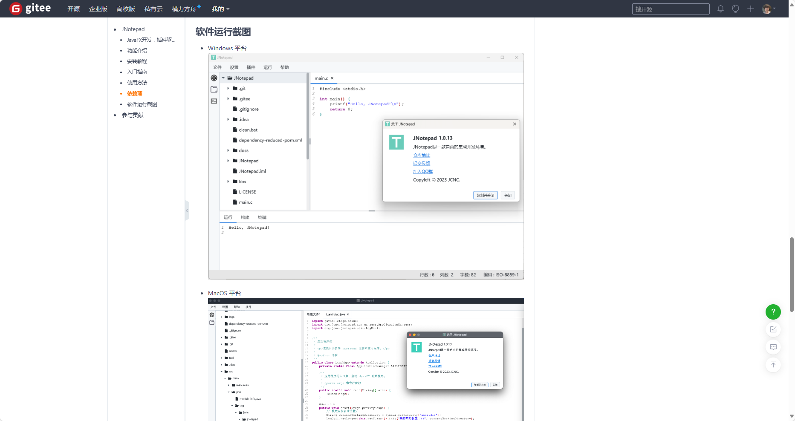

# 1. Snow 心路历程

## 1.1 Snow 简介

由 Java 语言编写的虚拟机与编译器，专为大型语言模型（LLM）量身定制的编程语言。
[项目链接](https://gitee.com/jcnc-org/snow)

## 1.2 背景与目标读者

自 ChatGPT 3.5 诞生以来，越来越多的个人和企业将 LLM 生成的代码融入日常开发与自动化。然而，实践证明：LLM 生成的代码虽然“看起来没问题”，却常因对底层语言细节把握不准导致微妙 Bug——比如运算符优先级混淆、作用域处理错误、甚至基础库调用都无法编译通过。

于是，我萌生了这样一个想法：**能否设计一门编程语言，让 LLM 在“语法层面”能够更精准、高效地理解和生成代码？**

传统编程语言的设计多偏重“计算机”的执行效率，程序员往往在抽象表达和底层性能之间不断权衡。Ruby 之父松本行弘提出“为人而不是为机器编程”的理念。而在 LLM 日益普及的今天，我们应当承认：大型模型正成为“超级程序员”，它们不仅是助手，更是“代码生产的中介”。如果一门语言的语法和设计能最大化发挥 LLM 的推理与生成能力，人机协作的效率将被极大提升。

因此，**Snow** 的使命是：让脚本语言不再“让人头疼”，而是“让 LLM 更加从容地书写”。目标受众涵盖 LLM 爱好者、开发者、对编译原理感兴趣的学生，以及对性能有追求的工程师甚至是初学者——每个人都能在 Snow 中找到乐趣与成长。

## 1.3 文章目的

本文将带你完整体验 Snow 从零到 v0.1 的诞生历程，围绕四个核心目标：

* **兴趣驱动的坚持**：用真实经历激励更多人相信“兴趣是最好的动力”，哪怕工作再忙，也能靠热爱坚持探索。
* **从规划到实践的拆解**：详解在有限资源下，如何一步步拆解出词法分析、语法解析、AST 构建、解释执行等关键模块，以“先可用后完备”为原则，稳步推进。
* **经验与反思**：不仅有“成功输出 1+1=2”的成就感，也有调试死循环、运算符冲突等踩坑经历，全方位展示编程语言设计的挑战与思考。
* **激励与号召**：希望 Snow 成为开源社区的新起点，邀请更多伙伴参与，见证从 v0.2、v1.0 甚至到未来并发、标准库、包管理等更大梦想的实现。

---

# 2. 项目缘起与动机

## 2.1 现有工具的痛点

* **脚本语言过于灵活，缺乏规范**
  常见的脚本语言如 Python、PHP、Ruby，虽然语法简洁、上手快，但“灵活性”本身也带来了不少隐患：变量类型可以随意变化，作用域和命名规则宽松，团队协作时代码风格极易失控，隐蔽 Bug 难以及时发现。自动化运维和日常数据处理脚本往往随手一写，维护与交接时却漏洞百出、沟通成本高。许多开发者都在思考：如果有一门语法严谨、行为可预测，并天然适合团队协作与 LLM 生成的脚本语言，是不是能让代码质量和工程效率都上一个台阶？

* **缺乏专为 LLM 设计的脚本语言**
  当下主流编程语言，基本都是“为人类程序员”而设计，很少考虑 LLM 的生成和推理习惯。比如：部分语法容易混淆，作用域和可见性规则不直观，LLM 在生成时不仅需要大量提示，结果还常常不理想。缺少一门语法清晰、特征单一、对 LLM 友好的脚本语言，导致自动化和智能生成代码场景下，仍然存在很多不可控和效率瓶颈。

## 2.2 触发想法的场景

* **对高效与规范的需求日益突出**
  在实际开发和运维工作中，我们经常要写各种自动化脚本。由于编程语言过于灵活，代码风格极易失控，维护起来痛苦不堪。团队中常常讨论：能否有一门语法严谨、易于规范化、适合团队协作的脚本语言？大家都希望提升代码质量，减少后期返工。

* **自研编程语言的大胆设想**
  随着 LLM 在自动化、辅助编程中的应用普及，越来越多场景下希望直接“让 LLM 写代码”。但事实是，不管是让 LLM 生成 Python 还是 PHP，总要写很多提示，还要人工修正各种细节。由此引发思考：如果有一门对 LLM 友好的脚本语言，语法特征清晰、行为可预测，能不能大幅提升代码自动生成与落地的效率？


## 2.3 项目愿景

* **语法严谨、协作友好，降低维护成本**
  Snow 的首要目标是打造一门结构清晰、语法规范的编程语言，让团队成员在协作开发、交接维护脚本时，不再被各式各样的“灵活写法”困扰。通过约定明确、易读易写的语法，让代码风格自然统一，极大降低维护与沟通成本。

* **为 LLM 生成量身设计，提升自动化与智能化编程体验**
  Snow 从设计之初就充分考虑大型语言模型（LLM）的生成与理解特性，语法特征清晰、指令表达直观，方便 LLM 高效、准确地生成编程语言。无论是日常自动化、数据处理，还是和 LLM 配合进行代码批量生产、校验，都能极大提升人机协作效率。

* **轻量高效，逐步扩展性能与生态**
  在保证“开箱即用”的体验前提下，Snow 注重执行效率，力争做到比传统解释型脚本更快、资源占用更低。随着版本迭代，将逐步引入并发机制、标准库扩展以及跨平台支持，让 Snow 既可嵌入大型系统、也适合高效开发微服务或日常自动化脚本，最终发展为既利于团队协作，也能支撑 LLM 驱动智能开发的现代编程语言。

---

# 3. 开源决策与第一次公开

## 3.1 为什么开源

* **获得社区反馈，检验设计思路**：闭门造车易“自嗨”，开源能快速获得用户和专家的多视角建议。
* **边开源边完善，更吸引贡献者**：功能精简但可用时就发布，容易吸引早期用户参与共建。

## 3.2 开源准备工作

* **许可证选择**：
  采用 [Apache-2.0](https://gitee.com/jcnc-org/snow/blob/main/LICENSE)，最大程度降低贡献门槛。

## 3.3 项目运行输出
``` Snow
## 源代码 (main.snow)
module: Main
    import:Math
    function: main
        parameter:
        return_type: int
        body:
            Math.factorial(6L,1L)

            return 0
        end body
    end function

end module

## 源代码 (test.snow)
module: Math
    function: factorial
        parameter:
            declare n1: long
            declare n2: long
        return_type: long
        body:
           return n1+n2
        end body
    end function
end module

## 编译器输出
### AST
[
  {
    "type": "Module",
    "name": "Main",
    "imports": [
      {
        "module": "Math",
        "type": "Import"
      }
    ],
    "functions": [
      {
        "type": "Function",
        "name": "main",
        "parameters": [
          
        ],
        "returnType": "int",
        "body": [
          {
            "type": "ExpressionStatement",
            "expression": {
              "type": "CallExpression",
              "callee": {
                "type": "MemberExpression",
                "object": {
                  "type": "Identifier",
                  "name": "Math"
                },
                "member": "factorial"
              },
              "arguments": [
                {
                  "type": "NumberLiteral",
                  "value": "6L"
                },
                {
                  "type": "NumberLiteral",
                  "value": "1L"
                }
              ]
            }
          },
          {
            "type": "Return",
            "value": {
              "type": "NumberLiteral",
              "value": "0"
            }
          }
        ]
      }
    ]
  },
  {
    "type": "Module",
    "name": "Math",
    "imports": [
      
    ],
    "functions": [
      {
        "type": "Function",
        "name": "factorial",
        "parameters": [
          {
            "type": "long",
            "name": "n1"
          },
          {
            "type": "long",
            "name": "n2"
          }
        ],
        "returnType": "long",
        "body": [
          {
            "type": "Return",
            "value": {
              "type": "BinaryExpression",
              "left": {
                "type": "Identifier",
                "name": "n1"
              },
              "operator": "+",
              "right": {
                "type": "Identifier",
                "name": "n2"
              }
            }
          }
        ]
      }
    ]
  }
]
### IR
func main() {
  %0 = CONST 6
  %1 = CONST 1
  %2 = CALL Math.factorial, %0, %1
  %3 = CONST 0
  RET %3
}
func factorial(%0, %1) {
  %2 = ADD_L64 %0, %1
  RET %2
}

### VM code
112 6
152 0
112 1
152 1
162 0
162 1
201 12 2
152 2
111 0
151 3
161 3
255
162 0
162 1
11
152 2
162 2
202
Calling function at address: 12
Return 7
Process has ended


### VM Local Variable Table:
0: 6
1: 1
2: 7
3: 0
```

---

# 4. 从 v0.1 到 v0.2 / v1.0 的计划与展望

## 4.1 v0.2 初步目标

1. **完善变量作用域与高级函数调用**：
   支持函数参数、返回值、本地与全局变量隔离，以及闭包基础，为并发/异步打基础。
2. **完善错误提示与调试信息**：
   报错更精准，方便新手调试。
3. **预计发布日期：2025 年 7 月 30 日**

## 4.2 v0.3 目标
1. **IDE的支持**
   重构和优化[JCNC开源社区](https://gitee.com/jcnc-org)的[JNotepad](https://gitee.com/jcnc-org/JNotepad),实现Snow官方IDE的发布。
   
   

## 4.3 v1.0 长期规划

1. **初步标准库**：
   I/O、字符串、JSON、文件系统，满足日常脚本需求。
2. **包管理与模块加载**：
   设计 `snowpkg`，支持一键安装依赖、自动模块导入。
3. **社区协作与贡献**：
   开设设计讨论区、每月线上分享，鼓励贡献代码与案例，让更多人参与 Snow 的成长。

---

# 5. 个人感言与号召

## 5.1 学习收获与成就感

回望从零到 v0.1 的历程,我最开始设计了虚拟机,然后设计的编译器，最震撼的是：让一个想法变成可运行的代码，哪怕只输出一句“Hello, Snow!”也足以令人热血沸腾。每一次 Snow 在屏幕上输出，都让我更深刻理解了编译原理的乐趣。

## 5.2 技术敬畏与情感共鸣

也许有人会说“输出一句话算什么”，但其实，每一个简单的表达式背后，都凝结了无数技术细节：多字符运算符的处理、优先级解析、AST 与符号表、作用域管理、底层 GC 可行性……每一环都让人敬畏计算机科学之美。

## 5.3 欢迎你的加入

真诚邀请所有对编程语言、编译原理、LLM 应用感兴趣的小伙伴：

1. 在 Gitee 提交 Issue，反馈使用体验和建议；
2. Fork 仓库、贡献 PR，参与语法和功能共建；
3. 加入讨论群，与社区探讨 Snow 如何更适配 LLM 未来需求；
4. 撰写教程、录制视频，让更多人了解 Snow 的故事。

> 联系方式(直接和作者对话和加入群聊):
> 微信: xuxiaolankaka
> QQ: 1399528359

对于从未写过语言的初学者，我想说：**不要害怕，从 Hello World 开始，你会发现编译原理其实很有趣。** 让我们一起，把 Snow 打造为兼顾 LLM 友好和人类易用的创新编程语言。也许，下一个改变编程世界的创举，就在我们手中诞生。

---

> **致谢**
> 感谢每一位为 Snow 提出建议、陪我深夜调试的朋友。是你们的批评与鼓励，让 Snow 一路成长。让我们共同期待 Snow 走得更远、更高、更强！