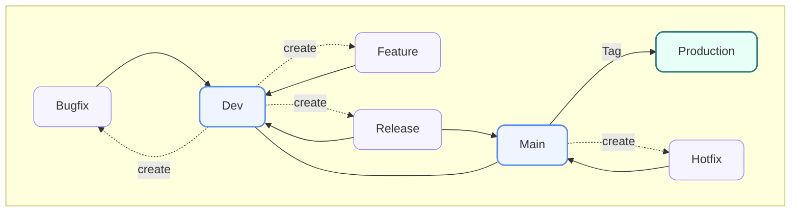
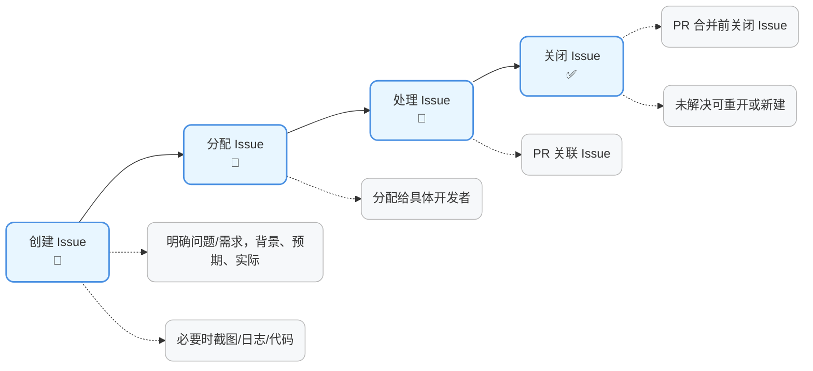

# Snow 项目 Git 管理规范

## 1. 版本控制基础

本项目使用 Git 进行版本控制，并遵循以下基本原则: 

* 所有代码更改必须通过 Git 提交，并推送至远程仓库。
* 每次提交必须包括清晰、简洁且具描述性的提交信息，确保团队成员能够轻松理解变更的目的和内容。
* 严禁直接在 `main` 分支上进行开发。所有功能开发必须通过独立分支进行。

## 2. 分支管理

本项目采用以下分支策略进行代码管理，分为 **主线分支（长期存在）** 和 **辅助分支（短期存在）** 两个层级。

### 2.1 主线分支（长期存在）

#### `main` 分支

* **用途**:

    * 始终保持项目的稳定版本；
    * 此分支的代码随时可以部署到生产环境。

* **更新规则**:

    * 严禁直接在 `main` 分支上开发；
    * 仅允许经过充分测试并审查的代码合并；
    * 每次从 `release` 分支合并到 `main` 后，必须打上版本标签。

#### `dev` 分支

* **用途**:

    * 集成分支，是所有开发工作的汇集点；
    * 所有新功能和修复分支都应合并至 `dev` 进行集成测试。

* **更新规则**:

    * 功能开发完成后 → 合并至 `dev` ；
    * `dev` 分支应保持可运行状态，避免不稳定代码长期停留。

### 2.2 辅助分支（短期存在，用完即删）

#### 功能分支 (`feature/*`)

* **用途**:

    * 用于新功能开发，每个功能一个独立分支。

* **命名规范**:

    * `feature/功能描述`，如: `feature/ast-folding`、`feature/user-cli`；
    * 分支名称统一使用小写字母，单词间用破折号（`-`）分隔。

* **开发流程**:

    1. 从 `dev` 分支拉取最新代码并创建分支；
    2. 完成功能开发后，本地提交并推送到远程仓库；
    3. 创建拉取请求（PR），合并回 `dev` 分支。

#### 修复分支 (`bugfix/*`)

* **用途**:

    * 用于修复一般性 Bug；

* **命名规范**:

    * `bugfix/bug描述`，如: `bugfix/fix-ast-error`。
    * 分支名称统一使用小写字母，单词间用破折号（`-`）分隔。

* **开发流程**:

    1. 从 `dev` 分支拉取最新代码；
    2. 完成修复后提交并推送到远程仓库；
    3. 创建拉取请求（PR），合并回相应分支。

#### 发布分支 (`release/*`)

* **用途**:

    * 用于版本发布的准备（文档更新、版本号调整等）；
    * 保证发布过程稳定，不受未完成功能的影响。

* **命名规范**:

    * `release/vX.X.X`，如: `release/v1.0.0`。

* **开发流程**:

    1. 从 `dev` 分支创建 `release` 分支；
    2. 在 `release` 分支完成发布前准备工作（文档、版本号、配置修改等）；
    3. 准备完成后，将 `release` 分支合并至 `main` 后打上版本标签；
    4. 将 `release` 分支变更同步合并回 `dev`，保证开发分支与主分支一致。

#### 热修复分支 (`hotfix/*`)

* **用途**:

    * 用于生产环境中的紧急问题修复（如严重 Bug、系统崩溃等）；
    * 保证在最短时间内修复并恢复服务。

* **命名规范**:

    * `hotfix/bug描述`，如: `hotfix/fix-production-crash`。

* **开发流程**:

    1. 从 `main` 分支创建 `hotfix` 分支，保证包含生产环境的最新稳定版本；
    2. 在 `hotfix` 分支完成修复并提交推送；
    3. 创建拉取请求（PR），将 `hotfix` 分支合并至 `main` 并打上版本标签；
    4. 同时将修复内容合并回 `dev`，避免后续开发再次出现同样问题；
    5. **回滚策略**：若修复未能解决问题，立即回滚合并，删除 `hotfix` 分支并通知团队，确保不影响生产环境。

### 2.7 分支流程图




#### 简要说明

* **主流程**：所有开发都在 `feature/` 或 `bugfix/` 分支，合并至 `dev`，再经过 `release/` 到 `main`。
* **发布**：`release/` 分支只用于准备发布，合并后要打 Tag 并同步回 `dev`。
* **热修复**：`hotfix/` 从 `main` 分支拉出，紧急修复后要同时同步回 `main` 和 `dev`。
* **所有分支** 通过 **PR** 合并，需经过代码审查。


## 3. 提交规范

为确保提交信息清晰且易于理解，遵循以下提交规范: 

### 3.1 提交信息格式

提交信息应简洁且具有描述性，格式如下: 

```
[类型] 描述

详细描述（可选）
```

#### 提交类型

* `feat`: 新增功能
* `fix`: 修复 Bug
* `docs`: 文档更新
* `style`: 代码格式调整（不影响功能）
* `refactor`: 代码重构
* `test`: 增加/修改测试
* `chore`: 工具配置等其他杂项任务
* `ci`: 持续集成相关改动
* `perf`: 性能优化

#### 示例

* `feat: 添加 IR 折叠功能`
* `fix: 修复问题 Y（原因: X bug，解决方案: Z）`
* `docs: 更新 API 文档`
* `refactor: 优化 AST 逻辑`

### 3.2 提交实践

* 提交时，请确保代码已完成并通过所有相关测试。
* 每次提交应仅包含少量且相关的变更，避免一次性提交过多内容，以便于追踪和管理。

## 4. 拉取请求（PR）与代码审查

### 4.1 拉取请求流程

1. 开发者在完成功能或修复后，创建 PR，将其分支合并至 `dev` 或 `main` 分支。
2. 其他团队成员进行代码审查，重点检查代码质量、功能完整性。
3. 审查通过后，PR 将被合并,PR 合并后删除 `feature/bugfix` 分支，避免仓库臃肿。

### 4.2 代码审查

* 所有 PR 必须经过至少一名开发者的代码审查。
* 审查时应关注以下方面: 

  * 代码是否符合项目的编码规范。
  * 是否提供了足够的单元测试覆盖。
  * 是否存在冗余代码或复杂度过高的部分。
  * 功能是否按预期工作。
  * 审查者应在 PR 中提供反馈，确保代码质量高，符合团队要求。

## 5. 版本发布

版本发布基于 Git 标签，发布流程如下: 

### 5.1 打标签

每当版本准备发布时，应在 `main` 分支上打上版本标签: 

* **版本号规则**:
  采用语义化版本控制（SemVer）格式，版本号由三部分组成:
  `主版本号.次版本号.修订号`（例如: `v1.0.0`）。

    * **主版本号（Major）**：当做了**不兼容的 API 变更**，或有较大重构影响使用方式时，递增主版本号，例如 `v2.0.0`。
    * **次版本号（Minor）**：当新增了**向下兼容的新功能**，且未破坏已有接口时，递增次版本号，例如 `v1.1.0`。
    * **修订号（Patch）**：当进行**向下兼容的问题修复或小改进**，递增修订号，例如 `v1.0.1`。

* **标签命令**:

  ```bash
  git tag v1.0.0
  git push origin v1.0.0
  ```

### 5.2 发布流程

1. 确保所有功能已合并至 `dev` 分支，并通过集成测试。
2. 从 `dev` 分支创建 `release` 分支，进行版本发布的准备工作。
3. 在 `release` 分支上完成最终修改，如文档更新和版本号调整。
4. 将 `release` 分支合并至 `main` 并打上版本标签。
5. 将 `release` 分支的变更合并回 `dev`，确保所有修复和改动在开发分支中得到同步。

### 5.3 发布后

* 发布版本后，团队成员应确保将 `main` 分支的最新代码拉取到本地，以保持代码库的同步。
* 如出现生产环境问题，应及时创建 `hotfix` 分支进行紧急修复，并尽快发布。


## 6. Issue

### 6.1 Issue 介绍

* **用途**:
  Issue 用于跟踪项目中的任务、功能需求、Bug 报告以及改进建议。
  每个 Issue 都应有明确的描述，方便开发者理解并处理。

* **基本要求**:

    * 每个功能开发、Bug 修复都应有对应的 Issue。
    * 在提交 PR 时，应在描述中关联对应的 Issue（如 `close #123` 或 `resolve #123`）。
    * Issue 状态应及时更新，避免长期挂起。


### 6.2 Issue 分类

<table style="border-collapse:separate;border-spacing:0;width:100%;font-size:15px;">
  <tr>
    <th style="background:#f5f7fa;color:#222;font-weight:bold;padding:8px 12px;">标签</th>
    <th style="background:#f5f7fa;color:#222;font-weight:bold;padding:8px 12px;">分组</th>
    <th style="background:#f5f7fa;color:#222;font-weight:bold;padding:8px 12px;">说明</th>
    <th style="background:#f5f7fa;color:#222;font-weight:bold;padding:8px 12px;">用途举例</th>
  </tr>
  <tr>
    <td style="padding:6px 14px;"><code>bug</code></td>
    <td style="padding:6px 14px;">类型</td>
    <td style="padding:6px 14px;">缺陷或错误修复</td>
    <td style="padding:6px 14px;">修复功能异常、错误行为</td>
  </tr>
  <tr>
    <td style="padding:6px 14px;"><code>feature</code></td>
    <td style="padding:6px 14px;">类型</td>
    <td style="padding:6px 14px;">新功能开发</td>
    <td style="padding:6px 14px;">开发新模块、新接口</td>
  </tr>
  <tr>
    <td style="padding:6px 14px;"><code>enhancement</code></td>
    <td style="padding:6px 14px;">类型</td>
    <td style="padding:6px 14px;">功能改进或优化</td>
    <td style="padding:6px 14px;">性能优化、界面优化</td>
  </tr>
  <tr>
    <td style="padding:6px 14px;"><code>documentation</code></td>
    <td style="padding:6px 14px;">类型</td>
    <td style="padding:6px 14px;">文档相关</td>
    <td style="padding:6px 14px;">修改/补充文档</td>
  </tr>
  <tr>
    <td style="padding:6px 14px;"><code>test</code></td>
    <td style="padding:6px 14px;">类型</td>
    <td style="padding:6px 14px;">测试相关</td>
    <td style="padding:6px 14px;">单元测试、集成测试</td>
  </tr>
  <tr>
    <td style="padding:6px 14px;"><code>question</code></td>
    <td style="padding:6px 14px;">类型</td>
    <td style="padding:6px 14px;">需要进一步澄清</td>
    <td style="padding:6px 14px;">提问、需求澄清</td>
  </tr>
  <tr>
    <td style="padding:6px 14px;"><code>wontfix</code></td>
    <td style="padding:6px 14px;">类型</td>
    <td style="padding:6px 14px;">不会修复</td>
    <td style="padding:6px 14px;">不予处理的问题</td>
  </tr>
  <tr>
    <td style="padding:6px 14px;background:#f6fffa;"><code>high</code></td>
    <td style="padding:6px 14px;background:#f6fffa;">优先级</td>
    <td style="padding:6px 14px;background:#f6fffa;">高优先级，需立即处理</td>
    <td style="padding:6px 14px;background:#f6fffa;">紧急缺陷、重大阻塞</td>
  </tr>
  <tr>
    <td style="padding:6px 14px;background:#f6fffa;"><code>medium</code></td>
    <td style="padding:6px 14px;background:#f6fffa;">优先级</td>
    <td style="padding:6px 14px;background:#f6fffa;">中等优先级，近期处理</td>
    <td style="padding:6px 14px;background:#f6fffa;">普通功能需求</td>
  </tr>
  <tr>
    <td style="padding:6px 14px;background:#f6fffa;"><code>low</code></td>
    <td style="padding:6px 14px;background:#f6fffa;">优先级</td>
    <td style="padding:6px 14px;background:#f6fffa;">低优先级，长期计划</td>
    <td style="padding:6px 14px;background:#f6fffa;">次要改进、未来规划</td>
  </tr>
</table>


### 6.3 Issue 流程

1. **创建 Issue**

    * 明确问题或需求，写清楚背景、预期结果和实际情况。
    * 必要时提供截图、日志或代码片段。

2. **分配 Issue**

    * 项目负责人或团队成员可将 Issue 分配给具体开发者。
    * 复杂的 Issue 建议先进行评估，再拆分为子任务。

3. **处理 Issue**

    * 开发者在新建分支（如 `feature/*`、`bugfix/*`、`hotfix/*`）时，应在分支说明或 PR 中关联对应的 Issue。
    * 处理完成后，提交 PR 并关联 Issue。

4. **关闭 Issue**

    * 合并 PR 前需要关闭关联 Issue。
    * 如果问题未解决，应重新打开或创建新的 Issue。

### 6.4 Issue 最佳实践

* **描述清晰**：避免模糊描述，如“修复报错”；应写明“修复用户登录时因 token 校验失败导致的 500 错误”。
* **一个 Issue 只包含一个问题**：避免一个 Issue 同时涉及多个 Bug 或功能需求。
* **保持更新**：在处理过程中，及时补充进展，方便团队成员了解状态。
* **关联 Milestone**：将 Issue 关联 Milestone，保证任务有明确的交付目标。

