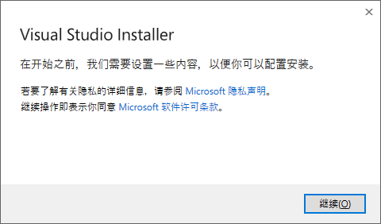
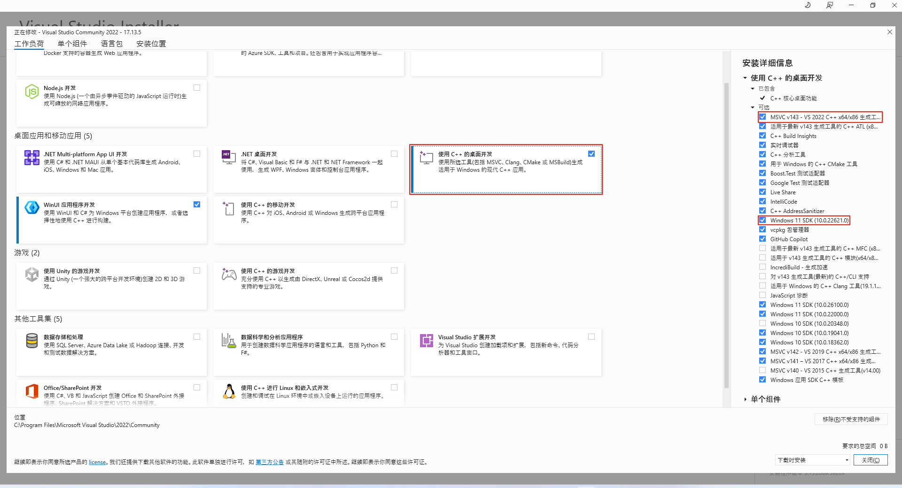
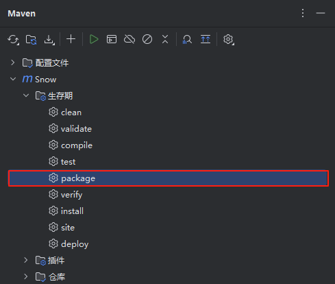

# Snow-Lang GraalVM AOT 打包指南

## 1. 概述

本文档介绍如何使用 GraalVM 的 AOT（Ahead-of-Time）编译功能将一个 Snow-Lang 项目打包成原生可执行文件（Native Image）。

## 2. 前置条件

1. 操作系统: Linux/macOS/Windows
2. Java 项目（Maven）
3. GraalVM（建议 24+ 版本）

## 3. 环境准备

### 3.1 安装 GraalVM

1. 下载对应平台的 GraalVM Community 版本: [https://www.graalvm.org/downloads/](https://www.graalvm.org/downloads/)
2. 解压并配置环境变量: 

3. 验证安装: 

```bash
java -version
# 应显示 GraalVM 版本信息
java version "24.0.1" 2025-04-15
Java(TM) SE Runtime Environment Oracle GraalVM 24.0.1+9.1 (build 24.0.1+9-jvmci-b01)
Java HotSpot(TM) 64-Bit Server VM Oracle GraalVM 24.0.1+9.1 (build 24.0.1+9-jvmci-b01, mixed mode, sharing)
```
### 3.2 Windows 上 Native Image 的先决条件

在 Windows 上，Native Image 需要 Visual Studio 和 Microsoft Visual C++(MSVC)。

1. 从 [visualstudio.microsoft.com](https://visualstudio.microsoft.com/zh-hans/vs/) 下载 Visual Studio Build Tools 2022 或更高版本（C 开发环境）。

2. 通过打开下载的文件来启动安装，然后单击 **继续** 

    

3. 在主窗口中选择 **使用 C++ 进行桌面开发** 复选框。在右侧的“安装详细信息”下，确保选择了两个要求，**Windows 11 SDK** 和 **MSVC (…) C++ x64/x86 构建工具**。单击 **安装** 继续。

    

您现在能够使用 GraalVM Native Image 进行构建。

### 3.3 Arch Linux 上 Native Image 的先决条件

在 Arch Linux 上，Native Image 需要先安装 [jdk25-graalvm-bin](https://aur.archlinux.org/packages/jdk25-graalvm-bin) 包

1. 安装运行环境依赖

```bash
sudo pacman -Syu glibc zlib
```

2. 安装编译依赖

```bash
sudo pacman -Syu git maven musl
```

```bash
yay -Syu jdk25-graalvm-bin
```

注意： 使用的 AUR 的  `jdk25-graalvm-bin` 包

3. 编译使用

```bash
git clone https://gitee.com/jcnc-org/snow.git
cd snow
export PATH="/usr/lib/jvm/java-25-graalvm/bin/:$PATH"
export JAVA_HOME="/usr/lib/jvm/java-25-graalvm"
mvn -P native-linux -DskipTests clean package
```

4. 安装到系统目录

```bash
install -Dm0755 target/Snow /usr/bin/snow
install -dm0775 /usr/lib/snow \
        /usr/share/doc/snow

cp -R lib/* /usr/lib/snow
cp -R docs/* /usr/share/doc/snow
cp -R *.md /usr/share/doc/snow
```

注意：安装过程中会使用到 `root` 权限，如果提示权限不足，可以在命令行前增加 `sudo` 进行安装

## 4. Maven 项目配置文件

通过将以下配置文件添加到 `pom.xml` 中，为 Native Image 启用 Maven 插件: 

```xml
<profiles>
    <!--
        原生镜像构建: Linux 平台
        - 使用 GraalVM 的 native-image 工具，生成静态链接的可执行文件
        - 依赖 musl libc，需提前安装并配置 musl-gcc 工具链
    -->
    <profile>
        <id>native-linux</id>
        <activation>
            <os>
                <family>unix</family>
            </os>
        </activation>
        <build>
            <plugins>
                <plugin>
                    <groupId>org.graalvm.buildtools</groupId>
                    <artifactId>native-maven-plugin</artifactId>
                    <version>${native.maven.plugin.version}</version>
                    <!-- 启用插件扩展，允许在 build 生命周期中无须额外配置 -->
                    <extensions>true</extensions>
                    <executions>
                        <!-- 打包阶段生成原生可执行文件 -->
                        <execution>
                            <id>build-native</id>
                            <goals>
                                <!-- compile-no-fork 在当前 JVM 进程中执行 native-image -->
                                <goal>compile-no-fork</goal>
                            </goals>
                            <phase>package</phase>
                        </execution>
                        <!-- 测试阶段运行原生镜像的测试 -->
                        <execution>
                            <id>test-native</id>
                            <goals>
                                <goal>test</goal>
                            </goals>
                            <phase>test</phase>
                        </execution>
                    </executions>
                    <configuration>
                        <buildArgs>
                            <!-- 静态链接 -->
                            <buildArg>--static</buildArg>
                            <!-- 指定 musl libc -->
                            <buildArg>--libc=musl</buildArg>
                            <!-- 输出构建报告 -->
                            <buildArg>--emit build-report</buildArg>
                            <!-- 优化级别 O2 -->
                            <buildArg>-O2</buildArg>
                        </buildArgs>
                        <environment>
                            <!-- 指定使用 musl 工具链 -->
                            <PATH>/opt/musl-1.2.5/bin:${env.PATH}</PATH>
                            <C_INCLUDE_PATH>/opt/musl-1.2.5/include</C_INCLUDE_PATH>
                            <LIBRARY_PATH>/opt/musl-1.2.5/lib</LIBRARY_PATH>
                        </environment>
                    </configuration>
                </plugin>
            </plugins>
        </build>
    </profile>

    <!--
        原生镜像构建: Windows 平台
        - 使用 GraalVM 的 native-image 工具，生成 Windows 可执行文件
        - Windows 上不使用 musl，因此不配置静态链接
    -->
    <profile>
        <id>native-windows</id>
        <activation>
            <os>
                <family>Windows</family>
            </os>
        </activation>
        <build>
            <plugins>
                <plugin>
                    <groupId>org.graalvm.buildtools</groupId>
                    <artifactId>native-maven-plugin</artifactId>
                    <version>${native.maven.plugin.version}</version>
                    <extensions>true</extensions>
                    <executions>
                        <!-- 打包阶段生成 Windows 可执行文件 -->
                        <execution>
                            <id>build-native</id>
                            <goals>
                                <goal>compile-no-fork</goal>
                            </goals>
                            <phase>package</phase>
                        </execution>
                        <!-- 测试阶段运行原生镜像测试 -->
                        <execution>
                            <id>test-native</id>
                            <goals>
                                <goal>test</goal>
                            </goals>
                            <phase>test</phase>
                        </execution>
                    </executions>
                    <configuration>
                        <buildArgs>
                            <!-- 输出构建报告 -->
                            <buildArg>--emit build-report</buildArg>
                            <!-- 优化级别 O2 -->
                            <buildArg>-O2</buildArg>
                        </buildArgs>
                    </configuration>
                </plugin>
            </plugins>
        </build>
    </profile>
</profiles>
```

## 5. 构建 Native Image

1. 确保项目已在 JVM 下通过测试。
2. 点击 `Maven` `生命周期` `package`

    

3. 等待 Native Image 构建完成: 这个过程可能较慢（数分钟）。
4. 可执行文件即可直接运行，无需 JVM。
    > 生成的可执行文件位于 target/ 目录。
